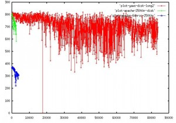

## [Programação funcional e escalabilidade: o que uma coisa tem a ver com a outra?](http://feedproxy.google.com/~r/Escalabilidade/~3/0YRFf5RdGow/)

do [Escalabilidade](http://www.google.com/reader/view/feed/http%3A%2F%2Ffeeds.feedburner.com%2FEscalabilidade) de Herberth Amaral

Programação imperativa, funcional, orientada a eventos e atores. Muitos programadores não conhecem todos estes termos, mas hoje falaremos de um em especial: a **programação funcional** e o que ela tem a ver com escalabilidade.

Comecemos pela definição de programação funcional:

> In computer science, functional programming is a programming paradigm that treats computation as the evaluation of mathematical functions and avoids state and mutable data. It emphasizes the application of functions, in contrast to the imperative programming style, which emphasizes changes in state. [[Fonte](http://en.wikipedia.org/wiki/Functional_programming)]

Traduzindo temos:

> Em Ciência da Computação, programação funcional é um paradigma de programação que trata a computação como avalição de funções matemáticas e **evita estado e dados mutáveis**. Dá ênfase à aplicação de funções em contraste com o estilo de programação imperativa, que dá ênfase em mudanças de estado.

A maioria de nós, desenvolvedores, estamos acostumados com o paradigma imperativo, presente na maioria das linguagens comerciais de hoje em dia (PHP, C#, Java, C++, etc) e quando vemos um código de uma linguagem funcional, a primeira impressão é um grande **WTF?!**.

É realmente difícil conceber a idéia que você não tem variáveis para guardar o estado. De fato, em programação funcional, toda variável só pode ser assinalada uma única vez (como *const* em C++ ou *final* em Java) e isso reflete a o que a definição diz sobre “evitar mudança de estado”. Em programação funcional, o estado não fica em variáveis, mas na pilha. Isso traz algumas vantagens para o programador:

- **Seu código fica mais fácil de testar**, já que você precisa testar somente a saída das funções, sem se preocupar com o estado da aplicação ou de um objeto qualquer.
- **O debugging é mais fácil**, novamente por causa do estado que não necessita ser testado. Se ocorrer uma exceção, é só olhar na pilha e ver o que aconteceu e voilà: todo seu estado estará na pilha!
- **Facilita a escrita de programas concorrentes e paralelos**, pois não há variáveis compartilhadas e, portanto, não há semáforos, deadlocks ou outros efeitos colaterais.

Opa opa, a última parte é interessante: facilita a escrita de programas concorrentes e paralelos.

### Paralelismo e escalabilidade

Paralelismo é a capacidade de sistemas executarem instruções simultâneamente e há uma ligação entre paralelismo e escalabilidade bem importante.

Há alguns anos vimos a entrada de processadores multicore no mercado. A principal razão para isso é que ficou difícil para os fabricantes aumentar a performance de um único processador, portanto, a saída mais óbvia foi aumentar o número de cores em um processador. Com isso, o usuário poderia executar mais de uma tarefa ao mesmo tempo sem que o desempenho de uma interfira no desempenho da outra.

Porém, fazer com que os atuais sistemas consigam aproveitar a capacidade total de processamento de todos os cores de um processador ainda é um desafio. A programação paralela é bem mais complexa do que a programação seqüêncial, principalmente quando há a necessidade de compartilhar recursos.

Aí que a programação funcional entra: como não há recursos compartilhados, escalar uma aplicação escrita em uma linguagem funcional torna-se mais simples do que uma linguagem imperativa. Mesmo que você tenha escrito algo utilizando o paradigma funcional e pensando em uso de processadores single core, seu compilador pode lhe dar uma mãozinha e otimizar seu código pra sistemas multicore.

### Sistemas paralelos e distribuídos

Até agora focamos em sistemas paralelos, que são executados em somente uma máquina com vários cores e consegue escalar bem com isso. Com o crescente número de cores por processador, paralelismo torna-se um assunto interessante, porém limitado em alguns casos. E se precisarmos de mais processadores, só que em máquinas diferentes? Como podemos fazer isso?

Bem, talvez aí somente uma linguagem funcional não te ajude muito. Você precisa de uma forma de trocar informações com outros processos/threads em outras máquinas. Como discutimos anteriormente, acesso compartilhado de variáveis não é uma opção. Uma boa opção que nos resta é a **passagem de mensagens**.

### Alto paralelismo, passagem de mensagens e tolerância a falhas: conheçam o Erlang

O Erlang é uma linguagem funcional e orientada a concorrência desenvolvida na Ericsson com o objetivo inicial de servir como linguagem de desenvolvimento de aplicações para telefonia.

Desenvolvimento de aplicações pra telefonia é algo complexo, pois são sistemas que têm que apresentar o mínimo possível de falhas. Imagine sua central telefônica lidando com um deadlock enquanto você tenta ligar por socorro. Se estes sistemas falharem, vidas podem ser perdidas (sem exageros).

A atualização destes sistemas não pode acarretar em downtime. Você não pode simplesmente parar uma central pra fazer o update de um software. Aí que entra uma funcionalidade interessante do Erlang: hot code swapping, que permite a modificação do código sem a necessidade de parar o sistema.

Mas o que torna o Erlang uma linguagem interessante pra quem quer trabalhar com programação concorrente são as construções a nível de linguagem para programação multithread. O Erlang possui uma pequena série de primitivas para criação e comunicação de processos. Não confunda processos do Erlang com processos do sistema operacional ou threads: são simplesmente “processos leves” criados pela VM do Erlang.

Como era de se esperar, a comunicação destes processos é feita através de troca de mensagens de forma **assíncrona**, sem compartilhamento de estado. Note o destaque da palavra assíncrona: um processo não espera a resposta de outro: ele simplesmente pode continuar executando sem ser “bloqueado”. Não é a toa que os sistemas de telefonia da Ericsson tem um [tempo de parada de aproximadamente 31ms **por ano**](http://www.erlang.se/publications/BYTE2003.html) [anexo ausente]

Não é de se espantar o seguinte resultado comparando um servidor Web (Yaws) escrito em Erlang com o Apache:

Os pontos vermelhos representam o comportamento do Yaws, enquanto os verdes e azuis representam o Apache rodando localmente e num sistema de arquivos NFS. Resumidamente, o que o gráfico mostra é que o Yaws conseguiu ter um throughput de aproximadamente 800 KBps e suportar até 80.000 conexões simultâneas, enquanto o Apache morreu em torno das 4.000. Tudo isso graças ao sistema de concorrência do Erlang.

### Conclusão

Este post apenas arranha a superfície na discussão sobre linguagens de programação (especialmente as funcionais) e escalabilidade. A nossa intenção é iniciar uma discussão e produzir mais posts falando do assunto. Diga-nos o que achou! Give us your 2 cents [anexo ausente]

Referências:

<http://en.wikipedia.org/wiki/Erlang_(programming_language)>  
<http://www.defmacro.org/ramblings/fp.html>  
<http://bc.tech.coop/blog/050119.html>

Posts Relacionados:

1. [Escolhendo entre escalabilidade horizontal e escalabilidade vertical](http://escalabilidade.com/2010/09/21/escolhendo-entre-escalabilidade-horizontal-e-escalabilidade-vertical/ "Permanent Link: Escolhendo entre escalabilidade horizontal e escalabilidade vertical")
