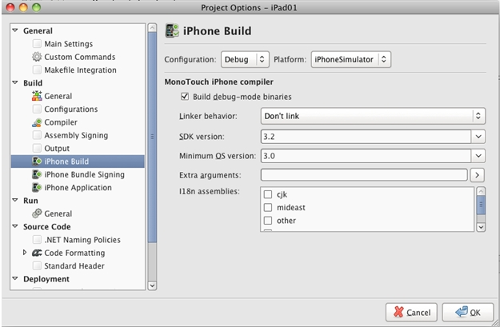
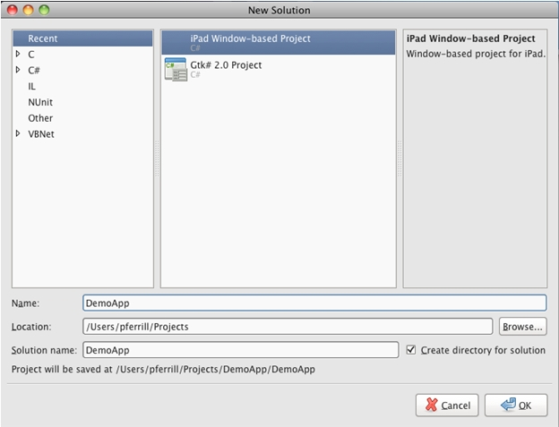
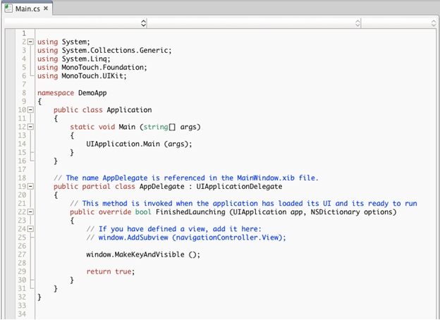
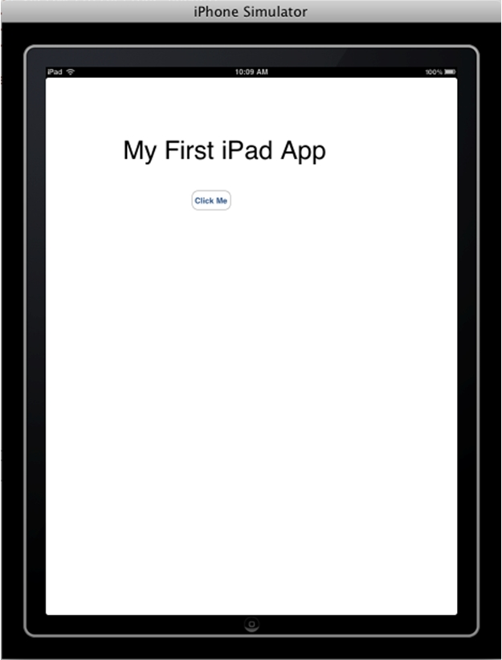

## Introduction

Developing applications for Apple's iOS devices including the iPhone, iPod Touch and iPad has, for the most part, meant using the Objective C language. For C# developers, this is a big turn off. Moving from C# to Objective C is something like going from Visual Basic to GW Basic. The languages are similar but different. Novell's Monotouch brings the power and elegance of C# to the table, making it possible for Microsoft developers to code in a language they're comfortable with.

You'll find the process even easier if you like to build forms in code rather than using a drag-and-drop designer like **Microsoft Visual Studio**. Monotouch provides bindings for all the form elements in the CocoaTouch class library. Admittedly, they are different from your typical Windows Forms app, but there are similarities just the same. All the standard elements like buttons and text boxes are there along with a whole host of new elements specifically designed for the touch environment on small screens.

## Getting Started

The first thing you need to know right off the bat is that you'll need an Intel-based Mac if you want to actually test or debug your code. Monotouch uses the Apple SDK for a multitude of things including the device emulator, Interface Builder and, ultimately, the final executable code as it is linked to the base Apple libraries. To get the Apple SDK and their Xcode tool you'll have to register with Apple's developer program. If you want to actually deploy an app, you'll have to pay the $99 annual fee.

Novell offers a trial version of Monotouch that does everything you need except deploy onto a physical device. You can write all the code you want as long as you use the device emulator for testing. Be sure you follow the installation guide as the order of installation is important. Monotouch relies on the latest Mono runtime for OSX that must be installed first. There's also a special version of Monodevelop with additional tools for Monotouch. If you're comfortable with using **Microsoft Visual Studio**, you'll feel right at home with **Monodevelop**.

There are a multitude of resources to help you get up to speed quickly with developing using Monotouch. The tutorials web page has links to how-to articles, sample code and screen casts. If you learn better from a book there's an excellent recently-released book titled iPhone Programming with MonoTouch and .NET/C# by Wally McClure, Martin Bowling, Craig Dunn, Chris Hardy and Rory Blyth. Both Wally McClure and Craig Dunn have active blogs with lots of good information as well.

If you decide to try out code samples from either the book or from the Monotouch site, you'll need to know a few things. First and foremost is the SDK version number. Many sample apps were built with earlier versions of the SDK and will have that set in the project options. If you compile an app and you don't have the target SDK installed, you'll get an error. To change the target SDK, simply open application options under the Project menu and change SDK version under the iPhone Build entry as shown below.



([Full Size Image](http://www.codeguru.com/dbfiles/get_image.php?id=17923&lbl=IPAD1_JPG&ds=20100916) )  
Figure 1

## Code Basics

One of the things you should do before you get too far along in coding is read Apple's user interface (UI) document. If you have any plans of actually publishing and selling an application, it will need to comply with their guidelines or you'll never get it approved for the Apple store. You'll want to pay close attention to the screen rotation requirement. All apps must support screen rotation, so you'll need to know how to adjust your screen elements when that happens.

Coding for the iPhone family frequently utilizes the Model-View-Controller (MVC) design pattern. You can see it in many of the class names and supporting code. Apple's iOS development introductory tutorial builds a basic "Hello World" app for the iPhone and uses MVC as a part of the design. Understanding these patterns and how they apply to different programming tasks will help you build better applications. The Cocoa Fundamentals Guide is a good read to help get you oriented to the Apple way of user interface design, and it includes a chapter on design patterns.

Building a UI around the `CocoaTouch UIViewController` is a pretty standard approach to creating a basic interface. Adding the ability to autorotate with a `UIViewController` is accomplished with the following snippet of code:

```
  public class AppViewController : UIViewController
  {
      public AppViewController () {}
  		
      public override bool ShouldAutorotateToInterfaceOrientation (UIInterfaceOrientation toInterfaceOrientation)
      {
          return true;
      }
  }
```

This code will cause all the elements in the UIViewController to reorient when the operating system rotates the screen. It doesn't do anything other than change things like text labels and buttons so that they render properly based on how the user is holding the device. You'll have to write more code if you want to do something like add a navigation pane on the left hand side of the screen when the device is in landscape orientation.

Building an app for the iPad is fundamentally no different from the iPhone. The only real difference is the hardware, meaning screen size and iPhone specific capabilities such as GPS and the magnetometer. Creating a new iPad solution in Monodevelop looks something like the screen capture below:



([Full Size Image](http://www.codeguru.com/dbfiles/get_image.php?id=17923&lbl=IPAD2_JPG&ds=20100916) )  
Figure 2

Once you have the solution created you'll see the basic components of your app appear in the Solution pane including `Main.cs` and `MainWindow.xib`. These are the two necessary pieces to any basic app. `Main.cs` contains all the code necessary to initialize the app and display the UI described in `MainWindow.xib`. This should look like the following:



([Full Size Image](http://www.codeguru.com/dbfiles/get_image.php?id=17923&lbl=MAIN3_JPG&ds=20100916) )  
Figure 3

If you double-click on the `MainWindow.xib` file, you'll open up Interface Builder and have the opportunity to build your user interface using the Apple tools. This will take some getting used to as it is quite different from the `Microsoft Visual Studio` approach. For this demo we put a text label and a button on the main surface and saved the file. Selecting Run from the Monodevelop menu will launch the iPhone (iPad) simulator and run your application. For the simple text label and button you should see the following:



([Full Size Image](http://www.codeguru.com/dbfiles/get_image.php?id=17923&lbl=MAIN4_JPG&ds=20100916) )  
Figure 4

## Wrap Up

Building apps with Monotouch should look and feel a lot like Microsoft Visual Studio. You'll have to adjust your thinking somewhat to the Apple way of doing things, but the transition isn't that difficult. The demo version of Monotouch lets you get your feet wet without spending a lot of cash. You will have to buy the full version ($399 for the Professional Edition) when you get ready to actually deploy to the device.
