## [20 Melhores HQs de 2011](http://pipocaenanquim.com.br/2012/01/20-melhores-hqs2011/ "20 Melhores HQs de 2011")

[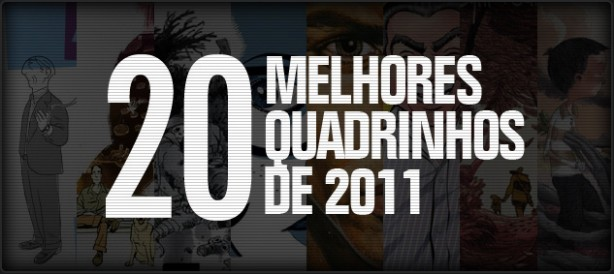](http://pipocaenanquim.com.br/wp-content/uploads/2012/01/melhores-hqs-20112-copy.jpg)

Olá, pessoal!

2011 foi um ano excepcional para o mercado de quadrinhos brasileiro, uma vasta gama de gêneros publicados por pequenas e grandes editoras, de maneira independente e também virtualmente em blogs e sites dos criadores.

Diante das centenas de lançamentos mensais foi dificílimo acompanhar tudo de legal que era lançado, por isso fontes referência como o [*Universo HQ*](http://www.universohq.com/) , [*Blog dos Quadrinhos*](http://blogdosquadrinhos.blog.uol.com.br/) , [*Impulso HQ*](http://impulsohq.com/) , [*Ambrosia*](http://www.ambrosia.com.br/) , [*Papo de Quadrinhos*](http://revistaogrito.com/papodequadrinho/) , *Mundo dos Super-Heróis*, [*Banca de Quadrinhos*](http://programabancadequadrinhos.com/) , *[Soc Tum Pow](http://soctumpow.com/)* e outros, foi de extrema importância para nós leitores, pois são bons termômetros do que vale a pena adquirir.

Outra coisa que atraiu nossa atenção e aumentou exponencialmente a oportunidade de conhecer novos títulos e autores foram os eventos que rolaram por aqui, *FIQ*, *Fest Comix*, *Rio Comicon*, *GibiCon* e por ai vai…leiam o excelente [texto](http://www.universohq.com/quadrinhos/2011/beco_2011eventos.cfm "Universo HQ festivais") de Sidney Gusman e saiba como foi cada um deles.

Para saber mais sobre esse incrível panorama recomendo a leitura desses [dois textos](http://blogdosquadrinhos.blog.uol.com.br/arch2011-12-01_2011-12-31.html "Blog dos quadrinhos")  do jornalista Paulo Ramos.

O difícil (e isso é uma coisa maravilhosa!) foi selecionar a lista de melhores HQs lançadas esse ano. Nós do Pipoca e Nanquim tivemos a honra de participar de duas votações, no [*Gibizada*](http://oglobo.globo.com/blogs/Gibizada/posts/2011/12/26/melhores-quadrinhos-de-2011-423399.asp) e *[Revista O Grito!](http://www.revistaogrito.com/page/blog/2011/12/26/melhores-de-2011-top-20-quadrinhos/) .*

Minha lista aqui é ligeiramente diferente e maior do que aquela elaborada para aqueles site. Por quê? Pois, assim como todos vocês, não consegui ler tudo que saiu em 2011 e ainda estou me deparando com obras incríveis.

Optei por listar somente quadrinhos lançados pela primeira em 2011, por isso a ausência de relançamentos espetaculares como *Conan, O Libertador* (Mythos), *Gen – Pés Descalços* (Conrad), *Hellblazer – Origens* (Panini), os volumes de *Marvel Deluxe* (Panini), *Cavaleiro das Trevas* (Panini), *Calvin e Haroldo – Os Dias Estão Todos Ocupados* (Conrad) entre vários outros.

Como tenho acompanhado pouquíssimos títulos de super-heróis mensais, resolvi deixar de lado séries continuadas que saem em mix regulares.

Vamos à lista!

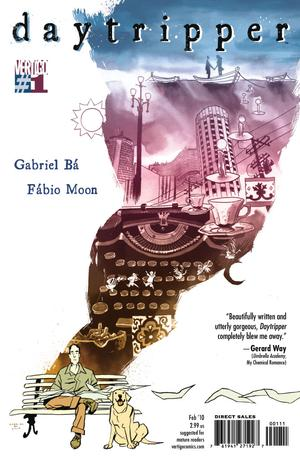

**1)** [**Asterios Polyp**](http://www.comix.com.br/product_info.php?products_id=14341) (Quadrinhos na Cia.)

Esse lançamento da **Quadrinhos na Cia.** arrebentou a boca do balão. Foi para mim, o melhor do ano.

Não escondemos nossa empolgação ao acabar de ler, correr para gravar um [podcast](http://pipocaenanquim.com.br/2011/11/podcast-52-asterios-polyp/) somente para essa obra-prima. Através de diversos experimentalismos e profundo domínio da narrativa gráfica David Mazzucchelli nos contou um pouco sobre o arquiteto Asterios, um grande arrogante que no dia de seu qüinquagésimo aniversário vê seu apartamento pegar fogo e resolve mudar completamente de vida e postura perante o mundo. Com a trajetória impecável de Mazzucchelli pelas HQs e após ser laureado com os prêmios *Harvey* e *Eisner 2010*, não poderia ser diferente. Espetacular!

**2)** [**Daytripper**](http://www.comix.com.br/product_info.php?products_id=14003) (Panini)

Essa maravilhosa obra criada pelo irmãos Fábio Moon e Gabriel Bá entrou para o meu seleto hall de obras favoritas da vida. Somente após ser lançada nos EUA pelo aclamado selo **Vertigo** e ganhar o *Eisner* e o *Harvey* é que vimos sua versão pitando por aqui, em um encaderno de luxo e irretocável da editora Panini.

Poética e onírica na medida exata, essa HQ é daquelas aconselhadas para todos os tipos de leitores.

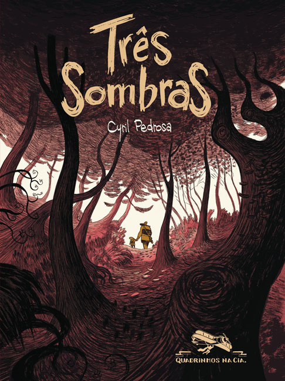

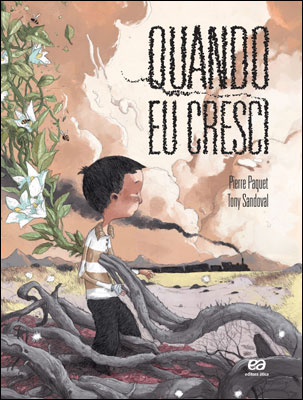

**3)** [**Três Sombras**](http://www.comix.com.br/product_info.php?products_id=13171) (Quadrinhos na Cia.)

“Até onde você iria para salvar seu filho?”, assim pergunta Fábio Moon no prefácio dessa obra de Cyril Pedrosa. É essa a tônica da fabulosa jornada contada e desenhada magistralmente pelo autor, na qual Louis, pai de Joachim, recusa a possibilidade de três misteriosas sombras levar a vida de seu garoto e sai em uma viagem desesperada. Uma lição de vida lindíssima.

Ponto para a **Quadrinhos na Cia.** por trazer essa HQ tão encantadora e para o *FIQ*, que trouxe Cyril para o Brasil e autografou meu exemplar! [anexo ausente]

**4)** **Quando Eu Cresci** (Ática)

Estréia com pé direito do selo **Agaquê** da editora **Ática**. *Quando Eu Cresci* é obra do escritor Pierre Paquet e do desenhista Tony Sandoval (um monstro!) e fala sobre um garoto peralta chamado Pepe que após entrar na parede de sua casa vaga por diversos lugares fantásticos (muitas vezes assustadores), conhecendo pessoas (nem todas boazinhas) e passando por muitas situações que às vezes lembra o bom e velho *Alice no País das Maravilhas*. Não precisa nem de dez páginas para você estar completamente absorto pelos mistérios da história e perceber que o que parecia ser uma fábula voltada ao público infantil logo toma ares sombrios. E que final!

Destaque para toda edição do volume, com entrevista exclusiva com os autores para o Brasil e a excelente tradução de Carol Bensimon, também responsável por *Três Sombras*.

Uma das poucas obras que terminei e reli imediatamente, você vai precisar fazer isso, vai por mim. Sublime!

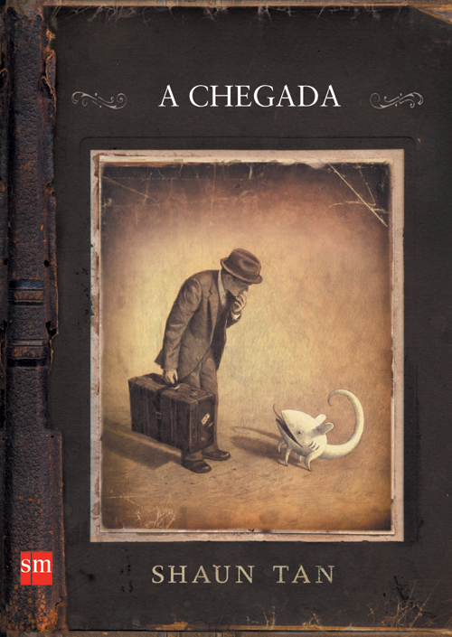

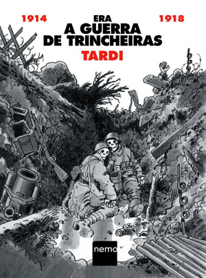

**5)** **A Chegada** (SM)

Outra editora sem tradição em lançar quadrinhos se aventurando nessa seara, o que só retifica a força que esse mercado vem ganhando por aqui, a **SM** colocou no mercado essa obra sem fazer nenhum alarde e em poucas livrarias, o que é uma pena, pois ele deveria ser amplamente divulgado.

Shaun Tan é um gigante das ilustrações e nos conta a fantástica história de um imigrante em busca de uma vida melhor em um lugar totalmente diferente sem utilizar nenhuma palavra (pelo menos as conhecidas por nós, pois o álbum contém vários símbolos daquele estranho lugar). Meu amigo, como esse cara desenha!

Por contar uma história tão fabulosa, transmitindo exatamente os sentimentos a qual se propõe, como esperança, saudade, amizade e força de vontade esse álbum merece ser conhecido e figurar nas estantes de todos vocês.

**6)** [**Era a Guerra das Trincheiras**](http://www.comix.com.br/product_info.php?products_id=14497) (Nemo)

Lida aos 45 do segundo tempo, já nos primeiros dias de 2012, essa HQ me arrebatou e não poderia deixá-la de fora desse ranking.

Lançada pelo selo **Nemo** da editora **Autêntica** essa HQ de Jacques Tardi lançada originalmente em 1993 começou a ganhar fama após seu lançamento nos EUA e justa premiação com o *Eisner Award*  de melhor trabalho baseado em fatos e melhor publicação americana de material estrangeiro.

Os incríveis desenhos de Tardi nos mostra terríveis e monstruosas situações vividas pelos combatentes da Primeira Guerra Mundial. Uma das melhores e mais acachapantes obras anti-bélicas de todos os tempos.

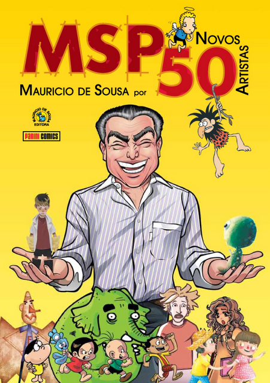

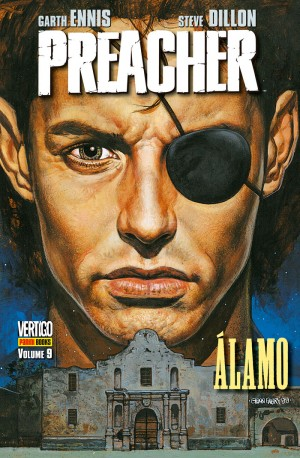

**7)** [**MSP Novos 50**](http://www.comix.com.br/product_info.php?products_id=14009) (Panini)

O editor Sidney Gusman consegui fechar de maneira impecável a trilogia mais importante dos quadrinhos nacionais. O projeto *MSP* não só reiterou (se é que alguém tinha dúvida) a influência do mestre Maurício de Sousa, como nos mostrou um incrível panorama sobre os quadrinhos brasileiros ao elencar 150 artistas de ponta, já conhecidos pelo grande público ou não.

É um deleite ler histórias protagonizadas pelos personagens que fizeram parte da nossa formação em estilos e concepções tão diversos.

**8 )** [**Preacher – Álamo**](http://www.comix.com.br/product_info.php?products_id=13989) (Panini)

Quando esse volume chegou a minhas mãos, exclamei “Finalmente!”, acredito que milhares de leitores brasileiros fizeram o mesmo. Era praticamente uma lenda o final de *Preacher* por aqui, nenhuma editora conseguia terminar de lançar a obra máxima de Garth Ennis, até que em setembro de 2011 a **Panini** quebrou a maldição e fez nossa alegria. A conclusão da busca desenfreada de Jesse Custer por Deus é concluída de maneira apoteótica. Foda!

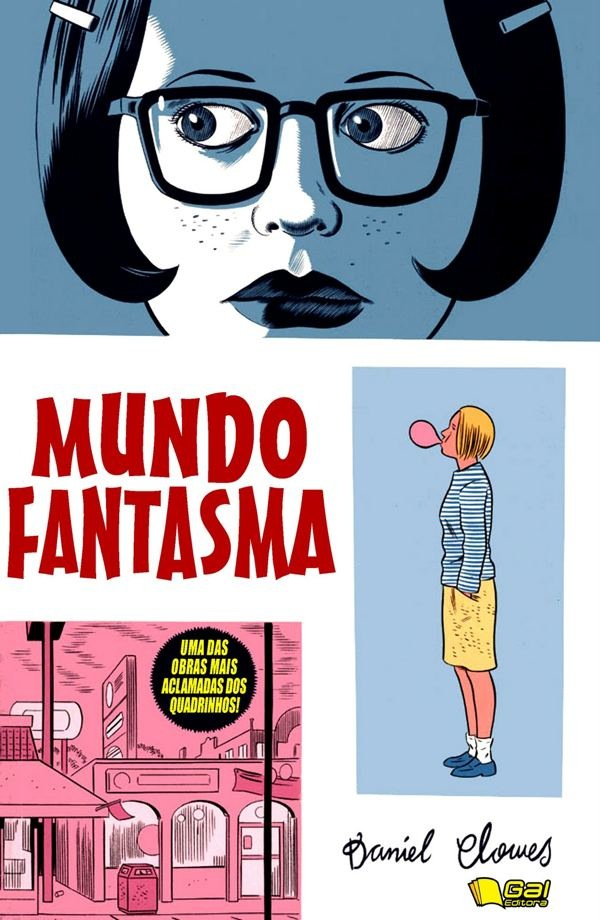

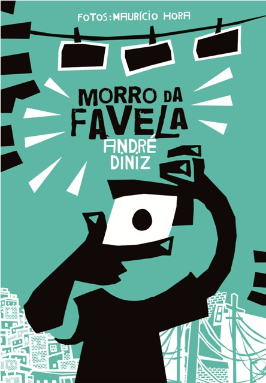

**9)** [**Mundo Fantasma**](http://www.comix.com.br/product_info.php?products_id=13299) (Gal)

Chega a ser incrível que uma obra dessas, lançada há quase vinte anos atrás no EUA, ainda não havia sido publicada por aqui, ainda mais sendo de um dos autores de maior renome no cenário *underground* e tendo ganhado uma aclamada adaptação para os cinemas pelo diretor Terry Zwigoff. O público brasileiro já podia conferir o trabalho de Daniel Clowes na HQ *Como Uma Luva De Veludo Moldada Em Ferro* (Conrad) mas muitos queriam ler *Mundo Fantasma*, eu era um deles.

A história mostra a vida pouco glamourosa das amigas niilistas Enid e Rebecca, recém saídas do colegial, não fazem a menor idéia do querem para o futuro e passam os dias de ócio criticando tudo e a todos.

Apesar do clima deprimente de toda a obra é impossível não se cativar e até se identificar com os personagens apresentados. Se sua vida muitas vezes é um pé no saco, leia essa HQ agora.

**10)** [**Morro da Favela**](http://www.comix.com.br/product_info.php?products_id=13660) (Leya/Barbanegra)

A história do fotógrafo Maurício Hora é belíssima e ficaria ótima em qualquer mídia, mas para nossa alegria ela foi contada através da nona arte por um dos melhores quadrinistas brasileiros. [André Diniz](http://pipocaenanquim.com.br/2011/03/entrevista-com-andre-diniz-autor-de-o-quilombo-orum-aie/) narra com traços fortes, em branco e preto, a trajetória do garoto criado no Morro da Favela, no Rio de Janeiro, que apesar de conviver com o tráfico de drogas (seu pai foi o primeiro traficante do lugar), preconceitos, prisões, assassinatos , conseguiu ser reconhecido por sua arte e através da fotografia, mostrou que aquele lugar tinha e tem muito mais a oferecer do que  a nossa míope visão discriminatória tende a achar.

Emocionante sem ser piegas e denso sem ser apelativo, um álbum na medida, realizado por quem sabe muito bem o que está fazendo.

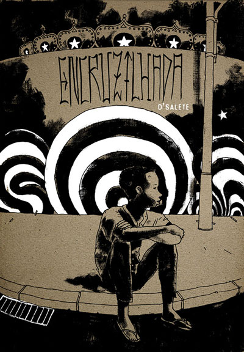

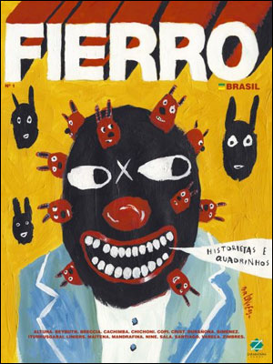

**11)**[**Encruzilhada**](http://www.comix.com.br/product_info.php?products_id=13827) (Leya/Barbanegra)

Enquanto André Diniz retratou a vida de um morador do morro no Rio de Janeiro na obra acima, Marcelo d´Salete contou a história de várias pessoas marginalizadas vivendo em uma São Paulo muito pouco gloriosa.

Em cinco histórias que se interligam, conhecemos um breve período da vida de dois garotos de rua, um viciado em drogas, um ladrão de carros, uma garota de programa e uma vendedora ambulante de DVDs piratas, ou seja, excluídos da sociedade.

A temática é pesada, o desenho escuro e sujo, a narrativa brusca e não-linear, o que gera uma obra exatamente condizente com a mensagem que o autor quer passar. Mais um ponto para a editora **Leya / Barba Negra** que lançou esse grande trabalho em uma edição impecável.

**12)**[**Fierro Brasil**](http://www.comix.com.br/product_info.php?products_id=13052) (Zarabatana)

A *Fierro* é um dos títulos mais importantes dos quadrinhos argentinos e revelou centenas de grandes artistas. Com essa mesma proposta o editor Claudio Martini elencou 45 artistas argentinos e brasileiros para figurarem nesse primeiro volume nacional.

O resultado é uma coletânea de belíssimas histórias, a maioria espetacular e um verdadeiro desfile de estilos.

Também não é para menos, estamos lendo Horacio Altuna, Danilo Beyruth, Alberto Breccia, Copi, Gustavo Duarte, Juan Giménez, Oesterheld, Guazzelli, Adão Iturrusgarai, Kioskerman, Liniers, Carlos Trillo, Salvador Sanz, Carlos Nine, só para citar alguns… é muita coisa fina em uma publicação só!

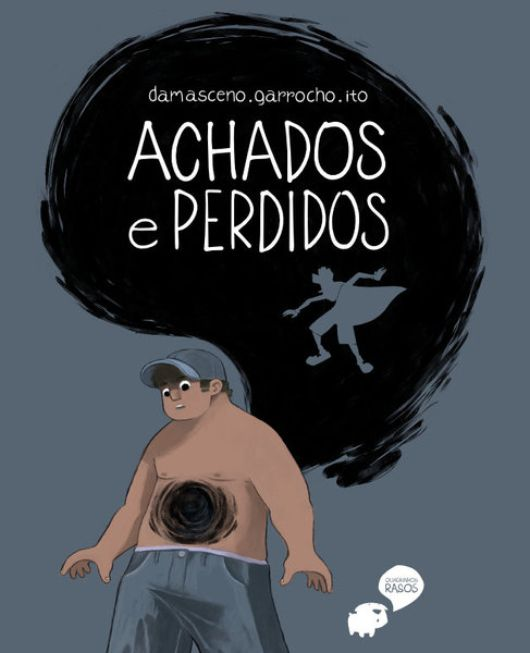

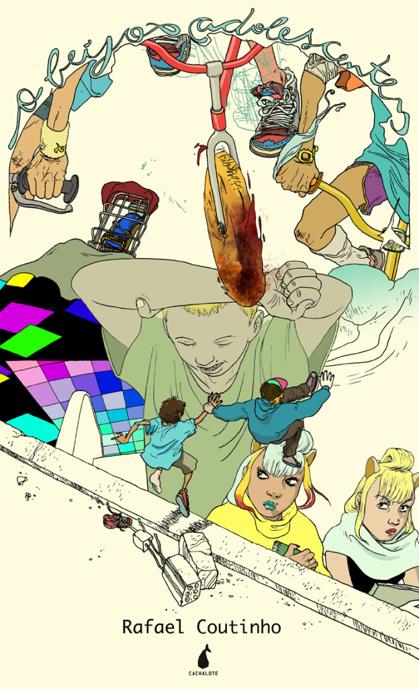

**13)** [**Achados e Perdidos**](http://pandemoniocomix.com/products/achados-and-perdidos) (Independente)

Já falei no videocast que fizemos sobre o [FIQ](http://pipocaenanquim.com.br/2011/11/videocast-95-%E2%80%93-fiq-2011/) e repito, esse foi o melhor projeto editorial do ano. A dupla de autores [Eduardo Damasceno e Felipe Garrocho](http://pipocaenanquim.com.br/2011/09/entrevista-com-quadrinhos-rasos-quando-a-musica-inspira-hqs/) vinha apresentando um trabalho excelente no site [Quadrinhos Rasos](http://www.quadrinhosrasos.com/) , no qual desenham HQs curtas baseadas em trechos de músicas, na metade de 2011 lançaram um projeto no Catarse, uma plataforma financiamento colaborativo e a cooperação de mais de quinhentas pessoas interessadas e crentes no trabalho da dupla possibilitou a impressão do álbum (com qualidade gráfica impecável) e a gravação de um CD composto por Bruno Ito, que ao ser tocado durante a leitura da obra faz a trilha sonora perfeita.

A aposta dos 500 interessados foi paga com juros e correção monetária, pois o produto final ficou excelente. Que história bonita e sutil a dupla criou! Apesar do personagem Dev ter um buraco negro na barriga(!), ele e seus amigos são críveis e logo surge aquela empatia, como se você os conhecessem de verdade.

**14)** [**O Beijo Adolescente**](http://narvalcomix.com.br/?p=472) (Independente)

Um projeto bacana lançado em 2011 foi o portal [*IG Jovem*](http://quadrinhos.ig.com.br/) trazendo webcomics de feras como Rafael Albuquerque (que desenvolveu o ótimo *Tune 8*), Eduardo Medeiros, Rafael Sica, Raphael Salimena e Rafael Coutinho.  Pena que o projeto durou pouco e acabou antes mesmo do final do ano. Coutinho, decidiu compilar seu excelente material em um volume impresso (em formato estranho e pouco usual) pelo seu selo **Cachalote**.

Depois da leitura dessa primeira temporada, fica a ansiedade para o lançamento das próximas!

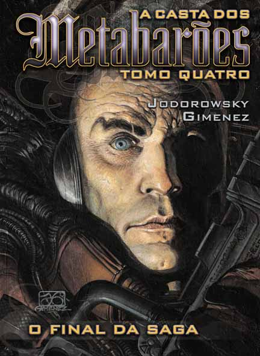

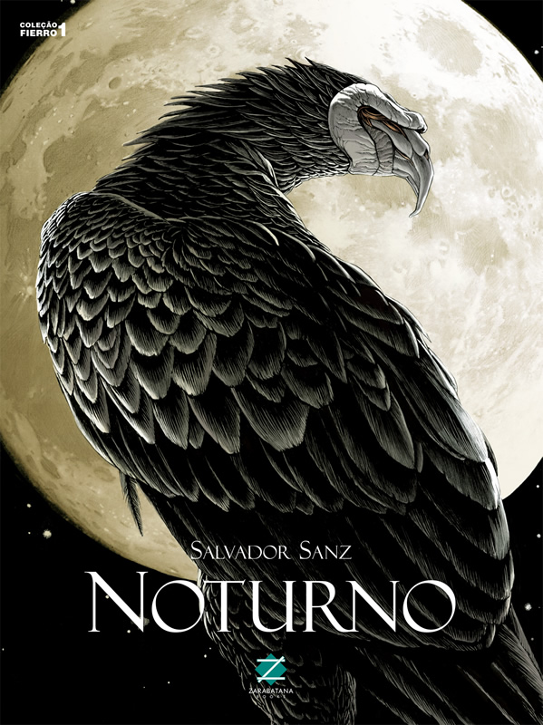

**15)** **A Casta dos Metabarões – Tomo Quatro** (Devir)

O final da saga dos Metabarões foi sensacional! Na verdade não poderia deixar de ser diferente, desde *Incal*, Alejandro Jodorowsky vem desenvolvendo uma das melhores ficções cientifica dos quadrinhos.

Este volume trouxe as edições #7 e #8 da série original, o *spin-off* de *Incal* que aborda seu personagem mais carismático, o Metabarão, o guerreiro mais poderoso do universo.

Ao lado do genial escritor, está o desenhista Juan Gimenez, que ilustra perfeitamente todas as viagens propostas pelo roteirista e nos brinda com algumas das páginas mais bonitas do mundo dos quadrinhos, é de tirar o fôlego os cenários criados pelo mestre.

Uma verdadeira epopéia!

**16)** [**Noturno**](http://www.comix.com.br/product_info.php?products_id=13053) (Zarabatana)

Bastou uma rápida folheada nesse exemplar para eu comprá-lo imediatamente, que traço espetacular tem esse Salvador Sanz!

Mas o álbum não se resume a belíssimas imagens, traz também uma grande trama de fantasia, terror e suspense, na qual pessoas sonham que são pássaros monstruosos (ou vice-versa). Com o tempo vamos descobrindo a verdade por trás desses sonhos e o enredo caminha para um terrível evento muito além da nossa compreensão.

Destaque para as incríveis seqüências de metamorfose humano/pássaro. Insanas.

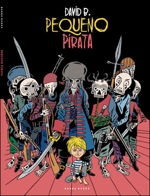

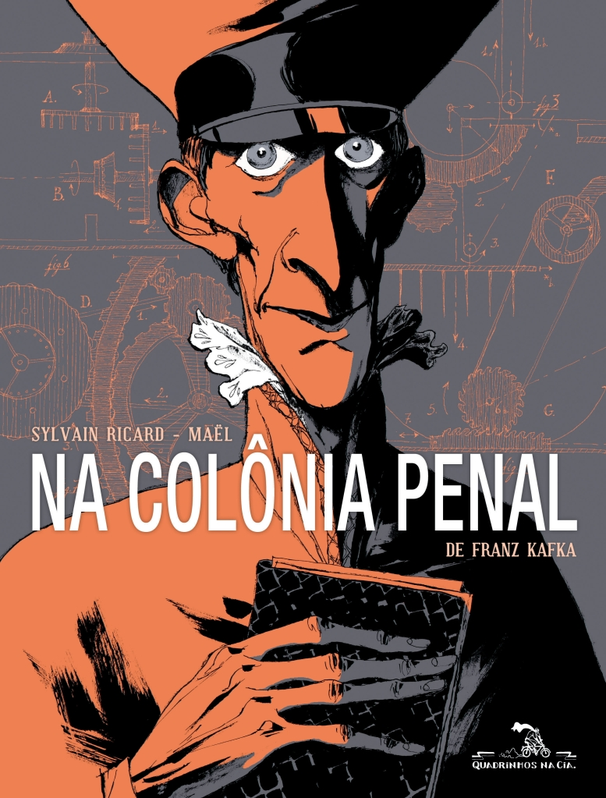

**17)** **[Pequeno Pirata](http://www.comix.com.br/product_info.php?products_id=13926)** (Leya/Barbanegra)

Poucos anos atrás a editora **Conrad** lançou em dois volumes o excelente *Epiléptico* dofrancêsDavid B. e apresentou esse grande artista ao público brasileiro. Ano passado foi a vez da editora **Leya/Barbanegra** trazer mais um de seus trabalho para nosso país.

Nessa adaptação do conto “Le roi rose” (1921) de Pierre Mac Orlan, vemos uma trupe de piratas morto-vivos sanguinários, que buscam incansavelmente o descanso eterno. Um dia, depois de mais um saque bem sucedido do navio-fantasma, encontram um recém nascido e decidem criá-lo a até que faça 10 anos de idade (segundo eles, a época mais divertida e alegre da vida), para então torná-lo também um morto-vivo e perpetuar seu encanto capaz de apaziguar suas viagens infinitas.

Em apenas 48 páginas repletas de ilustrações peculiares e impressionantes, David B. apresentou uma obra fantástica que contrapõe e explora vida e morte de maneira magistral.

**18)** [**Na Colônia Penal**](http://www.comix.com.br/product_info.php?products_id=13323) (Quadrinhos na Cia.)

Ótima adaptação para os quadrinhos dessa história de Kafka publicada originalmente em 1914. Sylvain Ricard (roteiro adaptado) e Maël (desenhos) foram muito fiéis ao texto original e o que é melhor, ao clima tenso e pertubador que caracteriza a obra do escritor.

A trama se passa em apenas um pequeno cenário, um terreno desolado nas imediações de um presídio no qual se localiza uma máquina de punição, considerada pelo oficial responsável o melhor método de execução dos criminosos. O aparelho escreve na pele do condenado sua sentença, utilizando-se agulhas presas em uma espécie de rastelo, o torturando até a morte. A grande questão é que o oficial responsável realmente acredita nessa método e precisa convencer o observador convidado de sua eficácia.

Uma das melhores adaptações literárias para HQs.

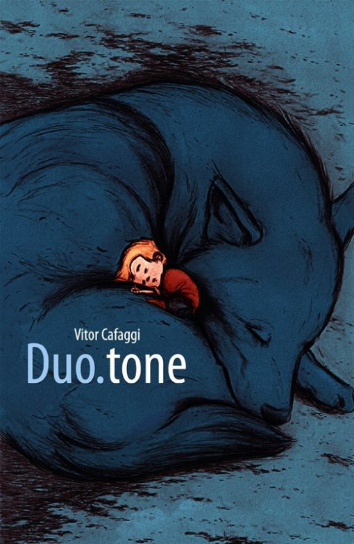

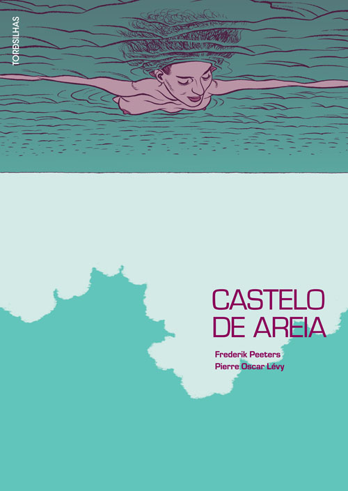

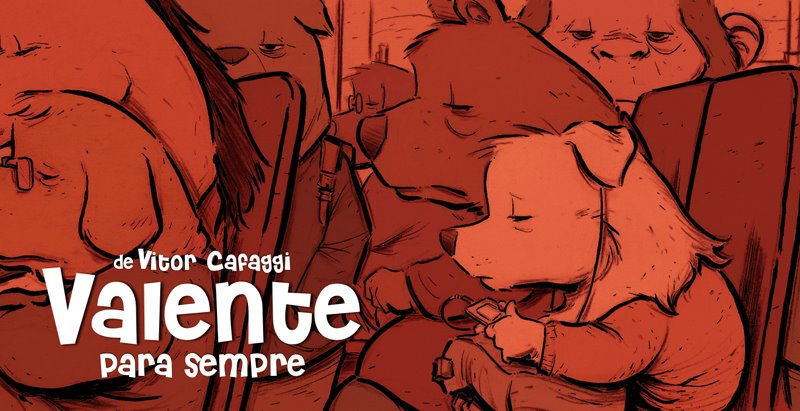

**19)** [**Valente**](http://pandemoniocomix.com/products/valente) e [**Duo.Tone**](http://pandemoniocomix.com/products/duotone) (Independente)

Depois de ler esses dois quadrinhos do Vitor Cafaggi não consegui mesmo escolher meu favorito, então coloco os dois aqui na lista. Depois de ter feito um trabalho sensacional com as tiras on-line [*Puny Parker*](http://punyparker.blogspot.com/) , criar uma das melhores histórias dentre todas as publicadas a trilogia *MSP 50* e uma bela participação em *Pequeno Heróis*, fiquei muito feliz ao chegar ao FIQ e me deparar com os dois primeiros álbuns solos desse grande artista.

*Valente para Sempre* compila algumas tiras publicadas no jornal *O Globo* e em seu site, e mostra a história de um cachorro que sofre por amor em busca de sua alma gêmea,  são conflitos tão humanos e sinceros que logo você se identifica, pois todos nós, ao menos uma vez na vida já nos apaixonamos perdidamente.

*Duo.Tone* traz duas histórias protagonizadas por crianças extremamente criativas e imaginativas, a primeira, do garoto Tim, é de uma sensibilidade  incrível. Aliás, todos os trabalhos de Vitor demonstram isso, o que faz cativar qualquer leitor que tenha coração.

Eu poderia ler quadrinhos do Vitor todos os dias.

**20)** [**Castelo de Areia**](http://www.comix.com.br/product_info.php?products_id=14422) (Tordesilhas)

Mais uma editora estreando nos quadrinhos e fazendo isso com muita classe. O selo **Tordesilhas** da **Alaúde Editorial** trouxe ao nosso mercado esse belo trabalho  do roteirista e renomado documentarista francês Pierre-Oscar Lévy e arte impecável do suíço Frederik Peeters.

Uma história de terror, daquela impossível de largar até chegar ao final. Algumas pessoas chegam a uma praia para fazer picnic e aproveitar o dia ensolarado, quando uma das crianças encontra um cadáver de uma mulher, logo o mistério envolvendo o corpo deixa de ser a única preocupação dos personagens, por algum motivo bizarro estão envelhecendo a uma velocidade surreal e não conseguem abandonar o local de jeito nenhum.

Estranho, muito estranho…

\_\_\_\_\_\_\_\_\_\_\_\_\_\_\_\_\_\_\_\_\_\_\_\_\_\_\_\_\_\_\_\_\_\_\_\_\_\_\_\_\_\_\_\_\_\_\_\_

Aproveito o espaço e indico logo mais 10 HQs sensacionais!

[**Corto Maltese** – **A Juventude**](http://www.comix.com.br/product_info.php?products_id=14384) (Nemo)  
Hugo Pratt

[**Quando Meu pai Encontrou um ET**](http://www.comix.com.br/product_info.php?products_id=14755) (Quadrinhos na Cia.)  
Lourenço Mutarelli

[**Arzach**](http://www.comix.com.br/product_info.php?products_id=13691) (Nemo)  
Moebius

[**Koko Be Good**](http://www.comix.com.br/product_info.php?products_id=14163)  (Leya/Barbanegra)  
Jen Wang

[**Ordinário**](http://www.comix.com.br/product_info.php?products_id=12897) (Quadrinhos na Cia.)  
Rafael Sica

**[Almas Públicas](http://www.comix.com.br/product_info.php?products_id=13185)** (Conrad)  
Marcelo Quintanilha

[**Lucille**](http://www.comix.com.br/product_info.php?products_id=14430) (Leya/Barbanegra)  
Ludovic Debeurme

[**Birds**](http://www.comix.com.br/product_info.php?products_id=14064) (independente)  
Gustavo Duarte

**[Clara dos Anjos](http://www.comix.com.br/product_info.php?products_id=14553)** (Quadrinhos na Cia.)  
Lelis (arte) e Wander Antunes (roteiros)

[**Sandman – Caçadores de Sonhos**](http://www.comix.com.br/product_info.php?products_id=13775) (Panini)  
Neil Gaiman (roteiro) e P. Craig Russell (adaptação e arte)

Olha que mesmo com essas trinta indicações, ficou muita coisa de fora, não estou contanto séries continuadas com *Y*, *100 Balas*, *Mortos Vivos*, *Jonah Hex*, *J. Kendall, Bakuman* e por ai vai…Eita ano bom! E pelo jeito 2012 será melhor ainda.

E para você, quais foram os melhores lançamento de 2011?
