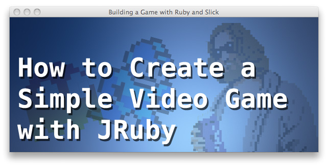
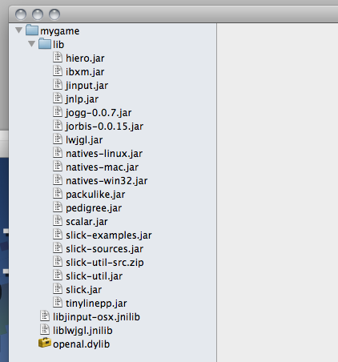
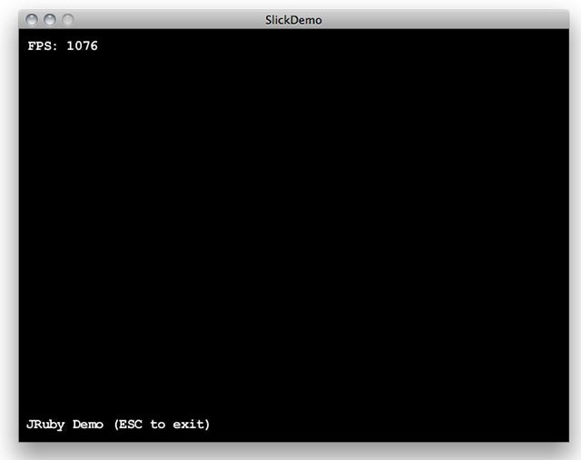
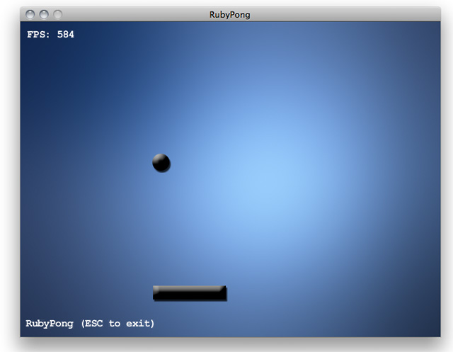

Ruby isn't known for its game development chops despite having a [handful](http://mon-ouie.github.com/projects/ray.html) [of](http://rubygame.org/) [interesting](http://www.libgosu.org/) [libraries](https://github.com/ippa/chingu) suited to it. Java, on the other hand, has a thriving and popular game development scene flooded with powerful libraries, tutorials and [forums.](http://www.java-gaming.org/) Can we drag some of Java's thunder kicking and screaming over to the world of Ruby? Yep! - thanks to [JRuby.](http://jruby.org/) Let's run through the steps to build a simple 'bat and ball' game now.



### The Technologies We'll Be Using

#### JRuby

If you're part of the "meh, JRuby" brigade, suspend your disbelief for a minute. JRuby is easy to install, easy to use, and isn't going to trample all over your system or suck up all your memory. It will be OK!

One of [JRuby's](http://jruby.org/) killer features is its ability to use Java libraries and generally dwell as a first class citizen on the [JVM.](http://en.wikipedia.org/wiki/Java_Virtual_Machine) JRuby lets us use performant Java powered game development libraries in a Rubyesque way, lean on Java-based tutorials, and basically *have our cake and eat it too.*

To install JRuby, I recommend [RVM](http://beginrescueend.com/) (Ruby Version Manager). I think the JRuby core team prefer you to use their own installer but `rvm install jruby` has always proven quick and effective for me. Once you get it installed, `rvm use jruby` and you're done.

#### Slick and LWJGL

The [Slick](http://slick.cokeandcode.com/) library is a thin layer of structural classes over the top of [LWJGL](http://lwjgl.org/) (Lightweight Java Game Library), a mature and popular library that abstracts away most of the boring system level work.

Out of the box LWJGL gives us OpenGL for graphics, OpenAL for audio, controller inputs, and even OpenCL if we wanted to do heavy parallelism or throw work out to the GPU. Slick gives us constructs like game states, geometry, particle effects, and SVG integration, while allowing us to drop down to using LWJGL for anything we like.

### Getting Started: Installing Slick and LWJGL

Rather than waste precious time on theory, let's get down to the nitty gritty of getting a basic window and some graphics on screen:

- First, create a folder in which to store your game and its associated files. From here I'll assume it's `/mygame`
- Go to the [Slick homepage](http://slick.cokeandcode.com/) and choose "Download Full Distribution" ([direct link to .zip here](http://slick.cokeandcode.com/downloads/slick.zip) ).
- Unzip the download and copy the `lib` folder into your `/mygame` as `/mygame/lib` - this folder includes both LWGWL and Slick.
- In `/mygame/lib`, we need to unpack the `natives-[your os].jar` file and move its contents directly into `/mygame`.

  **Mac OS X:** Right click on the `natives-mac.jar` file and select to unarchive it (if you have a problem, grab the awesome free *The Unarchiver* from the App Store) then drag the files in `/mygame/lib/native-mac/*` directly into `/mygame`.

  *Linux and Windows:* Running `jar -xf natives-linux.jar` or `jar -xf natives-win32.jar` and copying the extracted files back to `/mygame` should do the trick.
- Now your project folder should look a little like this:

  

  If so, we're ready to code.

### A Bare Bones Example

Leaping in with a bare bones example, create `/mygame/verybasic.rb` and include this code:

```
$:.push File.expand_path('../lib', __FILE__)

require 'java'
require 'lwjgl.jar'
require 'slick.jar'

java_import org.newdawn.slick.BasicGame
java_import org.newdawn.slick.GameContainer
java_import org.newdawn.slick.Graphics
java_import org.newdawn.slick.Input
java_import org.newdawn.slick.SlickException
java_import org.newdawn.slick.AppGameContainer

class Demo < BasicGame
  def render(container, graphics)
    graphics.draw_string('JRuby Demo (ESC to exit)', 8, container.height - 30)
  end

  # Due to how Java decides which method to call based on its
  # method prototype, it's good practice to fill out all necessary
  # methods even with empty definitions.
  def init(container)
  end

  def update(container, delta)
    # Grab input and exit if escape is pressed
    input = container.get_input
    container.exit if input.is_key_down(Input::KEY_ESCAPE)
  end
end

app = AppGameContainer.new(Demo.new('SlickDemo'))
app.set_display_mode(640, 480, false)
app.start
```

Ensure that `ruby` actually runs JRuby (using `ruby -v`) and then run it from the command line with `ruby verybasic.rb`. Assuming all goes well, you'll see this:



If you don't see something like the above, feel free to comment here, but your problems most likely orient around not having the right 'native' libraries in the current directory or from not running the game in its own directory in the first place (if you get `probable missing dependency: no lwjgl in java.library.path` - bingo).

#### Explanation of the demo code

- `$:.push File.expand_path('../lib', __FILE__)` pushes the 'lib' folder onto the load path. (I've used `push` because my preferred << approach breaks WordPress ;-))
- `require 'java'` enables a lot of JRuby's Java integration functionality.
- Note that we can use `require` to load the .jar files from the lib directory.
- The `java_import` lines bring the named classes into play. It's a *little* like `include`, but not quite.
- We lean on Slick's `BasicGame` class by subclassing it and adding our own functionality.
- `render` is called frequently by the underlying game engine. All activities relevant to rendering the game window go here.
- `init` is called when a game is started.
- `update` is called frequently by the underlying game engine. Activities related to updating game data or processing input can go here.
- The code at the end of the file creates a new `AppGameContainer` which in turn is given an instance of our game. We set the resolution to 640x480, ensure it's not in full screen mode, and start the game.

### Fleshing Out a Bat and Ball Game

The demo above is *something* but there are no graphics or a game mechanic, so it's far from being a 'video game.' Let's flesh it out to include some images and a simple pong-style bat and ball mechanic.

> Note: I'm going to ignore most structural and object oriented concerns to flesh out this basic prototype. The aim is to get a game running and to understand how to use some of Slick and LWJGL's features. We can do it again properly later :-)
>
> All of the assets and code files demonstrated here are also available [in an archive](http://ruby-inside.s3.amazonaws.com/mygame.zip) if you get stuck. Doing it all by hand to start with will definitely help though.

#### A New Code File

Start a new game file called `pong.rb` and start off with this new bootstrap code (very much like the demo above but with some key tweaks):

```
$:.push File.expand_path('../lib', __FILE__)

require 'java'
require 'lwjgl.jar'
require 'slick.jar'

java_import org.newdawn.slick.BasicGame
java_import org.newdawn.slick.GameContainer
java_import org.newdawn.slick.Graphics
java_import org.newdawn.slick.Image
java_import org.newdawn.slick.Input
java_import org.newdawn.slick.SlickException
java_import org.newdawn.slick.AppGameContainer

class PongGame < BasicGame
  def render(container, graphics)
    graphics.draw_string('RubyPong (ESC to exit)', 8, container.height - 30)
  end

  def init(container)
  end

  def update(container, delta)
    input = container.get_input
    container.exit if input.is_key_down(Input::KEY_ESCAPE)
  end
end

app = AppGameContainer.new(PongGame.new('RubyPong'))
app.set_display_mode(640, 480, false)
app.start
```

Make sure it runs, then move on to fleshing it out.

#### A Background Image

It'd be nice for our game to have an elegant background. I've created one called `bg.png` which you can drag or copy and paste from here (so it becomes `/mygame/bg.png`):

[](http://www.rubyinside.com/wp-content/uploads/2011/12/bg.png)

Now we want to load the background image when the game starts and render it constantly.

To load the game at game start, update the `init` and `render` methods like so:

```
def render(container, graphics)
  @bg.draw(0, 0)
  graphics.draw_string('RubyPong (ESC to exit)', 8, container.height - 30)
end

def init(container)
  @bg = Image.new('bg.png')
end
```

The `@bg` instance variable picks up an image and then we issue its `draw` method to draw it on to the window every time the game engine demands that the game render itself. Run `pong.rb` and check it out.

#### Adding A Ball and Paddle

Adding a ball and paddle is similar to doing the background. So let's give it a go:

```
def render(container, graphics)
  @bg.draw(0, 0)
  @ball.draw(@ball_x, @ball_y)
  @paddle.draw(@paddle_x, 400)
  graphics.draw_string('RubyPong (ESC to exit)', 8, container.height - 30)
end

def init(container)
  @bg = Image.new('bg.png')
  @ball = Image.new('ball.png')
  @paddle = Image.new('paddle.png')
  @paddle_x = 200
  @ball_x = 200
  @ball_y = 200
  @ball_angle = 45
end
```

The graphics for `ball.png` and `paddle.png` are here. Place them directly in `/mygame`.

We now have this:



> Note: As I said previously, we're ignoring good OO practices and structural concerns here but in the long run having separate classes for paddles and balls would be useful since we could encapsulate the position information and sprites all together. For now, we'll 'rough it' for speed.

#### Making the Paddle Move

Making the paddle move is pretty easy. We already have an input handler in `update` dealing with the Escape key. Let's extend it to allowing use of the arrow keys to update `@paddle_x` too:

```
def update(container, delta)
  input = container.get_input
  container.exit if input.is_key_down(Input::KEY_ESCAPE)

  if input.is_key_down(Input::KEY_LEFT) and @paddle_x > 0
    @paddle_x -= 0.3 * delta
  end

  if input.is_key_down(Input::KEY_RIGHT) and @paddle_x < container.width - @paddle.width
    @paddle_x += 0.3 * delta
  end
end
```

It's crude but it works! (P.S. I'd normally use `&&` instead of `and` but WordPress is being a bastard - I swear I'm switching one day.)

If the left arrow key is detected and the paddle isn't off the left hand side of the screen, `@paddle_x` is reduced by `0.3 * delta` and vice versa for the right arrow.

The reason for using `delta` is because we don't know how often `update` is being called. `delta` contains the number of milliseconds since `update` was last called so we can use it to 'weight' the changes we make. In this case I want to limit the paddle to moving at 300 pixels per second and 0.3 \* 1000 (1000ms = 1s) == 300.

#### Making the Ball Move

Making the ball move is similar to the paddle but we'll be basing the `@ball_x` and `@ball_y` changes on `@ball_angle` using a little basic trigonometry.

If you stretch your mind back to high school, you might recall that we can use sines and cosines to work out the offset of a point at a certain angle within a [unit circle.](http://en.wikipedia.org/wiki/Unit_circle) For example, our ball is currently moving at an angle of `45`, so:

```
Math.sin(45 * Math::PI / 180)   # => 0.707106781186547
Math.cos(45 * Math::PI / 180)   # => 0.707106781186548
```

*Note: The `* Math::PI / 180` is to convert degrees into radians.*

We can use these figures as deltas by which to move our ball based upon a chosen ball speed and the `delta` time variable that Slick gives us.

Add this code to the end of `update`:

```
@ball_x += 0.3 * delta * Math.cos(@ball_angle * Math::PI / 180)
@ball_y -= 0.3 * delta * Math.sin(@ball_angle * Math::PI / 180)
```

If you run the game now, the ball will move up and right at an angle of 45 degrees, though it will continue past the game edge and never return. We have more logic to do!

*Note: We use `-=` with `@ball_y` because sines and cosines use regular cartesian coordinates where the y axis goes from bottom to top, not top to bottom as screen coordinates do.*

Add some more code to `update` to deal with ball reflections:

```
if (@ball_x > container.width - @ball.width) || (@ball_y < 0) || (@ball_x < 0)
  @ball_angle = (@ball_angle + 90) % 360
end
```

This code is butt ugly and pretty naive (get ready for a nice OO design assignment later) but it'll do the trick for now. Run the game again and you'll notice the ball hop through a couple of bounces off of the walls and then off of the bottom of the screen.

#### Resetting the Game on Failure

When the ball flies off of the bottom of the screen, we want the game to restart. Let's add this to `update`:

```
if @ball_y > container.height
  @paddle_x = 200
  @ball_x = 200
  @ball_y = 200
  @ball_angle = 45
end
```

It's pretty naive again, but does the trick. Ideally, we would have a method specifically designed to reset the game environment, but our game is so simple that we'll stick to the basics.

#### Paddle and Ball Action

We want our paddle to hit the ball! All we need to do is cram another check into `update` (poor method - promise to refactor it later!) to get things going:

```
if @ball_x >= @paddle_x and @ball_x < = (@paddle_x + @paddle.width) and @ball_y.round >= (400 - @ball.height)
  @ball_angle = (@ball_angle + 90) % 360
end
```

*Note: WordPress has borked the less than operator in the code above. Eugh. Fix that by hand ;-)*

And bingo, we have it. Run the game and give it a go. We have a simple, but performant, video game running on JRuby.

If you'd prefer everything packaged up and ready to go, [grab this archive file of my /mygame directory.](http://ruby-inside.s3.amazonaws.com/mygame.zip)

### What Next?

#### Object orientation

As I've taken pains to note throughout this article, the techniques outlined above for maintaining the ball and paddle are naive - an almost C-esque approach.

Building separate classes to maintain the sprite, position, and the logic associated with them (such as bouncing) will clean up the `update` method significantly. I leave this as a task for you, dear reader!

#### Stateful Games

Games typically have multiple states, including menus, game play, levels, high score screens, and so forth. Slick includes a `StateBasedGame` class to help with this, although you could rig up your own on top of `BasicGame` if you really wanted to.

The Slick wiki has [some great tutorials](http://slick.cokeandcode.com/wiki/doku.php?id=tutorials) that go through various elements of the library, including a [Tetris clone that uses game states.](http://slick.cokeandcode.com/wiki/doku.php?id=02_-_slickblocks) The tutorials are written in Java, naturally, but the API calls and method names are all directly transferrable (I'll be writing an article about 'reading' Java code for porting to Ruby soon).

#### Packaging for Distribtion

One of the main reasons I chose JRuby over the Ruby alternatives was the ability to package up games easily in a .jar file for distribution. The Ludum Dare contest involves having other participants judge your game and since most participants are probably not running Ruby, I wanted it to be relatively easy for them to run my game.

[Warbler](https://github.com/jruby/warbler) is a handy tool that can produce .jar files from a Ruby app. I've only done basic experiments so far but will be writing up an article once I have it all nailed.

#### Ludum Dare

I was inspired to start looking into JRuby and Java game libraries by the [Ludum Dare game development contest.](http://www.ludumdare.com/compo/) They take place every few months and you get 48 hours to build your own game from scratch. I'm hoping to enter for the first time in just a couple of days and would love to see more Rubyists taking part.
