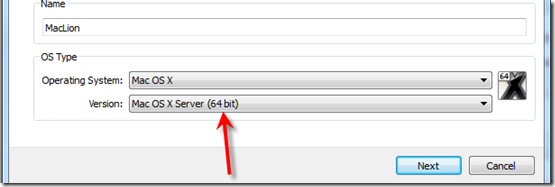
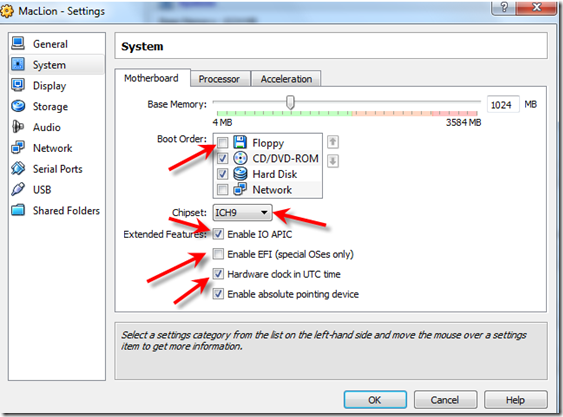
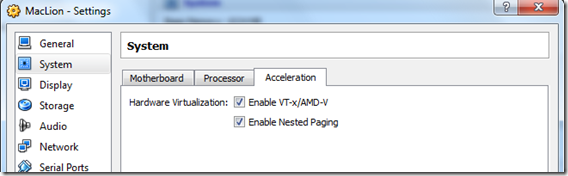
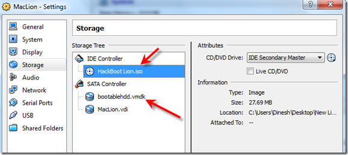
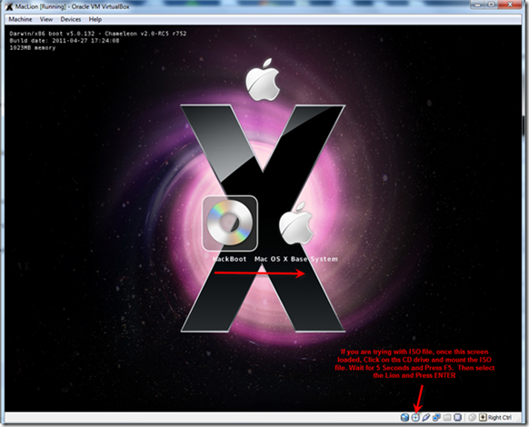
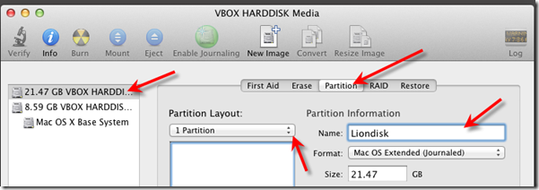
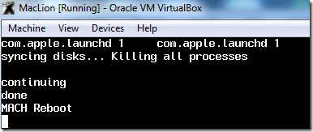
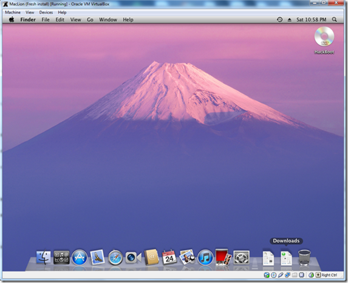

# [Guide] Mac OS X 10.7 Lion on VirtualBox with Windows 7 and Intel PC

September 26, 2011 By [Dinesh](http://www.sysprobs.com/author/admin "Posts by Dinesh")  [87 Comments](http://www.sysprobs.com/guide-mac-os-x-10-7-lion-on-virtualbox-with-windows-7-and-intel-pc#comments)

Finally I managed to find out the working method to install and run latest Mac OS X 10.7 Lion on Oracle VirtualBox with normal Intel computer. The main issue every hackintosh users faced with Lion, is the boot loader to start the installation in normal PC or in any desktop virtualization software. Here I explain and demonstrate step by step method to install Mac OS X 10.7 Lion on VirtualBox in Windows 7 host Intel computer.

Please note this is just for testing and learning purpose only. This method is not recommended for production or long term use, also not all applications will be working on Mac Lion virtual machine as its not recommended by Apple company. Highly advisable to go with original Apple hardware and Mac OS to get the all features and power of Mac.

OK, I demonstrate these steps in my Windows 7 32 Bit computer with Oracle VirtualBox 4.1.2.

> ## My PC Configurations.

Intel Core2Duo 2.66GHz, 3GB RAM on Host and Windows 7 32 Bit Operating System. Hardware Virtualization Technology (VT) is enabled in the host processor and processor is 64 bit ready.

> ## What You Need?

**1)** Oracle VirtualBox 4.1 or later.  ([Install the latest VirtualBox extension pack also](http://www.sysprobs.com/oracle-virtualbox-extension-pack-4-1-and-4-1-2-download-and-install) )

**2)** The pre created Lion OS X installation disk. This is the very important part in this installation. The ordinary installation DMG file you download from Apple or any torrent sites will not work here. We need to modify some packages and create a new disk which can be booted in VirtualBox or VMware.

For this process, you must have a working Snow Leopard on physical or virtual machine.

The procedure is already covered in Sysprobs clearly, please check [this guide on creating bootable Lion OS X disk](http://www.sysprobs.com/create-bootable-lion-os-installer-image-vmware-windows-intel-based-computers) .

I have used this pre created disk to boot and install [Lion OS X in VMware workstation, which is already covered here](http://www.sysprobs.com/working-method-install-mac-107-lion-vmware-windows-7-intel-pc) .

***The bootable Lion OS X disk can be created by two methods,***

**a)** Create as a VMDK or VDI file. So this file can be attached to the virtual machine as the first disk to boot the Lion OS. This file can be used in VMware and VirtualBox whenever needed.

Follow the steps [here to create bootable Lion OS X VMDK (or VDI) file](http://www.sysprobs.com/create-bootable-lion-os-installer-image-vmware-windows-intel-based-computers) .

**b)** Create an ISO file. This is also ideal method to use with all virtualization software and physical computer also.

One of my reader created a nice video on [creating bootable Lion OS X ISO file from DMG](http://www.sysprobs.com/video-create-bootable-lion-os-iso-file-dmg) .

**3)** Minimum 1GB memory to Virtual machine.

**4)** VT and 64bit supported processor. [Check this guide and make sure your processor supports these features](http://www.sysprobs.com/disable-enable-virtualization-technology-bios) .

**5)** [Download the boot loader](http://www.mediafire.com/file/ue5d849o5odp9lt/HackBoot_Lion.zip)  which can boot the Lion OS in VirtualBox (HackBoot.iso which is uploaded by me, no virus.)

> ## How to Install Lion OS X on VirtualBox

**1)** Double check the VT support and 64Bit in BIOS. If its not enabled, then enable it in BIOS and make sure the host Operating System is detecting it.

[Check this guide on how to enable VT in BIOS](http://www.sysprobs.com/disable-enable-virtualization-technology-bios)

**2)** Create a new virtual machine. **OS is Mac OS X** , the version should be **“64bit**”. Do not ask me why, because normal 32bit version did not work on my computer.

**3)** Set the memory size to 1GB or more than that, 2GB is recommended.

**4)** Create a virtual hard disk, minimum is 20GB.

**5)** Here is System settings.

You can deselect the floppy drive.

Make sure **‘Enable IO APIC”** and others are selected as shown below.

**Remove the Enable EFI option**. Leave the ICH9 chipset as default.

Under Acceleration, **“Enable VT-x/AMD-V”** and **“Enable Nested Paging”** should be enabled. If Acceleration tab is missing in your VirtualBox settings, it means VT is not enabled in host computer BIOS.

**Processor Settings.**

This is slightly tricky. My processor is Core2Duo, so I could select 2 processors. Unfortunately during the installation the virtual machine crashed. I had to put it back to 1 processor (core). If you are using Intel i-series processor you can increase the number up to 4. Increase to maximum and try, if it doesn’t work then try with single core (1 processor).

**6)** Attach the bootable ISO or VMDK file to virtual machine. In all cases we have to set Hackboot.iso in CD drive and boot with it.

If you are trying to install with bootable VMDK file (which I did), here is the setup.

***If you are going to try with ISO file, then you do not need to add the ‘bootabelhdd.vmdk’ file.***

**7)** Start the Lion OS X virtual machine now in VirtualBox.

It will boot with HackBoot.iso file.

If it’s from VMDK file, select the disk by pressing right arrow key in keyboard and press ENTER.

***If you are trying with ISO file, then once the above screen loaded, click on the CD icon of VirtualBox console and browse the Lion bootable ISO file. Wait for 5 seconds and press F5 to refresh the loaded CD, select it and press ENTER to start the installation.***

**8.)** Are you lucky enough? The first screen should start normally. Select the language and continue.

**9)** If you do not see the virtual hard disk to install, then it should be created in **Disk Utility** during the installation. Click on ***‘Utilities’ and select ‘Disk Utility’***.

Press Apply and close the disk utility box. Now you should be able to see and select the newly created partition for installation. Select and begin the process.

**10)** After the installation automatic restart will be attempted ***but it will not work here***. The virtual machine will stop with following screen which is ready for manual restart.

Reset the virtual machine from menu. It may give a guru meditation error sometimes. Do not worry, just close the virtual machine.

We need to start the VM now, **so load the HackBoot.iso file again to CD drive** if it was removed during the installation. Incase virtual machine hangs with ash color screen now, again restart.

**11)** After few initial settings, you must land on working Lion OS X desktop in VirtualBox.

The performance of Lion OS X in VirtualBox is manageable. I could play around with few new changes and applications. Still there are few small drawbacks and issues on method. I will try my best to find out the solutions to fix them in future.

> ## You must consider two issues now,

**a)** **Shutting down and restart the Lion VM**- This will not happen automatically. Once the black screen appears (*Shown in Step 10*), it’s safe to shutdown or reset from VirtualBox menu.

**b)** Ab**out the Mac** – If you try ‘About the Mac’ inside virtual machine, it will not work. The virtual machine may crash.

I hope this guide would be helpful to install Mac OS X 10.7 Lion on VirtualBox with normal Intel computer with Windows 7, Vista or Windows XP. I’m NOT sure how this will work on AMD computer. Please someone leave comment about AMD processor.  Your responses are highly expected.

Have fun.

## Recommended Posts
