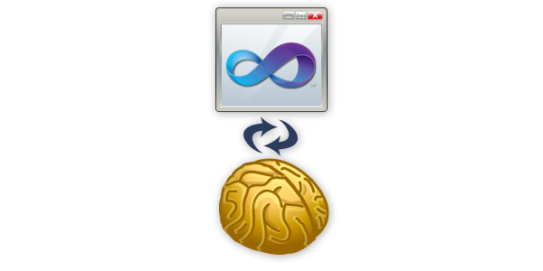
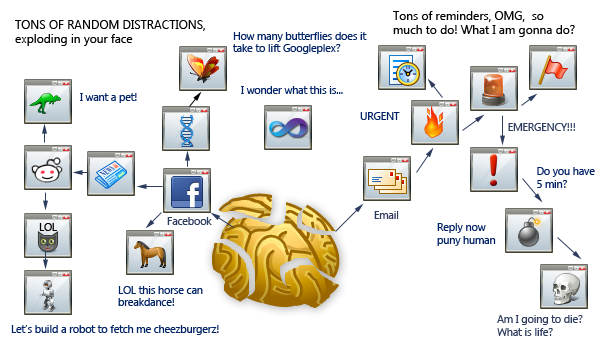

# [Owl's Blog on .NET development](http://www.componentowl.com/blog)

Component Owl codes Better ListView control all night so you don't have to.

## Are You a Zen Coder or Distraction-Junkie?

Blog Post by Jiri Novotny published on Sunday, 12 February 2012 in [Programming](http://www.componentowl.com/blog/category/programming/ "View all posts in Programming")

**What you do when compiling can ruin your life.** And not just when compiling, but when waiting for any short computer operation to finish.

That time is ridiculously tiny compared to the rest of your workday, yet it can have a huge impact on your productivity and well-being overall. Yes, that’s a big fat claim.

And by the way, this article is not just about coders or programmers. It’s about *any* smart people working with computers. And there will be pictures! Let’s rock and roll -

# Why am I writing this

I recently started implementing certain time management techniques into my work style to boost my productivity, reduce stress, and help my body and brain rest. I basically wanted to work in uninterruptable 100% focused 60-120 minutes blocks of time, followed by a 20-30 minute breaks.

However, I almost immediately run into a big problem: When I was compiling or deploying something, I automatically opened one or more of the following: Email client, Facebook, news reader, news sites. That’s a bad habit. It’s hard to break. It ruins my goal of clean focus.

So I decided to do some research. There was a discussion on “[What to do while compiling?](http://productivity.stackexchange.com/questions/970/what-to-do-while-compiling) ” on StackExchange. The most up-voted answers were of the “reduce the compilation time” kind. However, these answers don’t solve the more general problem: There will always be waiting times while working on the computer.

Other than that, the people in the discussion were mostly suggesting what they usually do (such as checking email or news) – which is a horrible idea. One good advice was that “Multi-tasking is bad”. I agree with that. But overall? Not. Good. Enough. The answers were disappointing. So, in this article, I am going to explore this issue deeply and present you with the optimal approach.

# Two kinds of coders

There are two extreme archetypes of coders – The “zen coder”, and the “distraction junkie coder”. Both are extreme, so both should be rare on the bell curve of distribution, right?

Wrong. Although the “Distraction junkie coder” is, in fact, extreme, he is unbelievably prevalent.

A picture is worth 1000 words, so I am going to show you, with pictures, what is happening on the mental desktops of both of these kinds of coders.

# The zen coder

What does zen coder do?

He codes. That’s the only thing he does, and that tells it all. Perhaps the more important question is what he does not do: He does not succumb to distractions. Clean focus. Clean cuts. Clean coding. 60-120 minutes of pure coding, then a 20-30 minute break, which is usually off the computer. Then he codes again. (The minutes are just an example. He can use a different pattern – but he is always balanced and betting on the long-term productivity.)

His mind is like calm fluid water with a steady flow. It is not like frozen water shattered to 1000 constantly shaking pieces.

This is how the mental desktop of zen coder looks like:

# The distraction junkie coder

Even if your mental desktop looks like the one of a zen coder, just a few minutes after you open Facebook and check your email – e.g. when compiling, it will look like this:

And that is, ladies and gentlemen, after just merely checking your email and opening Facebook! If you also have a bunch of real-time notifications, IMs, and check your RSS and twitter, the above will look like a scheme of a meditating monk’s brain compared to the havoc you will break.

You will probably never fully recover from that. Not on that particular day, anyway. Even if you minimize all this crap on your mental desktop to your mental taskbar, it will remain there, tempt you forever, and eat up your mental resources. And boy, the time will fly by, and you will wonder where it went.

Oh, and by the way, if you are distraction junkie, then you **must** check out **[our web comics for developers!](http://www.componentowl.com/comics/26)** Don’t even return to finish reading this article. And don’t forget to subscribe to the comics RSS! And read all the strips! Then send it to your buddy, and start chatting! The distraction-rabbit holes are not that deep, really!

# The difference between zen coder and distraction junkie coder

Zen coder prefers long-term happiness and productivity. He is capable of focusing deeply. He trains focus.

Distraction junkie coder prefers instant gratification for the price of not reaching his full potential and hurting himself both physically and mentally in the long run. He is too lazy to focus.

To fully grasp this, we first need to understand how our brains work.

# How our brains work

The truth is that we don’t really know, yet. But, based on our current understanding, there are some useful analogies that psychologists have been putting to a good use for some time, and that can help us grasp some of the complexities.

## The computer analogy

Your brain is a computer. Sure, it is infinitely more complex than a PC, but the computer metaphor allows us to describe many processes that are going on in the brain. There is something like HDD, there is something like RAM, CPU, there are processes and threads, and it takes certain amount of time to access information and to calculate things.

It is obvious that our brain has only a certain capacity to focus at any particular moment. You can focus on 1 thing well, or on 3 things badly, but you can’t do both. Even switching from one task to another carries a cognitive cost, especially if the tasks are in different contexts.

Once you bring something to your awareness, it takes time to *fully* dispose of it and its associated resources and to purge it from your mental RAM and background processes. It can even take hours or days. Things recently brought to your awareness constantly re-appear at random moments. Even if you do not notice them floating in your mind, they are there – and they take up resources, and reduce your ability to focus.

## The chest of drawers analogy

Another useful metaphor is a chest of drawers. Your brain stores stuff in drawers. Each drawer is a cloud of data associated and linked together based on certain contexts and concepts. At any particular time, some of the drawers are open, and some closed. The open drawers represent your current mental landscape, the stuff that is easily accessible.

**The big problem is that it takes time to close mental drawers, but opening them is instant.**

So, when you are working, and then switch to some news site, it can instantly open a bunch of drawers. When you return to work, these drawers will remain open. The only benefit is it can help you with creativity and brainstorming – but unnecessarily opened drawers come at a cost. They reduce your left-brain raw mental power and ability to focus.

# What to do while compiling?

What you do when waiting for some computer operation to execute can determine if you are a zen coder, or distraction junkie coder.

The main idea here is to:

1. Not lose focus, and
2. Take a micro break.

Not losing focus is not that hard – all you have to do is to switch your brain off, or keep thinking about your code. However, switching off is better. It’s a micro-meditation, and it also serves our goal of taking a micro-break.

Why meditation? Well, your brain is crunching code all day, so why not give it a rest? Plus it’s scientifically proven that meditation leads to permanent increase in levels happiness. Just imagine the long term benefits of this seemingly trivial habit of meditating for 30-60 seconds couple of times per day.

Now, what to do on your micro-break? Do any of the following, combine as you wish. You can also do them all, in this order, depending (or not) on how long is the operation taking.

1. Get up
2. Look into distance
3. Put your hands behind your head and lean back on your chair
4. Stretch your legs, then raise your hands as high as possible
5. Close your eyes
6. Gently massage your eyes
7. Slowly turn your head to the right, left, up and down as far as possible
8. Close your eyes and breathe
9. Go get a glass of water (Be careful not to get distracted by your co-workers on your way.)

You can do also anything else that engages primarily your body and not mind – isometrics exercise, juggling, sword-fighting ;-).

And by the way – if your boss gives you hard time about any of this, then refer him to this article. It is far better for you to quickly rejuvenate yourself and maintain focus than to appear working and get distracted, lose focus and become tired sooner.

Stretching can be very beneficial. My physiotherapist discovered a lot of tension in my shoulders on my last visit. She told me that it’s there probably because I have my hands bent all the time when siting at the computer, so the muscles shorten and work uneconomically. The best thing I can do? Lift and move my hands, try to reach as high as possible. That’s now one of the things I do when compiling or waiting for a computer operation to execute.

You’ve probably heard that it is a good idea to stretch and take a short break regularly when working on the computer. The problem is the implementation – even if you set a timer, what if you are in a middle of a difficult problem when it goes off? It’s just seems impossible to implement. However, if you take the micro-break while compiling, it works great and you can even make a habit out of it, so it gets “automated”! The compilation now becomes your reminder to stretch. Incredibly powerful stuff.

# The things you shouldn’t do when compiling

I really want to hammer my point home, so just to make things absolutely clear, here is a list of what you should NOT do when compiling. Think of it this way: These things will not just ruin your focus, but you will deprive your mind and body of the micro-break.

1. Check your RSS
2. Check news (*any* news)
3. Check email
4. Check social media (Facebook, twitter, G+, LinkedIn, reddit – you name it)
5. Watch videos

Doing the following 2 things is better than all of the above, but it is still not optimal:

1. Chat with a co-worker
2. Read a physical book

# Clean Focus and Clean Cuts

I will close this article with what I think is the ideal approach to daily work-flow – the zen coder way.

The key to true productivity and efficiency is to focus 100% on the one thing you are doing at the moment, and then to completely switch and do something else. There shouldn’t be any blurry transitions from one thing to the next.

Divide your time into 60 – 120 minutes blocks of work. Focus 100% percent in these blocks of time. Then take a 20-30 minute break and do something else entirely. You can check your email and social media during the break, sure, but a brisk walk or a short nap and healthy snack will do you more good. After the break is over, check what’s next in your task management software (e.g. I use my own **[Swift To-Do List](http://www.dextronet.com/swift-to-do-list-software)** ), and do another block of focused work. It is somewhat similar to Pomodoro technique, only on a larger scale.

The breaks are not optional. Don’t even think about skipping them. Your body needs them. Take the breaks even if you do what you love – in such a case, you will be motivated to accomplish more in the next time block.

**Your work-flow should look something like this:**

(Task 1 – Task 2) – Break – (Task 2 – Task 3 – Task 4) – Break – (Another 60-120 minute block of tasks) – Break…

**And not something completely chaotic, random and sad, like this:**

Task 1 – Email – Task 1 – Facebook – Task 1 – Task 2 – Minibreak – Facebook – Task 2 – Email – reddit – Task 3 – Email – Break – Task 2 – Email – Task 3 – twitter – Hacker News – twitter – Task 1 – Task 3 – Break – Task 4

If your workflow is sub-optimal like that, you will neither fully relax nor accomplish what you could. This is inferior on every level. It is not just a waste of your potential and time, but often also completely unnecessary wreckage of your body in the long run.

I won’t lie to you. Focusing is really hard. It’s hard, because when you are not doing it, you are basically training the opposite. Habits and ingrained routines are inherently hard to change.

The good news is you can train. You *can* learn to focus. It’s a learnable skill for everyone, and incredibly well worth the effort.

- By **[Jiri Novotny+](https://plus.google.com/108094026317986529064/)** , the obsessed author of **[task management software for Windows](http://www.dextronet.com/)** . He is posting this guest article here on ComponentOwl.com, because his Swift To-Do List uses .NET **[Better ListView](http://www.componentowl.com/better-listview)** from Component Owl as its core component.

PS: Know anyone who is checking email 50 times a day, and has 12 different notifications jumping in his face all the time? Send him this article. He will thank you later.
