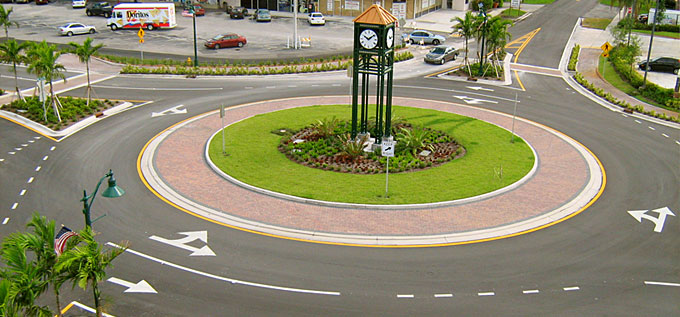
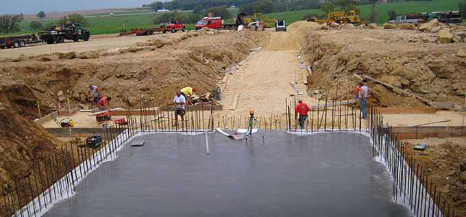
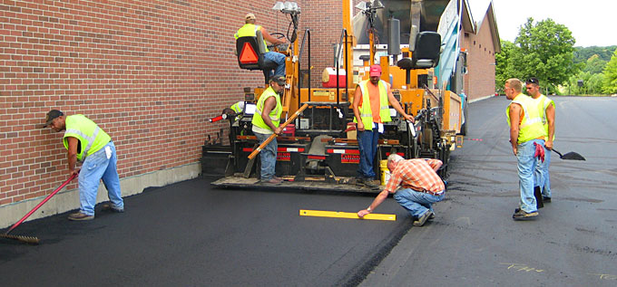
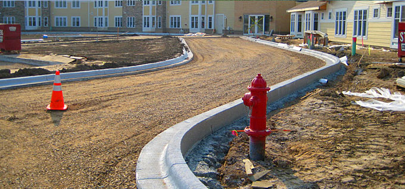
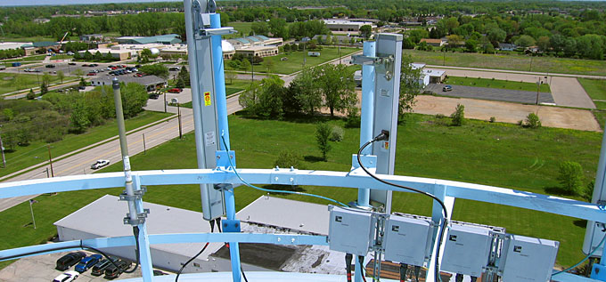
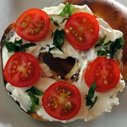

[Download Latest on Github](http://github.com/ProLoser/AnythingSlider/downloads) 

##### [Original](http://css-tricks.com/examples/AnythingSlider/) By [Chris Coyier](http://chriscoyier.net) , based upon lots of smart stuff by [Remy Sharp](http://remysharp.com/) , significantly improved by [Douglas Neiner](http://dougneiner.com/) , improved again by [ProLoser](http://github.com/ProLoser/) and [Mottie](http://github.com/Mottie/)

# AnythingSlider

[«](#)[»](#)

- 
- 
- 
- 

- 
- 

[Stop](#)

[«](#)[»](#)

- 
- 

  ### Queenie's Killer Tomato Bagel Sandwich

  #### Ingredients

  - 1 bagel, split and toasted
  - 2 tablespoons cream cheese
  - 1 roma (plum) tomatoes, thinly sliced
  - salt and pepper to taste
  - 4 leaves fresh basil
- > In awe I watched the waxing moon ride across the zenith of the heavens like an ambered chariot towards the ebon void of infinite space wherein the tethered belts of Jupiter and Mars hang forever festooned in their orbital majesty. And as I looked at all this I thought... I must put a roof on this lavatory.  
  > -- Les Dawson
- 
- > Life is conversational. Web design should be the same way. On the web, you’re talking to someone you’ve probably never met – so it’s important to be clear and precise. Thus, well structured navigation and content organization goes hand in hand with having a good conversation.

  - [Chikezie Ejiasi](http://quotesondesign.com/chikezie-ejiasi/)
- 
- 

  ### Queenie's Killer Tomato Bagel Sandwich

  #### Ingredients

  - 1 bagel, split and toasted
  - 2 tablespoons cream cheese
  - 1 roma (plum) tomatoes, thinly sliced
  - salt and pepper to taste
  - 4 leaves fresh basil

## Features

- Panels are HTML Content (can be anything).
- Multiple AnythingSliders allowable per-page.
- Infinite/Continuous sliding (always slides in the direction you are going, even at "last" slide).
- Optionally resize each panel (specified per panel in css).
- Optional Next / Previous Panel Arrows.
- Use keyboard navigation or tabs that are built and added dynamically (any number of panels).
- Link to specific slides or go forward or back one slide from static text links - go to [Slide 4](#) (Quote #2) in second example.
- Each panel has a hashtag (can link directly to specific panels).
- Optional custom function for [formatting navigation text](#format).
- Auto-playing slideshow (optional feature, can start playing or stopped)
- Pauses playing YouTube videos when not in view and resumes them when in view (only in non-IE browsers & if files are hosted on the web).
- Pauses slideshow on hover (optional).
- Optionally play the slideshow once through, stopping on the last page.

## Default Options

> ```
> $('#slider1, #slider2').anythingSlider({
>   // Appearance
>   width               : null,      // Override the default CSS width
>   height              : null,      // Override the default CSS height
>   resizeContents      : true,      // If true, solitary images/objects in the panel will expand to fit the viewport
>
>   // Navigation
>   startPanel          : 1,         // This sets the initial panel
>   hashTags            : true,      // Should links change the hashtag in the URL?
>   buildArrows         : true,      // If true, builds the forwards and backwards buttons
>   buildNavigation     : true,      // If true, buildsa list of anchor links to link to each panel
>   navigationFormatter : null,      // Details at the top of the file on this use (advanced use)
>   forwardText         : "»", // Link text used to move the slider forward (hidden by CSS, replaced with arrow image)
>   backText            : "«", // Link text used to move the slider back (hidden by CSS, replace with arrow image)
>
>   // Slideshow options
>   autoPlay            : true,      // This turns off the entire slideshow FUNCTIONALY, not just if it starts running or not
>   startStopped        : false,     // If autoPlay is on, this can force it to start stopped
>   pauseOnHover        : true,      // If true & the slideshow is active, the slideshow will pause on hover
>   resumeOnVideoEnd    : true,      // If true & the slideshow is active & a youtube video is playing, it will pause the autoplay until the video has completed
>   stopAtEnd           : false,     // If true & the slideshow is active, the slideshow will stop on the last page
>   playRtl             : false,     // If true, the slideshow will move right-to-left
>   startText           : "Start",   // Start button text
>   stopText            : "Stop",    // Stop button text
>   delay               : 3000,      // How long between slideshow transitions in AutoPlay mode (in milliseconds)
>   animationTime       : 600,       // How long the slideshow transition takes (in milliseconds)
>   easing              : "swing"    // Anything other than "linear" or "swing" requires the easing plugin
> });
> ```

## Usage

- ### Getting current slide number:

  > ```
  > var current = $('#slider1').data('AnythingSlider').currentPage; // returns page #
  > ```
- ### Setting current slide (external link example):

  > ```
  > <a href="#" id="slide-jump">Slide 4</a>
  > ```
  >
  > ```
  > $("#slide-jump").click(function(){
  >   $('#slider2').anythingSlider(4);
  > });
  > ```
- ### External Slideshow Control

  > ```
  > $('#slider1').data('AnythingSlider').startStop(true);  // start the slideshow
  > $('#slider2').data('AnythingSlider').startStop(false); // stops the slideshow
  > $('#slider1').data('AnythingSlider').goForward();      // go forward one slide
  > $('#slider1').data('AnythingSlider').goBack();         // go back one slide
  > ```
- ### Formatting Navigation Text

  To use the `navigationFormatter` option, you must have a function that accepts two parameters, and returns a string of HTML text.
  - `index` = integer index (1 based);
  - `panel` = jQuery wrapped LI item this tab references.
  - Function must return a string of HTML/Text.
  - Here is a sample formatter (view this page source for another example):
    > ```
    > $('#slider').anythingSlider({
    >  navigationFormatter : function(index, panel){
    >   return " Panel #" + index; // This would have each tab with the text 'Panel #X' where X = index
    >  }
    > })
    > ```

## Changelog

### Version 1.4

- Added `maxOverallWidth` option. This sets the max width (in pixels) of all combined sliders (side-to-side) due to problems with Opera.
- Added new classes to the base UL ("anythingBase") and its immediate children LIs ("panels") to reduce and clarify the CSS.
- Added hover class to arrows and start/stop button to indicate the link has focus (while tabbing through the page)
- Fixed flickering problem completely :P - numerous changes made to script & CSS
- Bumped version to 1.4 because of significant differences from version 1.3

### Version 1.3.7

- Added `startPanel` option.
- Added `playRtl` option to reverse the play direction.
- Added back `stopAtEnd` option (it was added in a previous version).
- Added `resumeOnVideoEnd` option to prevent an active slideshow from pausing a video.
- Changed location of reverse reference from the wrapping div to the original ul - updated instructions (see Getting current slide; previously you had to reference `$('.anythingSlider:eq(0)')`.
- Fixed height/width options to accept strings (e.g. "400px" instead of a number, it may not work properly if values are other than the numnber of pixels).
- Fixed setting to accept strings (e.g. $(slider).anythingSlider(" 1 ")) as well as numbers.
- Fixed problem with objects (youtube videos) flickering in Firefox by setting `resizeContent` to false.
- Fixed problem that occurs when using an incorrect easing function name ([submitted ticket](http://dev.jquery.com/ticket/7064) )
- Reorganized, cleaned up the code and updated the demos & instructions.

### Version 1.3.6

- Fixed minor bug with links to specific slides and updated example to reflect changes and be less confusing
- Tweaked start/stop button css to be more maleable

### Version 1.3.5

- Added resizePanel option - does not support percentage sizing.
  - When true, it will resize all panels & solitary content to the size settings (CSS or the script options).
  - When false, the AnythingSlider wrapper will resize to fit the panel (set inline or in the CSS for each panel).
- Fixed keyboard navigation to work with multiple AnythingSliders on a page.
- Added tabbed navigation. Both the links within panels and the thumbnail navigation will activate it.

### Version 1.3.4

- Added keyboard navigation
- Embeded objects will now resize to fit the panel
- YouTube videos will pause the video when it is not in view and play (if already started) when in view (in non-IE browsers)  
  \*Note: this feature only works when the files are hosted on a webserver as the flash player restricts calls between local files and the internet.
- Modified code according to JSLint & added minified version.

### Version 1.3.3

- Previous / Next arrows are now optional
- Clicking start button immediately begins transition instead of waiting for the delay

### Version 1.3.2

- Greatly refactored CSS for a more fluid resizing behavior
- Dimensions can be passed via javascript or modified at the top of the css file
- Merged all Github forks
- Wrapper DIVs (<div class="anythingSlider"><div class="wrapper">) no longer required in html. Divs are generated in jquery
- Improved CSS scope and classes, Javascript degredation is handled differently now however
- Greatly refactored CSS for a more fluid resizing behavior
- Hash URLS now work for multiple panels

### Version 1.3

- Accessibility improvements by Matt Lawson
- Some generic JavaScript/HTML/CSS code cleaning
- Moved to GitHub entirely
- Ensures unique panel ID's
- Removes navigation if there is only one panel
- Added option to stop on the last page when autoPlay is set to true

### Version 1.2

- Bug Fix: When autoPlay was set to false, any interaction with the control would cause a javascript error.

### Version 1.1

- Changed default easing to "swing" so didn't depend on any other plugins
- Removed extra junk (other plugins used for design, etc)
- Added Pause on Hover option
- Added options for passing in HTML for the start and stop button
- Added option to use custom function for formatting the titles of the navigation
- Added public interface for linking directly to certain slides

### Version 1.0

- First version
