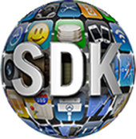
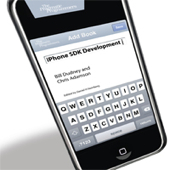
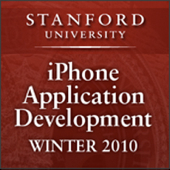
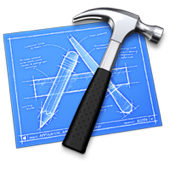
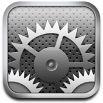
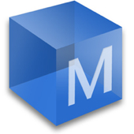
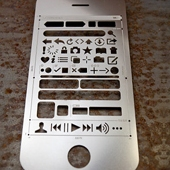
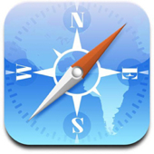
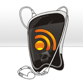
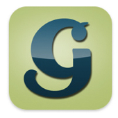

# The Complete iPhone Development Toolbox

Nobody could argue that the iPhone has been a revolutionary product in the cell phone industry. A fantastic SDK and third-party application support has enabled programmers to release thousands of apps to millions of people around the world. There are some fantastic apps available and many people are making a living from developing for the iPhone.

In this “ultimate toolkit”, we’re showing you everything you need to get started; books, tutorials, software resources, screencasts, podcasts, blogs, forums, conferences, software libraries, design kits, icons, and even where to hire a developer if you decide not to go it alone!

I hope you enjoy the roundup, and feel well equipped to embark on iPhone development will a full set of resources at your disposal.

## Getting Started

To start developing for the iPhone you will need a Mac running OSX and to register on the [iPhone Developer Program](http://developer.apple.com/iphone/program/)  with Apple. This will enable you to download the SDK to build your apps, test them on your iPhone and then release them to the App Store.

Registration is free for those just wanting to experiment with development. You can access all the guides and videos from Apple but testing your app is restricted to an iPhone simulator on your Mac. If you wish to test on your iPhone and release your app to the App Store, you will need to enrol on the standard program which costs $99 a year. This helps Apple preserve the integrity of the App Store and ensure that only quality apps are developed.

Once you have registered on the Developer Program, you get access to all of the goodies Apple has produced to help you develop iPhone Application. Make sure you download the latest iPhone SDK (currently 3.1.3) which comes bundled with the latest version of XCode and you’re then ready to go!

For all the documentation you will realistically need for development, check out the [iPhone Resource Library](http://developer.apple.com/iphone/library/navigation/index.html) . There are over 700 documents in the library and I will start the roundup by listing those that are going to be helpful when you first start out.

## Apple’s Best Bits

[Introduction to Objective-C](http://developer.apple.com/iphone/library/documentation/Cocoa/Conceptual/ObjectiveC/Introduction/introObjectiveC.html)  – Apple’s hefty introduction to Objective-C doesn’t specifically refer to [iPhone development](http://iphonedevelopercenter.net/) , or to any practical applications, but it has just about everything you need to know and in some detail!

[iPhone Application Programming Guide](http://developer.apple.com/iphone/library/documentation/iPhone/Conceptual/iPhoneOSProgrammingGuide/Introduction/Introduction.html)  – Quite simply an overview of everything to do with iPhone programming, including windows, event handling, drawing, files and multimedia support .

[Getting Started Guides](http://developer.apple.com/iphone/library/navigation/index.html?section=Resource+Types&topic=Getting+Started)  – Not just getting started with programming for the iPhone, but also getting started with Audio, Data Management, Security and much more.

## Books

If reading books is the best way for you enjoy learning, these seven cover pretty much everything you will need to know about iPhone development. From the basics of learning Objective-C and Cocoa, to interface design and 3D Games Development, you will get a good grounding in designing and programming for the iPhone interface.

There are many other books out there, but this selection, I think, cover pretty much everything you will need to get started.

[Objective-C for Dummies](http://www.amazon.com/Objective-C-Dummies-Neal-Goldstein/dp/0470522755/ref=sr_1_1?ie=UTF8&s=books&qid=1267480016&sr=8-1)   
The majority of iPhone apps are written in Objective-C so you need to know the language before getting started. Neil Goldstein takes you through an introduction to the language relating both to iPhone and Mac OSX development. No programming experience is required to pick this book up and it comes with a CD of source.

[Learn Cocoa on the Mac](http://www.amazon.com/Learn-Cocoa-Mac-Jack-Nutting/dp/1430218592/ref=sr_1_1?ie=UTF8&s=books&qid=1267480040&sr=1-1)   
After successfully getting to grips with Objective-C, the next step would be to learn how to utilise the Cocoa Frameworks in your development of both Mac OSX and iPhone applications. This book gives you a good grounding into what you should code yourself, and what you should let Cocoa do for you, enabling you to go on to create high quality apps for the iPhone.

[Beginning iPhone 3 Development: Exploring the iPhone SDK](http://www.amazon.com/Beginning-iPhone-Development-Exploring-SDK/dp/1430224592/ref=sr_1_1?ie=UTF8&s=books&qid=1267480289&sr=1-1)   
The book I continue to pick up at the bookstore, yet never have the money to buy, Dave Mark and Jeff LaMarche take you through the beginning stages of [iPhone development](http://iphonedevelopercenter.net/) . Previous programming experience is necessary, especially in Objective-C or at least in a C related language and any Cocoa experience would be beneficial. The writers have also set up a forum for support, mentioned in the forum section of this write-up.

[iPhone User Interface Design Projects](http://www.amazon.com/s/ref=nb_sb_ss_i_0_14?url=search-alias%3Dstripbooks&field-keywords=iphone+user+interface+design+projects&x=0&y=0&sprefix=iphone+user+in)   
Designing for the iPhone is probably unlike anything else you have previously designed for, as certain aspects are standardised and the screen is much smaller than any desktop or laptop. This book introduces you to designing for the iPhone, including how to best use the limited screen real estate, how to present data intensive apps and what to consider when migrating desktop applications down to the iPhone. Contributions come from a number of different app developers giving you a broad range of opinions and a lot of good advice.

[iPhone for Programmers – An App Driven Approach](http://www.amazon.com/iPhone-Programmers-App-Driven-Approach-Developer/dp/013705842X/ref=sr_1_1?ie=UTF8&s=books&qid=1267480327&sr=1-1)   
Deitel and Deitel write some of the best programming books around, such as the “How to program” series, but this book takes an entirely different approach to programming. Introducing you to all the main iPhone programming concepts and libraries using 14 complete apps, you learn how to integrate Cocoa Touch, Map Kit, Core Location and many other technologies. The book also gives you a brief introduction to getting your app approved by Apple, though requires some previous programming knowledge to understand the example source code given.

[3D for iPhone Apps with Blender and SIO2 – Your Guide to Creating 3D Games and More with Open-Source Software](http://www.amazon.com/iPhone-Apps-Blender-SIO2-Open-Source/dp/0470574925/ref=sr_1_1?ie=UTF8&s=books&qid=1267480358&sr=1-1)   
Programming apps for the iPhone is one thing, but I’m sure there are a few wannabe iPhone games developers out there and the next step on from learning the iPhone basics would be to start creating 3D apps. Using Blender as the 3D content creator, you are introduced to the concepts of graphics programming using Open GL along with collision detection, animation and interacting with the environment. The book gives you a good introduction to creating 3D Games that utilise the iPhone’s touchscreen capabilities and is a great next step up from programming basic apps.

[iPhone Advanced Projects](http://www.amazon.com/iPhone-Advanced-Projects-Joachim-Bondo/dp/1430224037/ref=sr_1_1?ie=UTF8&s=books&qid=1267480375&sr=1-1)   
For those developers looking to take their iPhone apps to the next level, this book is for you. Taking you through topics such as optimising performance and streamlining your interface, the book also introduces different writers to talk about a variety of advanced topics. Learn about networking with other iPhones, integrating SQLite and Push Notifications, streaming audio and debugging errors in your code.

For those of you who just want one book and already have some experience in OOP and a C-based language, then Bill Dudney and Chris Adamson’s iPhone SDK Development is the best starting point. It goes into just enough detail to get you going without boring you and, by the time you have finished, you will be developing decent applications.

## Screencasts

I would love to say that there are a lot of great screencasts out there for learning iPhone development, but unfortunately many of them are for an older SDK or cost money to watch. I’m reluctant to recommend video tutorials that cost money because it’s difficult to judge their quality (and we wouldn’t want you to waste your money). That said, if you have paid for and wish to recommend a tutorial, let us know in the comments below.

[Apple’s Getting Started Tutorials](http://developer.apple.com/iphone/)  – Once you have registered on the free iPhone Developer Program you get nine introductory videos helping you to get started with iPhone app development. Everything from introducing the iPhone SDK to fundamentals of Cocoa, integrating iPhone features and interface design is covered in these detailed videos.

[iPhone Tech Talk World Tour](http://developer.apple.com/iphone/)  – Also from Apple through the Developer Program, and slightly newer than the above tutorials, comes this thirteen video series, covering all the tools and technologies needed to develop killer iPhone applications. Topics include game development, UI and web applications over the course of 13 hours of video tutorials.

[iPhone Application Programming](http://deimos3.apple.com/WebObjects/Core.woa/Browse/itunes.stanford.edu.3124430053.03124430055)  – One of the most popular series on iTunes U, Stanford University’s iPhone Application Development is updated for the Winter 2010 semester. Featuring the full lectures along with PDFs of the lecture slides and all the [supporting code](http://www.stanford.edu/class/cs193p/cgi-bin/drupal/) , it’s almost as good as being there….just without the pressure of assignments! Highly recommended to all those with some knowledge of a C language and Object Oriented Programming concepts.

[iPhone Application Programming](http://deimos3.apple.com/WebObjects/Core.woa/Browse/rwth-aachen.de.2800424446.02800424448)  – Similar to Stanford’s course above, RWTH Aachen in Germany also uploaded their course to iTunes U. Don’t worry if you can’t speak German, the course is fully in English and covers everything from interface building and debugging to audio, video, drawing and networking. Lecture slides are available as PDFs although you cannot get hold of any of the source code or assignments.

[Build Your First iPhone App](http://www.youtube.com/watch?v=LtJl799MFA0&feature=related)  – A YouTube video showing how to make your first app on SDK 3.x including basic tabbed screen functionality

## Tutorials

[Absolute Beginners Guide](http://www.switchonthecode.com/tutorials/an-absolute-beginners-guide-to-iphone-development)  – No tutorial roundup would be complete without the Hello World introduction. So here it is!

[Getting Started with iPhone Development](http://dblog.com.au/iphone-development/rss-reader-part-1-getting-started-with-iphone-development/)  – A 4 part tutorial on creating an RSS Reader. Takes you from downloading and installing the SDK through to creating an Advanced RSS Reader with different tabbed views.

[Build a simple RSS Reader](http://theappleblog.com/2008/08/04/tutorial-build-a-simple-rss-reader-for-iphone/)  – Another RSS Reader tutorial. This one is much more basic than the above app and enables you to open the feed links in Safari.

[Create an Orientation-Aware Clock](http://theappleblog.com/2009/04/08/iphone-dev-sessions-how-to-make-an-orientation-aware-clock/)  – An introduction to recognising the orientation of the iPhone by creating a clock which rotates based upon the way you hold your phone.

[iPhone Game Programming](http://icodeblog.com/2009/01/15/iphone-game-programming-tutorial-part-1/)  – Part one of a 4-part series on creating your first iPhone Game. Create a simple pong style game and learn about collision detection, sounds, AI and user interaction in the process.

[Configure Application Preferences](http://knol.google.com/k/usman-ismail/iphone-sdk-application-preferences)  – You may have noticed some apps can be customised from the Settings app on your iPhone. This tutorial shows you how.

[Create a Map View](http://iamsgtyang.com/blog/2010/02/01/mkmapview-tutorial-for-google-maps-latitude-and-longitude/)  – Integrate the Map Kit framework into your app and display a region based upon the latitude and longitude.

[Playing with Map Kit](http://blog.objectgraph.com/index.php/2009/04/02/iphone-sdk-30-playing-with-map-kit/)  – Slightly more detailed, 3-part, tutorial explaining how to create a “Where Did I Park?” style application.

[Shake, Rattle ‘n’ Roll](http://blog.ablepear.com/2010/02/iphone-sdk-shake-rattle-roll.html)  – Tutorial on integrating with the accelerometer and vibrate features of the iPhone.

[Basic Music Player](http://www.developers-life.com/hello-music-player.html)  – Essentially a Hello World of music players. Simply queues your entire iPod library and starts playback when the app launches. A good starting point.

[Push Notifications](http://blog.boxedice.com/2009/07/10/how-to-build-an-apple-push-notification-provider-server-tutorial/)  – Communicate with the Apple Push Notification Server using PHP, JSON and Objective-C.

[Using the Store-Kit Framework](http://www.sixtemia.com/journal/2009/08/12/using-store-kit-framework/)  – Firmware 3.0 brought the ability to make in-app purchases. This tutorial explains how to integrate the Store-Kit framework to enable you sell content within your app.

[Create a To Do List using SQLite](http://icodeblog.com/2008/08/19/iphone-programming-tutorial-creating-a-todo-list-using-sqlite-part-1/)  – Part 1 of a 4-part tutorial on saving and accessing data using an SQLite database.

[Using openURL to send Email](http://icodeblog.com/2009/02/20/iphone-programming-tutorial-using-openurl-to-send-email-from-your-app/)  – If you have ever needed to send email from within your app this short tutorial explains how.

[Integrate Twitter into your app](http://icodeblog.com/2009/07/09/integrating-twitter-into-your-applications/)  – Utilise the Twitter API to integrate Twitter into your iPhone app.

[Playing with the GameKit](http://blog.objectgraph.com/index.php/2009/07/01/iphone-sdk-30-playing-with-game-kit-part-1/)  – Introduction to the GameKit framework allowing connection between two devices using Bluetooth.

## Podcasts

[Mobile Orchard](feed://podcast.mobileorchard.com/feed/podcast/)  – iPhone Developer podcast talking to some of the people behind the most popular apps in the store. Gain some insight into what goes into producing an app and the different technologies utilised.

[The MDN Show](http://itunes.apple.com/gb/podcast/the-mdn-show/id318584787)  – A “one stop shop” show for Mac and iPhone developers, the Mac Developer Network show takes on a magazine style format and is very easy to to listen to. Not too technical, but a useful resource.

## Blogs

[iCodeBlog]( http://icodeblog.com/)  – Updated about once a week, iCodeBlog provides some very useful and detailed tutorials, including the Twitter tutorial linked above.

[ManiacDev](http://maniacdev.com/)  – One of the best blogs out there regularly updated with quality tutorials and resources.

[ObjectGraph](http://blog.objectgraph.com/)  – Excellent development blog regularly updated with many useful tutorials.

[iPhoneized](http://iphoneized.com/)  – Focusing mainly on Mobile Safari web design, iPhoneized also looks at features that make developing apps easier.

[iPhone Flow](http://www.iphoneflow.com/)  – Community blog where users post links to items they feel will be of interest to other developers. Can pick up some neat tips here.

[iDevKit](http://idevkit.com/iphonedev/)  – News, [Tips and Tutorials](http://tutorialdb.org/)  for [iPhone development](http://iphonedevelopercenter.net/ "iPhone Developer Center") .

[Ray Wenderlich](http://www.raywenderlich.com/)  – Some great iPhone tutorials and tips from developer Ray Wenderlich. VItal read for those wishing to develop in Cocoa2D.

## Forums

[Apple Developer Forums](http://developer.apple.com/devforums/)  – Apple’s official forums where you will meet lots of like-minded developers. Requires a paid Developer Program account to access.

[iPhone Dev Forums](http://www.iphonedevforums.com/forum/)  – Get help with coding the iPhone SDK, web apps and also advice on app promotion.

[iPhone Dev SDK](http://www.iphonedevsdk.com/forum/)  – Massive forum with over 22,000 members covering everything from basic development, to tutorials, game development and the legal side of coding apps.

[iPhone Dev Book Forum](http://iphonedevbook.com/forum/)  – Ties in with the Beginning iPhone 3 Development book mentioned above and gives developers support as they progress through the chapters. Also includes a general discussion forum along with support for the authors’ other book.

[TiPb iPhone Developer Forum](http://forum.tipb.com/iphone-developer-forum/)  – Get helpful advice from other developers and browse the informative blog for the latest iPhone and iPad news while you’re there.

[iPhone World](http://forum.iphoneworld.ca/)  – A large forum with over 20,000 members, and topics centring around the App Store, technical iPhone development, and general Apple/iPhone news.

## Conferences

[360iDev](http://www.360idev.com/)  – Occurring on April 11-14th 2010, 360iDev is into it’s 2nd year in San Jose, CA. Cost is $499 in advance for the 4-day event featuring some of the top speakers in the industry.

[Voices That Matter](http://www.voicesthatmatter.com/iphone2010/)  – This two-day conference will be in Seattle on the 24-25th April 2010. Cost is $495 for the early bird and the schedule is split between a day of Best Practices/Game Development and one of Core Competencies/Interface Development.

[DevDay iPhone Conference](http://www.iphonedevday.com/)  – For those of you not fortunate enough to be in North America, DevDay iPhone caters for both developers and those working on the business side of iPhone development. Scheduled for London on the 26th April 2010, the day costs £399+VAT and includes an evening Networking Event.

[Apple Worldwide Developers Conference](http://developer.apple.com/wwdc/)  – Although not officially announced yet, the WWDC 2010 is rumoured for June 28th through July 2nd. Apple’s conference features some excellent technical sessions on both iPhone and Mac OSX and could see the release of iPhone 4.0.

[iPhone Developer Summit](http://www.iphonedevsummit.com/)  – Open to anyone with an interest in iPhone development, the iPhone Developer Summit is usually held in Santa Clara, CA .

## Open Source Libraries

[Google API client library](http://code.google.com/p/gdata-objectivec-client/)  – Google provides some brilliant Objective-C APIs for its services like Maps, Docs, YouTube and Analytics among others

[Oolong Engine](http://code.google.com/p/oolongengine/)  – For those of you wanting to create games for the iPhone, the Oolong Engine provides a great starting point. 3D game creation becomes a whole lot simpler and it ties in with the Bullet Physics SDK.

[Facebook Connect](http://developers.facebook.com/connect.php?tab=iphone)  – Integrate Facebook Connect into your app to connect with your Facebook friends and for a reliable method of authentication.

[ObjectiveFlickr](http://github.com/lukhnos/objectiveflickr)  – API for connecting to a Flickr account through your iPhone or Mac app. It was built for iPhone 2.x but should work with 3.x.

[Cocos2D](http://code.google.com/p/cocos2d-iphone/)  – Another game development framework, although this one is for 2D rather than 3D games. Based on cocos2d for the python language but converted to Objective-C for iPhone development.

[31 Example Applications](http://appsamuck.com/)  – Appsamuck provide source code for 31 example applications showing you how achieve a number of different tasks in your applications. Unfortunately not well commented so you will need to be a good with Objective-C to work it out.

[Touch XML](http://code.google.com/p/touchcode/wiki/TouchXML)  – Touch XML is a lightweight replacement for NSXML allowing parsing of XML data on the iPhone. Cannot generate XML though.

[PhoneGap](http://phonegap.com/)  – For those of you not interested in learning Objective-C, Phone Gap is a framework for building mobile apps using Javascript.

[Model Baker](http://www.widgetpress.com/modelbaker)  – Point and click iPhone app development? Model Baker introduces the quickest way to make iPhone applications, without even having to code.

[Liquid Gear](http://www.liquidgear.net/)  – Develop iPhone Apps using Javascript and HTML. Liquid Gear runs as the middle man and can integrate with databases, accelerometer, maps, contacts and location among a number of other features.

[Rhodes](http://rhomobile.com/products/rhodes/)  – Rhodes is an open source framework for developing mobile apps for all platforms. It’s based on the Ruby programming language and can compile apps for Android, Blackberry and iPhone.

## Design Kits and Interfaces

[iPhone GUI Design](http://www.teehanlax.com/blog/2009/06/18/iphone-gui-psd-30/)  – Before you make an app you need to design it. This brilliant Photoshop GUI kit comes with all the different types of buttons, sliders and graphics you need to quickly create mockups of your apps.

[iPhone PSD Vector Kit](http://www.smashingmagazine.com/2008/11/26/iphone-psd-vector-kit/)  – Smashing Magazine bring a much simpler iPhone GUI for those of you focusing on more straightforward applications.

[iPhone Application Sketch Book](http://www.amazon.com/gp/product/1430228237?ie=UTF8&tag=iphoapplsketb-20&linkCode=as2&camp=1789&creative=9325&creativeASIN=1430228237)  – For those of you who prefer to sketch out your applications, this book provides 150 templates at 1.5x zoom. Plenty of room to jot notes and you look professional in front of your clients.

[iPhone Stencil Kit](http://www.uistencils.com/products/iphone-stencil-kit)  – Brilliant little stencil with all the major buttons and shapes you will need to create mockups of your iPhone apps.

[iPhone Sticky Pad](http://www.uistencils.com/products/iphone-sticky-pad)  – Design your iPhone apps on this sticky pad that ties in with the above stencil. You can then stick your designs around the office and create flowcharts of your apps.

## Icons

  
[Icon PSD Kit](http://www.keepthewebweird.com/iphone-icon-psd-template/)  – Photoshop template for creating app icons. Comes with a lot of options but seems to be a bit more complicated than it needs to be.

[Icon ‘Shine’ Kit](http://notlost.blogspot.com/2008/10/iphone-icon-shine-kit.html)  – Easily create the glossy icon shine using this clever kit. Simply drop the flat image into the kit and it layers the shine over the top. Saves time, looks great.

## Mobile Website Tools

[Learn How to Develop for the iPhone](http://net.tutsplus.com/misc/learn-how-to-develop-for-the-iphone/)  – The ever excellent Nettuts+ shows us how to make iPhone specific stylesheets and how to detect page orientation.

[iUI](http://code.google.com/p/iui/)  – iUI is a Javascript and CSS framework for creating web apps which look and act like standard iPhone apps.

[JQTouch](http://www.jqtouch.com/)  – Spice up your iPhone websites using JQTouch, the JQuery plugin for mobile web development.

[iPhone Web Developer Toolbar](http://www.manifestinteractive.com/iphone/)  – An ingenious bookmarklet from Manifest Interactive helping you to build and debug iPhone websites.

[JQuery Flick](http://plugins.jquery.com/project/flick)  – Also from Manifest Interactive is the JQuery plugin allowing you to add the flick/scroll status to iPhone websites. The iPhone seems to struggle with scrolling through some things on websites and this plugin could help fix the problem.

## Directories to List your App in

Here are a collection of different directories where you can submit your application for inclusion – obviously in addition to the App Store itself! They offer an easy way to gain some extra promotion, and a few extra links back to your website or blog:

## Where to Hire Developers

[TheyMakeApps](http://theymakeapps.com/)  – A directory of different companies that design and develop iPhone apps, fully sortable by location, fee, and numerous other factors. All wrapped up in a wonderfully designed website!

[37 Signals](http://jobs.37signals.com/categories/6/jobs)  – 37 Signals have a dedicated section for posting iPhone developer jobs. Currently $300 for a 30 day advert.

[CocoaDev](http://cocoadev.jobcoin.com/)  – With 2,000 unique visitors a day and adverts for just $99 for 30 days, you can reach a lot of people for a small payment.

[iPhone Freelancers](http://www.iphonefreelancers.com/)  – Search for and post jobs for iPhone Freelancers. Currently $25 for 60 days.

[GetAppsDone](http://www.GetAppsDone.com/)  – Always a lot of jobs on offer at GetAppsDone. Jobs you post are also shared via their iPhone app.

[TUAW](http://www.tuaw.com/jobs)  – The Unofficial Apple Weblog have their own job board, with both iPhone and Mac OSX development jobs.

[Craigslist](http://www.craigslist.org)  – Although derided by many, Craigslist is still a valuable resource for those looking to find work and is a great place to post adverts.

## Let’s Get Started!

Hopefully we’ve given you a good kick start for developing iPhone apps. Just writing this has brought to my attention a whole range of great products that I didn’t even know existed. I think I’m definitely going to pick up UI Stencil’s iPhone Stencil Kit and the sticky, post-it style pad they sell.

Anyway, if there is anything we have not included that you would recommend for people starting out in iPhone development, let us know in the comments below. Thanks for reading, and best of luck with the development of your iPhone application!
