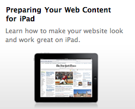
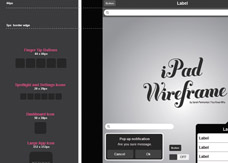
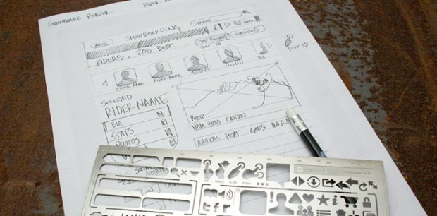
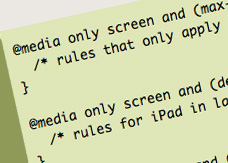

# The iPad Web Design & Development Toolbox

A few months ago, we published a [set of resources](http://iphone.appstorm.net/roundups/developer/the-complete-iphone-development-toolbox/)  for iPhone developers, covering a huge range of different types of resource. From podcasts and conferences to design kits and frameworks.

Today we’re doing something similar, but specifically with designing websites for the iPad in mind. It won’t be quite as extensive (let’s face it, the iPad is still fairly new!), but should offer a brilliant set of resources for developing a browser-based site or application for Apple’s latest gadget.

## Getting Started

The main focus of this article relates to designing *websites* for the iPad. The entry barrier to this type of development is virtually non-existant.

That said, if you’re wanting to develop a native application, there’s a considerably more complex process. As with the iPhone, you’ll need to enrol on the [iPhone Developer Program](http://developer.apple.com/programs/iphone/) . This gives you full access to all Apple’s resources, the SDK, and the latest beta builds of the software for your iPhone and iPad.

You can either [register for free](http://developer.apple.com/programs/register/)  if you’d like just the basic access to Apple’s SDK, or pay $99 per year to have the ability to test applications on your iPad itself, and submit them to the App Store.

Once you’ve done one of the above, you’re ready to get started! Download the SDK, and take a look at [our iPhone developer tookbox](http://iphone.appstorm.net/roundups/developer/the-complete-iphone-development-toolbox/)  for a whole range of resources that are still perfectly suited to iPad development.

## Apple’s Resources

Though focused primarily on native app development, Apple do have a few great documents that relate to web design – or interface design in general. These make for a good initial port of call:

- [Preparing Your Web Content for iPad](http://developer.apple.com/safari/library/technotes/tn2010/tn2262.html)  – This article talks through details of the user agent code for Mobile Safari on the iPad, why you should use W3C standard web technologies instead of plug-ins (Flash is, of course, not supported), and how you should modify CSS code previously targeting the iPhone. There are also a few useful tips relating to the challenges of developing for a touch device – there’s no hover or mouse-over state, for instance.
- [Human Interface Guidelines](http://developer.apple.com/iphone/library/documentation/General/Conceptual/iPadHIG/Introduction/Introduction.html)  – This is a mammoth document, and essentially outlines Apple’s “best practices” for designing iPad interfaces. Although primarily aimed at native apps, if you can implement these standards in your web application you’ll be on the road to offering a great experience for the user.
- [Safari Web Content Guide](http://developer.apple.com/safari/library/documentation/AppleApplications/Reference/SafariWebContent/Introduction/Introduction.html)  – A guide on how to ensure your web design works well in Safari (whether on the desktop, iPhone, or iPad), and tips on extra events and handlers you can use with the touch interface.

## Interface and Wireframing Design Kits

One of the most important things to consider when designing for the iPad is how you’re going to structure the interface of your application. It’s all about touch, and it needs to be obvious for the user as to how and when to interact with your website or web application.

Wireframing your design from an early stage is a great move, and there are a few handy resources below:

- [iPad Wireframe EPS](http://www.sazzy.co.uk/2010/04/ipad-wireframe-eps/)  – A great illustrator file that provides everything you need to create accurate wireframes for the iPad. The rest of Sarah’s blog is pretty brilliant as well, and she’s an incredibly talented interface designer.
- [iPad Stencil Kit](http://www.uistencils.com/products/ipad-stencil-kit)  – Something a little bit different, this metallic stencil kit is perfect for wire framing on paper (often the best place to start). There are also kits available for the iPhone if you’d like to try them out.
- [iPad GUI PSD](http://www.teehanlax.com/blog/2010/02/01/ipad-gui-psd/)  – For the actual iPad interface elements themselves, this PSD kit is one of the best options to experiment with. It contains everything from buttons to toolbars and pop-over windows.

## General iPad Design Articles

For general design principles, we’ve rounded up a few other articles below that will give you a little guidance:

- [Design Tips for Your iPad App](http://www.smashingmagazine.com/2010/04/16/design-tips-for-your-ipad-app/)  – The tips shared here aren’t just relevant to the iPad, but design in general. Focus on knowing who your user is, keep it minimal, and experiment with every orientation.
- [Ember’s iPad Category](http://emberapp.com/explore/categories/user-interface-design/ipad)  – Ember is packed with iPad interface screenshots, snippets and information. Browsing through here will give you no end of ideas for designing something that looks great.
- [Designing for iPad: Reality Check](http://informationarchitects.jp/designing-for-ipad-reality-check/)  – A fantastic, rambling, in-depth article looking at all manner of different design aspects. From typography to interaction, there are some really interesting thoughts here.
- [How iPad Affects the Way we Design Websites?](http://www.inspiredm.com/2010/02/09/ipad-design/)  – Another fairly general walkthrough of a few design decisions that you might want to make.
- [Quick and (not so) Dirty iPad User Testing](http://carsonified.com/blog/design/quick-and-not-so-dirty-ipad-user-testing/)  – A fun look at how you can emulate the experience, size, and feel of the iPad if you’re yet to purchase one but still want to perform some testing.

## Developing and Coding

From a technical point of view, you’ll need to *detect* that a reader is using an iPad in order to show them a particular version of your site. You’ll also want to know all about the interesting things you can do on an iPad that aren’t possible on the desktop!

Here are some great pieces of advice:

- [iPad Detection using PHP and JS](http://davidwalsh.name/detect-ipad)  – Three code snippets are offered here, to detect the iPad using PHP, JavaScript, or a .htaccess file. This lets you easily redirect the user to a different design (be sure to let them easily view the original site though!)
- [iPad Orientation CSS](http://www.cloudfour.com/ipad-css/)  – Unfortunately, you can’t pick up your computer monitor and turn it portrait. You can with the iPad, and it’s important to have CSS that accommodates both orientations. These rules will let you do just that.
- [Detecting Device Size and Orientation in CSS](http://mislav.uniqpath.com/2010/04/targeted-css/)  – A slightly more in-depth look at how you can target the iPad using CSS.
- [iPad Web Development Tips](http://www.nczonline.net/blog/2010/04/06/ipad-web-development-tips/)  – Working through a number of different CSS/JS techniques, and explaining why the browser really isn’t all that different from the desktop.

## Dealing with WordPress

Optimising your WordPress theme for the iPad is something you might like to consider, but fortunately there usually isn’t too much that you have to do. Generally speaking, your beautifully crafted theme will probably look fine on the iPad out of the box (assuming it looks good in Safari on OS X).

[This short article](http://www.wplover.com/1670/getting-your-wordpress-themes-ready-for-apple-ipad)  covers a few things you might like to consider, and it’s also worth taking a look at a plugin called [WP-UserAgent](http://wordpress.org/extend/plugins/wp-useragent/)  if you’re wanting to detect if a reader is using an iPad.

Of course it’s also worth mentioning the [WordPress app](http://iphone.wordpress.org/)  for the iPad, which is far more usable than the iPhone equivalent.

## Hiring a Developer

Of course, you may find that it simply doesn’t make sense to develop a website, and a native application is the best way to go. Luckily, there are a range of different sites that can help to make the process of finding a developer remarkably straight-forward.

We [covered all these](http://iphone.appstorm.net/roundups/developer/the-complete-iphone-development-toolbox/)  in our recent iPhone developer post, and you can find the full list at the bottom of the article.

Remember to check out a variety of previous work to gain a strong idea of quality before hiring anyone in particular!

## Share Your Tips!

Are there any other handy links, resources, and tips you’ve picked up about developing for the iPad? I’d love to hear them in the comments below – feel free to share!
