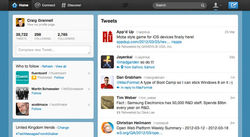

## Christian Heilmann wants free services to stop punishing users

Christian Heilmann thinks we need new models to support free online

[In his latest blog post](http://christianheilmann.com/2012/03/26/are-free-apps-evil/) , Mozilla Developer Evangelist [Christian Heilmann](https://twitter.com/#!/codepo8) has written about free services and apps and what they mean to users. Within, he said people increasingly react arrogantly to free services that cause problems – “There is a general consensus of 'you can't expect quality when things are free' …” – and that companies don't help by denying access to user data that's nonetheless being sold to third-parties. Additionally, he noted blame is regularly misdirected – users rally against ad-supported free apps draining batteries by slamming advertising rather than the industry figuring out how to make the ads better behaved, such as by them working locally.

We spoke to Heilmann about perceived issues with 'free' and whether it's time for more people to start paying for their web services and apps.

**.net: You seem to suggest there's a sense of entitlement regarding free apps ('everything should be free') but also skewed expectations ('when something is free, you should expect a poor service'). Do you see any obvious means of the wider audience breaking out of these mindsets?**  
Heilmann: I guess if it becomes more obvious to the wider audience that some free applications sell users as products there could be a backlash towards paying, to keep people's privacy. Tools such as [Collusion](http://www.mozilla.org/en-US/collusion/) can help with spreading that awareness.

The issue is that, especially with the young generation of users, there is a sense of 'so what?'. It's normal to share everything you do, and even to create new identities if a password to an old one is forgotten. This also means data sold to third-party providers is full of fake information. In the end, the whole system is broken.

**.net: Are there any services that could be used to 'fix' things?**  
Heilmann: I can see how [Mozilla Persona](http://www.mozilla.org/en-US/persona/) can fight this – you never have to share everything you are, just an email address. This also means providers don't host your data and lose it if they get hacked or sell out. So as a free service provider, you can prove that you are not a seller by using this system.

**.net: Would another solution be to ditch free apps?**  
Heilmann: By no means do I want to kill free apps. I just don't want to see people punished for using a free service. You can do both well. And arrogantly saying users of free systems deserve being spied on is not getting us anywhere. It actually shows that the people who know better don't want to help.

**.net: But with the likes of Twitter, would it be beneficial to have a paid tier, providing extra options, such as more data history? This could provide the means for users to be on equal footing with advertisers in that regard.**  
Heilmann: Yes, very much so. I'd pay for Twitter if I could get all my data – I'd then release it for free. And I'd pay for getting an extra level of transparency that tells me where my data goes and be allowed to block that.

**.net: You talk about local ad rotation, but should more people just start paying for what they value, rather than relying on 'free' and then moaning about it?**  
Heilmann: Again, if that is an option, yes. Angry Birds, for example, can't be bought [on some platforms] – you have to suffer the ads. So it makes sense to fix the problem rather than trying to shift a market. That has to happen, too, but why cause people discomfort while we do it?

On the web a lot of advertising is annoying enough that you pay to turn it off. Not many apps go that way because a payment system is more work than showing ads. It's time to phase out the concept of ad display as a viable monetisation strategy. Whenever I mentored at Seedcamp, I told start-ups that this will not work. The ones who had a paid service are still around.
