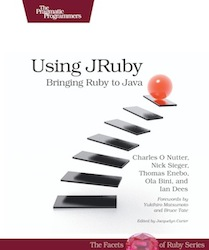
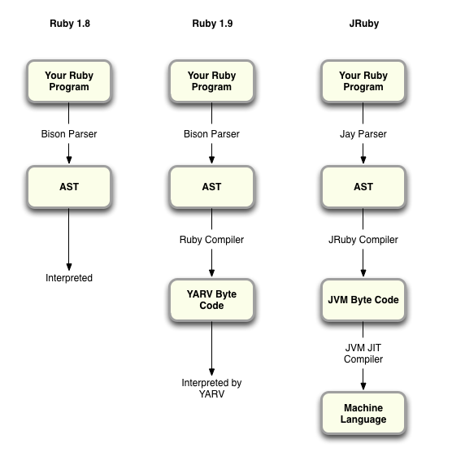
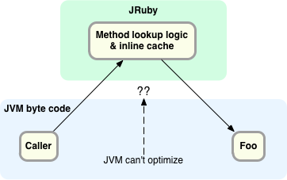
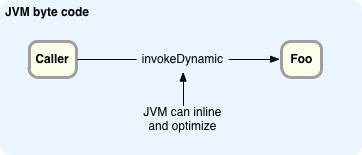

[1 Comment](http://rubysource.com/learning-more-about-jruby-from-charles-nutter/#comments "Comment on Learning More About JRuby from Charles Nutter")

# Learning More About JRuby from Charles Nutter

Reddit287  244 Email0 [Hackernews](#)

JRuby has been in the news a lot recently: just a couple of weeks ago [JRuby 1.6.7 was released](http://jruby.org/2012/02/22/jruby-1-6-7) , [JRubyConf](http://jrubyconf.com/)  is coming up soon, and over the past several months there’s been a lot of buzz about the upcoming JRuby 1.7 release and how it will take advantage of Java 7’s new support for “InvokeDynamic.” With all of this going on, I was thrilled to have a chance to interview [Charles Nuttter](http://twitter.com/headius) , one of developers on the JRuby core team.

If you have a few minutes, read on to hear directly from Charles in his own words about what’s new in JRuby, why a traditional Rubyist would want to use JRuby, how Ruby apps can use Java libraries from a Maven repository, and – my favorite topic – JRuby internals. For me this was all fascinating! Interviewing Charles was a golden opportunity to learn more about JRuby.

## RubyConf India, JRubyConf and JRuby 1.6.7

Charles Nutter

Q: I heard you’re going to give the keynote address at [RubyConf India](http://rubyconfindia.org/2012/)  next week… congratulations!

Yea, the keynote slot was kind of a surprise! I just wanted to come out and talk and hang out, but that should be fun.

Q: And speaking of conferences, isn’t [JRubyConf scheduled for May](http://jrubyconf.com/) ?

Yes! I invite everyone to come to JRubyConf in Minneapolis, home town of [Tom Enebo](http://blog.enebo.com/) , [Nick Sieger](http://blog.nicksieger.com/)  and I, from May 21st to 23rd. It’s reasonably priced, in a cheap area, and we’d love to have as many folks as possible come up. We’ll have talks about both JRuby and non-JRuby stuff. It should just be a great event!

Q: And I heard that you guys [just released JRuby 1.6.7](http://jruby.org/2012/02/22/jruby-1-6-7) . What’s new in this release?

We did a major/minor release in 1.6.6, that we were hoping was going to be the last 1.6 release. We had a lot of fixes in it: a lot of improvements, some performance bugs were fixed, and a lot of Ruby 1.9 behaviors were improved. Since 1.6.6 had a long cycle and nobody tries stuff out until you release it, immediately after we released it we got a flood of bug reports, especially 1.9 encoding issues that we hadn’t fixed. So a couple of weeks later we decided that we’d spin another release. We got another 40 some issues fixed, most of them Ruby 1.9 feature related, and that’s what 1.6.7 is. It’s a quick follow up release to fix a bunch of issues that people found in 1.6.6.

## Why use JRuby?

Q: Just in case some of our readers aren’t very familiar with JRuby, where’s a good place to start learning about JRuby?

Well, there’s the book [Using JRuby: Bringing Ruby to Java](http://pragprog.com/book/jruby/using-jruby)  from Pragmatic Programmers – it’s a great book that seems to help a lot of people out.

Q: Can you explain why a traditional Rubyist would want to use JRuby?

There’s a few things we usually point to: one of the big ones is that we’re constantly working to improve performance. On small apps or computation/execution intensive stuff usually JRuby is about the fastest Ruby right now. That doesn’t mean for all apps we’re the fastest, in particular there are some complicated Rails applications that we’re having trouble running as fast as we would like. But performance is a big one and we continue to work on that all the time. Plus we leverage work that the JVM guys are doing with performance all the time.

The next thing would be if garbage collection or memory management is a bottleneck for an MRI based app, it’s probably not going to the issue on JRuby. The JVMs have excellent garbage collectors and we basically just piggyback off of that.

The last area is stability and the cross-platform aspect of the JVM: lots of great libraries, runs on every platform, and you get all of that for free, pretty much. You don’t have to do a lot of work porting JRuby from platform to platform. If you’ve got code that works on one platform, it’s pretty much going to work anywhere else too.

Q: With [Heroku](http://www.heroku.com/)  it’s so easy with a few commands to get a new app up and running on the Internet. Is there a similarly easy option for JRuby?

That’s actually one of the areas we spend a lot of time on. We want to make JRuby’s day to day experience feel pretty much like regular Ruby. To that end, there is a cloud option that is well tested and being used by folks at [Engine Yard](http://www.engineyard.com/) , for one. The way you deploy an app with MRI or JRuby at Engine Yard is basically identical. It is possible to deploy at Heroku using the cedar stack and other stuff. And I think there’s a build pack that makes it a little easier too. And if you’re doing your own hand rolled deployment there are a number of command line servers that mimic [Unicorn](http://unicorn.bogomips.org/)  or [Passenger](http://www.modrails.com/)  or any of those. Our preferred one is [Trinidad](http://thinkincode.net/trinidad/)  which wraps up [Tomcat](http://tomcat.apache.org/)  and gives you a command line option. We’ve done a lot to try and make it feel pretty much the same as deploying or running a regular Ruby.

It’s an ongoing process, but we want Rubyists to be able to work like Rubyists when they’re using JRuby.

Q: What are the obvious differences between the JVM and standard MRI Ruby?

With JRuby you’re running real concurrent threads… you have the benefit of that: being able to run concurrently and use multiple cores. But there are certain things that we don’t guarantee are thread safe, just because they would be too much overhead: things like concurrent mutations of strings, arrays, hashes that sort of stuff.

One of the downsides of JRuby that we’re always trying to improve, is the start up time. For JRuby it is definitely worse, but once you’ve got things up and running performance should be better, sometimes a lot better, than the standard implementation of Ruby. It’s kind of a trade off there.

Q: So it’s day to day development startup time that’s painful?

The day to day development time is impacted by having to start things. TDD, the typical way Rubyists do stuff, can still be a little bit painful with JRuby. It’s definitely improved over time, but it still gets in the way a little bit. The JVM startup time itself isn’t bad, but pretty much all of JRuby’s code still has to be compiled by the JVM at *run time* at some point. So for the first second or two that an application is running, nothing is compiled to native code. Not even the Java parts of JRuby. So it takes a little longer for us to warm up and get up to full speed.

The other half of it is that a lot of Ruby libraries and tools have been built around the fact that MRI starts up fast. For example “bundle exec” is two launches of whatever Ruby implementation you’re running. If you’re running “rake test” in Rails I think I counted it starts up 4 or 5 separate processes.

Q: Would it make sense to do your development with MRI and in production switch to JRuby?

If the libraries you are using are compatible, that actually isn’t a bad way to go. [Square](https://squareup.com/)  folks, for example, for their day to day development they tend to use MRI, and then testing and deployment is on JRuby.

Q: Many Rubyists hate Java for one reason or another… if you hate Java, will you hate JRuby also?

The startup time is probably the only thing that would be visible to most of them. The other aspects of Java that people hate, like classpaths, app servers and the verbosity of the Java language itself – most of that you never see if you’re using JRuby. We’ve hidden of all that stuff away pretty nicely.

## JRuby and Maven: taking advantage of Java libraries in a Ruby app

Q: I was watching a [video from last Fall’s RubyConf](http://confreaks.com/videos/684-rubyconf2011-jruby-polyglot-heaven)  and saw you talk about using Maven as a package manager for Ruby. Can you tell us more about that?

As anybody who deals with the Java world knows, it pretty much revolves around [Maven](http://maven.apache.org/index.html)  and Maven repositories – everything relates to Maven at some point. What Maven actually does well, whether you actually like the build process and the rigidness of it, is providing a global repository of all Java libraries with all their dependencies mapped out, all of their information clearly available. What we want to do is make that entire repository of Java libraries available as though they were just regular gems.

  

[search.maven.org](http://search.maven.org)  allows you to search Apache’s central Maven repository while  
[mvnrepository.com](http://mvnrepository.com)  allows you to search across various public Maven repos

Q: So this is sort of the Java version of [RubyGems.org](https://rubygems.org/) ? Is that how I should think of this?

Yea – by and large. It’s much larger, it’s federated across lots of servers, and there are many, many more libraries than there are on RubyGems, but that essentially what it does for the Java world. Because we want to make it easy for Ruby developers to use Java libraries and not have to think about things like Maven, we’ve slowly over time added some things like patches to our copy of RubyGems that allows installing any Maven library as though it were just a gem.

Q: So I can just run “gem install XYZ” and install a library from Maven?

Yup exactly. You just specify what the identifier for that library and it pulls it down from the Maven servers.

Q: And this will work with any Java library?

Oh yea – one of the examples I use is gem-installing [Clojure](http://clojure.org/) , the language for the JVM. You pull down the library, you start up IRB and you can actually call out to Clojure or any other Java library installed that way.

## JRuby Internals

Q: I always knew that JRuby’s Java code was compiled to byte code, but I never knew until recently that the target Ruby script was compiled to byte code also. Can you describe how that works?

For the standard bits and pieces, like the core classes String and Array, for the most part what is written in C in regular Ruby is written in Java for JRuby. That’s the basics. Beyond that, we have an interpreter, similar to Ruby 1.8 which is basically just walking the tree, the [Abstract Syntax Tree (AST)](http://en.wikipedia.org/wiki/Abstract_syntax_tree)  which has been parsed out of the code.

We have a parser which is largely a port of the Ruby parser, using a similar parser generator. Ruby uses one called [Bison](http://www.gnu.org/software/bison/) ; we use one called [Jay](http://www.informatik.uni-osnabrueck.de/alumni/bernd/jay)  which is essentially the same grammar, same syntax and our parser looks pretty much like Ruby’s does.

How Ruby 1.8, Ruby 1.9 and JRuby differ while parsing and executing your code

We interpret that for a while, basically just walking it and doing whatever the AST says to do. If a piece of code is run many times, then we would do another pass and compile it to JVM byte code. I think the threshold is about 50 calls and we’ll turn it into JVM byte code. From there it’s up to the JVM. The JVM has its own cycle of interpreting for a while and then compiling into native code. But mostly we try to hand off code to the JVM as quickly as possible, so that everything gets compiled down to native at some point.

Q: I’ve heard a lot about “InvokeDynamic” recently, and how it will speed up JRuby even more, but I’m not sure what it really is. Can you explain what InvokeDynamic actually does?

The basics of Ruby method invocation are: if you are calling a method “foo” you need to look up the piece of code that goes along with method “foo” on some target object, and then call it. Ideally you don’t want to do that look up every single time you call foo, since it might have to walk a class hierarchy, there might be some complicated modules and other things in between your call and the target class. So you want to cache that somehow. The typical way that Ruby 1.9, JRuby and some other implementations do that is with something called an inline cache. At each point in the code where you’re making a call, we have a little cache there, that saves the most recently seen method. If you continue to call the same method at that point, over and over again, it won’t keep doing the lookup. Now, that’s how JRuby on Java 6 works.

In JRuby 1.6, the JVM cannot optimize the complex method lookup code in JRuby

On Java 7, what we’re actually able to do is tell the JVM: “Here’s how you look up this method. Go and find it and bind it to a particular call. We’ll do the logic of finding the method. And here’s how we want you to call it. Here’s how we want you to organize the parameters, here’s any logic that needs to come before and after, here’s how you know if it’s the right method for a subsequent call, here’s how you guard against it being a different type, different class that’s at that point. Because we’re able to tell the JVM all that information, it’s much easier for it to optimize it. It can actually see all the way through from the call “foo” to the target method and understands all the logic in between. That was something we just couldn’t do as well on previous versions of the JVM.

In JRuby 1.7, the JVM is able to inline and optimize the dynamic call

The JVM itself is pretty dynamic, because almost everything is an object and they’re all virtual invocations. It has to do a lot of dynamic language stuff on the inside, even though it’s statically typed at the Java language level. When it gets to the linking phase, on a Java 6 JVM, there are really four or five ways that it knows how to do that. It’s either a static call, or a virtual call, or an interface call, etc., and it already has the plumbing hard coded in the optimizer to know how to do those as fast as possible. What InvokeDynamic gives us is a way to tell it a new way to link from a call to a target method in terms it can understand and optimize just like all those other call protocols.

JRuby 1.7, which is the master branch right now, is where doing all the InvokeDynamic work. You can play with it right now – the performance is already looking great, even though we’ve still got more work to do.

## What’s next?

Q: I read somewhere there’s a new JRuby compiler coming, called the “IR Compiler” – is that correct?

That is correct! In an effort to give the JVM better byte code, I guess is the easiest way to say it, we’ve been working on a new compiler of our own that works entirely above the JVM level, with our own instruction set. It’s an instruction set that we can control, we can optimize in our own way, and we’re starting to do simple inlining at that instruction set level before we even give it to the JVM. We’re trying to setup an execution environment and instruction set that matches better how Ruby works, and then go from there to have a better interpreter and compiler as a result.

Q: So there would be an extra step in the process; you would need to compile to this new instruction set first, and then translate that in turn back into the Java byte code?

Yes, exactly. This would fit where we have the AST walking right now, the AST interpreter. Instead of going right into the AST interpreter we might hand the code off to our IR compiler and optimizer, and then let that interpret for a while. And from there we would turn the IR into JVM byte code, and ideally the byte code that comes out of there would be sort of “pre-optimized” and doesn’t have that much to do.

Q: What the future for JRuby? What’s next?

Well we’re continuing to work to improve JRuby’s performance. We’ve done a lot of work over the past couple of months to really round out Ruby 1.9 features. We’re going to start turning our attention to performance again: the IR compiler, the invokeDynamic work, all that stuff should start paying serious dividends as part of JRuby 1.7 and beyond.

## Thanks!

Q: Wow – fascinating! Thank you for explaining all of that to me!

Thanks a lot – nice talking to you…
