15/12/2011

###### [JQuery](http://tableless.com.br/?cat=125)

# [20 plugins jQuery que marcaram 2011](http://tableless.com.br/20-plugins-jquery-que-marcaram-2011/)

Final de ano, época de listas. Confira 20 plugins jQuery que chamaram atenção em 2011, incluindo slideshows, utilitários para formulários e o framework jQuery Mobile.

Por [Davi Ferreira](http://tableless.com.br/?author=7)

---

- [19](http://tableless.com.br/20-plugins-jquery-que-marcaram-2011/#comments "Comment on 20 plugins jQuery que marcaram 2011") *comentários*

### jQuery Mobile

<http://jquerymobile.com>

Apesar de não ser um plugin, o jQuery Mobile encabeça nossa lista por ter sido uma das ferramentas mais importantes do ano. O objetivo do framework é disponibilizar uma API simples e compatível com todos os dispositivos móveis. Seu código é quase todo baseado em HTML e sua interface oferece suporte total a operações com toque.

### Quicksand

<http://razorjack.net/quicksand/>

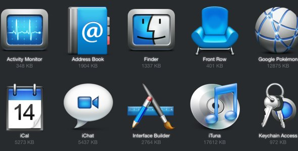

Quem utiliza sistemas e dispositivos da Apple conhece bem a interface simulada pelo plugin Quick Sand, que permite ordenar e filtrar ítens de uma lista, sejam eles ícones, texto ou imagens, utilizando animações e transições.

### Reveal

<http://www.zurb.com/playground/reveal-modal-plugin>

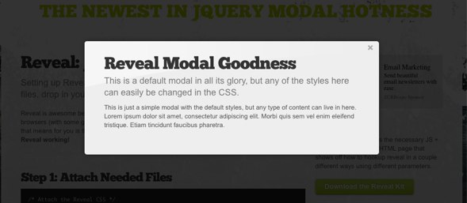

Reveal é mais um plugin para janelas de alerta/informação. Sua instalação é bem fácil, permitindo executar o plugin diretamente via jQuery ou simplesmente utilizando o atributo ‘data-reveal-id’ em um elemento.

### jQuery File Upload

<https://github.com/blueimp/jQuery-File-Upload>

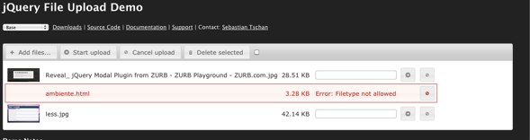

Plugin para upload de arquivos com suporte a múltiplos envios e drag and drop. O plugin oferece ainda uma barra de progressão, cancelamento e resumo de envios, restrições por tipo de arquivo e preview de imagens. Bem completo.

### QapTcha

<http://www.myjqueryplugins.com/QapTcha/>

Quem aí nunca teve dificuldade em reconhecer um captcha? O QapTcha chega para acabar com essa confusão de letras e números, trocando o captcha tradicional por um slider de liberação.

### DropKick

<http://jamielottering.github.com/DropKick/>

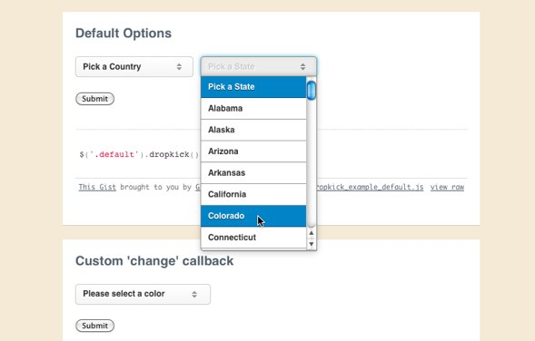

O DropKick bombou bastante no Twitter. É um plugin para a criação de menus dropdowns. Assim como plugins de modal, existem milhares de outros plugins para este tipo de menu. O diferencial do DropKick é a facilidade de criação e o ótimo resultado final em todos os navegadores do mercado.

### ParallaxSlider

<http://tympanus.net/codrops/2011/01/03/parallax-slider/>

O ParallaxSlider, na verdade, é um tutorial que acabou resultando em um plugin. No link acima você confere uma explicação completa de todo o desenvolvimento do plugin. Seu objetivo é oferecer uma galeria de fotos que adota o princípio de animação que se popularizou esse ano onde o background acompanha a navegação.

### Toast Message

<http://akquinet.github.com/jquery-toastmessage-plugin/>

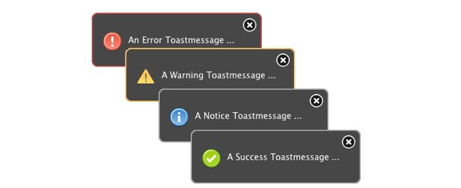

Mais um plugin para os fãs de Mac. O Toast Message oferece mensagens informativas no formato que ficou popular com o utilitário Growl. Fácil de implementar e personalizar.

### FitText

<http://fittextjs.com>

[Responsive Design](http://tableless.com.br/?s=responsive+design)  está na moda. FitText é um plugin que adapta o tamanho de títulos e textos no geral de acordo com o elemento pai, tornando flexíveis as dimensões da fonte.

### jRumble

<http://jackrugile.com/jrumble/>

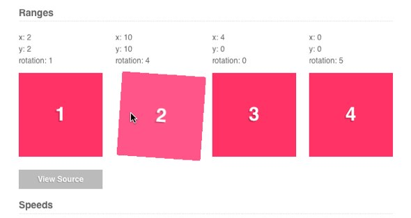

jRumble é um plugin para adicionar animações — tremer, vibrar, balançar ou girar qualquer elemento. Ideal para menus e efeitos hover em links. Possui, além das animações, configurações para opacidade e velocidade.

### Mosaic

<http://buildinternet.com/project/mosaic/>

Plugin que permite implementar “boxes deslizantes” de fotos e/ou conteúdo, com animações e tooltips. O plugin teve origem a partir de um [tutorial bastante popular](http://buildinternet.com/2009/03/sliding-boxes-and-captions-with-jquery/) .

### Isotope

<http://isotope.metafizzy.co>

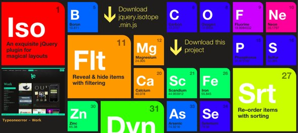

Mais um plugin que bombou no Twitter! O Isotope permite a criação de layouts fluidos automagicamente com animações e transições personalizadas.

### Zoomooz

<http://janne.aukia.com/zoomooz/>

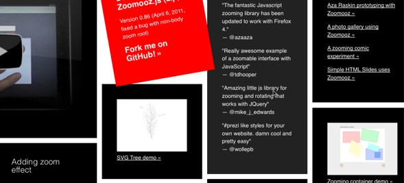

Semelhante ao Isotope, o Zoomooz (ê, nome!) permite a criação de boxes e layout fluido com a diferença de também habilitar um zoom fantástico.

### jQuery uCompare

<http://www.userdot.net/files/jquery/jquery.ucompare/demo/>

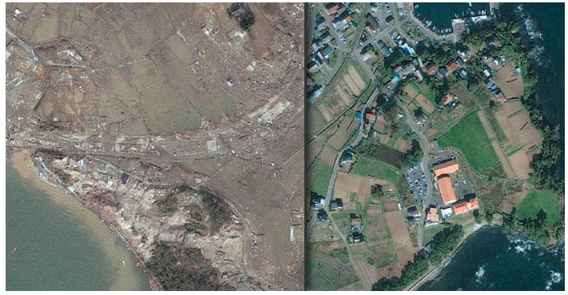

Já viram aquelas fotos com antes e depois? Este plugin habilita este recurso de forma dinâmica: o usuário pode visualizar a parte que desejar utilizando o mouse.

### ArborJS

<http://arborjs.org>

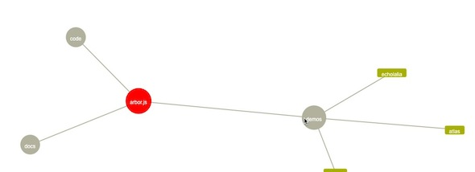

Arbor é um plugin bacana para a visualização de grafos. Sua API é bem rica com diversos métodos para manipular ítens e o grafo como um todo.

### Slides

<http://slidesjs.com>

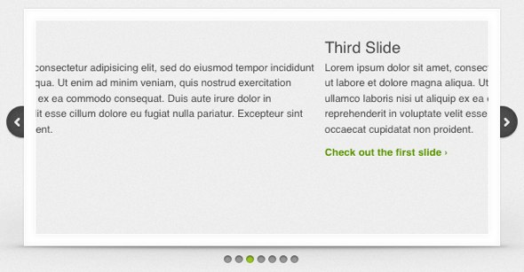

“Slides é um plugin de slideshow para jQuery desenvolvido com simplicidade em mente.” E, de fato, o grande diferencial do Slides para outros plugins de slideshow é a simplicidade e facilidade de implementação — isso sem limitar em nada a personalização.

### Zoomy

<http://redeyeoperations.com/plugins/zoomy/>

Plugin que habilita uma ferramenta de zoom em imagens, simulando aquela lente famosa da Apple. Possui callbacks permitindo um alto nível de personalização nos eventos de zoom.

### jFormer

<http://www.jformer.com>

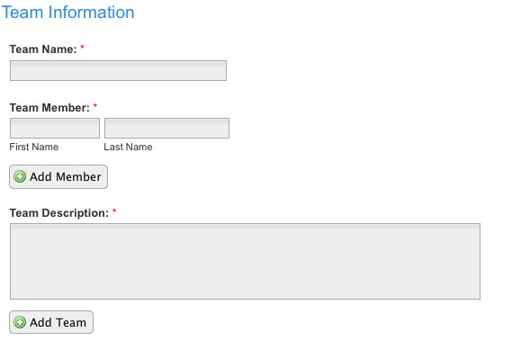

Forms geralmente são os elementos mais mal-tratados em um aplicativo web. O plugin jFormer visa facilitar o desenvolvimento de forms bonitos, paginados e com validações integradas.

### DynamicNews

<http://www.egrappler.com/rss-driven-dynamic-jquery-news-slider-plugin-dynamic-news/>

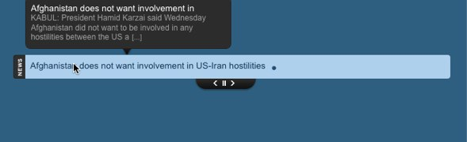

O plugin DynamicNews permite a integração de um ticker de notícias com funções para anterior e próxima e tooltips.

### jRating

<http://www.myjqueryplugins.com/jRating>

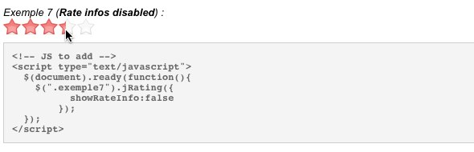

jRating é um plugin altamente personalizável para a implementação de um sistema de votação com jQuery e AJAX. Permite configurar desde o número de estrelas até callbacks onSuccess e onError.

### Bônus: jQuery Boilerplate

<http://jqueryboilerplate.com>

Desenvolvido pelo brazuca [Zeno Rocha](http://www.zenorocha.com)  em parceria com Addy Osmani e Adam J. Sontag, o jQuery Boilerplate é um template inicial para a criação de plugins jQuery e deve estar presente nos bookmarks de qualquer desenvolvedor jQuery.

---

### Para 2012…

#### Create

<http://createjs.org>

O plugin Create ainda vai dar muito o que falar. Seu objetivo é oferecer uma interface de edição de conteúdo inline, recurso ainda pouco explorado por desenvolvedores.

#### nanoScroller

<http://jamesflorentino.com/jquery.nanoscroller/>

A personalização da barra de scroll foi moda durante um tempo e (ainda bem?) ficou no passado. O plugin nanoScroller oferece um scroll simples, simulando o visual do Mac OS.

---

Esqueci algum? Deixei de fora aquele plugin que você curtiu muito? Compartilhe com a gente nos comentários!

- [19](http://tableless.com.br/20-plugins-jquery-que-marcaram-2011/#comments "Comment on 20 plugins jQuery que marcaram 2011") *comentários*

#### Por [Davi Ferreira](http://tableless.com.br/?author=7)

Programador apaixonado pelo que faz.
Responsável pelo desenvolvimento de sistemas e interfaces para
Globo.com, Confederação Brasileira de Vôlei, Ricoh
Brasil, Embratel entre outros.

<http://www.daviferreira.com/blog>

Veja os outros posts de [Davi Ferreira](http://tableless.com.br/author/davitferreira/ "Posts by Davi Ferreira")

### Adicionar novo comentário

[anexo ausente]

### Mostrando 10 de 18 comentários

- Adriano Marinho

  Muito bom. Também não conhecia alguns...
- Victor Bastos

  Algum ser humano conseguiu entender como se implementa formulários com JFormer? A documentação é realmente pobre em detalhes!
- Verdade, a documentação dele é fraca, mas o código não é difícil de entender. Dá uma olhada nos exemplos. E depois faz um post, que tal? :)
- Danilo Abranches

  Excelente artigo! Muita coisa interessante!
- Alfredo Nunes Pinto

  Excelentes plugins. O melhor, na minha opinião, é o jFormer, que possui um belo design, e o principal, é bem intuitivo para o usuário. Vou estuda-lo um pouco pois não entendi quase nada de como implementa-lo, mas nada que uma olhada no codigo fonte não resolva.

  Quanto ao create, se for possível, vou tentar usa-lo para criar e editar postagens do meu site.

  Obrigado pela lista!!
- Fabiano

  Parabéns, muito bons exemplos.
- Alfredo Nunes Pinto

  Estou tendo dificuldades para usar o Qaptcha. Estou fazendo alguns testes nele no Wapserver 2.1 e quando a barra chega ao final ele não destrava a form.

  Alguém conseguiu usar esse plugin?
- galvone

  Exatamente o que eu procurava. Tudo em um lugar só.

  Muito bom o post, parabéns!

### Reações

[mostrar mais reações](#)

### Trackbacks

URL de Trackback

- [Tropeçando 46 « Rafael Bernard Araujo](http://rafael.bernard-araujo.com/tropecando-46.php)  

  01/02/2012 02:27 PM

  [...] Tropeçando 46 bb\_keywords = "jQuery"; bb\_bid = "1613262"; bb\_lang = "pt-BR"; bb\_name = "custom";bb\_limit = "9";bb\_format = ...
