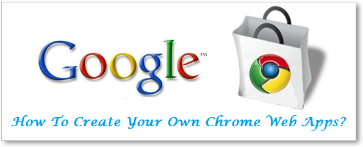
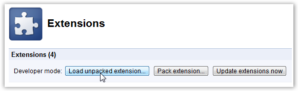
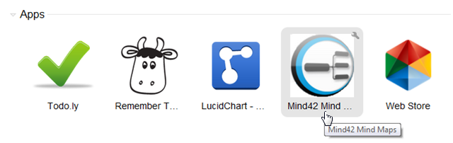
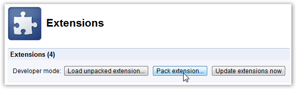
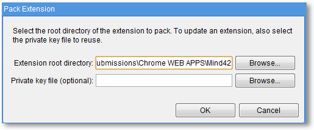
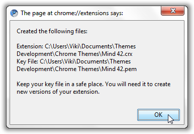
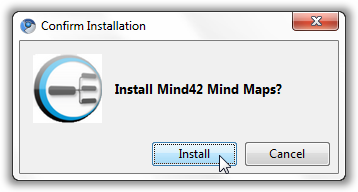
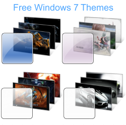

# How To Create Your Own Chrome Web Apps

##### Do You Like This Post?



Google recently launched the [Chrome Web Store](https://chrome.google.com/webstore "Chrome Web Store")  and I was excited to see a lot of really cool web apps being added to the Web Store everyday. Most of the Web Apps listed are just regular websites packaged to be installable on your Chrome browser, and these apps and extensions can then be synched across computers, so that you always get the same personalized experience in your browser, no matter which computer you use.

We have created some [Google Chrome Themes](http://www.vikitech.com/google-chrome-themes "Google Chrome Themes Gallery")  and I wanted to see how to create a Web App. After reading the Chrome Web Apps Documentation for a while, I found that the process of making a web app from any existing website is quite easy. As an example, I created a Web App for Mind42.com which is my favorite site for creating Mind Maps.

Using the process described below you can create your own Chrome Web Apps. Lets see how it’s done.

## Creating Your Own Chrome Web Apps:

#### Basics: What does a Chrome Web App consist of?

A Chrome Web App consists of a .crx file that contains the metadata describing the app. (The .crx file format is just a variation of ZIP that’s used by Google Chrome.)

The .crx file for a hosted app (app made from an existing website) must contain an icon and a manifest that has details about how the app should function in the browser.

### Getting Started:

These are the only 2 things you need to make a Chrome Web App. The manifest and an icon for the web app.

**The Manifest -** Every app needs a manifest—a JSON-formatted file named manifest.json that describes it.

**The Icon -** Every app also needs an icon. The icon is used on the New Tab page.

### Creating The Manifest:

In order to create a manifest file, open the notepad or any other text editor you use and save the document as a .json file. The code below shows the manifest.json we used in making the Mind Maps 42 Web App.

```
{
```

```
  "name": "Mind42 Mind Maps",
```

```
  "description": "A Simple Web App To Create Mind Maps with mind42.com",
```

```
  "version": "1.0",
```

```
  "icons": {
```

```
    "128": "128.png"
```

```
  },
```

```
  "app": {
```

```
    "urls": [
```

```
      "http://mind42.com/"
```

```
    ],
```

```
    "launch": {
```

```
      "web_url": "http://mind42.com/mindmaps"
```

```
    }
```

```
  },
```

```
  "permissions": [
```

```
    "unlimitedStorage",
```

```
    "notifications"
```

```
  ]
```

```
}
```

This manifest and the icon it points to ( 128.png ) make the Mind 42 web app installable as a hosted app in Chrome. When it’s installed, the specified icon appears on Chrome’s New Tab page. Clicking that icon launches the app by bringing up the page specified by the “web\_url” field.

#### Permissions:

The “permissions” field lets you specify HTML5 permissions that the app requires. By specifying “unlimitedStorage” and “notifications”, this app is able to use those HTML5 features without having to repeatedly ask the user for permission.

During app installation, the user is told which permissions the app needs; installing the app implicitly grants those permissions for all pages whose URLs match those in the “apps” field of the manifest.

**You can use the above code to create the manifest for your own web app. Just replace the various fields like name, versions, app, launch etc. with your own.**

To learn more about how the various parameters of the manifest work, [read Google’s documentation](http://code.google.com/chrome/apps/docs/developers_guide.html#manifest "Google Apps Doumentation - The Manifest").

### Creating the Icon:

It is necessary to have an icon when a web app is made, and according to Google’s specifications it should be exactly 128×128 pixels. So we edited the Mind 42 Logo a bit so that we know which app this icon represents. We used the Webpage Screenshot extension to take a screenshot and the beautiful [Aviary](http://www.vikitech.com/282/easily-take-website-screenshots-edit-images-and-add-effects-within-your-browser-with-aviary-firefox-addon "Aviary For Firefox")  [Chrome Web App](https://chrome.google.com/webstore/detail/lnhpjhojpnckkehlebbkpoammaemnnno "Aviary Chrome Web App")  to edit the image.

### Verify If Your Web App Works As Expected:

Now that you have the two necessary components to make a web app, we now need to load the unpacked app into the browser, to confirm that the app is valid.

1) First, create a folder (you might name it my\_app or anything else you want) and put the files we created above, in it:

- manifest.json
- 128.png

You’ve just created the metadata for a hosted app. Now we can load the app.

2) In Chrome, bring up the extensions management page by clicking the wrench icon  and choosing **Tools > Extensions**.

3) At top right corner – If **Developer mode** has a + by it, click the +. The + changes to a -, and more buttons and information appear.

4) Click the **Load unpacked extension** button, which open a new window. Now browse to the location where you created the **my\_app folder** shown in step 1, and select the folder.



5) If everything in the manifest file is correctly specified, your web app will install appear in the list of installed extensions. If there is an error, Chrome will tell you what went wrong.

> **Troubleshooting:** If you get an error dialog saying you could not load the extension, make sure your manifest file has valid JSON formatting and is called manifest.json (not manifest.json.txt or manifest.json.rtf , for example). You can use a [JSON validator](http://www.google.com/search?q=json+validator)  to make sure your manifest’s format is valid.

6) Now open a new tab and Voila, your application will be shown on the Chrome Launcher with other apps.



7) Test if the app is working as expected by clicking on the icon and visiting the target website.

If everything went smoothly, you are now capable of creating your own basic Chrome Web Apps. Yeah!

This should be enough for you to use your Web App in your browser, however in order for you to upload the app to Chrome Web Store or Share it with someone you would need to pack your web app.

### Packing Your Web App To Create The .crx File:

Now that we tested that our web app works, it’s time to pack it and create a .crx file.

1) Go to the Extensions Management page and click on “Pack Extension” button on top left.



3) Browse to the folder where you have placed the manifest.json and icon file and click ok.



This would also create a PEM or private key for you to be able to update this app in the Chrome Web Store.

If all goes well Chrome will tell you that your .crx and .pem files have been created. It also displays where these files have been placed.



The first file .crx is the container where your web app exists and it can now be installed on any Chrome browser. Just drag the .crx file into Chrome to install it.



The .pem file would be needed if you update this extension with new features after uploading it to the Chrome Web Store. ([Read about uploading Web Apps to Chrome Web Store](http://code.google.com/chrome/webstore/docs/get_started_simple.html#step6 "Read about uploading Web Apps to Chrome Web Store"))

With all these files in place you can now share your Chrome Web App with anyone. If some website you like doesn’t have a Web App, you can create one yourself, instead of waiting for them to come up with a Web App. You are now officially a newbie developer for Google Chrome.

If you have any questions about the above process or any suggestions to improve it, your comments are always welcome. Share your thoughts with us in the comments section below.

#### Further Reading:

##### Like This Post? Share it on your Favorite Social Network:



This post was originally written on December 13, 2010
