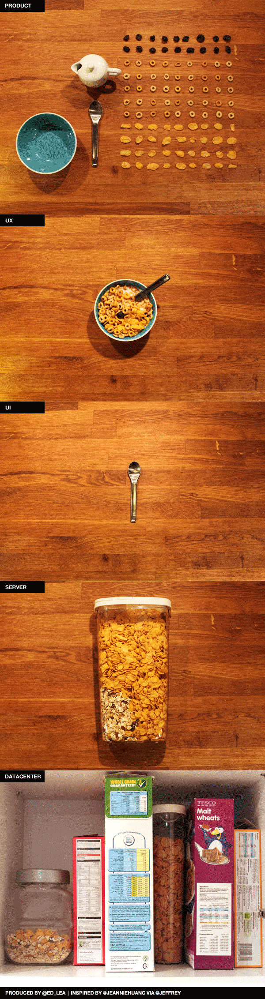

  

Assim fica fácil explicar né? :)

  

[via](http://design.org/blog/difference-between-ux-and-ui-subtleties-explained-cereal)

  
  
[[anexo ausente]](http://feeds.wordpress.com/1.0/gocomments/julianaconstantino.wordpress.com/4139/) [[anexo ausente]](http://feeds.wordpress.com/1.0/godelicious/julianaconstantino.wordpress.com/4139/)  [[anexo ausente]](http://feeds.wordpress.com/1.0/gotwitter/julianaconstantino.wordpress.com/4139/) [[anexo ausente]](http://feeds.wordpress.com/1.0/gostumble/julianaconstantino.wordpress.com/4139/) [[anexo ausente]](http://feeds.wordpress.com/1.0/godigg/julianaconstantino.wordpress.com/4139/) [[anexo ausente]](http://feeds.wordpress.com/1.0/goreddit/julianaconstantino.wordpress.com/4139/)   
  
  
  
  
from Arquitetura de Informação <http://arquiteturadeinformacao.com/2012/04/24/como-explicar-a-diferenca-entre-ux-e-ui-com-cereais/>
