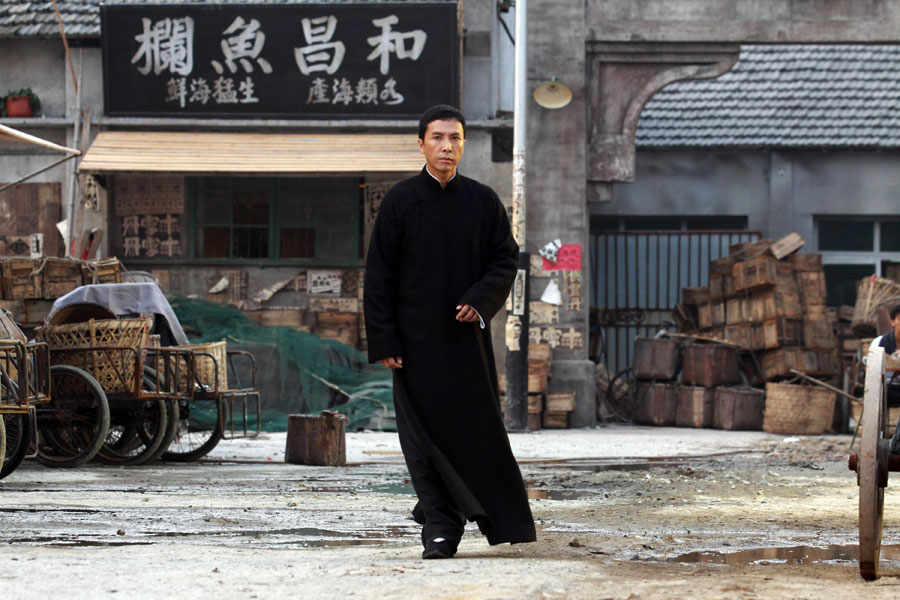
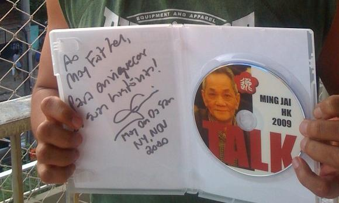
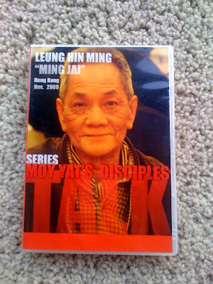
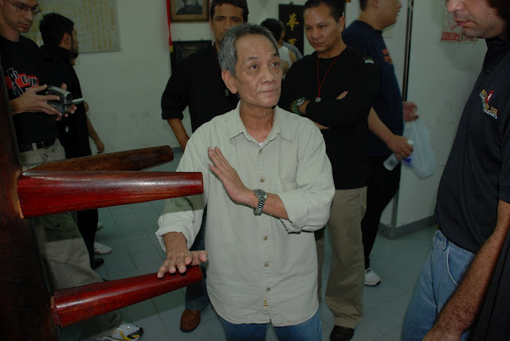

# [Moy Yat´s disciple from 60's talks about Ip Man and Challenges (Discipulo de Moy Yat dos anos 60, fala de Ip man e dos desafios com outras artes!)](http://moyfatlei.blogspot.com.br/2012/04/moy-yats-disciple-from-60s-talks-about.html)

Posted by BLOG DO PEREIRA Friday, 13 April 2012

**DESVENDANDO OS FILMES DE IP MAN PART 3**  
**UNCOVERING IP MAN MOVIES PART 3**

**PART 1 ( CLICK [HERE](http://moyfatlei.blogspot.com.br/2011/12/uncovering-ip-man-movies-desvendando-os.html) )**

**PART 2 (CLICK [HERE](http://moyfatlei.blogspot.com.br/2012/01/uncovering-ip-man-movies-part.html) )**

Mais uma parte do especial "DESVENDANDO IP MAN" !

Nesta parte 3, vamos lembrar que durante os 3 filmes, Ip Man foi alvo constante de desafios sem fim. Em cima de mesas, em mercados de peixe ou onde fosse, lá esteve Donnie Yen interpretando o lendário Mestre em mais uma contenda, como vemos na cena abaixo, onde para poder ter seu grupo de Ving Tsun, Ip Man teria que vencer todos os Mestres de uma determinada Associação num "Gong Sau"(講手).  
  
Another part of the special "UNCOVERING IP MAN"!  
  
In part 3, let's remember that during the three films, Ip Man was a constant target of endless challenges. On tables or at fish markets or where it was, there was the legendary Donnie Yen playing Ip Man in a challenge, as we see in the scene below, where in order to be able to have a Ving Tsun Group, Ip Man would have to win every Master from an Association during  a "Gong Sau" (講 手). Gong Sau (講手)  significa "conversar com as mãos".  
  
手 (Sau) - Significa "mao" ou "membro superior". ["Sau" é o mesmo ideograma de "Te" de "Karate"].  
講(Gong) tem alguns significados muito interessantes, onde um deles é "negociar". Ainda que os entusiastas e entendidos desta pratica, prefiram o verbo "falar" para sua tradução.

Gong Sau (講手) means "talking hands"

Sau (手) is the same character of "Te" in Karate. In cantonese means "Hand"

 講(Gong) also means "To talk"  
  

  
  
Em Janeiro de 2011, ganhei de presente do Mestre responsável pelo Nucleo Belo Horizonte,Anderson Maia, este DVD. Um grande presente.  
  
In Jan. 2011,  Master Anderson Maia, from Belo Horizonte MYVT Branch, gave me a special gift, this DVD!

Este DVD trata-se do primeiro de uma série de entrevistas com membros do Clã Moy Yat de cada década. O primeiro DVD traz Leung Hin Ming ou simplesmente "Min Jai", discípulo de Si Taai Gung Moy Yat dos anos 60 , que teve muito contato com seu Si Gung Ip Man, e presenciou não só desafios, como também a postura de Ip Man perante eles.  
This is the first of  series of DVD´s where Moy Yat Clan members make interviews with the great-seniors of the Clan. In this first one , we have Ming Jai , a member from Moy Yat Family from the 60's who had a lot of moments with his Si Gung Ip Man, watching Gong Sau but principally how Ip Man deal with that.

Num video legendado, Ming Jai fala sobre como Ip Man abordava perguntas como "O Ving Tsun funciona?" e relata uma história de Gong Sau!!!  
  
In a video (english) lets watch Ming Jaai talking about how Ip Man deal when someone asked him "Ving Tsun works in a fight?"  and also , he tells us a story of a Gong Sau in Moy Yat Family!

**Thiago Pereira "Moy Fat Lei"**

**Disciple of MAster Julio Camacho**

**moyfatlei.myvt@Gmail.com**
