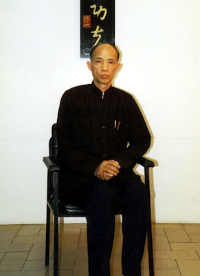
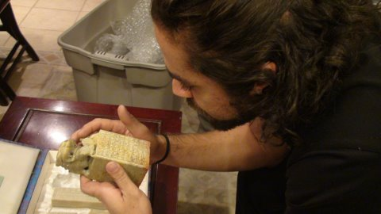
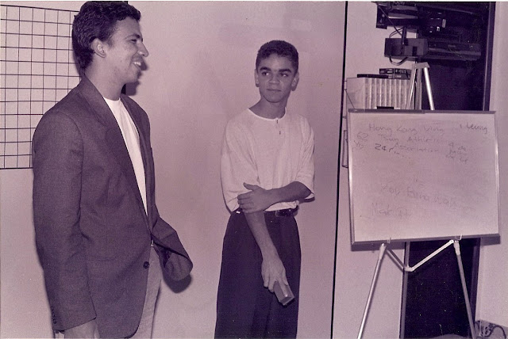
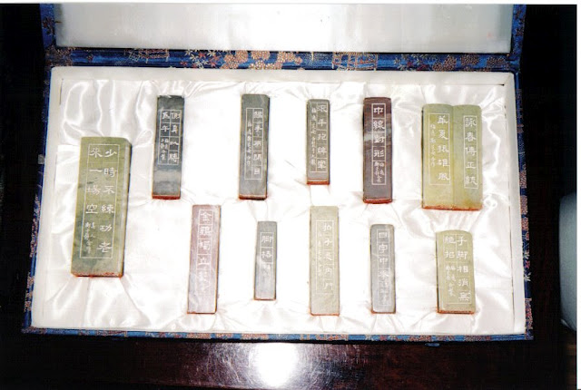
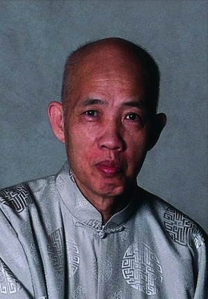
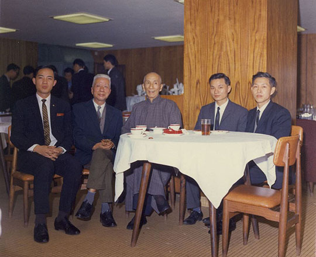
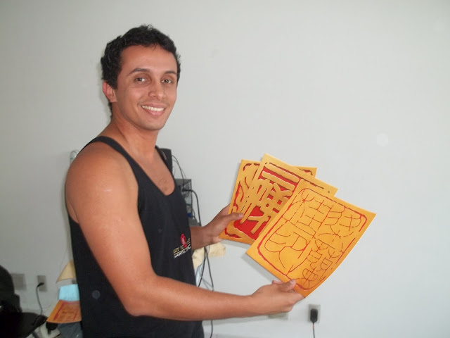
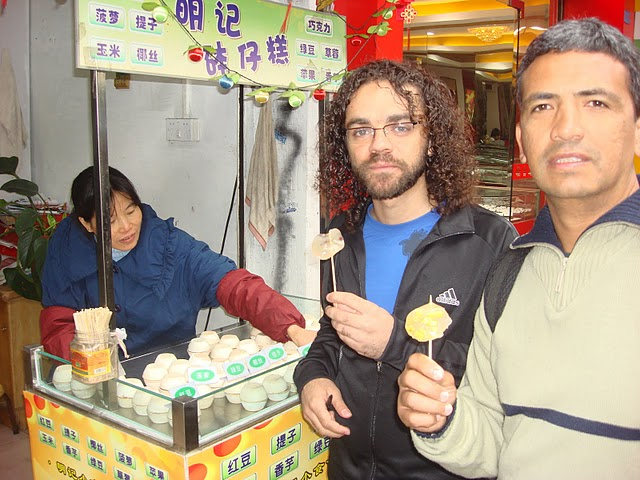
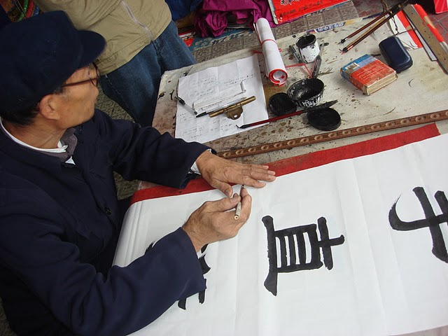

### [THE SECRET MATERIAL OF VING TSUN KUEN KUIT (O MATERIAL SECRETO DO VING TSUN KUEN KUIT)](http://moyfatlei.blogspot.com.br/2012/04/secret-material-of-ving-tsun-kuen-kuit.html)

Posted by BLOG DO PEREIRA Tuesday, 10 April 2012

Prepare-se para embarcar numa jornada maravilhosa através de um estilo de arte chinesa pouco conhecida no ocidente , que são as insculturas em carimbos.  
  
Não só descobriremos nas próximas postagens tudo sobre carimbos chineses mas principalmente sobre a obra "*Ving Tsun Kuen Kuit*" de Moy Yat, através de fotos, depoimentos e reportagens.  
  
  
Começaremos com uma entrevista perdida de Moy Yat sobre sua própria obra. Leia abaixo as respostas sobre o próprio autor depois de uma rápida introdução sobre o que é o "Ving Tsun Kuen Kuit"...  
  
  
Prepare to embark on a wonderful journey through a style of Chinese art little known in the West, which are the chinese seal stone cuts.  
  
Not only do we find in the next few posts all about Chinese Seals but mainly on the work "Ving Tsun Kuen Kuit" by Moy Yat through photos, interviews and reports.  
  
We begin with an interview present in each box of the seals . Read below for answers about the author himself after a quick introduction to what is the "Ving Tsun Kuen Kuit" ...

Uma das mentes mais brilhantes de Minas Gerais, e não por ser meu Si Sok, mas porque é o cara mesmo. Si Sok Leonardo Mordente, autor da incrível obra "O Livro de Pedra do Ving Tsun" observa de perto uma das peças do Ving Tsun Kuen Kuit em NY.

One of the greatest minds from Minas Gerais State, Brazil. Not for being my Si Sok, but he is the man indeed! Si Sok Leonardo Mordente , author of "The Stone book of Ving Tsun" holds one of the stones of the collection in NY.

Si Fu tem um carinho muito especial por Si Sok Leo Mordente, que este ano se tornará Mestre Qualificado. E que na foto acima vemos ainda como um garoto ao lado de Si Fu.

Si Fu always liked a lot Si Sok Leo, who this year will become a Qualified MAster. And in the photo above , we see with Si Fu and his Si Hing when he was very young.

O Ving Tsun Kuen Kuit  
the ving tsun kuen kuit  
  
Esta obra reune um total de 51 peças confeccionadas em pedra. A coleção encontra-se atualmente guardada em NY sob os cuidados da própria Familia de Si Taai Gung Moy Yat. A obra está em perfeito estado de conservação e estas peças encontram-se guardadas em quatro estojos diferentes.  
  
This work brings together a total of 51 pieces made of stone. The collection is currently stored in New York under the care of  Si Taai Gung Moy Yat own family. The work is in perfect condition and these parts are stored in four different cases.

Em cada um destes estojos, encontra-se uma ficha com o título "The Story of Ving Tsun Kuen Kuit", que com esse titulo ja daria um belo seriado ou filme, mas trata-se de uma coletânea de perguntas  sobre a obra. E agora aproveitem a entrevista:  
  
In each case there is a info paper titled "The Story of Ving Tsun" ( that would be a great Tv Series!hehe) but is a collection of questions and answers about the author and his work. Read below this content:  
  
**"The Story of Ving Tsun Kuen Kuit"**

1- Quem foi o artista a fazer esta obra?  
  
Resposta: Moy Yat, aliás "Moy Go Yan"\* (\**Moy Go Yan[Mei Gao Ren 梅高人] , era o nome artistico de Si Taai Gung*)  
  
2- Quem é Moy Yat?  
  
Resposta: Moy Yat é o criador do Mey Tung Artists Association, Mestre de Kung Fu e autor de muitos livros.  
  
3- O trabalho inteiro foi feito somente por ele?  
  
Resposta: Não, ele recebeu assistência de Kwong Tse-Nam , um artista e "primo Kung Fu".  
  
4- Quanto tempo ele levou para completar o trabalho?  
  
Resposta: Demorou quatro anos para achar as pedras apropriadas para cada inscultura porque tamanho e cor tem um papel importante neste trabalho. A inscultura levou 2 anos de dedicação.

1 - Who was the artist to make this work?  
  
Answer: Moy Yat, alias "Moy Yan Go" \* (\* Moy Go Yan [Mei Gao Ren 梅 高人], was the Moy Yat´s artistic name)

2 - Who is Moy Yat?  
  
Answer: Moy Yat is the creator of  Mey Tung Artists Association,Kung Fu Master and author of several books.  
  
3 - The whole work was only done by himself?  
  
Answer: No, he received assistance from Kwong Tse-Nam, an artist and "Kung Fu cousin."  
  
4 - How long it took to complete the work?  
  
Answer: It took four years to find the appropriate stone to each of the carvings because size and color plays an important role in this work. The stone carvings took two years of dedication.

Os jovens Moy Yat e Kwong Tsem Nam junto de Patriarca Ip Man e demais pessoas no dia da apresentação da obra terminada para a aprovação de Ip Man.

The young Moy Yat and Kwong Tse Nam and other gentleman with Ip Man in the day that he approved the work.

5 - As pedras são cortadas a mão ou por máquinas?  
  
Resposta: O trabalho inteiro foi feito a mão e a precisão é a coisa mais importante, pois um único erro,pode arruinar toda a pedra.  
  
6- Existe um estilo específico na confecção destes tipos de carimbo?  
  
Resposta: Existem muitos estilos de corte de pedra e cada um produz um diferente efeito e visual.

5 - The stones were cut by hand or by machine?  
  
Answer: The entire job was done by hand and the accuracy is the most important thing, because a single mistake can ruin the entire stone.  
  
6 - Is there a specific style in making these types of seals?  
  
Answer: There are many styles of stone cutting and each produces a different effect and look.

As figuras ancestrais que dispomos na parede principal do Mo Gun (Jing Tong) são reproduções ampliadas de parte da coleção Ving Tsun Kuen Kuit. Parte esta dedicada aos ancestrais. 9 peças das 51 estão dedicadas ao ancestrais do Ving Tsun.  
The pictures that we put on the main wall of our Mo Gun is representations of part of this collection dedicated to the Masters. There are 9 pieces about MAsters in this work.  
  
7- O que existe nesse trabalho(Ving Tsun Kuen Kuit)?  
  
Resposta: O trabalho cobre a história inteira do Ving Tsun. Algumas pedras contém nomes das sequências e pontos essenciais sobre elas, enquanto outras refletem certos principios de luta. Por exemplo, em uma pedra está encravada : "Enquanto outros caminham pelo arco, eu caminho pela corda" . Que passa a idéia de que a menor distância entre dois pontos, é uma linha reta.  
  
7 - What's in this work (Ving Tsun Kuen Kuit)?  
  
Answer: The work covers the entire history of Ving Tsun. Some stones contain sequences and names of key points about them, while others reflect certain principles of fighting. For example, in a stone is carved: "You walk the bow, I walk the string" What is the idea that the shortest distance between two points is a straight line.

Em 2009, Si Fu e Si Sok Leo Mordente encontraram um senhor que vendia arte em caligrafia chinesa.  
  
In 2009, Si Fu and Si Sok Leo met an old guy who was selling caligraphy art.

Este senhor acima, num dos trabalhos que Si Fu pediu(não o da foto) escreveu exatamente este  
Kuen Kuit que hoje está disposto em nosso Mo Gun.  
  
Si Fu asked to the old man make exactly to do this kuen kuit(not the pic) that in on the wall of our mo gun.  
  
8 - Quantas peças existem nesse trabalho?  
  
Resposta: 51 carimbos.  
  
9 - É o único trabalho deste tipo?  
  
Resposta:  Sim, este é o unico grupo de carimbos em pedra que carregam a história do Ving Tsun e é também o único trabalho completo de inscultura em pedra.  
  
10 - Que tipo de pessoa aprecia este trabalho?  
  
Resposta: Artistas Marciais e artistas em geral.  
  
11- Existem planos de refazer este trabalho?  
  
Resposta: Não, falta de pedras e tempo impedem outro trabalho destes de ser realizado.  
  
12- Quanto a coleção custaria?  
  
Resposta: Humm..  Se.. o valor... do trabalho fosse estabelecido , então não haveria segurança suficiente para exibi-lo.  
  
8 - How many parts are in this work?  
  
Answer: 51 seals.  
  
9 - Is it the only work of this kind?  
  
Answer: Yes, this is the only group of stone stamps bearing the history of Ving Tsun and is also the only work complete stone carving work.  
  
10 - What kind of person likes this work?  
  
Answer: Martial Artists and artists in general.  
  
11 - There are plans to redo this work?  
  
Answer: No, lack of time and t stones dont let other work being done..  
  
12 - How much the set woth?  
  
Answer: Hmm .. If .. the value ... work was established, then there would be no longer enough security to show it.  
.

**Thiago Pereira "Moy Fat Lei"**

**Disciple of Master Julio Camacho**

**@Moyfatlei**

**moyfatlei.myvt@Gmail.com**
