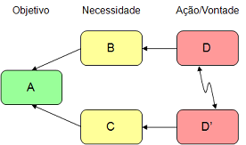

# Teoria das restrições

A **Teoria das Restrições** (TOC - Theory of Constraints) é uma filosofia de [negócios](http://pt.m.wikipedia.org/wiki/Administra%C3%A7%C3%A3o "Administração") introduzida por [Eliyahu M. Goldratt](http://pt.m.wikipedia.org/wiki/Eliyahu_M._Goldratt "Eliyahu M. Goldratt") no seu livro [A Meta](http://pt.m.wikipedia.org/wiki/A_Meta "A Meta"), de 1984. Ela é baseada na aplicação de princípios científicos e do raciocínio [lógico](http://pt.m.wikipedia.org/wiki/L%C3%B3gica "Lógica") para guiar [organizações](http://pt.m.wikipedia.org/wiki/Organiza%C3%A7%C3%B5es "Organizações") humanas. A publicidade e liderança por trás dessas idéias tem sido exercida principalmente pelo Dr. Goldratt através de uma série de livros, seminários e workshops.

A TOC foi concebida para auxiliar organizações a alcançar seus objetivos continuamente.[[1]](http://pt.m.wikipedia.org/wiki/Teoria_das_restri%C3%A7%C3%B5es#cite_note-goal-0)[[2]](http://pt.m.wikipedia.org/wiki/Teoria_das_restri%C3%A7%C3%B5es#cite_note-what_is_TOC-1)

A TOC é baseada em um conjunto de princípios básicos ([axiomas](http://pt.m.wikipedia.org/wiki/Axioma "Axioma"))[[3]](http://pt.m.wikipedia.org/wiki/Teoria_das_restri%C3%A7%C3%B5es#cite_note-SLP-2), alguns processos simples (Perguntas Estratégicas, Passos para Focalizar, Efeito-Causa-Efeito), ferramentas lógicas (o Processo de Raciocínio) e é aplicável através da [dedução lógica](http://pt.m.wikipedia.org/wiki/M%C3%A9todo_dedutivo "Método dedutivo") a áreas específicas como [finanças](http://pt.m.wikipedia.org/wiki/Finan%C3%A7as "Finanças"), [logística](http://pt.m.wikipedia.org/wiki/Log%C3%ADstica "Logística"), [gerência de projetos](http://pt.m.wikipedia.org/wiki/Ger%C3%AAncia_de_projetos "Gerência de projetos"), [administração de pessoas](http://pt.m.wikipedia.org/wiki/Administra%C3%A7%C3%A3o_de_pessoas "Administração de pessoas"), [estratégia](http://pt.m.wikipedia.org/wiki/Estrat%C3%A9gia "Estratégia"), [vendas](http://pt.m.wikipedia.org/wiki/Vendas "Vendas"), [marketing](http://pt.m.wikipedia.org/wiki/Marketing "Marketing") e [produção](http://pt.m.wikipedia.org/wiki/Produ%C3%A7%C3%A3o "Produção").

De acordo com a TOC, toda organização tem - em um dado momento no tempo - pelo menos uma restrição que limita a performance do sistema (a organização em questão) em relação à sua meta. Essas restrições podem ser classificadas como restrições internas e restrições externas, ou de mercado. Para gerir a performance do sistema, a restrição deve ser identificada e administrada corretamente (de acordo com os 5 passos de focalização, mostrados abaixo). Ao longo do tempo a restrição pode mudar (e.g., porque a restrição anterior foi solucionada com sucesso ou por mudanças no ambiente de negócios) e a análise recomeça.

## Princípios básicos

Os princípios são claramente explicitados no programa de auto-aprendizado "SLP 7 - Managing People" [[3]](http://pt.m.wikipedia.org/wiki/Teoria_das_restri%C3%A7%C3%B5es#cite_note-SLP-2) e em "Necessary and Sufficient - Unit 2 The Basic Assumptions of TOC".[[4]](http://pt.m.wikipedia.org/wiki/Teoria_das_restri%C3%A7%C3%B5es#cite_note-NAS-3)

1. Simplicidade Inerente (Convergência)
2. Consistência
3. Respeito

Os princípios são tratados como axiomas, ou seja, não possuem prova. Ainda assim Goldratt fornece[[3]](http://pt.m.wikipedia.org/wiki/Teoria_das_restri%C3%A7%C3%B5es#cite_note-SLP-2),[[4]](http://pt.m.wikipedia.org/wiki/Teoria_das_restri%C3%A7%C3%B5es#cite_note-NAS-3) alguma indicação do porquê ele teria escolhido esses princípios para servirem de base à TOC. A grande maioria desses princípios advém das [Ciências Exatas](http://pt.m.wikipedia.org/wiki/Ci%C3%AAncias_Exatas "Ciências Exatas"), particularmente da [Física](http://pt.m.wikipedia.org/wiki/F%C3%ADsica "Física").

Os dois primeiros derivam das palavras de [Isaac Newton](http://pt.m.wikipedia.org/wiki/Isaac_Newton "Isaac Newton"): *Natura valde simplex est et sibi consona.* (A natureza é excepcionalmente simples e é coerente consigo mesma), enquanto o terceiro fornece o embasamento para a arte de lidar com o [comportamento](http://pt.m.wikipedia.org/wiki/Comportamento "Comportamento") e [motivação](http://pt.m.wikipedia.org/wiki/Motiva%C3%A7%C3%A3o "Motivação") humanos.

[↑Topo da secção](http://pt.m.wikipedia.org/wiki/Teoria_das_restri%C3%A7%C3%B5es#section_1)

## O Processo de Raciocínio da TOC

A TOC oferece princípios, idéias, ferramentas e [processos](http://pt.m.wikipedia.org/wiki/Processos "Processos") para ajudar a responder 3 perguntas fundamentais:

1. O que mudar?
2. Para o que mudar?
3. Como causar a mudança?

### Árvore da Realidade Atual

Similar a um "mapa de situação atual", utilizado por muitas organizações, a árvore de realidade atual avalia a rede de relações de causa e efeito entre efeitos indesejáveis e auxilia na identificação das causas desses efeitos indesejáveis. Um dos primeiros passos nesse processo é descrever, através de um desenho simples, os principais sintomas percebidos de uma situação problemática e as suas causas aparentes. O benefício de se fazer isso é que fica muito mais fácil estabelecer relações entre causas e efeitos. E uma vez feito isso, o foco pode ir para a resolução dos pontos que causariam maior mudança positiva, se mudados.

### Evaporação de Nuvem

A evaporação de nuvem é um diagrama de resolução de conflitos apropriado para situações em que há um antagonismo entre duas partes envolvidas (duas idéias ou dois pontos de vista, da mesma pessoa ou entre pessoas ou entidades diferentes). É um método para examinar objetivamente o conflito e buscar uma situação "ganha-ganha":

As setas devem ser lidas como “para que”, “porque”, “de forma que”. Exemplo: “Para obtermos A precisamos de B, e para obtermos B precisamos de D”

Passos para a resolução do problema:

1. Decida que você realmente quer resolvê-lo.
2. Desenhe a nuvem e defina claramente o conflito, o objetivo em comum e as necessidades intermediárias.
   - O que cada parte quer? As respostas serão as caixas D e D'. Identifique claramente por que elas são mutuamente exclusivas, ou por que não podem ser satisfeitas simultaneamente (e.g., disponibilidade insuficiente de recursos).
   - Identifique as necessidades que estão sendo atendidas com as ações/vontades de cada parte - a razão pela qual cada parte quer o que quer. Comporão as caixas B e C.
   - Qual é o objetivo comum que B e C atendem? Isso pode ser difícil de se determinar, mas a idéia é que se não existisse algum objetivo em comum, ou estreitamente relacionado, não haveria conflito.
3. Obtenha acordo quanto ao diagrama.
4. Revise o diagrama e suas relações causais.
5. Desafie as setas entre as caixas, perguntando "por quê?".

#### Nuvem central de conflito

É um tipo de "evaporação de nuvem" que emerge da análise da árvore da realidade atual. É uma combinação de vários efeitos indesejáveis que formam uma espécie de nuvem mascarando os conflitos mais profundos que os causam. Conceito introduzido por Goldratt no seu romance "Não é Sorte".

### Outros processos

- Árvore da realidade futura: Similar a um "mapa de situação futura", a árvore de realidade futura mostra o estado futuro desejável do sistema e auxilia na identificação de possíveis efeitos colaterais (ramificações negativas) possibilitando o refinamento do plano de ação.

- Ramificações negativas: O objetivo do estudo das ramificações negativas é compreender o nexo causal entre ações desejadas (ou idéias) e seus potenciais efeitos indesejados, a fim de fornecer subsídio para o seu gerenciamento. É uma análise de risco e geração de planos de mitigação e contingência.

- Ciclo de retro-alimentação positiva: Os efeitos desejados expostos na árvore da realidade futura amplificam os objetivos intermediários que estão em um nível mais baixo na árvore. Enquanto o objetivo intermediário é fortalecido ele afeta positivamente esse efeito desejado.

- Árvore de pré-requisitos: Um diagrama que explicita todos os objetivos intermediários necessários para que se complete uma ação e os obstáculos a serem superados no processo. Excelente para criar planos de projeto.

- Árvore de transição: Descreve em detalhes as ações que deverão ser cumpridas para que se alcance o objetivo ou que se implemente as mudanças desejadas, especificando também o porquê de cada uma.

- Árvore de estratégia e tática: O plano de negócio em geral e as análises quantitativas que possibilitam uma implementação bem sucedida e o ciclo de retro-alimentação positiva. Também introduzido por Goldratt no seu romance "Não é Sorte".

Alguns observadores notam que esses métodos não são tão diferentes de outros modelos de mudança da administração como o [Ciclo PDCA](http://pt.m.wikipedia.org/wiki/Ciclo_PDCA "Ciclo PDCA").

[↑Topo da secção](http://pt.m.wikipedia.org/wiki/Teoria_das_restri%C3%A7%C3%B5es#section_2)

## Processo de Melhoria Contínua

## Aplicações

## Ver também

## Referências

## Leitura adicional

## Ligações externas

[Ver esta página na Wikipédia normal](http://pt.wikipedia.org/w/index.php?title=Teoria_das_restri%C3%A7%C3%B5es&amp;useformat=desktop) | [Não carregar imagens na versão móvel](http://pt.m.wikipedia.org/w/index.php?title=Teoria_das_restri%C3%A7%C3%B5es&amp;disableImages=1)

- Este texto é disponibilizado nos termos da licença [Atribuição-Partilha nos Mesmos Termos 3.0 não Adaptada (CC BY-SA 3.0)](http://creativecommons.org/licenses/by-sa/3.0/deed.pt); pode estar sujeito a condições adicionais. Consulte as [condições de uso](http://wikimediafoundation.org/wiki/Condi%C3%A7%C3%B5es_de_Uso) para mais detalhes.
