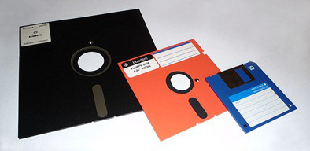
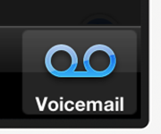

Afinal, quem tem 12 anos nasceu no ano 2000 e não sabe o que é viver em um mundo onde os arquivos não são digitais. E antes que você pense “ah, mas usuários com essa idade não vão acessar meu site”, lembre-se que sites adultos não são acessados apenas por adultos.

  

#### 1. Disquetes

  

Não sei você, mas eu não vejo um desses já faz pelo menos uns 8 anos. E eu não **“salvo”** arquivos dentro de um desses nem que eu quisesse, porque os arquivos de hoje simplesmente não cabem aí. Talvez o ícone de Salvar devesse mudar para um pendrive? Ou para uma nuvem?

  

  
  

  

#### 2. Clipboard

  

É a tal da “área de transferência”, aquele limbo onde flutuam as coisas quando você aperta CTRL+C nelas. Bom, se esse usuário de 12 anos já passou por algum médico mais antigão, pode ser que ele já tenha visto uma dessas pranchetas por lá.

  

  
  

  

#### 3. Agenda de contatos e calendários

  

Até quando a gente vai se enganar achando que as pessoas ainda têm essas agendas ao lado do telefone de casa? E a ‘folhinha’ então? Essas nem as pessoas de 30 e poucos anos usam mais.

  

  

  

#### 4. Voicemail

  

Se usar voicemail já está fora de moda (viva o SMS!), imagine então gravar a mensagem de voz com um aparelho desses aí embaixo.

  

  
  

  

#### 5. Telefone

  

Convenhamos: ainda que os telefones fixos insistam em sobreviver aos celulares, eles já pararam de ter esse formato faz um bom tempo. Esse formato é coisa da nossa infância, não da infância dos que nasceram depois de 2000. A não ser que você carregue um handset pra cima e pra baixo para plugar no seu celular, como mostra a imagem abaixo.

  

  
  

  

#### 6. Lupas e binóculos

  

Ok, esses os mais jovens já devem ter visto em algum desenho animado, talvez até já tenham segurado na mão. Mas certamente nunca usaram nenhum dos dois para **“Buscar”** algo.

  

  
  

  

#### 7. Televisão

  

Não, a televisão não deixou de existir. Mas certamente ela se tornou mais *wide* do que os ícones abaixo, e também deixou de ter aquela antena cafona em forma de “V” em cima dela.

  

  

#### 8. Envelopes

  

Os mais jovens até já devem ter recebido envelopes em casa, com propaganda ou encomendas. Mas será que passa pela cabeça deles que é possível escrever uma carta, colocar em um envelope e enviar para alguém (que é o que eles costumam fazer com os e-mails)?

  

  

#### 9. Microfones

  

Esse é outro que ainda existe. Mas nesse formato “microfone antigo”, só em museu ou em show de artista saudosista. Para os jovens, microfone é invisível, é um pequeno orifício no seu laptop – ou então é um daqueles microfones convencionais que as bandas usam.

  

  

#### 10. Fotografias e máquinas fotográficas antigas

  

Os ícones desses apps de fotos são bonitos, sim. Mas você precisa ter pelo menos 20 e muitos anos para ter visto uma Polaroid na vida, ou uma dessas câmeras antigas.

  

  
  

  

A lista foi tirada [desse post aqui](http://www.hanselman.com/blog/TheFloppyDiskMeansSaveAnd14OtherOldPeopleIconsThatDontMakeSenseAnymore.aspx).

  

Tem mais alguma sugestão? Envie aí embaixo nos comentários.

  
  
[[anexo ausente]](http://feeds.wordpress.com/1.0/gocomments/julianaconstantino.wordpress.com/4427/) [[anexo ausente]](http://feeds.wordpress.com/1.0/godelicious/julianaconstantino.wordpress.com/4427/)  [[anexo ausente]](http://feeds.wordpress.com/1.0/gotwitter/julianaconstantino.wordpress.com/4427/) [[anexo ausente]](http://feeds.wordpress.com/1.0/gostumble/julianaconstantino.wordpress.com/4427/) [[anexo ausente]](http://feeds.wordpress.com/1.0/godigg/julianaconstantino.wordpress.com/4427/) [[anexo ausente]](http://feeds.wordpress.com/1.0/goreddit/julianaconstantino.wordpress.com/4427/)   
  
  
  
  
from Arquitetura de Informação <http://arquiteturadeinformacao.com/2012/05/14/10-icones-que-os-usuarios-mais-novos-nao-entendem-mais/>
