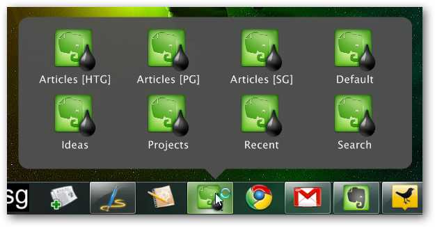
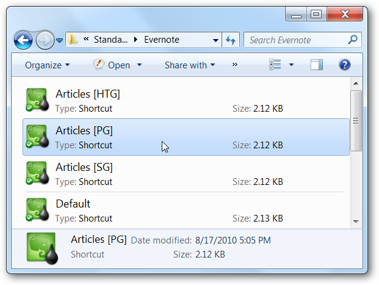
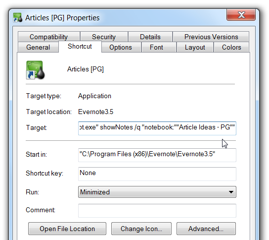

# [Make Evernote More Approachable with Custom Windows 7 Integration](http://www.howtogeek.com/howto/26100/make-evernote-more-approachable-with-custom-windows-7-taskbar-integration/ "Make Evernote More Approachable with Custom Windows 7 Integration")

Evernote is a great overall platform for taking notes, but the Windows app leaves a lot to be desired. A real, real lot. Seriously, it’s clunky. Painful, even. Here’s how I made it a little more tolerable with some tweaking.

*Note: if you’re a good programmer, or even a slightly tolerable one, please go to work for Evernote, since they* [*still can’t seem to fix a 6-month old bug with simple text files*](http://forum.evernote.com/phpbb/viewtopic.php?f=45&t=15086) *. Line breaks on notes created in Windows end up double-spacing on iPad or iPhone, especially when I’ve copied and pasted something from notepad. Yeah, I tried everything, no go.*

*Seriously, Evernote… you’re spending all this time creating a Trunk, apps, plug-ins, and doing everything else other than make the most basic of functions—text files—useful for those of us who support you… and that’s only one of my problems with the clunky, sluggish, bloated interface. If there was any competition with similar cross-platform features, I’d switch, but there isn’t. It’s like being forced to use Windows ME all over again.*

### Create the Quick Search Evernote Shortcuts

In order to quickly access my saved searches, notebooks, or recent documents in Evernote, what I’ve done is use the [StandaloneStack](http://www.chrisnsoft.com/standalonestack/)  utility with a folder containing special shortcuts to the ENScript.exe utility included in the Evernote installation folder. It’s a bit of work to get it setup, but once you’ve done so, you’ll be able to more quickly access your notes.

The first thing you’ll want to do is create a folder to hold the shortcuts.

Next you’ll want to create shortcuts to the ENScript.exe utility in your Evernote installation folder.

You’ll want to assign a custom icon to the shortcut, which you can find in the Evernote.exe file, and then set it to Run as Minimized, because otherwise it’ll show a command prompt window flashing on the screen.

**Using the Search Parameters**

Once you’ve created the shortcut, you’ll want to modify it to include the showNotes /q parameter along with your search query. For instance, this would search Evernote for “my search here”:

> ENScript.exe showNotes /q “my search here”

As a more useful example, if you wanted to show all the notes from a notebook called “Article Ideas – PG”, you would use this search query (note that there are double quotes around the notebook name)

> ENScript.exe showNotes /q “notebook:”"Article Ideas – PG”"

**Useful Search Ideas**

- You could create searches for each of your notebooks with notebook:NotebookName.
- You can use modified:day-2 to get a list of all notes that have been updated in the last couple of days.
- You can use tag:tagname to get a list of notes that have been tagged with tagname.
- You could create a shortcut to a specific note that you use often by giving it a one-use tag and searching for that tag.
- You can combine this criteria to search any way you want.

At this point you should be able to test your shortcuts and make sure that they run the correct search in Evernote. It’s definitely a much simpler way to access your searches from any app.

### Create the Stacks and Pin to the Taskbar

Once you’ve created all of these shortcuts, you’ll need to open up StandaloneStack and choose the New Stack option in the lower left-hand side.

[anexo ausente]

[anexo ausente]

Then over on the right-hand side, you’ll select the Path to the folder that you put all the shortcuts in, give it a name, and click the Create Stack button. Once that’s done, then you’ll click the Create shortcut button to create the actual shortcut that will launch the stack. You can tweak the other options as you see fit.

[anexo ausente]

[anexo ausente]

Once you’ve done this, you’ll have a shortcut icon, which you should save in a safe place… and then change the icon to something better. Again, the Evernote.exe file contains a bunch of useful icons. Here’s the ugly default one:

[anexo ausente]

[anexo ausente]

Now you’ll want to right-click on it to Pin to Taskbar. *Note:* If you don’t have that option, hold down the Shift key and right-click again.

[anexo ausente]

[anexo ausente]

At this point you should have a beautiful icon on your taskbar, and clicking on it should bring up the stacks view with all your saved search shortcuts that you’ve created.

[anexo ausente]

[anexo ausente]

### Create a Shortcut Icon to Evernote Search

In the Evernote Options panel, you can assign any shortcut key you want to bring up the global search, which is obviously a better choice overall, but for completeness I wanted a Search icon in the popup as well. So I created a one-line AutoHotkey script that simply calls the hotkey that I’ve assigned (Ctrl+Shift+F)

> Send {Ctrl down}{Shift down}f{Shift up}{Ctrl up}

Then I created a shortcut to that script called Search and put it into the folder with all the other shortcuts.

### Now if I could Fix the simple text bug with AutoHotkey…

Please, Evernote, could you [get on this one](http://forum.evernote.com/phpbb/viewtopic.php?f=45&t=15086) ? Seriously, it’s frustrating.
