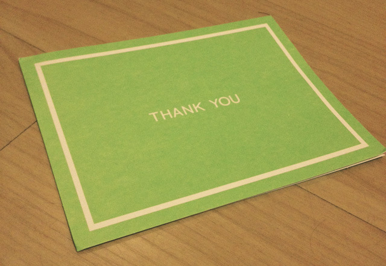
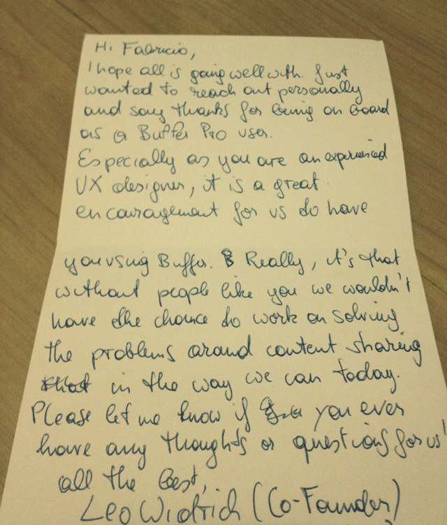

Estou morrendo de sono (sim, blogueiros também sentem sono), mas eu precisava compartilhar isso aqui.

  

Já faz alguns meses que eu estou usando o [Buffer](http://bufferapp.com/). Resumindo: é uma ferramenta para você agendar tweets, ao invés de ter que tuitar um por um. Isso facilita bastante a vida de quem tem que trabalhar longas horas por dia além de manter um blog. Gostei tanto da ferramenta que virei um usuário Pro.

  

Cheguei em casa hoje e tinha uma carta de Hong Kong me esperando.

  

Hmm, eu não tenho amigos que estejam em Hong Kong.

  

Era essa carta aqui:

  

  

  

A carta foi escrita à mão.

  

Tem rasuras.

  

Tem o nome do remetente.

  

Ele não errou meu nome (acreditem, ter o nome que eu tenho e trabalhar fora do país já me rendeu uma dúzia de nomes diferentes).

  

Ele foi pesquisar para descobrir que sou um UX Designer.

  

Nas poucas frases que ele escreveu, ele aproveitou para me lembrar da missão da empresa dele (*“solve the problems around content sharing in the way we can today”*).

  

E ele me agradeceu simplesmente pelo fato de eu ser um cliente dele.

  

Na hora me veio à mente aquele post onde falei sobre [O Sucesso através de UX](http://arquiteturadeinformacao.com/2012/03/21/sera-o-comeco-da-era-do-sucesso-atraves-de-ux/). Em uma época onde tudo é tão automatizado e digital, receber uma carta escrita à mão fez com que eu me sentisse novamente na pele de um consumidor. E foi uma experiência tão genuína que eu sei que se eu fizesse uma entrevista-com-usuário-comigo-mesmo, eu não conseguiria capturar com precisão aquilo que eu senti ao ler a carta.

  

Duas conclusões bem pessoais:

  

Uma delas foi ter mais certeza ainda de que eu sou apaixonado pelo que faço.

  

A outra foi esse tapa na cara de perceber que “se colocar no lugar do usuário” nunca é o bastante.

  
  
[[anexo ausente]](http://feeds.wordpress.com/1.0/gocomments/julianaconstantino.wordpress.com/4638/) [[anexo ausente]](http://feeds.wordpress.com/1.0/godelicious/julianaconstantino.wordpress.com/4638/)  [[anexo ausente]](http://feeds.wordpress.com/1.0/gotwitter/julianaconstantino.wordpress.com/4638/) [[anexo ausente]](http://feeds.wordpress.com/1.0/gostumble/julianaconstantino.wordpress.com/4638/) [[anexo ausente]](http://feeds.wordpress.com/1.0/godigg/julianaconstantino.wordpress.com/4638/) [[anexo ausente]](http://feeds.wordpress.com/1.0/goreddit/julianaconstantino.wordpress.com/4638/)   
  
  
  
from Arquitetura de Informação <http://arquiteturadeinformacao.com/2012/06/13/o-dia-em-que-uma-correspondencia-me-colocou-no-lugar-do-usuario/>
