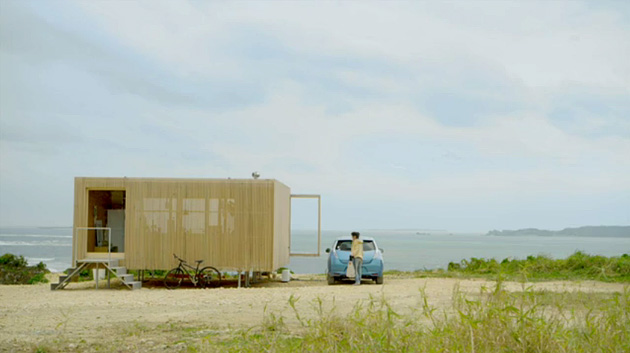

  
  

No post sobre o nosso **Cannes Bingo 2012**, eu afirmei que achava difícil apostar em algum case para *Titanium* esse ano, considerando a própria natureza da categoria, que são ideias realmente inovadoras ou capazes de mudar o mundo.

  

Bem, esse projeto da **TBWA\HAKUHODO** certamente é um bom concorrente. E não é uma campanha, nem um produto, mas sim uma casa.

  

O projeto **Mirai Nihon**, que traduzindo seria algo como *“o futuro do Japão”*, teve como ponto de partida o terremoto de 9 pontos que atingiu o país em 11 de março de 2011.

  

Com os recursos básicos completamente comprometidos e sem energia garantida, a agência se perguntou:

  
> Somos capazes de viver sem a infraestrutura moderna?

  

Em conjunto com diversas companhias japonesas, arquitetos e tecnólogos, a resposta é uma completa nova maneira de se viver. Uma casa auto-suficiente, em que as próprias pessoas podem gerar, controlar e consumir energia sem depender de fontes externas.

  

E não pense que isso significa o início da *Era da Escrotidão* (©Sr.K). O Mirai Nihon Project inclui muita dignidade: Água potável, energia elétrica, e inclusive “combustível” para você curtir o fim do mundo passeando em um **Nissan Leaf**.

  
  

 Post originalmente publicado no [Brainstorm #9](http://www.brainstorm9.com.br/)  
[Twitter](http://www.twitter.com/brains9) | [Facebook](http://www.facebook.com/brainstorm9) | [Contato](http://www.brainstorm9.com.br/contato/) | [Anuncie](http://www.brainstorm9.com.br/anuncie)

  
  
  

[[anexo ausente]](http://feeds.feedburner.com/~ff/brainstorm9?a=j6nMa5M9yNk:7Xjsh0FYI1Y:yIl2AUoC8zA) [[anexo ausente]](http://feeds.feedburner.com/~ff/brainstorm9?a=j6nMa5M9yNk:7Xjsh0FYI1Y:7Q72WNTAKBA)  [[anexo ausente]](http://feeds.feedburner.com/~ff/brainstorm9?a=j6nMa5M9yNk:7Xjsh0FYI1Y:V_sGLiPBpWU) [[anexo ausente]](http://feeds.feedburner.com/~ff/brainstorm9?a=j6nMa5M9yNk:7Xjsh0FYI1Y:I9og5sOYxJI) [[anexo ausente]](http://feeds.feedburner.com/~ff/brainstorm9?a=j6nMa5M9yNk:7Xjsh0FYI1Y:qj6IDK7rITs)

  
[anexo ausente]  
  
  
  
from Brainstorm #9 [http://www.brainstorm9.com.br/30298/arquitetura/mirai-nihon-uma-casa-alto-suficiente-para-garantir-o-futuro-do-japao/?utm\_source=feedburner&utm\_medium=feed&utm\_campaign=Feed%3A+brainstorm9+%28Brainstorm9%29](http://www.brainstorm9.com.br/30298/arquitetura/mirai-nihon-uma-casa-alto-suficiente-para-garantir-o-futuro-do-japao/?utm_source=feedburner&amp;utm_medium=feed&amp;utm_campaign=Feed%3A+brainstorm9+%28Brainstorm9%29)
