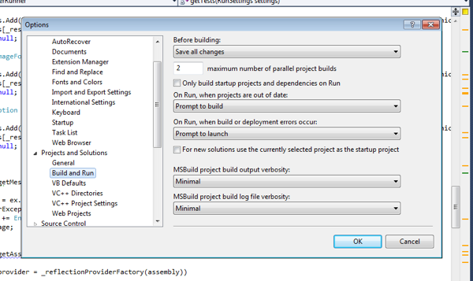
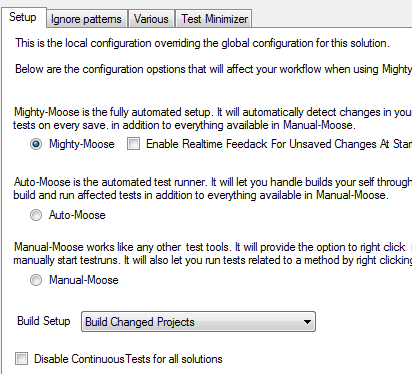

# How to make your build faster

I did an [informal survey a while ago](http://goodenoughsoftware.net/2012/02/25/build-times-2/)  and the results were frankly abysmal. I cannot understand how people work in such environments. I am ADD, if I have a feedback cycle more than a few seconds I have already hit ctrl+right arrow and am reading my email or sitting in twitter. This however has a very serious affect on my work. I am constantly pushing and popping my mental stack of what was going on (more often than not having cache misses as well). The sample size was pretty decent as well with over 700 respondents.

This post is going to look at some ways we can make our build times faster. There are loads of ways aside from buying SSDs. I work in a VM on a non-SSD drive on a laptop and rarely see a build over 5 seconds mostly because I focus very heavily on not having solutions with 20,000 projects in them but there are some other ways as well.

### Project Structures

To start with we can use smarter project layouts. Patrick Smacchia has some good posts on it:

[Advices on partitioning code through .NET assemblies](http://codebetter.com/patricksmacchia/2008/12/08/advices-on-partitioning-code-through-net-assemblies/)

[Hints on how to componentize existing code](http://codebetter.com/patricksmacchia/2007/12/16/hints-on-how-to-componentize-existing-code/)

Keeping well factored projects can go a long way and making a larger project will be faster than building many smaller ones (why? as an example they have a tendency of reusing many of the same references etc that need to be loaded repeatedly causing far more i/o).

### Parallel Builds

These are good reading to start but there are many more options that are available. Let’s start with one of the comments from Ben “I think unless you go down the parallel build/test route (like NCrunch) then this issue of build times is not going to go away.”

What a great selling point. Luckily for builds everyone can already do this. Did you know that Visual Studio and MSBuild already do parallel builds? All you have to do is drop into your configuration and you will see an options screen like the one here

Put in your max number of cores that you want. Work with msbuild? just use [/maxcpucount:4](http://msdn.microsoft.com/en-us/library/ms164311.aspx) . Of course this is still rather limiting as if you have project 1 that references project 2 which references project 3 you are in a serial situation anyways. The maxcpucount represents the number of projects that can be built concurrently (e.g.: providing no dependencies). Both MM and nCrunch support this option as well. This can get your build times to be quicker in some scenarios though I tend to see only a +- 20-25% increase on average.

### Mighty Moose

We did a quick survey on Mighty Moose users about a week ago and I was amazed to see that very few people were using this feature (about 10% of a survey size +- 100-150 people). Mighty Moose has a smart build system inside of it that is actually much better than what msbuild can do because it has more information. I know dotnetdemon from red gate has something similar to it.

Basically since I know what is changing and I know how that affects the dependency graph I can be much more intelligent with my builds. I also have further knowledge through static analysis about what the affects of that change was (are public contracts changed etc?). Of course its a bit more complicated than this in practice (lots of edge cases) but it can make a huge difference in your build times for your typical builds in your TDD cycle.

[youtube: 05Z5sPrGEeo]

You can see the difference in the video above. MSBuild on an incremental build in AutoTest.Net about 4.5 seconds. MM for the same build + locate tests to run + run the tests about 2.5-3 seconds. AutoTest.Net itself is not a tiny piece of code either. It has a reasonable amount of code in it, even the incremental build is doing pretty well when you consider my dev machine is a VM on a non-SSD drive. This is because we have more information than msbuild does as we stay running compared to it running then dying. You can enable the setting on the first screen in config (Build Setup) here.

Some people have asked if its so much faster why do we make you opt in to using it? There are a few reasons for this. The largest is compatibility mode. Most people do not generally build their projects directly and often have reasons why they don’t actually build successfully. Building the solution gives the highest level of compatibility with existing VS projects. As such we make you opt in for it, but its worth opting in for!
