# [O que é proporção divina?](http://design.blog.br/geral/o-que-e-proporcao-divina "Você está lendo: O que é proporção divina?")

Por [Canha](http://design.blog.br/author/canha "Posts de Canha")  | 07 de julho de 2008 | Tags: [proporção áurea](http://design.blog.br/tag/proporcao-aurea) , [proporção divina](http://design.blog.br/tag/proporcao-divina)  | [88 Comentários](http://design.blog.br/geral/o-que-e-proporcao-divina#comments "Comentário para O que é proporção divina?")

Encontrei um artigo falando de forma simplificada sobre a **proporção divina** (conhecida também como **proporção áurea**) e onde é possível encontrá-la.

Esse rapaz aí em cima é o matemático Luca Pacioli que inventou a contabilidade moderna. Em 1509 ele e seu amigo Leonardo (aquele da cidade de Vinci) publicaram o livro “*Divina Proportione*” (sim, isso é latim) – uma pesquisa sobre proporções divinas na natureza.

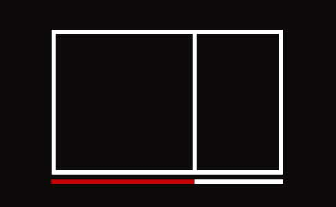

Foi baseado em estudos mais antigos de Fibonacci. Pacioli descobriu que as coisas na natureza evoluem exponencialmente. Descobriu que a natureza é baseada nos números 1, 2, 3, 5, 8, 13, 21, 34… (nada relacionado com os números 4, 8, 15, 16, 23 e 42 – isso é de Lost, seu nerd).

Quando cada um destes números é somado com o número anterior, cria o próximo (1+1=2, 1+2=3, 3+2=5, etc). A imagem acima é baseada na proporção perfeita.

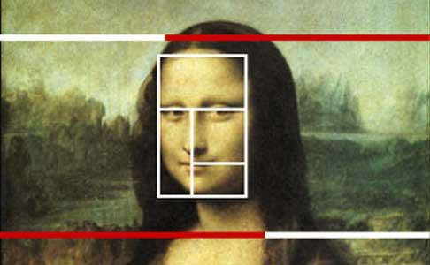

Então aquele rapaz, o Leonardo (Leo, pros amigos) e outros começaram a utilizar essa fórmula da “proporção divina da natureza” como base nas suas composições.

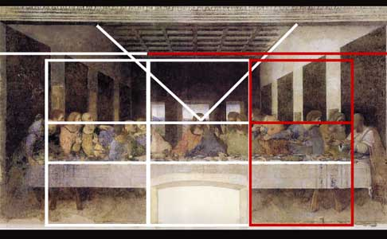

Assim que ele começou…

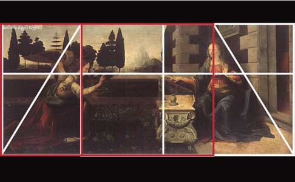

…não tinha mais como parar ele. Era como cocaína, só que mais nerd.

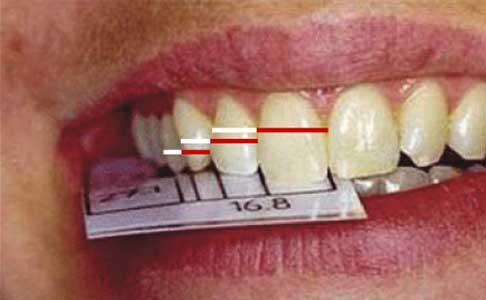

Então começaram a descobrir a proporção divina em todos os lugares…

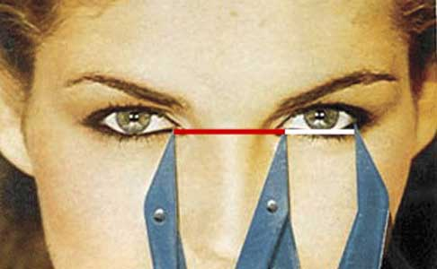

..desde a proporção do rosto humano…

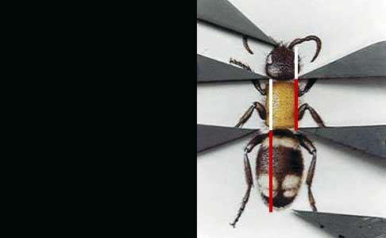

à proporção de insetos.

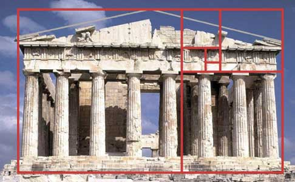

Descobriram que a arquitetura clássica foi baseada nela

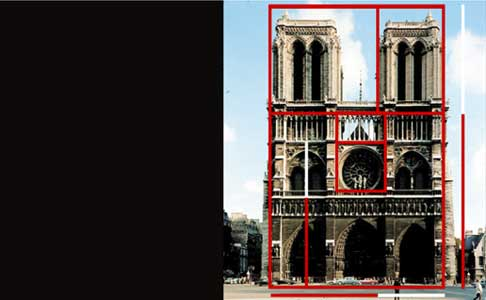

E que mais tarde inspirou gerações futuras, desde os construtores da catedral Notre Dame…

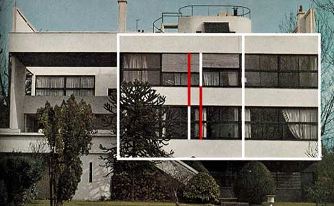

…á Corbusier…

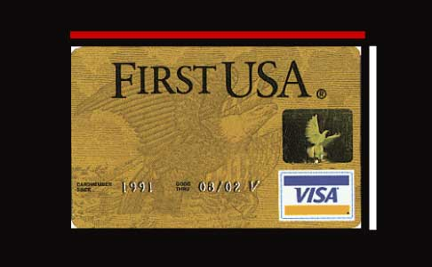

…cartões de crédito…

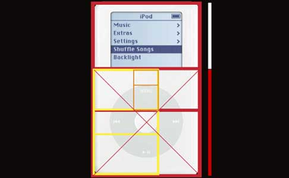

…o iPod…

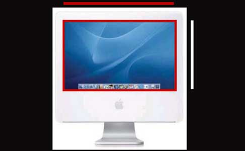

…o iMac…

…embalagens de produtos da Apple (você tá notando algum padrão aqui?).

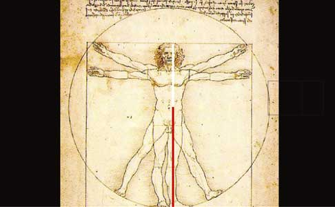

A verdade está lá fora…

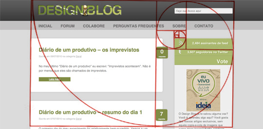

…e em todo lugar.

E aí? **Sua cabeça explodiu?**

Adaptado de: [Quick and Dirty International](http://www.quickanddirtyinternational.com/pages/proportion.html)

## Receba mais posts assim em seu e-mail

[Canha](http://design.blog.br/author/canha "Veja mais artigos deste autor") 

