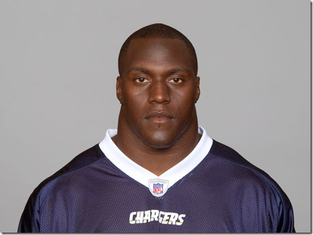

# [The Real Pain of Software Development [part 2]](http://haacked.com/archive/2012/04/15/The-Real-Pain-Of-Software-Development-2.aspx.aspx "Title of this entry.")

Around eight years ago I wrote a blog post about [Repetitive Strain Injury](http://en.wikipedia.org/wiki/Repetitive_strain_injury "Repetive Strain Injury on Wkipedia")  entitled [The Real Pain of Software Development [part 1]](http://haacked.com/archive/2004/06/09/The-Real-Pain-Of-Software-Development-1.aspx) . I soon learned the lesson that it’s a bad idea to have “Part 1” in any blog post unless you’ve already written part 2. But here I am, eight years later, finally getting around to part 2.

**But better late than never!**

The original reason that led me to write about this topic was a period of debilitating pain I went through when coding. Too many long hours at the keyboard took their toll on me so that even placing my fingers on the keyboard would cause me pain. I experienced numbness in my fingers, pain in my wrists, back and shoulders, and lots of headaches. In short, I was a mess.

## Road to Recovery

Fortunately, my employer at the time was supportive of me filing a Worker’s Compensation claim. I know for some, that has a negative connotation, but keep in mind it’s insurance that you pay in to specifically for cases of injuries. So it makes sense to use it if you’re legitimately injured on the job. [Per wikipedia](http://en.wikipedia.org/wiki/Workers'_compensation) :

> **Workers' compensation** is a form of insurance providing wage replacement and medical benefits to employees injured in the course of employment in exchange for mandatory relinquishment of the employee's right to sue his or her employer for the [tort](http://en.wikipedia.org/wiki/Tort)  of negligence.

The insurance covered several things for me:

- Doctor visits
- Physical Therapy (PT)
- Occupational Therapy (OT)
- An ergonomic chair ([Neutral Posture](http://www.amazon.com/Neutral-Posture-8000-Series/dp/B000WO09V4/ref=sr_1_cc_1?s=aps&ie=UTF8&qid=1334549364&sr=1-1-catcorr "Neutral Posture") )

I am extremely grateful for these measures as they’ve taught me the means to care for myself and deal with ongoing pain in a productive manner. I love to code and the thought of switching careers at the time was depressing.

One thing that’s important to understand is that every person is different. Some folks can work 16 hrs a day slouching the whole time, and have no problems. While others can work 8 hrs a day in perfect posture and have tons of pain. It’s important to listen to what your own body is telling you.

## Therapy

Have an fully grown friend lay down on the floor and relax. No funny business here, I promise. Then lift their head up gently with your two hands. Notice how heavy that is? A human head (without hair) [weighs around 8 to 12 pounds](http://danny.oz.au/anthropology/notes/human-head-weight.html "Human Head Weight") . And I’ve been told, some noggins are larger [than others](http://haacked.com/archive/2006/09/18/My_Sandwich_Compartment_ForeheadAgain.aspx) .

Ok, you can put it down now. Gently! A head is a pretty heavy thing, even when engaging your arms to lift it. Now consider the fact that you have only your neck muscles to hold it up all day.

So unless you’re built by this guy (photo from [The NFL’s Widest Necks article on Slate](http://www.slate.com/slideshows/sports/the-nfls-widest-necks.html "NFL's Widest Neck") )

Holding your head up all day can be a literal pain in the neck. The trick, of course, is to balance the head well so you’re neck isn’t constantly engaged.

What I learned in PT was how all these systems are connected. Pain in the neck and shoulders can impinge on nerves that run through the arm, elbow, and into your hands.

So a lot of Physical Therapy involved strengthening these muscles to better handle the stresses of the day combined with various massages and stretches to release tension in these muscles.

A lot of Occupational Therapy was focused on habits and behaviors so that these muscles weren’t overused in the first place. No matter how good your posture is, you need to take regular breaks. The body doesn’t respond well to being overly static. Even sitting in place with perfect posture for hours on end takes its toll. The body needs movement.

During my therapy, I bought a [foam roller](http://www.amazon.com/gp/product/B007EDGUK0/ref=as_li_ss_tl?ie=UTF8&tag=youvebeenhaac-20&linkCode=as2&camp=1789&creative=390957&creativeASIN=B007EDGUK0 "Foam Roller")  and would bring it to the office. I didn’t care how silly I looked, regular stress breaks with the roller helped me out a lot.

## Dvorak Keyboard Layout

Another change I made at the same time was to switch to a [Dvorak Simplified Keyboard Layout](http://en.wikipedia.org/wiki/Dvorak_Simplified_Keyboard "Dvorak on Wikipedia") :

> Because the Dvorak layout concentrates the vast majority of key strokes to the home row, the Dvorak layout uses about 63% of the finger motion required by QWERTY, thus making the Dvorak layout more ergonomic.[[16]](http://en.wikipedia.org/wiki/Dvorak_Simplified_Keyboard#cite_note-15) Because the Dvorak layout requires less finger motion from the typist compared to QWERTY, many users with [repetitive strain injuries](http://en.wikipedia.org/wiki/Repetitive_strain_injuries)  have reported that switching from QWERTY to Dvorak alleviated or even eliminated their repetitive strain injuries.

I hoped that reducing finger motion would result in less strain on my hands over all.

There’s some controversy around whether Dvorak is really better than QWERTY. A [reason.com article on QWERTY vs Dvorak](http://reason.com/archives/1996/06/01/typing-errors/singlepage "Typing Errors")  pointed out that the idea that QWERTY was designed to slow down typists is a myth. It goes on to provide evidence that there’s no reason to believe Dvorak is superior to QWERTY.

While the part about QWERTY is true, the evidence in the Reason article that QWERTY is superior to Dvorak [is also suspect](http://www.freakonomics.com/2007/05/30/qwerty-vs-dvorak/ "QWERTY vs Dvorak") .

The fact is that there’s too little research to make any claims. And all these studies focused on typing speed and not on impact to repetitive stress injuries.

And I’m not sure my experience can lend credence either way because it was not a controlled experiment. I switched to Dvorak while also engaging in new habits meant to improve my condition. So it’s hard to say whether Dvorak helped, I do subjectively feel that it’s more comfortable given how much my fingers stay on the home row.

## The Right Chair

In his blog post, [The Programmer’s Bill of Rights](http://www.codinghorror.com/blog/2006/08/the-programmers-bill-of-rights.html "Programmer's Bill of Rights") , Jeff Atwood calls out the need for a comfortable chair.

> Let's face it. We make our livings largely by sitting on our butts for 8 hours a day. Why not spend that 8 hours in a comfortable, well-designed chair? Give developers chairs that make sitting for 8 hours not just tolerable, but enjoyable. Sure, you hire developers primarily for their giant brains, but don't forget your developers' *other* assets.

He also has a great follow-up blog post, [Investing in a Quality Programming Chair](http://www.codinghorror.com/blog/2008/07/investing-in-a-quality-programming-chair.html "Investing in a Quality Programming Chair") .

I mentioned earlier that Workman’s Comp paid for a chair. I also bought another one with my own money so I’d have a good one both at home and at work. It’s that important!

For many, the [Herman Miller Aeron chair](http://www.amazon.com/gp/product/B003M1C7XW/ref=as_li_ss_tl?ie=UTF8&tag=youvebeenhaac-20&linkCode=as2&camp=1789&creative=390957&creativeASIN=B003M1C7XW "Herman Miller")  is synonymous with “ergonomic chair.” But it’s very important to note that, as good as it is, it’s not necessarily the right chair for everybody. I found that for whatever reason, it just wasn’t very comfortable with my body type. I felt the seat pan was too long and pushed against the back of my knees more than I liked.

I tried a bunch of chairs and settled on the [Neutral Posture series](http://www.amazon.com/gp/product/B000WO09V4/ref=as_li_ss_tl?ie=UTF8&tag=youvebeenhaac-20&linkCode=as2&camp=1789&creative=390957&creativeASIN=B000WO09V4 "Neutral Posture")  with a Tempurpedic seat cushion so my ass is cradled like a newborn. Be sure to get a chair that works for you and not simply select one because you heard about it.

## Today

One thing a doctor told me when I was dealing with this was that it’s very likely that I’ll always have pain. The question is how well will I deal with it when it happens?

And it’s true. The pain has subsided for the most part, but it’s never totally gone away. The good news is that I’ve been able to have a productive career in software because I took the pain seriously and worked to address it immediately. On days when I do have pain, I deal with it with stretches, exercise, and taking breaks. I also work to reduce my stress level as I’ve found that my pain level seems to be correlated to the amount of stress I feel. I think I tend to carry my stress in my shoulders.

If you’re dealing with pain due to coding, please know that it’s not because you are deficient in some manner. Or because you’re a wimp. There’s really no value judgment to be made. You’re not alone. It’s pretty common. Don’t ignore it! You wouldn’t (or shouldn’t) ignore a searing pain in your abdomen, so why ignore this?

With the right treatment and regimen, it can get better. Good luck!

Hey, if you liked this post, consider sharing it with others via a
or [ReddIt](http://reddit.com/submit?url=http%3a%2f%2fhaacked.com%2farchive%2f2012%2f04%2f15%2fThe-Real-Pain-Of-Software-Development-2.aspx.aspx&title=The+Real+Pain+of+Software+Development+%5bpart+2%5d "Submit to Reddit") .
  
You can also follow me on Twitter at [http://twitter.com/haacked](http://twitter.com/haacked "@haacked on Twitter") .

# What others have said

I just [ditched the chair](http://amzn.to/HbRSzB)  all together.   
  
I've only had it for a few days, but I expect it will transform my whole body.

This is the bain of the developer.   
  
I finally got an ergonomic chair last year and all my lower back pain disappeared overnight. Still get the pain in the heck/shoulders but its all about having the correct posture and taking breaks. Its does not get rid of the problems permanently but it does ease it significantly.

What a thoughtful article! Thank you.

I found that these changes really help me:  
- moved away from two monitors (17") to one larger one (24"). This really reduced the need to constantly be moving my head.  
- taught myself to use the mouse with my left hand. This really helped when typing a lot of numbers. Progressed from optical mouse, to trackball, to touchpad.  
- use a split keyboard. This keeps my arms separate and at a more comfortable angle.  
- i placed the touchpad between the two keyboard segements so that my arm motion goes inwards (more comfortable) instead of out.

About three years ago I thought I would have to change careers because of repetitive stress injury (RSI). I couldn't touch a mouse without a sharp pain up my arm. I switched to my left hand, and soon thereafter the pain shot up that arm too. It made me think there was something more going on because I had just started using the left hand for mousing and would not expect the pain to develop so quickly. Soon just thinking about a keyboard or mouse would cause me pain. Eventually I found this [book](http://www.amazon.com/The-Mindbody-Prescription-Healing-Body/dp/0446675156)    
  
To sum it up here is what I got out of it for me, but it is different for everyone: The pain was not permanently damaging my body, so I felt OK working through it. The pain was real, but is caused by my own mind and thereby can be healed by it as well. The pain can be managed and eliminated by managing stress. Regular exercise and other stress management techniques have helped me much more than the [weird joystick](http://www.amazon.com/UltraLite-Tension-Mouse-Carpal-Tunnel/dp/B001BS7NMS)  mouse I bought. Or this [one](http://www.evoluent.com/vm3.html)  that I also bought. Or the hundreds and hundreds of dollars I spent on special chiropractors, accupuncture, and massage therapy sessions.

Very nice article.   
  
I don't think that there is any credence to the claim laid by either side of the Dvorak v.s. QWERTY argument, but what I believe is that the change in muscle use brought by my switch to Dvorak has lessened the RSI in my wrist. And, I'm also fully prepared to switch back to QWERTY /when/ I start developing the same pain again.

I used to have severe pain on the wrist, knee, back and neck. What ended up helping was to exercise! Obviously I started taking more breaks but I got home and started doing exercise and everything improved significantly. Then I got two kids and working out started to become complicated, so now I ride my bike almost every day to work (30 minute trip) to keep my body active.

I get regular neck pain and the arthritis in my knees is aggravated by sitting so much each day. I keep thinking that a standing desk would be a good idea although I'm not sure how I would feel standing for 10 hours a day either.

Most important thing I learned was what Phil mentions... Your bones don't hold you up, they just hold you together. It's the muscles that hold you up. So if you have neck pain, make sure you are doing some excercises.... lifting 5-10 pound weights over head is a good start.  
  
Desk... 29" is great when writing with a pen, you probably want something more like 27". Ideally desk should have adjustable height. I like the Ikea Galant for this reason. Keyboard trays are generally a really bad idea. Actually OSHA has some good guidelines here.  
  
Chairs... A good chair is tremendous. I have a Steelcase Leap at home. The OfficeMax chairs would last me about 2-3 years, a good office chair lasts about 20. So spending $600-800 on a chair is a good investment over the $100-200 cheapies.  
  
While we're on chairs... I prefer hard floors over carpet, but you need to have different wheels that don't spin as easily or you'll fling the chair out from under you when you sit down. These are an order option for most office chairs. If you do have carpet, invest in a high quality mat. The cheap ones fall apart quickly, a quality mat is thicker and costs more, maybe $100 or so. These you can get from officemax/depot/staples, but you may have to order it online as they don't always carry them in stock.  
  
Keyboards... The problem with most keyboards is the keys, not the layout. You can certainly try dvorak or split keyboards, but personally I prefer a good quality keyboard like the Keytronics E03600U2. Easy to find, about $20-30.  
  
Mice... I found don't use laptop mice as the small size causes great pain. you may have to buy several mice before you find what you like. I have a Logitech G5 on my desktop and a MX1000 for carrying in my laptop bag.  
  
Monitor height... I've found it's best to have them up at eye level.

I've dealt with low back, arm, and neck pain for a few years and I'm only in my late twenties. I eventually bought a standup desk from GeekDesk. That's probably made the biggest difference for my low back. I alternate between sitting and standing. It also helps my neck. I was also diagnosed with carpal tunnel, but my therapist said it was more likely Thorasic Outlet Syndrome. I lift and exercise pretty reguarly but didn't spend enough time addressing the muscles that get stretched out during the day... my back. I stopped benching and focused more on chest stretching and back strengthening... that probably made the biggest difference for my CT like symptoms that any PT I've done.

Dvorak spent practically his whole life researching keyboard layouts, habits of typists and even wrote a whole book on it. One article written by a nobody that says qwerty is better should be given the credibility it deserves. None.

Oddly, the only time I've ever had write pain was a few hours after I started trying to type correctly on a Dvorak key board. I think it had more to do with the correctly than with the Dvorak. It went away as soon as a switched back to may habitual typing style with my pointer fingers hovering around the 'v' and 'n' and enough other "problems" to give a a typing teacher conniptions.

I used to get RSI very badly. I had pain in my neck, back, down my arms and numbness in my fingers. I had seen physio's, chiropractors and acupuncuturists, nothing helped. Then I experienced a knock to the head and had a severe concussion that stopped me from working for 4 months. It took 12 months to recover from headaches but the pains in my neck and back got worse. Riding my bike to work to try to get some exercise in the hope of aiding it was the killer blow. Holding your head stooper over your handle bars is one of the worst positions when you have weak muscles from bad posture. Again I did the rounds of the chiro etc who made it far worse. I got an MRI done and I'd perforated the cervical disc in my neck at C4/C5. The gel from inside was pushing on my spinal chord and pushing down the canals where the nerve roots go. The pain was excrutiating. I used to sit at work often with tears rolling down my face as I'd type. It got to the point where I could no longer work and finally made the hard decision to have surgery (I tried everything to avoid it but once a disc is perforated you're pretty screwed).  
  
I'm now back to work and am pain free again. I am very sure to keep my posture as best I can. I get up and walk around for a couple of minutes every hour and I'm hoping to slide slowly back into an rehabilitating exercise routine. We don't know what caused the perforation, it could have been the concussion but the build up to the pain was happening for years before that so it's very much a chicken and egg situation, had my muscles been stonger I may not have caused the damage, who knows.  
  
The surgeon said some people's bad postures tire out the muscles that badly that mean they just give way. So it really helps to keep your body fit and well. I have kids so finding time is hard, but having gone through 3 years of the most agonising pain that got to the point where I no longer wanted to live (seriously). The pain affected my mind in ways you can't imagine and I won't even go into what sleep deprevation because of the pain adds to the mix!  
  
I'd tell anyone to find 20 minutes everyday to do something and always sit up properly and always take regular short breaks, you really don't want to find out the hard way.

Unfortunately, a worker compensation claim is almost unheard of in many countries, in the area of software development - in our country, in order to to fill such a claim, it should be something very serious (like electrocuting while working or something similar), and it usually involves a lawsuit (most employers will never recognize their guilt and fill first try to blame the employee) and obviously the need to find another workplace..

And a Vertical Mouse! I got golfers elbow (and don't golf) and the Dr recommended one. It works! [http://www.evoluent.com/vm4r.htm](http://www.evoluent.com/vm4r.htm "http://www.evoluent.com/vm4r.htm")

alternating your mouse hand is a good idea. Change hands every other week. The beginning is difficult.  
  
  
but  
  
  
i dont know if you are workjng out?  
  
try this: push ups! It will train your hands, whole arms, back, shoulders and pecks. You dont need to go to 100. If you never did push ups; Just start with 3 every other day and every week add a few more. Until you are at min. 20. When you can do 20 you need it minimal 2x a week for maintenance. This will break your daily keyboard routine.  
  
start today, its free.

Been using Dvorak for 2 years now. It took about 6 months of to reprogramme my muscle memory. All my joint pain and finger cramping is completely gone. Another tip that came in handy, is to learn one keyboard short cut in your current ide/text editor per day and use command line tools over gui's. To stop you reaching for that damn mouse.   
  
When using Qwerty I cringe, you can tell the difference. Common words and common letter combinations are so much easier and hence faster to type.   
  
A good chair is a plus.  
And a monthly remedial massage to iron out the knots in shoulder and neck is well worth the temporary pain.

Who ever said that programming was not a full contact sport! But seriously, comming from nearly 15 years in the IT industry I have seen many disfigurements and ailments from programmers. Some people I know cannot be trusted to hold anything in their right hand from years of using a computer mouse and others constantly had neck pain.  
  
I think it's something to do with how passionate and 'zoned' focus developers get into without taking any breaks and possibly that every IT office I have ever been into has been like a freezing arctic region!  
  
I wonder if we will have an influx of injuries now that we are all on [Twitter](http://twitter.com/#!/brisrocket) and facebook. Speaking of which - congrats for continuing to blog with your setback!!  
  
Great article Phil - thanks!

Nice title :) although i agree, that a good chair, bigger monitor, etc. can help when programming more than 8 hours a day, i still believe that doing sports can do so much more for your health.

I completely agree. My wife is a PTA and I went from having shooting pains in my wrist everyday and wearing wrist braces to almost no pain. The right equipment makes all the difference. I'm using the Microsoft ergonomic 4000 with the wrist pad lifter as that has been proven to be the proper angel for wrist (per a ergonomic class my wife attended regarding computer related health issues), a Logitech G500 - higher DPI means less mouse movement which means less strain on my wrist, plus programming all those extra buttons help with little things - F5 to build/compile, refresh page, f12, etc. All I'm still working on is the chair - it's amazing how hard it is to get over the stereotype that $400-$500 is too much for a office chair. I argue - people pay much more than that for a Lazy Boy type chair in their living room that they only use 3 hours a night maybe.   
  
Good post. We need more information out there to help change people's mindset regarding proper office equipment.

Kinda... Relevant: [ux.stackexchange.com/...](http://ux.stackexchange.com/questions/20130/good-reasons-to-use-bad-ui "http://ux.stackexchange.com/questions/20130/good-reasons-to-use-bad-ui")

Mousing used to give me some discomfort and I switched to a trackball years ago and will never go back. If you have mouse related pain at least try a trackball; it will only drive you crazy for a day or so. That along with a good keyboard tray have been life savers.  
  
And paradoxically I have found that the better typist I have become, the more I can keep my hands on the keyboard the more comfortable (and fast) I am. As already said, everyone is different so mileage may vary. I know it is the geek-macho thing to just pound it out and not use heavy IDE features like intellisense, but I keep tweaking my setup with new snippets/live templates which cuts down on the "miles" my fingers need to travel.

I switched to a sit-to-stand workstation; it's awesome. It raises when I need to stand(and work) & lowers when I need to sit (and work). I also switched my mouse to my left hand and found it has other mind-expanding benefits too (gets you out of your comfort zone). That was about 10 yrs ago & I've never had the pain in my left arm, my right arm healed fine. The sit-to-stand workstation is for my lower back and let me warn you... it's TIRING standing for so long, and this has a direct reduction on my ability to concentrate for very long at a time.

After years of increasingly severe back and elbow / wrist pain, almost two years ago I switched to a sit stand desk ([Geek Desk](http://www.geekdesk.com) ).   
  
I was uncertain how I would feel about it at the time, rather expected to be dissapointed in fact, but other than my kids lowering the desk for fun, I have not used a chair to code more than one or two days since then. Back, wrist, elbow pain are all gone, though my legs often feel as if I had spent all day walking (a plus, I think). Life changing for me.

This is so true! It is unbelievable on what chairs programmers sit the hole day, or hole live. I found a chair that is perfect for people who had already back problems there hole live, and can not sit any more on that crapy chairs.   
If anyone is interested:   
[www.sitag.ch/.../sitagwave/](http://www.sitag.ch/produkte/alle-seating-produkte/dreh-besucherstuehle/sitagwave/ "http://www.sitag.ch/produkte/alle-seating-produkte/dreh-besucherstuehle/sitagwave/")   
I don´t know if it is available in US. But in Europe it is.

Just to give my two cents to this. A good chair won't help your back. It will maybe slow down the problem, but not solve it. The one thing that helped me after years of back pain besides a good chair was movement. I started swimming and by back pain vanished away literally. Back pain is only one problem that we as developers face, but there are other problems that ergonomic chairs and desks will cure. I was diagnosed with arterial hypertension with 25, which is usually uncommon at that age, but it seems that in the recent years it gets more common. Since I had no other disease that could couse it my doctor said it is most probably combined with my profession, since I'm sitting all day long for years and don't do sports. After a while I found that hiking and swimming are good ways of activity that will save your joints and won't put to much strain on the body. Swimming involves all your muscles and is a perfect aerobic exercise. It will strengthen back and shoulder muscles that help the spine keeping a good position. My advice, go swimming 2-3 times a week for an hour or so and you will see the difference in a matter of days. My health improved immensely.

I am glad I found this article when I did. I'm in the process of trying to rework my workstation at home. Desk, chair, monitor, etc. Right now it is just way too cluttered. I can't even fit a decently sized technical book on my desk. For some reason, I just feel tired and demotivated after working there for an hour or so.   
  
Thanks for writing this, as it'll really help me evaluate options as I redo my workstation.

It's a shame people can't move away from the idea of "home row typing", it would probably ease a lot of people's wrist problems. I learned to type when I was around 13, but in a "natural" way(ie, I wasn't taught the specific home row method of typing). I'm able to just plop my hands down on the keyboard and touch type without having to look. My left hand will generally be on ASDF or AWEF while my right hand might be on JIO: or any of the surrounding keys. This has always worked for me, typing tests put me at roughly 100 WPM. My coworkers refused to believe that I could type just fine until we all took the same typing test.  
  
Having said that, I *can't* use those ergonomic keyboards with the split down the middle. The way I type, my hands are already at an angle, so the split keyboards mess up how I know the keyboard layout.

I wrote my pain story few days back, titled:  
  
 [Efforts for the betterment of my software developer's life](http://irohitable.com/post/2012/03/14/Efforts-for-the-betterment-of-my-software-developer-life.aspx)   
  
I am still struggling with the neck pain caused by long hours of work on my Laptop. One thing I definitely feel will be effective is Swimming. It involves neck and shoulder stretching and also eases stiffness of shoulder muscles.

The only thing that really helps my RSI is the Vertical Mouse by Evoluent. I have used it for years now. I can no longer use a regular mouse and the trackpad is hard on my wrists as well.   
  
Interestingly the few weeks that I took Aikido I noticed an improvement in my wrists. At the beginning of each Aikido class we would do a series of warmups including wrist warmups. I think I will start doing them again.

I have passed through all these strains of software development, but it wouldn't be so interesting if there were no problems.

I'd like to affirm the [comment](http://haacked.com/archive/2012/04/15/The-Real-Pain-Of-Software-Development-2.aspx.aspx#87132) above by Quesi Jay.  
  
It's an odd book with little support from the medical community but it does help. It focusses on relaxation, talking to your inner-self and de-stressing, but in a way which is not to everyone's liking.  
  
But there's increasing evidence that RSI is linked to stress more than anything else. You may not realise it, but you may well be tense whilst working. This is especially true if your a perfectionist and always have to finish "that last little thing...". If you're typing all day with tense muscles and tendons in your hands, that can't be good for you.  
  
This is why exercise has such a huge benefit: exercise helps you to de-stress and relax.

I recently developed back and shoulder pain several months ago. Really glad to see this and the various comments. While I'm still dealing with the pain (PT really helped with the pain behind the shoulder blades! But I still need to work on building muscles, and trying not to slouch / lean forward when typing. It's amazing how many times a day I have to remind myself), I found that investing in a good pillow may also help alleviate some of the pain. Maybe it's just a placebo effect, but I'd like to think I'm sleeping better so my body is healing better too.

I'm totally agree with Rohit Khare and Slo - swimming is the most effective way to avoid problems with back. It helps me.

# What do you have to say?

:   Title:
:   Name:
:   Email: (never displayed)
    (will show your [gravatar](http://gravatar.com/ "gravatar") )
:   Website:
:   Comment: Allowed tags: blockquote, a, strong, em, p, u, strike, super, sub, code
