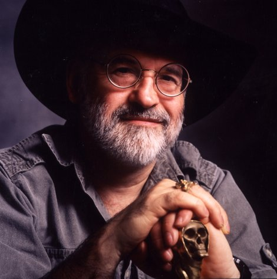

# Você já conhece Terry Pratchett?

  
[Você já conhece Terry Pratchett?](http://www.interney.net/blogs/melhoresdomundo/2012/04/09/voce_ja_conhece_terry_pratchett/ "Link permanente para o post") 

Não? Uma pena... **Terry Pratchett** é simplesmente um escritor fodão do nível de **Neil Gaiman** - que o [Nerd Reverso comentou anos atrás](http://www.interney.net/blogs/melhoresdomundo/2006/05/25/novo_livro_de_neil_gaimanlbrgem_pre_vend/)  escreveu ***Belas Maldições*** em parceria com ele - Grant Morrison, Alan Moore e outros autores que nerds adoram. Dono de um estilo invejável repleto de bom humor e muita literatura fantástica na veia.

[Mais:]

Não há nenhum fato novo rolando sobre o escritor... Simplesmente me ocorreu que nunca falamos nele aqui (promessa de ano novo pra cumprir em abril: mudar isso). E, acredite, se você nunca ouviu falar do escritor ou nunca leu seus livros, está perdendo ótimas leituras no universo da fantasia (sci-fi é legal, mas eu prefiro esse gênero).

No Brasil, [a editora Conrad publica seus livros](http://www.lojaconrad.com.br/lojas/CONRAD/__Detalhes.cfm?produto=RQ16007#) como ***O Fabuloso Maurício e seus Roedores Letrados***, com imagens que encabeçam este post. Entre as sugestões de leitura que posso dar para vocês, ***Os Pequenos Homens Livres*** é indicado para gente apaixonada por esse tipo de universo sem curtir suas banalizações. Mas o meu favorito ainda é ***Quando as Bruxas Viajam***, que tem um estilo mais pop.

Entre as curiosidades sobre Pratchett, está o fato de ter sido jornalista e assessor de imprensa. Até que, [para nossa alegria](http://www.youtube.com/watch?v=K02Cxo3fAC8) , ele resolveu se dedicar apenas a profissão de escritor. Pratchett é o campeão absoluto de vendas na Inglaterra, centro da literatura fantástica, permanecendo há quase dez anos na **lista dos dez mais vendidos** do *Sunday Times*.

Alguns livros da Conrad estão em falta, mas você pode conferir um preview de *O Fabuloso Maurício e seus roedores letrados* [aqui](http://www.lojaconrad.com.br/lojas/CONRAD/__VisPreview.cfm?id=11502) . Depois volta aqui para dizer o que achou.

Bugman se tornou fã de Pratchett

Indique:
