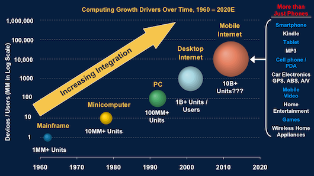
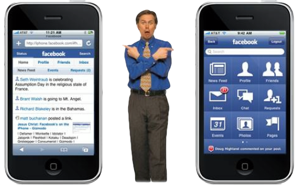

  

Primeiro foram mainframes, depois os minicomputadores. Em seguida, os microcomputadores (PC's). Então veio a internet desktop e, finalmente, ela, a maior tendência tecnológica de todos os tempos: a internet móvel.

  

Cada um desses ciclos tecnológicos foi cerca de 10 vezes maior que o anterior. Enquanto o mainframe somava cerca de 1 milhão de unidades na década de 1960, o minicomputador chegou a 10 milhões por volta de 1980. O PC alcançou a marca de 100 milhões em 1993. Os PC's com acesso a internet chegaram a 1 bilhão em 2005 e, para a próxima década, estima-se que o número de dispositivos móveis conectados à internet chegará a surpreendentes 10 bilhões[[1](http://maisquetitanium.blogspot.com/#ref-1)]! Que dispositivos são esses? Smartphones, tablets, e-readers, mp3 players, GPS's, vídeo games, TV's, eletrodomésticos etc[\*](http://maisquetitanium.blogspot.com/#asterisco).

  
  

  

Morgan Stanley - The Mobile Internet Report

  

A expectativa é que o número de usuários de internet através desses dispositivos ultrapasse os de internet desktop entre 2013 e 2014 e continue crescendo. Um excelente crescimento para se acompanhar, não?

  

### Smartphones e tablets

  

A internet móvel é uma área bastante abrangente, que inclui muitos dispositivos, mas gostaria de focalizar neste e nos próximos artigos um certo grupo deles: smartphones e tablets.

  

O motivo é simples: são os dispositivos mais representativos no crescimento da internet móvel atualmente e são aqueles para os quais empresas e developers individuais como você e eu podemos criar aplicativos e desde já.

  

O iPhone é o primeiro colocado no ranking mundial de smartphones[[2](http://maisquetitanium.blogspot.com/#ref-2)], enquanto o Android é o primeiro no ranking de sistemas operacionais móveis[[3](http://maisquetitanium.blogspot.com/#ref-3)]. O iPad, tablet que usa o mesmo sistema operacional do iPhone/iPod touch[#](http://maisquetitanium.blogspot.com/#asterisco2) (iOS), reina absoluto na sua categoria com 80% do mercado[[4](http://maisquetitanium.blogspot.com/#ref-4)].

  

Felizmente, os usuários de smartphones gostam de usar seus brinquedinhos para fazer muito mais do que falar. E os de tablets, para muito mais do que navegar na web. É aqui que entram os aplicativos, ou as apps, como são chamadas no contexto mobile. As maiores lojas de apps são a App Store da Apple e a Android Market da Google, que já contabilizaram, respectivamente, 15 e 5 bilhões de downloads[[5](http://maisquetitanium.blogspot.com/#ref-5)]. Isso dá quase 3 apps para cada habitante do planeta!

  

Você provavelmente está interessado em entrar nesse mercado em grande crescimento, mas antes precisa entender algumas diferenças básicas entre os tipos de app que se pode desenvolver para esses dispositivos.

  

### Web apps x Apps nativas

  

Web apps, no contexto mobile, é como são chamadas as aplicações web, executadas em browsers e otimizadas para uso em dispositivos móveis. Elas podem estar na internet, ou, se forem feitas usando os novos recursos do Html5, podem ser baixadas e executadas total ou parcialmente de forma offline. A capacidade de serem executadas numa variedade de plataformas e terem updates mais fáceis são algumas das vantagens, enquanto o fraco ou ainda nulo acesso a alguns aos recursos de hardware dos dispositivos são desvantagens.

  

  

GIA Industry White Paper: Native or Web Application?

  

As apps nativas, também chamadas de mobile apps, são compiladas para uma plataforma específica (iOS ou Android, por exemplo) e rodam fora do browser. Por serem nativas, elas tem acesso privilegiado aos recursos do dispositivo, tais como acelerômetro, câmera, lista de contatos, SMS e calendário. Mobile apps são muito mais populares, entre outras coisas, pelas vantagens oferecidas pelas app stores. Por outro lado, para submeter apps às stores é preciso seguir suas regras, em alguns casos (Apple) rígidas e arbitrárias.

  

O que é melhor, ter um app nativa top de linha numa plataforma específica ou ter uma web app menos sofisticada que funciona na maioria dos aparelhos? Não há uma resposta definitiva, dado que nenhuma das abordagens é inteiramente boa ou ruim. Mas é interessante notar que os usuários passam muito mais tempo usando apps nativas do que o browser[[6](http://maisquetitanium.blogspot.com/#ref-6)][[7](http://maisquetitanium.blogspot.com/#ref-7)]. Por quê?

  
> "Os aspectos mais fundamentais são a usabilidade e a experiência geral do usuário. Os browsers mobile estão sem dúvida evoluindo, [...] mas ainda há alguns elementos - como o pequeno tamanho das telas, a capacidade de renderização dos dispositivos, as limitações de uma aplicação web, uso offline etc - que tornam as aplicações dependentes do browser, em muitos casos, inadequadas, ou não tão boas para as telas desses dispositivos. É tecnicamente fácil [para as apps nativas] garantir a aparência, o funcionamento e como entregar valor para o usuário comparado com as web apps." (Hannu Verkasalo, Zokem)[[6](http://maisquetitanium.blogspot.com/#ref-6)]

  

Isso confirma o que o autor de [A Cauda Longa](http://books.google.com.br/books/about/A_cauda_longa.html?id=Azimn30tFbUC) e [Free](http://books.google.com.br/books?id=DKciQAAACAAJ) disse na revista Wired cuja capa estampava "The web is dead" (A web morreu)[[8](http://maisquetitanium.blogspot.com/#ref-8)]:

  
> "Visando otimizar o uso dos dispositivos móveis, os usuários abrem mão do navegador de uso geral. Eles usam a Internet, mas não a web" (Chris Anderson, Wired)[[8](http://maisquetitanium.blogspot.com/#ref-8)]

  

Se você tem um smartphone ou tablet, entende o que eles estão dizendo. Você provavelmente usa apps nativas para e-mail, calendário, RSS, Mapas, Redes sociais etc, ainda que exista uma versão web das mesmas apps. Você usa a internet através dessas apps, mas não a web.

  

Porém, isso pode mudar no futuro[[9](http://maisquetitanium.blogspot.com/#ref-9)], quando o Html5 se tornar mais maduro e der suporte aos recursos atualmente disponíveis apenas para as apps nativas. Se as web apps vão tomar o espaço das apps nativas ou ambas vão coexistir, só o futuro dirá. Até lá, espero já ter criado muitas apps nativas. A propósito, este blog é sobre isso.

  

### Sobre este blog

  

Este blog focalizará o desenvolvimento de aplicativos móveis, principalmente usando a plataforma [Appcelerator Titanium Mobile](http://www.appcelerator.com/products/titanium-mobile-application-development/), que atualmente permite criar apps nativas para iOS e Android usando uma única base de código, em JavaScript. Nos próximos artigos, explicarei porque estou usando o Titanium e compartilharei o meu aprendizado sobre essa plataforma ainda pouco conhecida no Brasil. Mas, como no nome do blog já diz, não me limitarei ao Titanium.

  

Este é o meu segundo blog relacionado a desenvolvimento de software. O primeiro, o [Mais que bom código](http://maisquebomcodigo.blogspot.com/), é generalista e continuará com o mesmo perfil, tratando de questões mais abrangentes, não restritas certas a tecnologias ou nichos.

  

Siga este blog, assine o rss ou siga meus perfis no [Twitter](https://twitter.com/DirleiDionisio) e/ou [G+](http://gplus.to/DirleiDionisio) para ser notificado das atualizações. E se você tem algo a dizer sobre esse primeiro artigo ou quer sugerir um assunto para um dos próximos, deixe seu comentário.

  

—

  

Créditos da foto: Meppol.

  

\* [^](http://maisquetitanium.blogspot.com/#cit-asterisco) É verdade que TV's e eletrodomésticos não são tão móveis quando smartphones, mas todos estão dentro da mesma categoria, chamada no relatório que estou usando[[1](http://maisquetitanium.blogspot.com/#cit_ref-1)] de "Mobile Internet". Da mesma forma, a categoria "Internet Desktop", usada no mesmo relatório, se refere tanto ao acesso à rede através de computadores de mesa, quanto pelos notebooks.

  

#[^](http://maisquetitanium.blogspot.com/#cit-asterisco2) O iPod touch (às vezes chamado de iTouch) está na categoria dos players de mídia portáteis, mas acho essa classificação injusta para um dispositivo tão bom. Pra mim, ele é um iPhone que não faz chamadas de voz. Se você quer criar apps para iPhone, mas não quer comprar um, vá de iPod touch. Tudo funcionará quase como se fosse num iPhone. Para saber mais sobre as diferenças entre os dois, clique [aqui](http://blogdoiphone.com/2010/09/conheca-as-diferencas-entre-o-novo-ipod-touch-e-o-iphone-4/).

  

Referências:

  

[1] [^](http://maisquetitanium.blogspot.com/#cit_ref-1) Morgan Stanley. ["The Mobile Internet Report"](http://www.morganstanley.com/institutional/techresearch/mobile_internet_report122009.html)

  

[2] [^](http://maisquetitanium.blogspot.com/#cit_ref-2) IDC. ["Apple Rises to the Top as Worldwide Smartphone Market"](http://www.idc.com/getdoc.jsp?containerId=prUS22974611)

  

[3] [^](http://maisquetitanium.blogspot.com/#cit_ref-3) BGR. ["Canalys: Android shipments balloon 379% in Q2, iOS now No. 2 smartphone platform"](http://www.bgr.com/2011/08/01/canalys-android-shipments-balloon-379-in-q2-ios-now-no-2-smartphone-platform/)

  

[4] [^](http://maisquetitanium.blogspot.com/#cit_ref-4) ABI Research. ["Android Takes 20% Media Tablet Market Share from iPad in Last 12 Months"](http://www.abiresearch.com/press/3753-Android+Takes+20%25+Media+Tablet+Market+Share+from+iPad+in+Last+12+Months)

  

[5] [^](http://maisquetitanium.blogspot.com/#cit_ref-5) Byte Revel. ["15 Billion iOS App Downloads And Counting"](http://byterevel.com/2011/07/11/15-billion-ios-app-downloads-and-counting/)

  

[6] [^](http://maisquetitanium.blogspot.com/#cit_ref-6) RWW. ["Apps Continue to Overtake Mobile Web (Study)"](http://www.readwriteweb.com/mobile/2011/02/apps-continue-to-overtake-mobile-web-study.php)

  

[7] [^](http://maisquetitanium.blogspot.com/#cit_ref-7) Nielsen. ["Mobile Apps Beat the Mobile Web Among US Android Smartphone Users"](http://blog.nielsen.com/nielsenwire/online_mobile/mobile-apps-beat-the-mobile-web-among-us-android-smartphone-users/)

  

[8] [^](http://maisquetitanium.blogspot.com/#cit_ref-8) Wired. ["The Web Is Dead. Long Live the Internet"](http://www.wired.com/magazine/2010/08/ff_webrip/all/1)

  

[9] [^](http://maisquetitanium.blogspot.com/#cit_ref-9) W3C. ["Device APIs Working Group"](http://www.w3.org/2009/dap/)

  

—

  

Se você gosta dos meus artigos, é provável que também gostará dos meus tweets. Siga [@DirleiDionisio](http://twitter.com/DirleiDionisio) no Twitter!

  
[anexo ausente]

  
  
  
from Mais que Titanium <http://maisquetitanium.blogspot.com/2011/08/maior-tendencia-tecnologica-de-todos-os.html>
