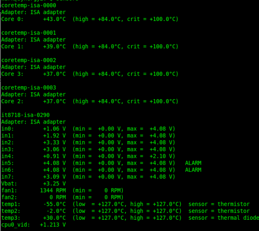
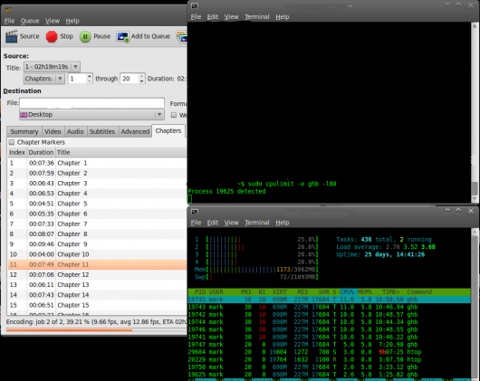

# [Limit CPU Usage by Process](http://nwlinux.com/limit-cpu-usage-by-process/ "Limit CPU Usage by Process")

published August 16th, 2011 | categories: [apt-get](http://nwlinux.com/category/apt-get/ "View all posts in apt-get") , [how-to](http://nwlinux.com/category/how-to/ "View all posts in how-to") , [Informational](http://nwlinux.com/category/informational/ "View all posts in Informational") , [Installing](http://nwlinux.com/category/installing/ "View all posts in Installing") 

article shortlink: <http://nwlinux.co/sT>

cpulimit is a daemon that limits the CPU usage of a process. Initial tests of cpulimit on Handbrake proved to be successful and very pleasing. As an example, when Handbrake decodes media, it will use any resources needed to complete the job. In short, it maxes out the CPU without regard for other processes. I had originally thought to use [Trickle prioritization](http://nwlinux.com/ubuntu-install-and-configure-trickle-bandwidth-prioritization/ "Ubuntu: Install and Configure Trickle Bandwidth Prioritization") , however it is more suited for bandwidth intensive operations than CPU limiting. The cpulimit daemon conducts a terrific job of dynamically limiting the CPU. Prior to utilizing cpulimit, my Xeon core temperatures were at a high of 70C-85C. Now that I have cpulimit installed, my cores are down to a more reasonable 43C.

cpulimit enabled for Handbrake and CPU sensors

Install cpulimit with the following commands at Terminal.

> sudo apt-get update  
> sudo apt-get install cpulimit

Using fairly basic commands, you can effectively limit or throttle the cpu, regardless of the number of cores. You will need to know the process name or ID that you want to limit. For example, I am limiting Handbrake using the following command.

> sudo cpulimit -e ghb -l80

The trickiest component of the command is determining the percentage of limiting. If you have more than 1 core, the percentage is directly relative, However, If you have 4 cores as I do on this machine, you would divide 80% by the number of cores. Using **-l80** statement in cpulimit indicates that I am using 20% of the total CPU for this process. As you can see by htop, that is approximately correct.

Handbrake process running with cpulimit enabled at 80%

> Previous Post: « [How to Mitigate Cache Stampeeds](http://nwlinux.com/mitigate-cache-stampeeds/)   
> Next Post: [Install Firefox 7 Ubuntu using apt-get](http://nwlinux.com/install-firefox-7-ubuntu-using-apt-get/)  »

Do you have something to say? Send me a message on my [Google Plus](https://plus.google.com/111316694563737314573/posts)  profile.
