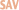

# Create a transparent TabbedBar for Titanium Mobile

---

---

URL: <http://www.chlab.ch/blog/archives/mobile-development/create-transparent-tabbedbar-titanium-mobile>

We create a View with a background color, put a semi-transparent TabbedBar with empty button names on top of it, then add another layer of fully visible labels spaced to fit the TabbedBar beneath it. Everything is then wrapped in one View, which you can add to another View or Window.

1. \* Create a semi transparent TabbedBar
2. \* The TabbedBar looks best if the backround color is set to one of the colors
3. \* of the background image of the view beneath it.
4. \* props:
5. \* - backgroundColor  string   Background color of TabbedBar
6. \* - buttonNames      array    Names for the labels of the TabbedBar
7. \* - height           number   Height of entire view
8. \* - opacity          decimal  Opacity level of TabbedBar and it's background
9. \* @param   object  Dictionary of properties
10. \* @return  object  Titanium View
11. function createTransparentTabbedBar (props)
12. if (typeof(props.opacity) == 'undefined')
13. props.opacity = 0.4;
14. // wraps all the views
15. var wrapper = Ti.UI.createView({
16. top: 0,
17. left: 0,
18. right: 0,
19. height: (typeof(props.height) != 'undefined' ? props.height : 30)
20. // text overlay container
21. overlay = Ti.UI.createView({
22. zIndex: 3,
23. touchEnabled: false
24. labels = [],
25. // bar background layer
26. bar\_bg = Ti.UI.createView({
27. backgroundColor: '#000',
28. opacity: props.opacity/2,
29. top: 0,
30. left: 0,
31. right: 0,
32. zIndex: 1
33. tabbed\_bar = Ti.UI.iOS.createTabbedBar({
34. backgroundColor: (typeof(props.backgroundColor) != 'undefined' ? props.backgroundColor : '#000'),
35. opacity: props.opacity,
36. style: Ti.UI.iPhone.SystemButtonStyle.BAR,
37. top: 2,
38. bottom: 2,
39. left: 2,
40. right: 2,
41. zIndex: 2
42. // button width = screen resolution-2px outer border-right/left margin-1px (border) for every button
43. width = Math.ceil((318-tabbed\_bar.left-tabbed\_bar.right-props.buttonNames.length)/props.buttonNames.length);
44. // loop all buttons
45. for (var i = 0, l = props.buttonNames.length; i < l; i++)
46. // create an empty label for the tab bar
47. labels.push('');
48. // create a label for the text overlay
49. var label = Ti.UI.createLabel({
50. text: props.buttonNames[i],
51. width: width,
52. left: (width\*i)+(i\*1),
53. touchEnabled: false,
54. textAlign: 'center',
55. color: '#FFF',
56. shadowColor: '#000',
57. shadowOffset: {x: 0, y: -1},
58. font: {
59. fontSize: 12,
60. fontWeight: 'bold'
61. overlay.add(label);
62. // add an array of empty labels to create the tabs
63. tabbed\_bar.labels = labels;
64. // wrap everything in one view
65. wrapper.add(tabbed\_bar, bar\_bg, overlay);
66. return wrapper;
67. // usage
68. Ti.UI.setBackgroundImage('images/background.jpg');
69. var win = Ti.UI.createWindow({title: 'Tabbed Bar Test'});
70. var bar = createTransparentTabbedBar({
71. backgroundColor: '#88502B',
72. buttonNames: ['One', 'Two', 'Three'],
73. height: 40,
74. opacity: 0.4
75. win.add(bar);
76. win.open();

Report this snippet

Comment:

You need to [login](http://snipplr.com/login/) to post a comment.
