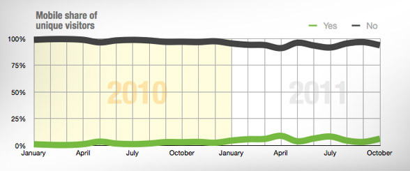
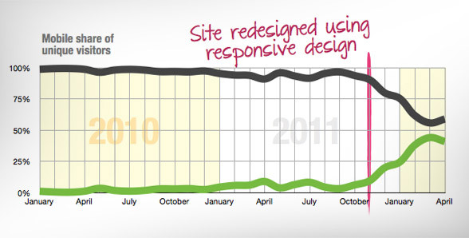

Essa história é muito boa. É do [Baekdal](http://www.baekdal.com/insights/the-mobile-shift-is-already-here/), um blog sobre tecnologia que já existe há alguns anos.

  

O autor conta que muito se tem lido sobre as pessoas usaram celulares cada vez mais para navegar na web. Que em 1 ano o acesso por celular vai ultrapassar o acesso por desktop. E que sites como Facebook e Twitter já têm mais de 50% de acessos feitos pelo celular.

  

  

Mas olhando para as estatísticas de seu próprio site, ele percebeu que as visitas por celular ficavam na casa dos 4% dos usuários, apenas.

  

No final de 2011, Baekdal fez algumas mudanças em seu site e o transformou em um site [Responsive](http://arquiteturadeinformacao.com/2011/12/13/o-que-e-responsive-web-design/). A partir daquele mês, o conteúdo do site passou a se adaptar automaticamente para o usuário de celular, para o usuário de tablet e para o usuário de desktop.

  

Seis meses depois, ele olhou novamente para as estatísticas de acesso mobile:

  

  

Isso fez Baekdal tirar algumas conclusões.

  

Uma delas é o título deste post.

  
> You are not going to get any mobile traffic until you start embracing what it means to be mobile.

  

E as outras eu resumi aqui:

  

A gente costumava dividir os usuários em “modos” de consumo de conteúdo. Um era o modo “inclinado para a frente”, nos computadores desktop do trabalho e de casa. Outro era o “inclinado para trás”, em frente à TV ou lendo uma revista. Hoje temos o modo “inclinado para qualquer direção”. Nós assistimos TV enquanto usamos o telefone ou o tablet. Preparamos o jantar na cozinha enquanto assistimos a um seriado no iPad. E checando o Facebook de 15 em 15 minutos no celular.

  

Nós não estamos mais divididos em “modos”. Nós nos tornamos “mobile”, o tempo todo.

  

Em 2011, o motivo pelo qual as marcas e os veículos não viam o acesso por celular disparando era simplesmente porque eles, eles próprios, não estavam fazendo mobile do jeito certo. As pessoas já tinham mudado; as marcas e veículos é que não tinham.

  

Muitas marcas ainda escolhem a posição do “vou esperar pra ver”. E alguns veículos tentam “fazer mobile” com os aplicativos. Mas eles não percebem que os aplicativos ainda exigem que as pessoas entrem em “modos”. Não é tudo que acontece num celular que é verdadeiramente móvel.

  
[[anexo ausente]](http://feeds.wordpress.com/1.0/gocomments/julianaconstantino.wordpress.com/4613/) [[anexo ausente]](http://feeds.wordpress.com/1.0/godelicious/julianaconstantino.wordpress.com/4613/)  [[anexo ausente]](http://feeds.wordpress.com/1.0/gotwitter/julianaconstantino.wordpress.com/4613/) [[anexo ausente]](http://feeds.wordpress.com/1.0/gostumble/julianaconstantino.wordpress.com/4613/) [[anexo ausente]](http://feeds.wordpress.com/1.0/godigg/julianaconstantino.wordpress.com/4613/) [[anexo ausente]](http://feeds.wordpress.com/1.0/goreddit/julianaconstantino.wordpress.com/4613/)   
  
  
  
from Arquitetura de Informação <http://arquiteturadeinformacao.com/2012/07/09/voce-nao-vai-ter-audiencia-mobile-enquanto-voce-nao-incorporar-de-verdade-o-que-significa-ser-mobile/>
