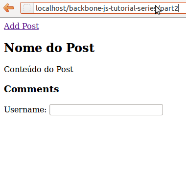

  

O Backbone.js é um framework Javascript que fornece componentes para melhorar a estrutura de aplicações web. Dentre os componentes, encontra-se a View, responsável pela apresentação de dados em uma aplicação MVC. Neste segundo artigo da série, apresentarei a classe Backbone.View, com exemplos práticos, utilização de templates e integração com jQuery.

  

#### Introdução

  

No [primeiro artigo](http://imasters.com.br/artigo/24577/javascript/serie-backbonejs-parte-01-introducao), apresentei o framework Backbone.js, seus principais conceitos e aspectos e fiz uma introdução rápida, através de um “Hello World”. De agora em diante serão apresentados individualmente os componentes do Backbone.js.

  

#### Backbone.View

  

A classe Backbone.View tem a responsabilidade de apresentar dados e elementos visuais aos usuários da aplicação. Ela representa a camada View, conforme o padrão arquitetural Model-View-Controller (MVC). Existe muita discussão sobre o Backbone aplicar corretamente o MVC, e segundo a [documentação oficial](http://backbonejs.org/#FAQ-mvc), os componentes podem, sim, estar ligados ao padrão MVC aplicado - por exemplo, no Ruby on Rails.

  

Sua utilização pode ser simples, conforme apresentado no artigo anterior:

  

```
 var HelloView = Backbone.View.extend({  
     el: $('body'),  
     initialize: function() {  
         this.render();  
     },  
     render: function() {  
         $(this.el).append("</pre>  
         <h1>Hello World</h1>  
         <pre>");  
     }  
 });
```

  

A primeira coisa a se destacar sobre a classe Backbone.View é que ela é responsável pela apresentação de um Model, contendo a lógica de renderização do mesmo. Mais detalhes sobre isso serão abordados no próximo artigo.

  

No código apresentado, pode-se notar a presença do atributo el, que representa um elemento DOM onde a View está ou será inserida. O el pode ser construído manualmente, como apresentado, ou pode ser construído baseando-se em outros atributos configurados na classe (explicados a seguir). O último ponto a se notar neste código é a presença do método initialize(), que funciona como um construtor para uma classe do framework Backbone.

  

Para os exemplos a seguir, será considerado o desenvolvimento de um simples blog. A principal premissa de um blog é que o mesmo é composto por diversas postagens. Seguindo essa premissa, nota-se a presença de uma View para apresentar o conteúdo de um post. O código para essa View pode ser escrito da seguinte forma:

  

```
 var PostView = Backbone.View.extend({  
     tagName: 'article',  
     className: 'page-posts',  
 });
```

  

Para o exemplo, foi considerada a tag <article>, introduzida na especificação do HTML5, que traz semântica ao blog, já que uma postagem, em alguns casos, pode ser um artigo. De acordo com os parâmetros da classe apresentada, o elemento HTML final ficará similar à <article class="page-posts">. Para construção deste elemento HTML, a classe Backbone.View utilizará os seguintes atributos como base:

  

tagName – Nome da tag HTML do elemento que conterá a View;

  

id – Atributo identificador da View atual;

  

className – Classe CSS que estilizará a View;

  

attributes – Demais atributos HTML que serão inseridos no elemento.

A próxima etapa ao se definir uma View é implementar seu método render(). Esse método é responsável por renderizar a View através dos dados do Model e atualizar o atributo el, preenchendo-o com o HTML necessário para apresentação. Por padrão, o método render() existe na classe Backbone.View, porém não contém nenhuma implementação. Para que a nova classe PostView renderize um post, o seguinte código pode ser utilizado:

  

```
 render: function() {  
     var htmlGenerated = "<h2>Nome do Post</h2>";  
     htmlGenerated += "<p>Conteudo do post</p>";  
     $(this.el).html(htmlGenerated);  
 }
```

  

Para ver o resultado do método render(), é necessário instanciar a classe PostView, executar o método render() e verificar o conteúdo do atributo el. Nesse exemplo, o atributo el é apresentado no console Javascript do browser:

  

```
 var postView = new PostView();  
 postView.render();  
 console.log(postView.el);
```

  

Ao verificar o console, o seguinte resultado será apresentado:

  

```
 <article class="page-posts">  
     <h2>Nome do Post</h2>  
     <p>Conteudo do post</p>  
 </article>
```

  

Esse exemplo utilizou o método $(this.el) padrão da jQuery, o que deixa o código dependente da biblioteca. Para diminuir este acoplamento, a classe Backbone.View possui o atributo $el. Esse atributo é construído automaticamente pelo Backbone, ao detectar a presença do framework jQuery ou Zepto, e é uma instância em cache para o $(this.el). É uma boa prática utilizar esse atributo. Modificando, então, o método render(), para utilizar o atributo $el, o código ficará da seguinte forma:

  

```
 render: function() {  
     var htmlGenerated = "<h2>Nome do Post</h2>";  
     htmlGenerated += "<p>Conteudo do post</p>";  
     this.$el.html(htmlGenerated);  
 }
```

  

O código funciona da mesma maneira, dando baixo acoplamento à biblioteca de terceiro utilizada na aplicação. A classe Backbone.View fornece alguns outros métodos comuns para uma View, como, por exemplo, o método remove() e o método make(). O primeiro irá remover a View do DOM da página, e é equivalente ao método $(view.el).remove() da jQuery. O exemplo abaixo demonstra a utilização deste método:

  

```
 // Remove a View  
 postView.remove();
```

  

O segundo método, o make(), irá criar um novo elemento DOM, de acordo com os atributos informados, e retorná-lo. Este método é utilizado para criar internamente o atributo el padrão da Backbone.View.

  

```
 var list = postView.make("ul", {"class": "list"}, "<li>A list</li>");  
 $('body').append(list);
```

  

#### Templates

  

Existem diversos mecanismos de templates que podem ser utilizados junto com a classe Backbone.View, como o [Mustache.js](http://mustache.github.com/), e [Underscore.js](http://underscorejs.org/), entre outros. Como demonstrado nos exemplos anteriores, é possível construir o HTML como strings. Outra alternativa seria construir os elementos visuais através do método document.createElement. Porém, utilizar templates é uma alternativa melhor, principalmente ao integrar Backbone.View com a classe Backbone.Model, que será apresentada no próximo artigo. Para os exemplos abaixo, utilizei o mecanismo de template da biblioteca Underscore.js.

  

Para definir um template na classe PostView, o atributo template é adicionado, em conjunto com o método \_.template(), que é o mecanismo de template da Underscore.js:

  

```
 var PostView = Backbone.View.extend({  
     tagName: 'article',  
     className: 'page-posts',  
     template: _.template("<h2><%= title %></h2><p><%= content %></p>"),  
     render: function() {  
         this.$el.html(this.template({title: "Nome do Post", content: "Conteudo do Post"}));  
     }  
 });  
 var postView = new PostView();  
 postView.render();  
 console.log(postView.el);
```

  

Esse código apresenta a notação especial de template “<%= %>”, que será interpretada pela Underscore.js em conjunto com a Backbone.View e substituirá os identificadores por atributos equivalentes no objeto sendo renderizado. Nesse exemplo, o objeto contém os atributos title e content, encontrados também no template, e renderizados na execução do método render(). Esse código se torna ainda mais prático ao se utilizar a classe Backbone.Model, que será apresentada no próximo artigo.

  

#### Eventos

  

É comum que uma View possua diversos eventos para interagir com o usuário, permitindo, por exemplo, uma busca AJAX no evento “blur” de um campo de texto ou algum processamento no evento “click” de um botão. O Backbone possui suporte a eventos na classe Backbone.View e utiliza internamente a função delegate() da jQuery. Para definir eventos na View, utiliza-se o atributo events, que é um hash contendo os possíveis eventos da View em questão. Os eventos são definidos no formato {“seletor do evento”: “callback”}, onde callback pode ser o nome de um método definido na classe View, ou em uma função concreta. O código abaixo adiciona três eventos à classe PostView:

  

```
 events: {  
     "dblclick" : "fullScreen",  
     "click #add-button" : "newPost",  
     "blur #username" : "searchUsername"  
 },  
 newPost: function() {  
     window.alert("Adicionar novo post");  
 },  
   
 searchUsername: function(e) {  
     window.alert("Searching username " + e.target.value);  
 },  
   
 fullScreen: function() {  
     window.alert("Post full screen");  
 }
```

  

No primeiro evento é tratado o clique duplo na área inteira de uma postagem, para abri-la em tela. O segundo evento trata a ação de clicar no botão "Adicionar Novo Post". E o terceiro evento simula a execução de uma busca na lista de usuários do blog, no evento "blur" do input de nome de usuário. Ao se definir um evento sem um seletor específico, como no caso do "dblclick", o mesmo é atribuído ao elemento HTML gerado por ele.

  

A atribuição desses eventos é feita pelo método delegateEvents(), da classe Backbone.View, que executa internamente a função delegate() da jQuery. Esse método é chamado ao se construir uma instância da View, garantindo que os eventos sempre estarão aplicados no decorrer da execução da View, a menos que seja implementado o contrário. O método delegateEvents() pode ser utilizado para modificar os eventos em tempo de execução e aceita como parâmetro uma hash similar a definida no atributo events. Para remover os eventos definidos na View, o método undelegateEvents() é utilizado. Internamente ele utiliza a função undelegate() da jQuery.

  

A última etapa para testar a delegação de eventos é adicionar a renderização à página HTML. O código a seguir pode ser utilizado:

  

```
 var postView = new PostView();  
 postView.render();  
 $('body').append(postView.el);
```

  

A página renderizada é apresentada na imagem a seguir:

  



  

#### Código-fonte

  

O código final criado no artigo é apresentado a seguir. Primeiro o código Javascript, que é definido no arquivo PostView.js:

  

```
 var PostView = Backbone.View.extend({  
     tagName: 'article',  
     className: 'page-posts',  
     template: _.template('<a href="#" id="add-button">Add Post</a><h2><%= title %></h2><p><%= content %></p><h3>Comments</h3><label>Username: <input id="username" type="text" /></label>'),  
     events: {  
         "dblclick" : "fullScreen",  
         "click #add-button" : "newPost",  
         "blur #username" : "searchUsername"  
     },  
     render: function() {  
         this.$el.html(this.template({title: "Nome do Post", content: "Conteúdo do Post"}));  
     },  
   
     newPost: function() {  
         window.alert("Adicionar novo post");  
     },  
   
     searchUsername: function(e) {  
         window.alert("Searching username " + e.target.value);  
     },  
   
     fullScreen: function() {  
         window.alert("Post full screen");  
     }  
 });
```

  

Por último, o código do arquivo index.html:

  

```
 <!doctype html>  
 <html>  
     <head>  
         <title>Backbone Tutorial Series Part 2 - View</title>  
         <meta charset="UTF-8" />  
         <script src="../lib/jquery-min.js"></script>  
         <script src="../lib/underscore-min.js"></script>  
         <script src="../lib/backbone-min.js"></script>  
         <script src="PostView.js"></script>  
         <script>  
             $(document).ready(function() {  
                 var postView = new PostView();  
                 postView.render();  
                 $('body').append(postView.el);  
             });  
         </script>  
     </head>  
     <body>  
     </body>  
 </html>
```

  

O código-fonte de todos os artigos desta série sobre Backbone.js encontram-se, também, no meu repositório do [GitHub](https://github.com/fernandomantoan/backbone-tutorial-series).

  

#### Referências

  

Para a construção deste artigo, a [documentação do Backbone.js](http://backbonejs.org/#View) foi utilizada, em conjunto com alguns vídeos do [curso de Backbone.js da CodeSchool](http://www.codeschool.com/courses/anatomy-of-backbonejs).

  

No próximo artigo, será apresentado o Model, que no Backbone é o responsável por representar dados de uma aplicação, conter regras de negócio e define aspectos de persistência (endpoint para gravação, exclusão, entre outros).

  
[anexo ausente]  
  

[](http://share.feedsportal.com/viral/sendEmail.cfm?lang=pt&amp;title=S%C3%A9rie+Backbone.js%3A+Parte+02+-+View&amp;link=http%3A%2F%2Fimasters.com.br%2Fartigo%2F25066%2Fjavascript%2Fserie-backbonejs-parte-02-view)

  

[](http://res.feedsportal.com/viral/bookmark_pt.cfm?title=S%C3%A9rie+Backbone.js%3A+Parte+02+-+View&amp;link=http%3A%2F%2Fimasters.com.br%2Fartigo%2F25066%2Fjavascript%2Fserie-backbonejs-parte-02-view)

  
  
  
[[anexo ausente]](http://da.feedsportal.com/r/139262551830/u/49/f/546640/c/33212/s/21b3bd64/a2.htm) [anexo ausente]  
  
[anexo ausente]  
  
  
  
from iMasters - <http://feedproxy.google.com/~r/imasters/~3/WJiCjtfAoJ4/story01.htm>
