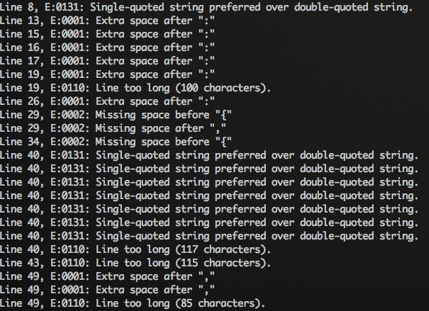
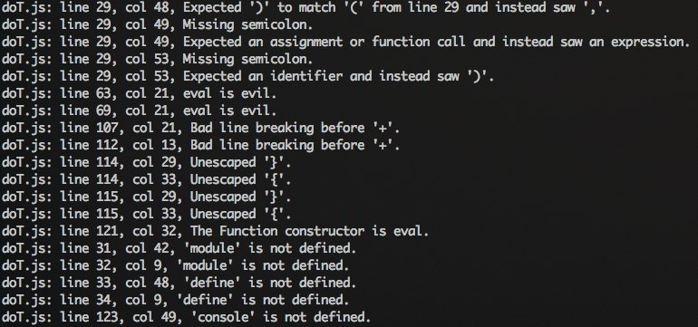
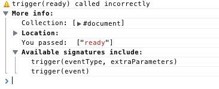

[[anexo ausente]](http://feedads.g.doubleclick.net/~a/09d1Ro91XHheHw8kH2TcpSkV4zA/0/da)  
[[anexo ausente]](http://feedads.g.doubleclick.net/~a/09d1Ro91XHheHw8kH2TcpSkV4zA/1/da)

  

Enquanto [testes automatizados](http://tableless.com.br/testando-seu-codigo-jquery-com-jasmine-parte-1/) asseguram o funcionamento de suas aplicações e, portanto, também a qualidade, algumas ferramentas atuam em outra área importante do seu código: a sintaxe.

  

Ferramentas de lint são scripts que interpretam seus arquivos javascript e buscam erros como varáveis não utilizadas, espaços em branco no final de linha, ausência de ponto-e-vírgula (um ponto polêmico) entre outros.

  

Abaixo você encontra alguns utilitários que buscam garantir melhor qualidade e padrão para seus códigos.

  

É importante ressaltar que esse tipo de ferramenta *não* garante que seu código está funcionando, que a lógica está correta, garante apenas a presença de boas práticas de desenvolvimento.

  

## JSLint

  

<http://www.jslint.com/>

  

Desenvolvida por ninguém menos do que Douglas Crockford, pai do famoso “The Good Parts”, esta ferramenta busca tanto erros de sintaxe, como erros estruturais.

  

As regras e convenções utilizadas na análise podem ser encontradas no site [javascript.crockford.com/code.html](http://javascript.crockford.com/code.html).

  

Você pode utilizar a [versão online da ferramenta](http://www.jslint.com/), ou então instalar o script através do gerenciador de pacotes do NodeJS (npm). O código-fonte está [disponível no GitHub](https://github.com/douglascrockford/JSLint).

  

  

## JSHint

  

<http://www.jshint.com/>

  

A ferramenta JSHint teve início como um *fork* da JSLint, visando uma maior flexibilidade, permitindo configurações de acordo com necessidades específicas.

  

A documentação do projeto inclui uma [página de opções disponíveis](http://www.jshint.com/options/) para essa personalização.

  

Assim como a JSLint, a JSHint pode [analisar seu código online](http://www.jshint.com/) ou pode ser instalada via NPM.

  

  

## Closure Linter

  

<https://developers.google.com/closure/utilities/>

  

Diferentemente das ferramentas anteriores, a Closure Linter obriga o uso do estilo JavaScript defendido pela Google. É utilizada em todos os projetos da empresa, incluindo Gmail, Docs e Reader.

  

Também diferentemente das anteriores, a Closure Linter vem acompanhada de um script para corrigir os erros encontrados. Ou seja, ela não apenas indica o que está errado, como também oferece uma maneira de “corrigir” seu código automaticamente.

  

Os utilitários podem ser baixados na [página do projeto no Google Code](https://developers.google.com/closure/utilities/). O script *gjslint* é o responsável pela análise de código enquanto o *fixjsstyle* corrige os erros encontrados.

  

  

## jQuery Lint

  

<http://james.padolsey.com/javascript/jquery-lint/>

  

Para finalizar, uma ferramenta para os fãs de jQuery que analisa a sintaxe e a estrutura. Ela funciona de forma diferente das demais: sua aplicação é feita na página, ou seja, o script deve ser chamado após o código da sua aplicação, A resposta é enviada para o console do navegador.

  

1  
2

  

<[script](http://december.com/html/4/element/script.html) src="aplicacao.js"></[script](http://december.com/html/4/element/script.html)>  
<[script](http://december.com/html/4/element/script.html) src="jquery.lint.js"></[script](http://december.com/html/4/element/script.html)>

  

É altamente configurável e pode ser adaptada para os padrões de desenvolvimento do seu projeto.

  

  

O código-fonte do projeto está disponível no GitHub: [github.com/padolsey/jQuery-Lint](https://github.com/padolsey/jQuery-Lint)

  

### Mais comentados

  

[Editores](http://tableless.com.br/editores/)

  

[Quer testar o Google Analytics?](http://tableless.com.br/quer-testar-o-google-analytics/)

  

[O Chrome não quer dizer muita coisa](http://tableless.com.br/chrome-nao-quer-dizer-muita-coisa/)

  

[Desenvolvedor analfabeto (sim, é sobre WYSIWYG)](http://tableless.com.br/desenvolvedor-analfabeto/)

  

[Não “otimize” seu código](http://tableless.com.br/nao-otimize-seu-codigo/)

[[anexo ausente]](http://feeds.feedburner.com/~ff/tableless?a=_0s0uzAJd9I:OCGcBqYc26k:yIl2AUoC8zA) [[anexo ausente]](http://feeds.feedburner.com/~ff/tableless?a=_0s0uzAJd9I:OCGcBqYc26k:D7DqB2pKExk) [[anexo ausente]](http://feeds.feedburner.com/~ff/tableless?a=_0s0uzAJd9I:OCGcBqYc26k:7Q72WNTAKBA) [[anexo ausente]](http://feeds.feedburner.com/~ff/tableless?a=_0s0uzAJd9I:OCGcBqYc26k:aKCwKftKxY0) [[anexo ausente]](http://feeds.feedburner.com/~ff/tableless?a=_0s0uzAJd9I:OCGcBqYc26k:dnMXMwOfBR0)  [[anexo ausente]](http://feeds.feedburner.com/~ff/tableless?a=_0s0uzAJd9I:OCGcBqYc26k:JEwB19i1-c4) [[anexo ausente]](http://feeds.feedburner.com/~ff/tableless?a=_0s0uzAJd9I:OCGcBqYc26k:wF9xT3WuBAs) [[anexo ausente]](http://feeds.feedburner.com/~ff/tableless?a=_0s0uzAJd9I:OCGcBqYc26k:V_sGLiPBpWU) 

  
[anexo ausente]  
  
  
  
from Tableless.com.br - Web Standards com Arroz e Feijão [http://tableless.com.br/assegurando-a-qualidade-do-seu-codigo-javascript/?utm\_source=feedburner&utm\_medium=feed&utm\_campaign=Feed%3A+tableless+%28Tableless%29](http://tableless.com.br/assegurando-a-qualidade-do-seu-codigo-javascript/?utm_source=feedburner&amp;utm_medium=feed&amp;utm_campaign=Feed%3A+tableless+%28Tableless%29)
