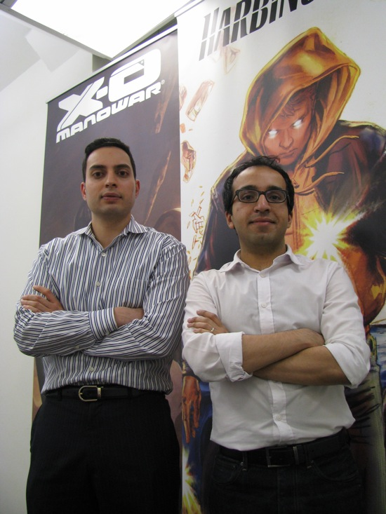
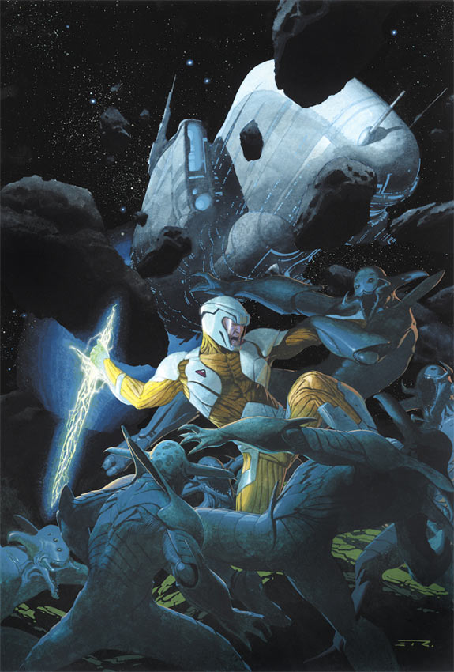
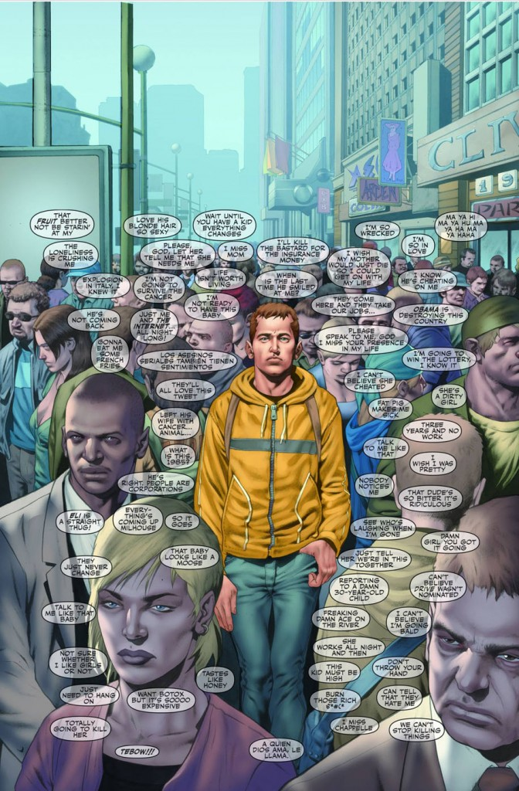

**Por Matheus Kiskissian**

  

O que você faria se sua editora preferida fechasse as portas e levasse com ela seus personagens favoritos? Choraria? Mudaria para a concorrência? Xingaria muito no Twitter?

  

  

Jason e Dinesh

  

A resposta dos dois amigos de infância **Jason** **Kothari** e **Dinesh** **Shamdasani** foi não se deixarem abalar, e desde 2005 entraram em uma longa batalha para adquirir a editora que marcara suas infâncias, a **Valiant** **Comics**.

  

Criada em 1989 por **Jim** **Shooter**, a Valiant se tornou rapidamente em uma gigante da indústria nos anos 1990 graças a um universo coeso, personagens complexos e tramas bem elaboradas. Chegando a competir pau a pau com Marvel, DC e Image, se tornando a 3ª maior editora de quadrinhos dos Estados Unidos com mais de 50 milhões de revistas vendidas.

  

Tão rápida quanto sua ascensão foi sua queda. Após ser adquirida pela produtora de videogames **Acclaim**, toda a sua linha editorial foi cancelada. E com a falência da Acclaim no começo dos anos 2000, o rico universo Valiant encontrou seu fim.

  

Após sete longos de batalhas judiciais, Kothari e Shamdasani finalmente conseguiram concretizar seu sonho de colocar com as próprias mãos a sua editora favorita de volta ao mercado. E para marcar a reestreia dessa outrora gigante, foram lançadas duas das séries mais emblemáticas da editora, **X-O** **Manowar** e **Harbinger** **cujos** primeiros arcos serão os alvos de nossa resenha.

  

  

X-O Manowar #1

  

**X-O** **Manowar** **#1** **e** **#2**

  

A maior dificuldade em reformular qualquer franquia é conseguir apresentar novamente conceitos já antigos sem que eles pareçam batidos para os antigos leitores e ainda consigam agradar a nova audiência. No caso da nova X-O Manowar, a equipe criativa tem plena consciência disso e consegue fazer uma introdução fenomenal para a história desse peculiar personagem.

  

**Aric** **de** **Dácia** é um líder para os Visigodos e sob seu comando seu povo consegue resistir bravamente aos ataques do Império Romano. O que já ia mal piora quando seu vilarejo é atacado por uma avançada raça alienígena e Daric e seus homens são abduzidos e feitos escravos em uma estranha “nave-jardim”.

  

Poucos roteiristas conseguiriam conduzir tão bem uma história com uma premissa tão estranha. **Robert** **Venditti** conduz uma narrativa excepcional, conseguindo em apenas duas edições nos apresentar a condição histórica e a personalidade do protagonista Aric. Sua jornada de líder bárbaro a escravo espacial a ser mais forte do Universo é empolgante e nos deixa com motivação suficiente para querer acompanhar o desenrolar da série.

  

A arte do ganhador do Eisner **Cary** **Nord** é bela e faz a proeza de conseguir retratar um cenário histórico, interagindo com a mais ousada ficção científica, além de trazer um clima *old-school* em seu traço que nos remete às clássicas histórias do Conan.

  

**Nota: 10/10**

  

  

Harbinger #1

  

**Harbinger #1 e #2: Omega Rising Part 1 & 2**

  

Esta seria aquela revista que teria tudo para dar errado, não fosse o bom planejamento editorial que vem sendo construído nessa nova Valiant. Harbinger foi uma história que marcou época nos anos 1990, provavelmente criando o gênero de “adolescente poderoso perseguido por corporações do mal” que vem sendo repetido *ad* *nauseam* pela indústria do entretenimento desde então.

  
  

Simplesmente repetir essa fórmula há muito já batida seria um erro mortal para uma editora que vem tentando reconquistar destaque no mercado.

  
  

A estratégia do roteiro então foi de se aproveitar da característica de histórias fortemente interligadas do Universo Valiant para reformular os personagens e o enredo e adicionar mais profundidade na trama.

  
  

O roteirista **Joshua** **Dysart** nos apresenta um protagonista com conflitos e defeitos, que tem consciência de seus imensos poderes psíquicos e não que cai nos clichês de querer conviver com eles.

  
  

O jovem **Peter** **Stanchek** abusa de seus poderes para manter sua fuga do estranho agente Tull e seu vício em drogas que reduz o incômodo que seus poderes psíquicos causam, deixando um rastro de mentes apagadas por seu caminho. O destino desse jovem problemático muda apenas quando encontra o misterioso (e poderoso) Toyo Harada, criador da **Fundação** **Harbinger**, destinada a apoiar jovens psiônicos a alcançar seu potencial. Uma clara referência aos X-Men cercada de mistérios, tendo em vista o papel de Harada na antiga série.

  
  

Outro recurso interessante do roteiro é começar as histórias com cenas que mostram o passado da Fundação Harbinger que ajudam a manter o interesse do leitor na trama.

  
  

A arte de **Khari** **Evans** apesar de um tanto irregular no geral, mostra todo seu potencial nas belas sequências de ação. Com detalhe para a bela batalha de Peter na segunda edição. Vale também uma menção honrosa à bela arte de **Lewis** **LaRosa** no prólogo da segunda edição, construindo uma linda cena que por si só já valeria o preço da revista.

  
  

**Nota: 9/10**

  
  

Veredito: Se você se interessa por quadrinhos, deveria correr atrás de conferir a nova Valiant. O bom planejamento editorial e a busca pela qualidade já se mostram como características marcantes desta nova velha editora. Com certeza os enredos interessantes e bem trabalhados irão chamar a sua atenção e te deixar com aquele gostinho de “quero-mais” para as próximas edições.

  

Pelo que vimos até agora, a Valiant já tem tudo para competir de igual com as principais editoras e reconquistar seu lugar de prestígio no mercado de quadrinhos.

  
  
  
from Terra Zero <http://www.terrazero.com.br/v2/2012/07/o-triunfante-retorno-da-valiant-comics/>
