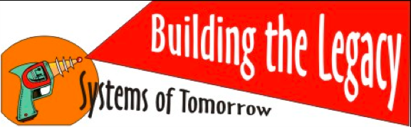
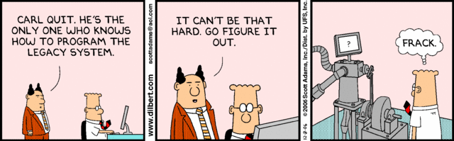
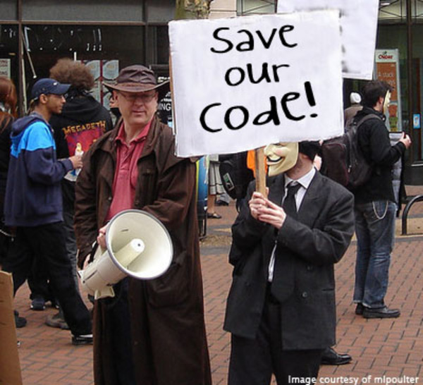

[AkitaOnRails.com](http://akitaonrails.com/)

- [Sobre](http://akitaonrails.com/pages/about)
- [Favoritos](http://akitaonrails.com/favorite)
- [Arquivos](http://akitaonrails.com/2012/08/15/off-topic-o-mito-do-legado#archives)
- [Feeds](http://akitaonrails.com/2012/08/15/off-topic-o-mito-do-legado#)
  - [Português](http://feeds.feedburner.com/AkitaOnRails)
  - [Inglês](http://feeds.feedburner.com/AkitaOnRailsEnglish)

15 Agosto 2012, 12:28 h

# [Off-Topic] O Mito do "Legado"

[Off-Topic](http://akitaonrails.com/Off-Topic) [agile](http://akitaonrails.com/agile) [Opinioes](http://akitaonrails.com/Opinioes)

Se existe uma história recorrente em qualquer desenvolvimento de software é o que eu chamo de "Mito do Legado". Se você é programador, já passou por isso: herdou código feito por outra pessoa ou outra equipe, vê que está tudo muito mal feito, e sua recomendação é jogar tudo fora e começar tudo de novo. Você tem certeza que esta é a única alternativa sadia e não fazer isso seria um enorme erro.

Esse comportamento é o que eu também chamo de "Histeria do Amador". E digo isso com total tranquilidade porque eu mesmo já tive momentos desse.

Antes de mais nada, vamos definir o que comumente é chamado de "Legado": basicamente todo código feito até ontem, especialmente se não foi você quem fez, é considerado um "Legado".

Mas o que a maioria dos programadores falha em entender é muito simples: com essa definição, qualquer código sempre se tornará automaticamente um "legado" no minuto seguinte em que ele é concluído: incluindo o seu próprio.

O jardim do vizinho sempre parece mais verde? Pois para programadores, o código do vizinho sempre parece pior. Quantas vezes já não ouvimos?

- *"Como assim levou tudo isso pra fazer esse código? Eu teria feito em menos tempo."*
- *"Como assim o código foi feito desse jeito tosco? Eu teria feito melhor."*

### Contexto, contexto, contexto

Por que determinado projeto demorou *"mais tempo do que eu acho que deveria?"* Dezenas de motivos: departamentos que não colaboraram, regras de negócio mal definidas que mudaram diversas vezes, e assim por diante.

Por que o código não está tão *"elegante"* ou *"bem feito"* como *"eu faria?"* Por que ele foi desenvolvido com um objetivo em mente, o objetivo mudou - como sempre muda -, o código foi se acumulando, prazos foram apertando, refatoramentos não aconteceram como deveriam, débito técnico foi se acumulando - a despeito do aviso dos programadores envolvidos - e o código atual acabou ficando muito pior do que deveria.

Outra coisa que deveria ser óbvia: todo programador sempre vai encontrar algo que não gosta em qualquer código, seja ele efetivamente ruim e mal feito ou mesmo bem feito e bem estruturado. Software é tão complexo que você pode achar defeito em qualquer coisa. É como apontar defeitos num ser humano: todos são imperfeitos. A falácia de quem escuta é entender que só porque alguém apontou alguns defeitos não significa automaticamente que *tudo* seja ruim. Isso é uma falácia comum: *"meu novo programador disse que achou esse defeito e essa outra coisa mal feita, portanto o sistema é ruim"* Só que você não apontou as qualidades e não analisou se os defeitos de fato são em maior volume, criticidade e severidade do que as qualidades. Mais do que isso: qualquer novo código também vai ter pontos que outro programador não vai gostar, e esse ciclo é infinito.

Agora a verdade: o programador que chegou depois e que questionou todos esses pontos, se estivesse exatamente no mesmo momento em que tudo começou teria entregue como resultado final o mesmo código ruim, ou até pior.

### O Medo

Agora o desafio é entender o seguinte: na maioria dos casos, código "Legado", ou seja, código que está em produção, em uso atualmente, está gerando resultados: coisa que seu código "novo e elegante" não está. Outro tipo de história que muitos programadores preferem ignorar é justamente o caso do *"Big Rewrite"* que nunca se concluiu e que nunca foi para o ar, especialmente se foi você quem fez.

O pior tipo de software é aquele que não gera valor. E um fator que diferencia um programador profissional de um amador é exatamente em como ele lida com código dos outros. Conversando ontem com o camarada [Rodrigo Yoshima](http://blog.aspercom.com.br/) ele soltou uma pérola: lidar com legado é para adultos, "greenfield" (projeto feito do zero) qualquer criança faz.

É preciso muito mais técnica, muito mais habilidade, muito mais capacidade, para pegar um legado e fazê-lo melhor, mesmo que em alguns casos seja necessário efetivamente refazer algumas partes, mas que isso não seja a primeira alternativa automática e sem justificativa. *"Porque eu faria melhor"* não é justificativa.

### O Ambiente

O processo que facilita equipes a gerar código ruim sempre é um dos problemas mais difíceis de resolver. Chefes, clientes que pedem *"mudanças urgentes de última hora"* é um dos sintomas. Departamentos com prioridades diferentes. Em ambientes como esse, qualquer novo software rapidamente será piorado até o ponto onde parecerá necessário refazer tudo de novo.

Não vou repetir tudo que as comunidades Ágeis já disseram até hoje, mas o "conserto" na maior parte das vezes não envolve apenas técnicas de programação, mas sim programadores que consigam ver além do código e entender como ajudar a consertar o ambiente ao seu redor. Isso inclui os colegas programadores ao redor, os chefes acima, as demandas vindas de departamentos ao redor e todo o feedback vindo do mercado no mundo exterior.

No mundo real, software é feito por pessoas para pessoas. Entender que pessoas não díficeis significa que o desafio para um profissional é muito maior do que seguir boas práticas ou ser especializado nesta ou naquela técnica. Um bom profissional sabe que apenas reclamar e ficar emburrado não leva a lugar algum.

### Oportunidades

Como sempre, histórias não são regras, mas servem para ilustrar um ponto. Anos atrás eu fui alocado sozinho num grande cliente que tinha um pequeno sistema "legado" extremamente mal feito. Uma alocação pontual. E eu posso dizer "mal feito" porque efetivamente ele não executava como devia, ou seja, era tecnicamente falho e devolvia muitos erros. Era exatamente o tipo de código que faria qualquer programador dizer, imediatamente, *"jogue isso fora e faça de novo!"*

Eu tinha 2 semanas para fazer alguma coisa. Outros já haviam tentado, o cliente já estava convencido a fazer um novo. Ninguém acharia ruim eu dizer que não dava pra fazer nada além de começar do zero. Era uma tentativa. E eu odeio dizer que não consigo resolver um problema.

Eles precisavam que o atual funcionasse minimamente. Eu era programador Java na época, o sistema era um dos piores ASPs que já tinha visto até então, misturado com diversos componentes DCOM que milagrosamente executavam de alguma forma.

Em 2 semanas eu entendi o que era a regra de negócio que se queria. Entendi porque o código não funcionava conforme essas regras. Entendi de onde vinham os dados que alimentavam, como eles eram tratados e armazenados, quais resultados eram esperados e como eu deveria interferir para conseguir implementar esse processamento.

Eu usei exatamente o mesmo código, fiz uma limpeza mínima de sanidade, retirei o que era desnecessário e inseri o mínimo necessário para atingir os objetivos esperados pelo cliente dentro do prazo que me foi estipulado.

Durante essas 2 semanas entendi mais sobre o processo, entendi mais sobre o cliente, entendi mais sobre o ambiente. Além de consertar o software consegui criar um bom relacionamento. Esse bom relacionamento, em poucos meses, me levou a voltar a trabalhar para esse cliente mas desta vez num projeto de 1 ano e meio com uma equipe de quase 10 pessoas, onde eu pude coordenar o desenvolvimento do meu jeito.

Nesse caso, estava claro que o código foi feito de má-fé por um programador que não sabia de verdade o que estava fazendo. Muitos softwares são mesmo feitos por programadores simplesmente ruins. Mas eu entendo que muitos casos também são bons programadores que tiveram que resolver um problema dentro de uma série de restrições que precisaram lidar.

Para mim, "legado" é software feito justamente por quem chama o software dos outros de "legado". Para mim, "legado" muitas vezes pode ser uma oportunidade - justamente porque poucos conseguem. E para mim, pessoas que julgam o código dos outros sem conhecimento do contexto todo, é só mais um amador querendo se mostrar.

Claro, isto não é uma defesa de que todo software legado é justificado e bom. De jeito nenhum, meu ponto neste artigo é focado ao comportamento automático de programadores que usam isso como desculpa.

### Comentários

Please enable JavaScript to view the <a href="http://disqus.com/?ref\_noscript=akitaonrails">comments powered by Disqus.</a>

#### Arquivos - selecione um ano e mês

- [2012](http://akitaonrails.com/2012/08/15/off-topic-o-mito-do-legado#2012)
- [2011](http://akitaonrails.com/2012/08/15/off-topic-o-mito-do-legado#2011)
- [2010](http://akitaonrails.com/2012/08/15/off-topic-o-mito-do-legado#2010)
- [2009](http://akitaonrails.com/2012/08/15/off-topic-o-mito-do-legado#2009)
- [2008](http://akitaonrails.com/2012/08/15/off-topic-o-mito-do-legado#2008)
- [2007](http://akitaonrails.com/2012/08/15/off-topic-o-mito-do-legado#2007)
- [2006](http://akitaonrails.com/2012/08/15/off-topic-o-mito-do-legado#2006)

[Jan **(0)**](http://akitaonrails.com/archives/2012/1?locale=pt-BR) [Fev **(2)**](http://akitaonrails.com/archives/2012/2?locale=pt-BR) [Mar **(0)**](http://akitaonrails.com/archives/2012/3?locale=pt-BR) [Abr **(4)**](http://akitaonrails.com/archives/2012/4?locale=pt-BR) [Mai **(3)**](http://akitaonrails.com/archives/2012/5?locale=pt-BR) [Jun **(2)**](http://akitaonrails.com/archives/2012/6?locale=pt-BR) [Jul **(14)**](http://akitaonrails.com/archives/2012/7?locale=pt-BR) [Ago **(3)**](http://akitaonrails.com/archives/2012/8?locale=pt-BR) [Set **(0)**](http://akitaonrails.com/archives/2012/9?locale=pt-BR) [Out **(0)**](http://akitaonrails.com/archives/2012/10?locale=pt-BR) [Nov **(0)**](http://akitaonrails.com/archives/2012/11?locale=pt-BR) [Dez **(0)**](http://akitaonrails.com/archives/2012/12?locale=pt-BR)

[Jan **(4)**](http://akitaonrails.com/archives/2011/1?locale=pt-BR) [Fev **(3)**](http://akitaonrails.com/archives/2011/2?locale=pt-BR) [Mar **(4)**](http://akitaonrails.com/archives/2011/3?locale=pt-BR) [Abr **(11)**](http://akitaonrails.com/archives/2011/4?locale=pt-BR) [Mai **(4)**](http://akitaonrails.com/archives/2011/5?locale=pt-BR) [Jun **(0)**](http://akitaonrails.com/archives/2011/6?locale=pt-BR) [Jul **(5)**](http://akitaonrails.com/archives/2011/7?locale=pt-BR) [Ago **(1)**](http://akitaonrails.com/archives/2011/8?locale=pt-BR) [Set **(5)**](http://akitaonrails.com/archives/2011/9?locale=pt-BR) [Out **(6)**](http://akitaonrails.com/archives/2011/10?locale=pt-BR) [Nov **(4)**](http://akitaonrails.com/archives/2011/11?locale=pt-BR) [Dez **(1)**](http://akitaonrails.com/archives/2011/12?locale=pt-BR)

[Jan **(14)**](http://akitaonrails.com/archives/2010/1?locale=pt-BR) [Fev **(6)**](http://akitaonrails.com/archives/2010/2?locale=pt-BR) [Mar **(9)**](http://akitaonrails.com/archives/2010/3?locale=pt-BR) [Abr **(14)**](http://akitaonrails.com/archives/2010/4?locale=pt-BR) [Mai **(8)**](http://akitaonrails.com/archives/2010/5?locale=pt-BR) [Jun **(16)**](http://akitaonrails.com/archives/2010/6?locale=pt-BR) [Jul **(14)**](http://akitaonrails.com/archives/2010/7?locale=pt-BR) [Ago **(6)**](http://akitaonrails.com/archives/2010/8?locale=pt-BR) [Set **(4)**](http://akitaonrails.com/archives/2010/9?locale=pt-BR) [Out **(10)**](http://akitaonrails.com/archives/2010/10?locale=pt-BR) [Nov **(2)**](http://akitaonrails.com/archives/2010/11?locale=pt-BR) [Dez **(9)**](http://akitaonrails.com/archives/2010/12?locale=pt-BR)

[Jan **(12)**](http://akitaonrails.com/archives/2009/1?locale=pt-BR) [Fev **(9)**](http://akitaonrails.com/archives/2009/2?locale=pt-BR) [Mar **(9)**](http://akitaonrails.com/archives/2009/3?locale=pt-BR) [Abr **(11)**](http://akitaonrails.com/archives/2009/4?locale=pt-BR) [Mai **(12)**](http://akitaonrails.com/archives/2009/5?locale=pt-BR) [Jun **(7)**](http://akitaonrails.com/archives/2009/6?locale=pt-BR) [Jul **(12)**](http://akitaonrails.com/archives/2009/7?locale=pt-BR) [Ago **(4)**](http://akitaonrails.com/archives/2009/8?locale=pt-BR) [Set **(19)**](http://akitaonrails.com/archives/2009/9?locale=pt-BR) [Out **(7)**](http://akitaonrails.com/archives/2009/10?locale=pt-BR) [Nov **(10)**](http://akitaonrails.com/archives/2009/11?locale=pt-BR) [Dez **(10)**](http://akitaonrails.com/archives/2009/12?locale=pt-BR)

[Jan **(31)**](http://akitaonrails.com/archives/2008/1?locale=pt-BR) [Fev **(32)**](http://akitaonrails.com/archives/2008/2?locale=pt-BR) [Mar **(12)**](http://akitaonrails.com/archives/2008/3?locale=pt-BR) [Abr **(27)**](http://akitaonrails.com/archives/2008/4?locale=pt-BR) [Mai **(26)**](http://akitaonrails.com/archives/2008/5?locale=pt-BR) [Jun **(21)**](http://akitaonrails.com/archives/2008/6?locale=pt-BR) [Jul **(13)**](http://akitaonrails.com/archives/2008/7?locale=pt-BR) [Ago **(25)**](http://akitaonrails.com/archives/2008/8?locale=pt-BR) [Set **(18)**](http://akitaonrails.com/archives/2008/9?locale=pt-BR) [Out **(15)**](http://akitaonrails.com/archives/2008/10?locale=pt-BR) [Nov **(20)**](http://akitaonrails.com/archives/2008/11?locale=pt-BR) [Dez **(14)**](http://akitaonrails.com/archives/2008/12?locale=pt-BR)

[Jan **(23)**](http://akitaonrails.com/archives/2007/1?locale=pt-BR) [Fev **(9)**](http://akitaonrails.com/archives/2007/2?locale=pt-BR) [Mar **(8)**](http://akitaonrails.com/archives/2007/3?locale=pt-BR) [Abr **(13)**](http://akitaonrails.com/archives/2007/4?locale=pt-BR) [Mai **(7)**](http://akitaonrails.com/archives/2007/5?locale=pt-BR) [Jun **(16)**](http://akitaonrails.com/archives/2007/6?locale=pt-BR) [Jul **(14)**](http://akitaonrails.com/archives/2007/7?locale=pt-BR) [Ago **(16)**](http://akitaonrails.com/archives/2007/8?locale=pt-BR) [Set **(28)**](http://akitaonrails.com/archives/2007/9?locale=pt-BR) [Out **(25)**](http://akitaonrails.com/archives/2007/10?locale=pt-BR) [Nov **(30)**](http://akitaonrails.com/archives/2007/11?locale=pt-BR) [Dez **(27)**](http://akitaonrails.com/archives/2007/12?locale=pt-BR)

[Jan **(0)**](http://akitaonrails.com/archives/2006/1?locale=pt-BR) [Fev **(0)**](http://akitaonrails.com/archives/2006/2?locale=pt-BR) [Mar **(0)**](http://akitaonrails.com/archives/2006/3?locale=pt-BR) [Abr **(0)**](http://akitaonrails.com/archives/2006/4?locale=pt-BR) [Mai **(0)**](http://akitaonrails.com/archives/2006/5?locale=pt-BR) [Jun **(0)**](http://akitaonrails.com/archives/2006/6?locale=pt-BR) [Jul **(0)**](http://akitaonrails.com/archives/2006/7?locale=pt-BR) [Ago **(0)**](http://akitaonrails.com/archives/2006/8?locale=pt-BR) [Set **(38)**](http://akitaonrails.com/archives/2006/9?locale=pt-BR) [Out **(15)**](http://akitaonrails.com/archives/2006/10?locale=pt-BR) [Nov **(17)**](http://akitaonrails.com/archives/2006/11?locale=pt-BR) [Dez **(17)**](http://akitaonrails.com/archives/2006/12?locale=pt-BR)

#### Empresa

- [Codeminer 42](http://www.codeminer42.com/)

#### Screencasts

- [Começando com Git](http://akitaonrails.com/2010/08/17/screencast-comecando-com-git)
- [Começando com Vim](http://akitaonrails.com/2010/07/19/screencast-comecando-com-vim)
- [Instalando um Ambiente Ruby](http://akitaonrails.com/2010/07/12/screencast-instalando-um-ambiente-ruby)
- [[Palestra] Entenda Software da Maneira Correta](http://akitaonrails.com/2010/07/01/screencast-entenda-software-da-maneira-correta)

#### Páginas

- [About Me](http://akitaonrails.com/pages/about)
- [Videos at Blip.tv](http://akitaonrails.blip.tv/)
- [Brazilian Rails Gallery](http://akitaonrails.com/2009/12/16/brazilian-ruby-on-rails-portfolio)
- [Exclusive Audio Interviews](http://akitaonrails.com/pages/audio-interviews)
- [Exclusive Interviews](http://akitaonrails.com/pages/interviews)
- [Tutorials](http://akitaonrails.com/dicas%20e%20tutoriais)

#### Conferências

- [RubyConf Brasil'12](http://akitaonrails.com/RubyConfBR2012)
- [RubyConf Brasil'11](http://akitaonrails.com/RubyConfBR2011)
- [RubyKaigi'11](http://akitaonrails.com/RubyKaigi2011)
- [RubyConf Brasil'10](http://akitaonrails.com/RubyConfBrasil2010)
- [RailsConf'10](http://akitaonrails.com/railsconf2010)
- [RailsConf'09](http://akitaonrails.com/railsconf2009)
- [RailsConf'08](http://akitaonrails.com/railsconf2008)
- [Rails Summit'09](http://akitaonrails.com/railssummit2009)
- [Rails Summit'08](http://akitaonrails.com/railssummit2008)

© 2006-2012 Fabio Akita. Todos os Direitos Reservados.

#### Mantenha contato:

