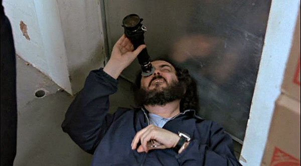
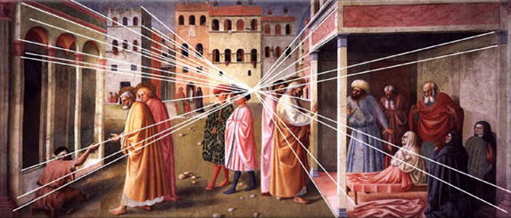
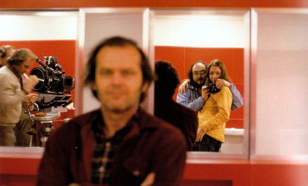

**Kubrick** (de longe, meu diretor predileto) fez 13 filmes em seus 46 anos de trabalho. O que é pouco se compararmos a outros diretores – **Spielberg**, por exemplo, dirigiu 51, produziu 133 e escreveu 21 títulos nos últimos 48 anos. E isso tem uma razão: Stanley era perfeccionista como poucos. Do tipo que levava atores, produtores e funcionários a completa exaustão. O próprio **Jack Nicholson** surtou com o diretor, depois de refazer um *take* centenas de vezes, dizendo:

  
> “Just because you’re a perfectionist doesn’t mean you’re perfect!”

  

E talvez o ponto principal desse cuidado minucioso fosse “apenas” a preocupação com o envolvimento do espectador. Pois ele não via a obra apenas como um artista, mas também como um psiquiatra. Kubrick sabia exatamente como entrar nas nossas mentes e causar desconforto, medo, aflição e excitação. Tanto pela atuação dos atores (como o próprio Jack, em **“O Iluminado”**), pela fotografia (como a luz natural de **“Barry Lyndon”**), pela trilha sonora (**“De Olhos Bem Fechados”**) ou pela visão imposta por suas lentes.

  
  
  
  

O vídeo acima (**One-Point Perspective**) mostra uma prática comum do diretor, centralizando o ponto de fuga da cena como em uma pintura renascentista. Primeiro por encarar seus filmes como pura arte. Mas principalmente por saber que essa é a melhor forma de nos puxar para dentro de suas construções.

  
  
  

Kubrick não se provou gênio por um ou outro filme. Na verdade, temo que nós ainda não entendemos tudo o que ele nos disse em sua obra. E é bem provável que achados como o *“One-Point Perspective”* surgirão durante as próximas décadas, quando nós, pobres mortais, perceberemos mais e mais detalhes (como a história do banheiro, que [já postei aqui](http://www.brainstorm9.com.br/21766/entretenimento/no-banheiro-com-stanley-kubrick/)) que esse mito deixou para nós.

  

Amém.

  

### Posts relacionados:

  

[GIFs animados dos clássicos de Stanley Kubrick](http://www.brainstorm9.com.br/26589/entretenimento/gifs-animado-dos-classicos-de-stanley-kubrick/)

  

[No banheiro com Stanley Kubrick](http://www.brainstorm9.com.br/21766/entretenimento/no-banheiro-com-stanley-kubrick/)

  

[O mundo através dos olhos de Stanley Kubrick](http://www.brainstorm9.com.br/2501/diversos/o-mundo-atraves-dos-olhos-de-stanley-kubrick/)

  

[Stanley, o piano interativo](http://www.brainstorm9.com.br/30803/tech/stanley-o-piano-interativo/)

  

[Little Orchestra: A embalagem musical da designer Elisabeth Kopf](http://www.brainstorm9.com.br/29987/design/little-orchestra-a-embalagem-musical-da-designer-elisabeth-kopf/)

  

 Post originalmente publicado no [Brainstorm #9](http://www.brainstorm9.com.br/)  
[Twitter](http://www.twitter.com/brains9) | [Facebook](http://www.facebook.com/brainstorm9) | [Contato](http://www.brainstorm9.com.br/contato/) | [Anuncie](http://www.brainstorm9.com.br/anuncie)

  
  
  
  

[[anexo ausente]](http://feeds.feedburner.com/~ff/brainstorm9?a=Scmsrc2yFZc:2QxiRQFyHLw:yIl2AUoC8zA) [[anexo ausente]](http://feeds.feedburner.com/~ff/brainstorm9?a=Scmsrc2yFZc:2QxiRQFyHLw:7Q72WNTAKBA)  [[anexo ausente]](http://feeds.feedburner.com/~ff/brainstorm9?a=Scmsrc2yFZc:2QxiRQFyHLw:V_sGLiPBpWU) [[anexo ausente]](http://feeds.feedburner.com/~ff/brainstorm9?a=Scmsrc2yFZc:2QxiRQFyHLw:I9og5sOYxJI) [[anexo ausente]](http://feeds.feedburner.com/~ff/brainstorm9?a=Scmsrc2yFZc:2QxiRQFyHLw:qj6IDK7rITs)

  
[anexo ausente]  
  
  
  
from Brainstorm #9 [http://www.brainstorm9.com.br/31346/entretenimento/o-ponto-de-fuga-de-stanley-kubrick/?utm\_source=feedburner&utm\_medium=feed&utm\_campaign=Feed%3A+brainstorm9+%28Brainstorm9%29](http://www.brainstorm9.com.br/31346/entretenimento/o-ponto-de-fuga-de-stanley-kubrick/?utm_source=feedburner&amp;utm_medium=feed&amp;utm_campaign=Feed%3A+brainstorm9+%28Brainstorm9%29)
