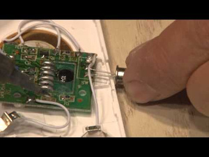
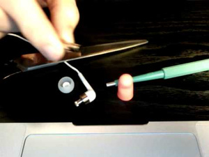
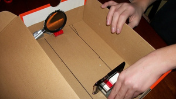
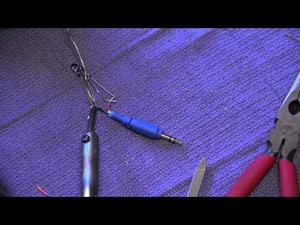
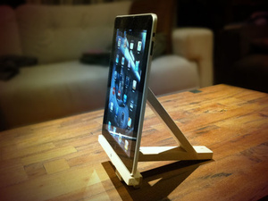
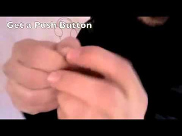
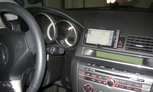
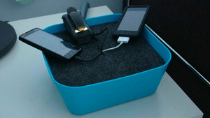
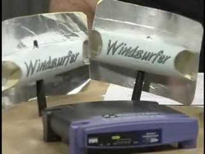

# Top 10 DIY Projects That Cost Less Than $3

[anexo ausente] **Whitson Gordon**

 Why pay tons of money for something when you can make it yourself for pennies on the dollar? Here are some of our favorite life hacking DIY projects that'll run you less than the cost of a latte.

### 10. Keep Thieves at Bay With a Motion-Activated Burglar Alarm

**Cost**: $2

You can do [a lot of things](http://lifehacker.com/5924084/protect-your-stuff-from-loss-and-theft-this-weekend) to keep your expensive gadgets and other possessions safe from theft, but sometimes a simple alarm is all you need. [This DIY motion alarm](http://lifehacker.com/5932698/protect-anything-from-theft-with-this-2-diy-motion-alarm) will let you know when a nearby thief is trying to grab your bike, your backpack, or whatever else you've set down for a moment, and all it takes is a little electronics hacking—and maybe a trip to the dollar store.

### 9. Rock Out Comfortably with a Pair of Noise-Isolating Earbuds

**Cost**: <$1

Earbuds are great for travel, but a lot of them are horrible at staying in your ear. Without that seal, you'll never get the best sound, and you'll always be fiddling to get them to stay in. Instead of doing that, you can grab a pair of basic foam earplugs—which cost less than a dollar—and use them to turn your earbuds into a [much more comfortable, noise-isolating set](http://lifehacker.com/5347245/make-comfortable-noise+isolating-earbuds-for-less-than-a-dollar) . Of course, if you're willing to spend a bit more, you could always [make your own custom-molded pair](http://lifehacker.com/5787610/diy-custom+molded-in+ear-headphones) , too.

### 8. Watch Videos on Your Wall with a Smartphone Projector

[Full size](http://img.gawkerassets.com/img/17wzma6qh6id8jpg/original.jpg)

**Cost**: $1

Gathering around your smartphone to watch funny videos is no fun, so why not [project that video onto your wall](http://lifehacker.com/5863761/build-a-smartphone-projector-for-around-a-dollar) ? All you need is a shoebox, a magnifying glass, and a few LEGO bricks—mostly stuff you already have lying around. It isn't going to give you theater-quality picture, but for showing off your new favorite cat video, it'll certainly do more than fine. Of course, the $1 price tag assumes you already have a smartphone to use it with—otherwise it's a $201 smartphone projector.

### 7. Control Your Camera from Afar with a Remote Shutter

**Cost**: $3

If you want to take pictures from afar, take a self-portrait, or just snap a few shots without shaking your camera, a remote control can be invaluable. But you don't need to go shell out for a pre-made one. In fact, for about $3, you can buy an old hands-free headset for cellphones and [turn it into a shutter trigger](http://lifehacker.com/358845/diy-remote-camera-trigger) for nearly any digital camera. However, if you want to do it wirelessly, you can [create an infrared trigger](http://lifehacker.com/5785557/make-a-diy-infrared-trigger-to-control-your-dslr-with-your-iphone) for about $2, as seen in the video to the right. However, you'll need a $5 iPhone app to control it (or an infrared remote, if you have one). Check out our [guide to remote controlling your digital camera](http://lifehacker.com/5898247/how-to-remotely-control-your-digital-camera-to-take-better-photos-create-awesome-timelapse-videos-and-more) for more ideas.

### 6. Protect Your Phone's Screen with a Scratch-Resistant Protector

[Full size](http://img.gawkerassets.com/img/17wzmuqn3ry1qjpg/original.jpg)

**Cost**: 5¢

While most people [don't think screen protectors are necessary anymore](http://lifehacker.com/5881290/are-screen-protectors-necessary-anymore) , even [damage-resistant screens can get scratched](http://lifehacker.com/5937324/your-keys-arent-scratching-your-smartphone-its-the-sand-in-your-pocket) —particularly by that sand floating around in your pocket. If you want to keep your screen protected (which is a good idea if you plan on re-selling it), you can [make your own vinyl screen protector for less than a nickel](http://lifehacker.com/5667841/make-your-own-screen-protector-for-less-than-a-nickel) . You just need to cut it to fit the shape of your screen and stick it on for scratch-free protection.

### 5. Prop Up Your Laptop, Smartphone, or Tablet

[Full size](http://img.gawkerassets.com/img/17ivqztt7qoorjpg/original.jpg)

**Cost**: $1-$3

Whether you're watching movies on your smartphone, using your tablet in the kitchen, or just trying to keep your laptop from overheating, a little DIY stand can go a long way. We've featured countless models over the years, but if you only have a few bucks to spend, we recommend checking out the [$1 smartphone plate stand](http://lifehacker.com/5756964/turn-a-1-plate-stand-into-a-universal-smartphone-stand) , the [$3 tablet wall mount](http://www.tumbleweedlabs.com/projects/three-dollar-ipad-wall-mount/) , the [$3 tablet stand](http://lifehacker.com/5719488/make-a-diy-ikea-ipad-stand-for-3) , the $3 tablet wall mount, the [$3 laptop stand](http://lifehacker.com/5898996/build-your-own-vertical-laptop-stand-for-3) , the [barbecue flipper laptop stand](http://lifehacker.com/5934775/keep-your-laptop-cool-and-elevated-with-a-3-barbecue-flipper) , and the [cardboard laptop stand](http://lifehacker.com/5885970/make-your-own-tangle+free-laptop-stand-with-a-cardboard-box-and-makedo-pins) . Some may be a bit jankier than others, but between all these choices you should be able to find something that suits your needs.

### 4. Add a Microphone and Remote to Any Pair of Headphones

**Cost**: $2

So you've finally decided to ditch Apple's crappy earbuds and [find the perfect pair of headphones](http://lifehacker.com/5800772/how-to-choose-the-perfect-pair-of-headphones) , but you miss the ability to make phone calls and control your music. Luckily, there's a DIY solution: with some cheap parts and a bit of soldering, you can [put together your own remote adapter](http://lifehacker.com/5904280/diy-headphone-adapter-adds-pause-play-and-a-microphone-to-any-smartphone-headphone-jack) that works with any pair of headphones. Of course, if you're willing to cut up your old remote-enabled headphones, you can [do it just as cheaply](http://lifehacker.com/5802821/add-an-inline-remote-control-to-your-favorite-headphones-without-ruining-them) with a bit of simple splicing.

### 3. Mount Your Smartphone in Your Car

**Cost**: $1

Nobody wants to go buy a $50 car mount for their phone, especially when it'll be obsolete as soon as you upgrade. Instead, you can [turn a binder clip into a cheap, effective, *universal car mount*](http://lifehacker.com/5747897/how-to-build-a-car-mount-for-your-cellphone-from-office-supplies) *for any smartphone or GPS device. All you need is a binder clip, some pliers, a rubber band, and some string. If you want to make it even better, we recommend using a hair tie in place of the rubber band, and [an old USB cable in place of the string](http://lifehacker.com/5930310/a-smarter-diy-smartphone-car-dock-a-fix-for-annoying-windows-shortcuts-and-os-x-wallpaper-tricks/gallery/1) . And, to see more $1 DIY miracles, check out [our top 10 binder clip projects](http://lifehacker.com/5927857/top-10-diy-miracles-you-can-accomplish-with-a-1-binder-clip) .*

### *2. Charge All Your Devices in One Place*

*[Full size](http://img.gawkerassets.com/img/17wzoq7hyc7gijpg/original.jpg)*

**

***Cost**: $1-$3*

*You probably have more than one gadget to charge during the day, and a DIY charging station is a great way to organize them. From the [dirt cheap outlet-mounted charging station](http://lifehacker.com/5308354/make-an-outlet+mounted-charge-station-from-a-shampoo-bottle) to a [DIY IKEA charging box](http://lifehacker.com/277771/ikea-charging-station) , you've no shortage of ways to get it done for cheap. [This more attractive station](http://lifehacker.com/5855145/make-an-affordable-good+looking-charging-station-for-less-than-10) comes with a $6 price tag, but could probably be easily done for less considering the bowl is only a dollar. If you are willing to spend a bit more, though, you could always go all out and [add a few switches to the side](http://lifehacker.com/303142/build-an-ikea-charging-station-with-switches) so your chargers don't continue to suck power out of your wall.*

### *1. Extend Your Wi-Fi's Range*

**

***Cost**: $1-$3*

*Wi-Fi signal got you down? [We've shared many ways to boost it](http://lifehacker.com/5931743/top-10-ways-to-boost-your-home-wi+fi) , but one of the cheapest ways is just to beef up that antenna. You can [do it with an aluminum can pretty easily](http://lifehacker.com/5839243/use-an-aluminum-can-as-a-wi+fi-extender) , or with a bit more effort, you could [cut out a tin foil parabola](http://lifehacker.com/296367/boost-your-wireless-signal-with-a-homemade-wifi-extender) as seen in the video to the right. If you're feeling a bit more adventurous, though, you can take [apart your router's antenna and boost it](http://lifehacker.com/324681/boost-your-wi+fi-antenna-for-less-than-a-dollar) with nothing but some copper wire, a drinking straw, a wood screw and a black marker.*

**Image remixed from [grmarc](http://www.shutterstock.com/pic.mhtml?id=100196561) (Shutterstock)*.*
