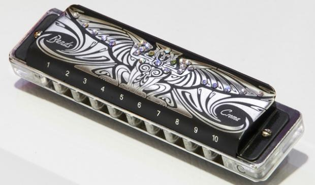

## Como comprar uma gaita para comer mulher

- 

por [Luciano Ribeiro](http://papodehomem.com.br/author/lucianoribeiro/ "Posts de Luciano Ribeiro")  
em 07/08/2012 às 17:20 | [Listas e guias](http://papodehomem.com.br/secoes/principal/listas/ "Ver todos os posts em Listas e guias"), [Mulheres](http://papodehomem.com.br/secoes/principal/mulheres-principal/ "Ver todos os posts em Mulheres"), [PdH Shots](http://papodehomem.com.br/secoes/pdh-shots/ "Ver todos os posts em PdH Shots")

- [**4 comentários**](http://papodehomem.com.br/como-comprar-uma-gaita-para-comer-mulher/#comments)

A gaita foi o meu primeiro instrumento. Não aquele que eu toquei pela primeira vez, mas sem dúvida, foi o primeiro com o qual me dei minimamente bem.

Na época, eu já tocava minha banda, o [Tranze](http://facebook.com/tranzeonline), na qual fui vocalista. E, quando se é vocalista, às vezes nós sentimos falta de fazer parte do instrumental com outra coisa que não a voz – talvez, seja por isso que hoje este posto raramente não seja dividido com uma guitarra ou outro instrumento nas mãos do músico.

Entre as opções mais comumente escolhidas, preferi a gaita, tanto pela paixão que nutro pelo blues de raiz e rock clássico, quanto pelo inegável interesse que as jovens donzelas manifestam quando ouvem uma.

*[Link Youtube](http://www.youtube.com/watch?v=nDXkd2NyCCE) | É só fazer igual, garotão.*

### Gaita diatônica ou cromática?

Você vai encontrar dois tipos de gaita: cromáticas e diatônicas. As duas são drasticamente diferentes entre si e geram efeitos bem diversos, tornando uma mais apropriada do que a outra para determinados fins. Depende do músico e da música.

De maneira grosseira, posso dizer que a [gaita cromática](http://www.izzomusical.com.br/public/files/produtos/7038/1.jpg) consegue acessar todas as notas da escala do piano, incluindo as teclas pretas (sustenidos e bemóis), o que faz com que seja possível tocar em qualquer tom com ela.

A diatônica, por sua vez, possui uma escala definida, feita para tocar em um tom específico. A sua principal vantagem é a possibilidade de executar várias técnicas de expressão, como os [*bends*](http://youtu.be/EzcebtpVsiI?t=38s).

A diatônica é assim

A gaita que *as mina pira* é a diatônica, já que é aquela popularmente usada no blues. Por isso, é dela que vou falar no resto do texto.

### Corpo de madeira, plástico ou alumínio?

Cada material tem inúmeras especificidades que eu simplesmente não tenho nem espaço para abordar aqui, por isso, falo de um modo bem grosseiro e superficial, para podermos ter em mente que isso existe.

O corpo de madeira proporciona um som mais envelhecido, o qual eu particularmente prefiro. Elas me remetem muito claramente ao [som *bluesy* dos anos 60](http://www.youtube.com/watch?v=XIbFJETrScI). Porém, têm a desvantagem de ter uma durabilidade um pouco inferior, pois a madeira está sujeita a empenar com mais facilidade, distorcendo a afinação e estando mais sujeita a acúmulo de fungos e bactérias em climas mais úmidos, tornando necessários alguns cuidados especiais.

Há inúmeros tipos de madeira e revestimentos, o que as faz mais ou menos sujeitas a essas desvantagens.

*[Link Youtube](http://www.youtube.com/watch?v=txjpgvfEYBI) | Som de gaita de madeira. Evite fazer o que ele faz em 3:35*

O corpo de alumínio e o plástico compartilham a vantagem de serem bem mais duráveis. Eu sinto que o corpo plástico tem uma característica sonora um pouco diferente, menos encorpado que o da madeira, mas ainda assim interessante. Nada que prejudique tanto o desempenho. O de alumínio gera um timbre com um volume bem elevado e um som mais, er… metálico.

### Qual afinação escolher?

As gaitas diatônicas vêm com uma escala pronta. O que quer dizer, basicamente, que são feitas para acompanhar músicas em determinados tons – ainda que seja possível adaptar a execução por meio de algumas técnicas. Geralmente, recomenda-se aos principiantes a escala de C (Dó), mas há várias outras, com diferentes ajustes. Seria bem difícil explicar o por que, então confie em mim, compre uma em C (Dó).

E, sim, se você não sabe o que é uma escala ou tom, vai precisar [estudar um pouquinho](http://www.ehow.com/how_5771_play-harmonica.html).

O fato da gaita ser um instrumento bastante simples não quer dizer que é desnecessário procurar um professor e aprender pelo menos um pouco de música. Eu mesmo não sou um expert em teoria musical, mas tive que dar algum upgrade no que já sabia para poder utilizá-la melhor.

### Por que um guia ensinando a comprar gaita?

É relativamente simples de se iniciar na gaita, ainda que tocá-la bem não seja tão fácil quanto normalmente ouço dizerem por aí. Mesmo assim, são grandes as chances de que dê alguma merda e você não consiga produzir som algum.

A gaita é um instrumento muito barato, mas comprar uma não é como comprar uma guitarra. Você não vai poder sair de loja em loja testando instrumentos até encontrar aquele que melhor se ajuste ao seu gosto. Talvez você acabe comprando várias até encontrar a melhor para a sua pegada, e isso é parte do processo.

Com a gaita perfeita em mãos, é a hora de começar a praticar e se divertir tocando. Depois que já tiver aprendido alguns truques, é só carregar a pequena no bolso e estar sempre preparado para colocar algum brilho nos olhos das moças pela noite. Mas lembre-se: não se pode tocar blues e ser feliz no amor.
