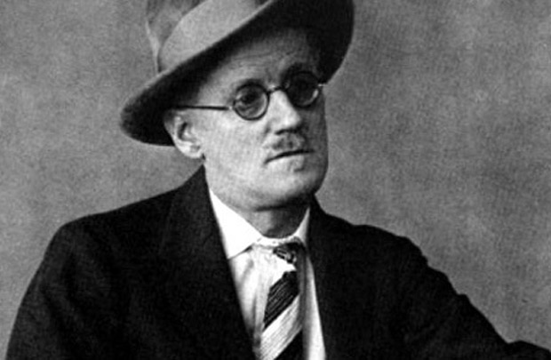

Duas semanas atrás estreei nessa coluna, e a crítica comum foi a de que eu escrevo complicado e uso um vocabulário difícil e empolado. Na verdade, esta crítica me acompanha desde a quinta série, quando li uma redação em aula e a professora, um tanto elogiosa, me convidou para explicar a terminologia para a turma. Foram dois os bullyings marcantes que levei em 1985: uma cuspida na cara por ser agnóstico (hoje sou ateu) e um rapaz que na ocasião dessa minha explanação da terminologia disse para a turma “ele não sabe viver, só pensa em livros e computadores”.  (*Get a life!* Como já dizia William Shatner.)

  

Não que a acusação de [prolixidade e grandiloquência](http://en.wikipedia.org/wiki/Verbosity) seja absurda, pelo contrário. O texto sempre pode ser melhorado, e a simplicidade é, no fim das contas, uma virtude verdadeira. Por outro lado, os filisteus existem e algumas vezes são capazes do ativismo. O episódio irônico de duas semanas atrás, [uma grande jogada publicitária de Paulo Coelho](http://www1.folha.uol.com.br/ilustrada/1131545-paulo-coelho-que-lanca-seu-22-romance-diz-que-ulysses-fez-mal-a-literatura.shtml), fez muita gente meditar sobre literatura e elitismo. Dois textos que recomendo são “[Paulo Coelho, James Joyce e a defesa dos monumentos como desejo de distinção](http://revistaforum.com.br/idelberavelar/2012/08/09/paulo-coelho-james-joyce-e-a-defesa-dos-monumentos-como-desejo-de-distincao/)“ e [o convite da folha a sete autores para que reduzissem Ulisses a um tuíte](http://www1.folha.uol.com.br/ilustrada/1138343-a-convite-da-folha-sete-autores-reduzem-ulysses-a-um-tuite.shtml).

  

  
  

De um lado, Paulo Coelho

  

Encontro-me numa posição boa para falar sobre esse assunto. Li ambos os autores (Joyce me tomou mais tempo de vida) e medito constantemente sobre o elitismo. Acho que Joyce também o fazia, já que, como aponta meio que pela metade Idelber Avelar, ele realmente sustenta essa indescritível mistura do prosaico, cotidiano, popular e até mesmo sujo com alta cultura, estilização refinadíssima e os labirínticos níveis de leitura de um ser que vive como que no texto, e que mantém até hoje uma sempre renovada indústria de estudiosos que previu e deliberadamente incentivou. É realmente um bicho esquisito esse Joyce, e também por isso tanta gente ainda o acha interessante.

  

De Paulo Coelho admiro muito a posição sobre pirataria (Joyce e posteriorme a família eram intratáveis com a questão dos direitos, até eles expirarem no ano passado), e creio que seu sucesso se deu por um texto agradável, histórias interessantes para seus leitores e a tentativa explícita de vincular a experiência do leitor a um tipo de crescimento pessoal pelo livro. O texto dele nunca me incomodou (muitos dizem se incomodar), mas é fato que esteticamente me parece pobre. Quando digo “pobre” quero dizer que é muito mais comum eu me encontrar em situações em que mencionar alguma referência a Joyce vai ser muito mais bem-vinda do que uma referência a Paulo Coelho – e se uma pessoa me diz que gosta de ler Paulo Coelho, bem, daí a conversa sobre livros e literatura provavelmente não será a que eu vou querer travar com essa pessoa. Não que haja algo de errado com isso. Mencionar Paulo Coelho não soa um bom preâmbulo para uma conversa que eu considere intelectualmente instigante, mas é só um auspício, nunca se sabe onde uma conversa vai desembocar. A experiência dita que quando a carta Paulo Coelho é jogada na mesa, não se deve esperar muito do interlocutor enquanto articulista de ideias fascinantes. **Nada mais do que isso.**

  

É provável que cada produtor intelectual se depare com a questão “devo tornar isso mais palatável à custa de minha integridade pessoal”, e daí a figura do “vendido” (*sell out*) ser tão comum na crítica de todo tipo de produção intelectual. É evidente que muita gente pensa em fazer de sua atividade artística um jeito de ganhar a vida, mas entre os dois extremos — de não comprometer nada em nome do gosto popular e simplesmente tentar agradar um “consumidor ideal” dessa produção –, ali, num ponto indistinto, está o nível certo de autenticidade e apelo. Talvez esse ponto não seja nem tão milionário quanto Paulo Coelho (Joyce enfrentou problemas financeiros a vida toda), nem tão artisticamente reconhecido como Joyce (que também escrevia por dinheiro e para ganhar a vida, e que contou com a generosidade de vários mecenas).

  

Quem não se comunica se trumbica? Não consegue patrocinador? Num mundo onde a comunicação permeia todo instante de nosso estado desperto, a questão não é mais obter uma massa de sinal de baixa qualidade, como um programa do Chacrinha. Creio que ainda há textos que atraem as pessoas por possuírem exatamente algumas chacretes e abacaxis, algumas miçangas brilhantes pelas quais podemos trocar nosso precioso e escasso tempo. Hoje talvez seja mais interessante criar a cumplicidade de um nicho: um grupo fiel que sabe o que esperar de você, em vez de almejar o mínimo denominador comum. É talvez uma circunstância dos meios atuais. De toda forma, ambos os extremos do popularesco que critica o erudito, e do erudito que fagocita o popularesco não parecem opções verdadeiras. O produtor cultural apenas cuidadosamente sintoniza aquilo que ele consegue comunicar efetivamente e de forma autêntica, e isso talvez exija comprometimento tanto da comunicação quanto da autenticidade: bem sucedido quando nenhuma delas se perde totalmente.

  

E por que nessa frase de Paulo Coelho (de quem eu não tenho motivo para duvidar da autenticidade, ainda que uma autenticidade banal) temos um tom de marqueteiro, talvez um marqueteiro louvável em sua esperteza? Porque ele se colocou onde ninguém o colocaria: em contraste com James Joyce. (Até eu estou falando nisso. Mencionei Paulo Coelho num texto. É quase como se eu tivesse um voto de não fazê-lo!) A literatura (vou evitar pôr as aspas) dele é confessamente utilitária, simples, massificada. Utilitária porque as pessoas que o leem querem lições de vida suficientemente pré-mastigadas; ainda que tenha aparentemente trocado a coisa do mago pelo mais usual escritor/artista, é isso que ele ainda vende: autoajuda embebida na ficção. É, na verdade, uma tradição literária de respeito: da Jane Austen, que prepara a moçoila para as peculiaridades do cortejo e do casamento e a vida em sociedade, ao [Bildungsroman](http://pt.wikipedia.org/wiki/Bildungsroman).

  

Muitas vezes, sim, a literatura é utilitária, deliberadamente ou não. Mas você quer ser reconhecido como um leitor de Paulo Coelho? Um leitor que o admira em particular? Quantos outros livros você leu? Qual é sua educação? O produto dele é bem sucedido, mas só porque Omo vende bem e limpa suas roupas, e você usa Omo, você acha interessante se identificar como um consumidor de Omo? Você, é claro, está ciente que uma pessoa preconceituosa como eu vai prejulgar você como alguém sem muito horizonte intelectual? Não que haja algo de errado com não ter vastos horizontes intelectuais…

  

E os elitismos são variados. Há quem viva da distinção entre minissérie e novela. Há quem critique o funk para ouvir música norte-americana de jeca. As mais iletradas pessoas muitas vezes conseguem desenvolver complexos de superioridade em torno de Twilight ou Harry Potter. Isso é indicativo de alguma coisa. Existe um [ethos](http://pt.wikipedia.org/wiki/Ethos) na nossa navegação cultural, seja qual for, ampla ou estreita, prosaica e das massas ou de impossível cultivo e gosto adquirido por esforço descomunal. O fato é que todos nós olhamos pelo menos algum elemento cultural de cima para baixo. Não adianta querer assumir uma igualdade forçada e artificial que serve apenas como modo educado de lidar com os outros. Em casa, o que gostamos e aquilo em que botamos energia é, naturalmente, o melhor.

  

  
  

De outro, James Joyce

  

O caso de Joyce tem realmente a ver com essa encruzilhada entre o pop/folclórico e a autoconsciência reflexiva da cultura enquanto coisa de gente culta. Joyce detalhadamente (obsessivamente) tratou sua oprimida e autorridicularizada Irlanda, e o cotidiano de pessoas irrelevantes (não heróis gregos) e seu xixi, cocô e punheta em meio a “grande arte” (se não Joyce, então o quê?) e um exercício virtuosístico de estilo. No caso, mais do que isso, não só um estilo, mas muitos estilos, como uma reflexão multiforme e em muitos níveis sobre a própria história da literatura desde Homero. Daí realmente é preciso louvar Paulo Coelho ao dizer que é apenas isso, reduzível a um tuíte. Que grande sacada!

  

Se num mundo ficcional eu inventasse um Paulo Coelho e um James Joyce, fazendo o primeiro dizer isso do segundo, ora… acho que superaria os dois, em quaisquer vertentes pragmáticas ou transcendentes de texto que porventura fizessem. E isso é realidade. Nós só podemos mesmo viver no melhor de todos os mundos possíveis. Jonathan Swift e Voltaire dançam ou arrancam os cabelos! São fortes emoções.

  

Leio [Finnegans Wake](http://pt.wikipedia.org/wiki/Finnicius_Rev%C3%A9m) desde 1997, não cheguei muito longe. [[Neste link, eu lendo trecho de FW.](http://soundcloud.com/padma-dorje/finnegans-wake-slices-read-by)] Não li nenhuma outra ficção de porte desde então. Uma vida não é suficiente para vislumbrar o que está naquelas páginas. Passei alguns anos (uns cinco) realmente certo de que era uma pegadinha de Joyce e que não havia conteúdo no livro (ao contrário de Paulo Coelho, nunca desconfiei que Ulysses fosse um mero exercício de estilo). Mas volto a ele vez após vez e segue me fascinando, me irritando, me fazendo rir e me comovendo. Se Ulysses pode ser resumido a um tuíte, Finnegans Wake não está nem mesmo dentro de si próprio. E por mais que eu possa dizer que a literatura não me é tão importante assim, que no fundo fora algumas citações espertinhas (do mesmo nível das do Sr. Coelho), não retirei nada de tão profundo ou importante para minha vida cotidiana, não consigo fugir do texto. (Li [O Alquimista](http://pt.wikipedia.org/wiki/O_Alquimista) em duas horas, para efeito de comparação. Eu não diria que é um livro ruim, mas eu provavelmente não lerei de novo.)

  

Então peço paciência com este colunista desajeitado, que não tem a habilidade de Paulo Coelho em escrever para as massas e de forma simples, de fazer frases sensacionais/sensacionalistas. Confesso ser muito mais fascinado por coisas absolutamente abstrusas como FW, que, também confesso, não entendo nada bem após todos estes anos. Faz parte da minha natureza gostar do que me exige como leitor. E também de desconfiar do que é popular e de fácil aceitação. Se sou um pseudão elitista? Se você depositar em mim o tempo que depositei em Joyce para fazer essa avaliação… é melhor nem começar.

  
  

## LEIA TAMBÉM...

  

1.   

   Rio e São Paulo, duas arrogantes

     

     

   Inside Out São Paulo: compartilhando humanidade

     

     

   As coisas que o rock me ensinou

[anexo ausente]  
  

Artigos Relacionados

  

[Os quatro estágios da competência em qualquer tarefa](http://rss.feedsportal.com/c/32911/f/530922/s/2299e7b0/l/0Lpapodehomem0N0Bbr0Cos0Equatro0Eestagios0Eda0Ecompetencia0Eem0Equalquer0Etarefa0C/story01.htm)

  

[Mão de mulher](http://rss.feedsportal.com/c/32911/f/530922/s/22a0b42f/l/0Lpapodehomem0N0Bbr0Cmao0Ede0Emulher0C/story01.htm)

  

[Ministério da saúde (não) adverte: tire a bunda da cadeira e faça qualquer coisa](http://rss.feedsportal.com/c/32911/f/530922/s/22a1dfeb/l/0Lpapodehomem0N0Bbr0Calerta0Esedentarismo0Efaz0Etao0Emal0Equanto0Ecigarro0C/story01.htm)

  

[Degustação e duas receitas inusitadas de drinks com whisky](http://rss.feedsportal.com/c/32911/f/530922/s/22a323df/l/0Lpapodehomem0N0Bbr0Cpare0Ecom0Eo0Epuritanismo0Ecom0Eo0Ewhisky0C/story01.htm)

  

[Triathlon | Regras do Jogo #1](http://rss.feedsportal.com/c/32911/f/530922/s/22a8d1a8/l/0Lpapodehomem0N0Bbr0Ctriathlon0Eregras0Edo0Ejogo0E10C/story01.htm)

  
  
  
[[anexo ausente]](http://da.feedsportal.com/r/139263499898/u/49/f/530922/c/32911/s/22aae552/a2.htm) [anexo ausente]  
  

[[anexo ausente]](http://feeds.feedburner.com/~ff/PapodehomemLifestyleMagazine?a=hRCJ8AEWXi8:oSnKJUtXr3o:yIl2AUoC8zA)  [[anexo ausente]](http://feeds.feedburner.com/~ff/PapodehomemLifestyleMagazine?a=hRCJ8AEWXi8:oSnKJUtXr3o:qj6IDK7rITs) [[anexo ausente]](http://feeds.feedburner.com/~ff/PapodehomemLifestyleMagazine?a=hRCJ8AEWXi8:oSnKJUtXr3o:-BTjWOF_DHI)

  
[anexo ausente]  
  
  
  
from Papo de Homem - Lifestyle Magazine <http://papodehomem.com.br/de-paulo-coelho-a-james-joyce-resumido-as-coisas-a-um-tuite-dr-wtf-2/>
