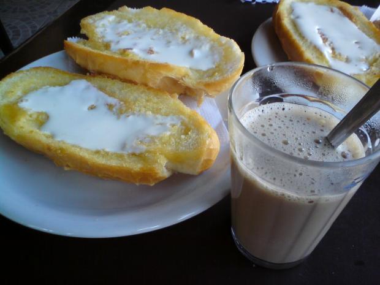
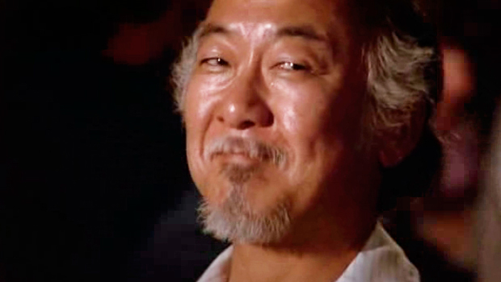
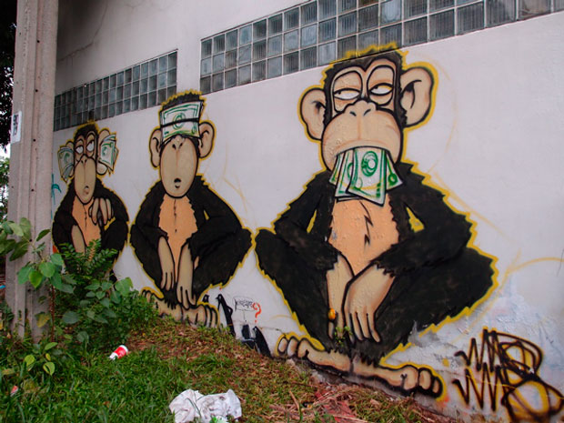

Saio de casa às 8 da manhã. Desço até o subsolo, abro a porta do carro, que me leva onde quero ir, mesmo eu não tendo a menor ideia de como um motor funciona. No caminho para o trabalho, paro na padaria. Como se fosse mágica, antes que eu tivesse que me preocupar em fazer uma massa de ovo e farinha, um pão com manteiga surge na minha frente.

  

  

Já tava assim quando eu cheguei

  

Saio da padaria e dirijo. No caminho, parado no farol, um rapaz limpa o vidro. Na empresa, encaro uma lista de problemas que não eram meus, mas que agora são. Dispenso, em função deles, uma atenção que poderia ser dada aos meus amigos, a minha família ou a qualquer hobbie que eu por acaso queira. A noite me encontro com alguns amigos em um bar. Levanto a mão e um garçom vem até mim. Digo o que quero e em poucos minutos tenho um belo prato na minha frente. Volto para casa, vejo um seriado. Na TV, pessoas bonitas fingem ser outras pessoas. Decoram falas, encenam e eu dou risada. Poucos minutos depois, durmo.

  

Este foi meu dia.

  

Foi como se eu tivesse um pó mágico no bolso. Um pó poderoso. Com ele, fiz com que um cara saísse de casa, assasse alguns pães, cortasse, passasse manteiga e me servisse. Mobilizei centenas de operários, para que juntassem parafusos e pedaços de metal em um fábrica abafada e construíssem um carro para mim. À noite, me fiz de rei e fui servido como tal. Era só levantar a mão. Por fim, pessoas encenavam fatos engraçados na minha frente, me faziam rir. Montes de energia movidos a meu favor.

  

Esse artefato mágico existe. Chama-se dinheiro.

  

### Propósito (queremos dinheiro, é isso?)

  

“Queremos vocês ocupando altos cargos gerenciais, que nos convidem para a inauguração das filiais das multinacionais que estão dirigindo, que se sintam pessoas completas, preenchidas e satisfeitas.”

  

Lembro da coordenadora do colégio em que estudei dizendo algo parecido com isso, tentando nos motivar para uma turbulenta maratona de vestibulares. Aquilo fazia muito sentido. Era aquilo que queríamos, naquela época e hoje. Uma vida repleta de prazeres, uma conta bancária entupida de dinheiro, um carro extremamente caro e uma carreira de sucesso. Queremos escolher roupas sem olhar o preço, escolher destinos sem cotar passagens e ter uma TV que ocupe a parede da sala inteira. Mentira.

  

Queremos ser felizes. Por um lapso, acidente, personalidade, criação, contexto ou panorama mental, acreditamos que o faremos bem vestidos, assistindo TV numa tela imensa, com uma viagem para uma ilha paradisíaca marcada.

  

*Link YouTube | É exatamente isso que a gente quer. Casa (grande), comida (farta) e roupa (cara) lavada. Além de carro, mulher, fama, ouro e uma cama gigantesca*

  

Queremos algo que não tem preço, uma sensação de preenchimento, de ausência de ausência. Com a busca frustrada, vamos nos virando sobre esse buraco, desejando mais, sonhando com o próximo degrau, com o próximo aumento, em criar uma empresa, em ter tempo de sobra para ler, assistir filmes e fazer churrasco. Tentamos materializar nossa felicidade, racionalizá-la, para que nossa busca por uma receita finalmente termine.

  

Pense na sua carreira até aqui. No seu primeiro trabalho e no quanto você recebia para fazê-lo. Em algum momento, o seguinte pensamento deve ter passado pela sua cabeça:

  

“Quando eu receber X mil reais por mês, aí sim. Aí sim eu vou ter grana para realizar meus sonhos, levar uma vida boa e parar com essa correria desenfreada.”

  

E esse salário chegou. Mas o relaxamento e a sensação de realização não vieram junto com o novo holerite. Seus sonhos mudaram, seu padrão de vida mudou. Agora você quer um carro melhor, apartamento maior, mais viagens. E a vida segue.

  

Enxergar nossa ambição como materialismo vazio é uma visão bem limitadora. É possível expandir mais.

  

### O dinheiro como treinamento

  

Em posse de uma visão menos turva, o dinheiro passa a ser um meio extremamente hábil, uma plataforma para a realização de projetos e sonhos. É como se ele servisse de corrimão, de apoio para que cada setor caminhe melhor.

  

Praticamos esportes para mantermos nosso corpo em forma, consumimos cultura e nos relacionamos para mantermos uma mente sadia, nada mais justo do que administrar bem o que temos no bolso para potencializar nossas relações, viabilizar nossos projetos e impulsionar nossas vidas na direção desejada.

  

Tão importante quanto a ação é a motivação que faz com que o ímpeto surja. É necessário descontruir a visão padrão, para que algo melhor ganhe espaço:

  
> “Você pode fazer um chá e apenas fazer um chá, escrever um texto e apenas escrever um texto, dar uma palestra e apenas dar uma palestra, limpar sua casa e apenas limpar sua casa. Ou pode aproveitar cada ação para se engajar em algum treinamento, para desenvolver qualidades corporais e mentais que serão utilizadas em muitos outros contextos.”
>
>   
>
> (Gustavo Gitti no texto [“O método do Sr. Miyagi”](http://papodehomem.com.br/o-metodo-do-sr-miyagi/))

  

  

Sr. Miyagi, após ler um texto do Gitti

  

Podemos pagar 100 reais para uma diarista, para que ela mantenha a casa arrumada, como se fosse uma simples troca: dinheiro pelo serviço feito. Ou podemos despender esses mesmos 100 reais enxergando nisso um investimento, acreditando que um ambiente limpo e organizado nos favorece de diversas formas, acreditando que eu posso empregar as horas que gastaria limpando de uma maneira que me favoreça ou agrade mais. Academia, empreendimento, aula de inglês, cinema, boteco.

  

Na primeira visão, pagamos por preguiça, somos escravos, dependentes. Ao invés de utilizar o dinheiro para avançar, presentamos nossa criança mimada com um doce, para que ela pare de chorar e o desconforto da casa suja não incomode mais.

  

### O dinheiro como feedback

  

Além de servir como corrimão e logística para a maneira como nossa vida está sendo conduzida, a nossa relação com o dinheiro serve também de [termômetro](http://papodehomem.com.br/o-metodo-do-sr-miyagi/). As mesmas aflições que sentimos ao andar pelo shopping aparecem também no nosso ambiente de trabalho, no nosso círculo de amizades e na maneira como nos posicionamos perante as discussões do dia a dia.

  

A mente aflita que não se controla e gasta mais do que deve na loja de eletrônicos é a mesma que não deixa o outro terminar de falar, não escuta, não relaxa e anseia pelo depois, incessantemente.

  

Quando recebemos uma bonificação da empresa em que trabalhamos, imediatamente surgem necessidades imprescindíveis, vontades inadiáveis que precisam ser sanadas. É quase uma agonia. É a mesma urgência que nos acomete quando executamos uma tarefa e o reconhecimento não vem. Se já trabalhamos tanto, se sofremos tanto, parece natural nos julgarmos merecedores de um agrado.

  

### Nossa relação com o dinheiro

  

Considerando o dinheiro como uma ferramenta de apoio para nossos projetos, faz muito sentido tentar entender como nos relacionamos com ele atualmente. De que maneira enxergamos os recursos que nos são confiados?

  

Uma boa relação com o dinheiro não necessariamente significa ter tudo organizado em planilhas, embora ter controle sobre o que entra e o que sai seja um excelente ponto de partida.

  

  

Organizar o caminho é justo e preciso, mas há que se olhar tudo que está ao redor

  

É necessário identificar se estamos investindo os recursos que recebemos na direção em que desejamos que nossa vida caminhe. Estime quanto dinheiro você ganhou no ano anterior. Você pode fazer uma conta de padaria, multiplicando seu ordenado mensal por 12, ou analisar seu imposto de renda.

  

Vamos supor que, nos 12 meses passados, você tenha recebido 36 mil reais. Deste montante, quanto você aplicou na realização de sonhos, de coisas que você sente que contribuíram para seu desenvolvimento, que valeram a pena? Quanto do que você recebeu foi aplicado de modo a servir de base para o caminho que você quer seguir? Quanto foi empregado na manutenção do seu padrão de vida, para que o teto fique onde está e para que você se mantenha estável?

  

Esse último é um valor importante. É ele que vai segurar as pontas enquanto estamos focados no que realmente importa, no que nos dá prazer.

  

### Same old story

  

Sobram referências internet afora. Gente com uma cacetada de gabarito abordando o tema “finanças pessoais”, propondo soluções, paliativos e metodologias. Tem tudo para funcionar, mas falha.

  

O método padrão é muito simples:

  

“Defina seus objetivos de curto, médio e longo prazo, estime-os e coloque-os em um espaço de tempo viável. Pronto. Agora é só poupar o valor determinado, periodicamente.”

  

Mesmo num horizonte curto, de 1 ano, oscilamos demais. Fiquei por quase 6 meses bolando uma viagem de um mês para o Canadá. Na época era estagiário, recebia R$ 1200,00 por mês e precisava de mais de R$ 7500,00 para viajar. Pensava na viagem todos os dias. Eu sabia o quanto precisava poupar por mês, a motivação era muito válida, mas a execução do plano simplesmente não engrenava. Sempre após uma semana difícil, surgia uma pequena viagem, uma compra imprescindível, um jantar caro, e o depósito mensal pró-viagem era adiado. Além do mais, pensava eu, o que seriam 200 ou 300 reais, quando estamos falando de quase 8 mil?

  

A coisa só andou quando eu dei dois passos para trás e quebrei a missão em pequenas tarefas. Ao invés de pensar no valor total, foquei em comprar apenas a passagem. Os R$ 300,00 gastos em uma compra aleatória, que antes representam uma parcela muito pequena dos R$ 8000,00, agora significavam quase 20% da minha passagem. Era muito mais fácil recusar programas e passar ileso pelas vitrines pensando dessa forma.

  

  

Com dinheiro na mão, a gente não ouve, a gente não enxerga, a gente não fala. Só gasta

  

Construir uma planilha de Excel (ou anotar seus gastos em um caderno) é uma parte pequena processo. A maneira como nos posicionamos é que dita quão longe o plano chega.

  

### Do que você sente falta em textos sobre dinheiro?

  

Além de ter uma motivação muito clara, fracionar o projeto (o problema, a missão, a vida) e de fazer correlações pouco usuais (uma balada vale 6 almoços?), quais outros rituais ajudam a manter o foco mais estável? De que maneira vocês têm encaixado o dinheiro como viabilizador, como parte de um processo maior?

  

Tenho um respeito imenso por quem trabalha com educação financeira atualmente. Alguns, inclusive, já escreveram por aqui. Mas ainda acho que nos perdemos. Muito. Em algum ponto desvirtuamos, mandamos as planilhas pro inferno e vamos preencher os vazios com moedas.

  

Que método você já tentou utilizar e que não funcionou? De que maneira você enxerga o dinheiro na sua rotina? De que maneira você gostaria de lidar com seu dinheiro para além do jogo econômico usual?

  

Quem já leu bastante sobre finanças e na real nunca mudou sua relação com o dinheiro? Do que vocês sentem mais falta? O que gostariam de entender ou saber fazer? Quem aqui não aguenta mais esse papinho sobre propósito, motivação, planejamento e disciplina?

  

Além de toda a parafernalha tradicional (um bom discurso, um filme motivacional com uma música tocante de fundo e uma planilha), o que falta para que o dinheiro deixe de ser problema e vire parte integrante da sua jornada?

  

## LEIA TAMBÉM...

  

1.   

   Entre planejamento e caos: gestão de dinheiro, tempo e elos de confiança

     

     

   O dinheiro, o homem e uma festa cheia de gente estranha

     

     

   O pôquer e o mercado financeiro

[anexo ausente]  
  

Artigos Relacionados

  

[A tampa (im)perfeita de cada panela](http://rss.feedsportal.com/c/32911/f/530922/s/219a6e4a/l/0Lpapodehomem0N0Bbr0Ca0Etampa0Eimperfeita0Ede0Ecada0Epanela0C/story01.htm)

  

[The Heart Attack Grill e o poder protetor da ironia](http://rss.feedsportal.com/c/32911/f/530922/s/219f12a8/l/0Lpapodehomem0N0Bbr0Cheart0Eattack0Egrill0C/story01.htm)

  

[Arne Naess dá o seu pitaco sobre qualidade de vida](http://rss.feedsportal.com/c/32911/f/530922/s/21be50fc/l/0Lpapodehomem0N0Bbr0Carne0Enaess0Equalidade0Ede0Evida0C/story01.htm)

  

[Qual é a função das revistas femininas?](http://rss.feedsportal.com/c/32911/f/530922/s/21e83061/l/0Lpapodehomem0N0Bbr0Cqual0Ea0Efuncao0Erevistas0Efemininas0C/story01.htm)

  

[Viciados em epifanias | Dr. WTF #1](http://rss.feedsportal.com/c/32911/f/530922/s/221b581b/l/0Lpapodehomem0N0Bbr0Cviciados0Eem0Eepifanias0Edr0Ewtf0E10C/story01.htm)

  
  
  
[[anexo ausente]](http://da.feedsportal.com/r/139262968350/u/49/f/530922/c/32911/s/221edf5d/a2.htm)  
  

[[anexo ausente]](http://feeds.feedburner.com/~ff/PapodehomemLifestyleMagazine?a=c2dA-BDePUQ:L1KLyrM4Cwg:yIl2AUoC8zA)[[anexo ausente]](http://feeds.feedburner.com/~ff/PapodehomemLifestyleMagazine?a=c2dA-BDePUQ:L1KLyrM4Cwg:qj6IDK7rITs)[[anexo ausente]](http://feeds.feedburner.com/~ff/PapodehomemLifestyleMagazine?a=c2dA-BDePUQ:L1KLyrM4Cwg:-BTjWOF_DHI)

  
[anexo ausente]  
  
  
  
from Papo de Homem - Lifestyle Magazine <http://papodehomem.com.br/dinheiro-um-outro-modo-de-usar/>
