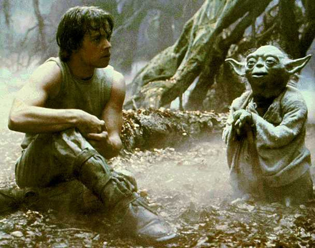
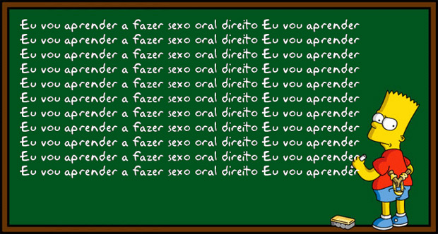
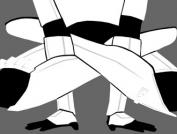

O aprendizado de algo novo é um processo interessantíssimo, mas que muitas vezes passa despercebido pela nossa mente. Claro, ela está ocupada aprendendo o diacho daquilo que estamos aprendendo, e não com o processo de aprendizado em si.

  

(Aliás, se você já leu o termo “metacognição” e coçou a cabeça, saiba que ele significa exatamente isso. “Cognição” é processo de conhecer/aprender algo novo, enquanto “meta” é um termo meio complicado de explicar, usado para indicar algo se refere a si próprio. Ou seja: metacognição é “aprender a aprender”. É ir um nível mais a fundo, [como naquele filme](http://www.imdb.com/title/tt1375666/).)

  

  
  

Não este, mas não quero transgredir a lei interplanetária que nos manda sempre incluir uma imagem desta cena ou do Karate Kid em textos sobre treinamento

  

Não é bizarro, por exemplo, quando alguém faz um trabalho claramente porco e mesmo assim se posiciona como um profissional da mais alta competência? Isso enquanto há outros fazendo um trabalho bem melhor, e ainda assim amaldiçoados por inseguranças a ponto de mal conseguirem aceitar um elogio sem falarem algo como “ah, obrigado, mas ainda preciso melhorar muito”.

  

Posso dizer com uma certa segurança que você já viu essa cena – talvez até com você mesmo em um dos papéis principais –, e não é por eu ser capaz de enxergar através da sua alma até o seu passado. É porque esse é um fenômeno psicológico muito comum no aprendizado humano.

  
> “A ignorância gera confiança com mais frequência do que o conhecimento.”  
> –Charles Darwin

  

### Do não-saber ao saber, em quatro passos

  

Pense em algo que você aprendeu, e hoje faz muito bem. É possível que você olhe para trás e só lembre de dois momentos: um no qual estava aprendendo, e outro no qual você simplesmente havia aprendido a maioria das coisas necessárias.

  

No entanto, passamos por quatro fases no caminho que nos leva do não-saber ao saber.

  

  
  

E a paciência para esperar o magrão aprender tudo?

  

### 1. Incompetência inconsciente

  

Digamos que você está aprendendo a tocar violão ou fazer drinks. Essa fase é o início da coisa toda, quando você olha alguém fazendo um drink e pensa “não pode ser muito difícil”. Você e aprende a introdução de “Come As You Are” ou a base de “Que País É Esse” e já acha que está mandando bem.

  

Nesta fase, você acha que manja. Faz o básico do básico para realizar o que quer e acha que, por conseguir fazer isso, já *sabe*. Talvez alguém no seu trabalho mal e mal faça o que diz na sua descrição de cargo, apenas o suficiente para não ser demitido por justa causa, mas está lá, se achando o próximo candidato a sócio. Esse cara não tem consciência do quanto é incompetente, por isso ele está na fase um.

  

A boa notícia é que ela passa rápido. Basta a pessoa ter um mínimo de interesse na tarefa, e o segundo estágio logo começa.

  

### 2. Incompetência consciente

  

Para a maior parte das pessoas, essa é a parte crítica. Tocar *Legião Urbana* e *Ramones* já não parece suficiente. Você se dá conta de que fazer só o básico da sua função não vai te levar muito longe nem te fazer merecer um aumento. Então o que você faz? Se dedica a aprender mais.

  

Você pesquisa, se informa, observa, e logo chega a uma conclusão dolorosamente óbvia: tem literalmente uma caralhada de coisas que você ainda não sabe e precisa aprender.

  

O peso dessa constatação é provavelmente a causa número um da desistência de aprender habilidades novas e não-essenciais, como música, culinária, mixologia, sexo oral avançado etc.

  

Sendo assim, a maneira mais confiável de avançar para a próxima fase é talvez a mais contra-intuitiva: **fazer mais para errar mais; errar mais para aprender mais.**

  

  
  

Persevera e triunfarás

  

### 3. Competência consciente

  

Eis que as coisas começam a fazer um pouco mais de sentido. Você finalmente aprendeu o que precisava. Mas não sem um esforço consciente para acertar e fazer direito.

  

Aquele solo do Led Zeppelin finalmente soa bem. Mas você precisa olhar para a guitarra enquanto o executa, e geralmente toca com a língua para fora, no canto da boca.

  

Aquele drink ficou bonito e gostoso, e as pessoas te perguntaram onde você aprendeu, te elogiaram e pediram a receita, mas você o preparou meticulosamente na cozinha da sua casa, dosando cada ingrediente com muito cuidado e relembrando cada passo do preparo. Se estivesse em um bar, as pessoas teriam jogado pedras de gelo em você pela demora.

  

Você até consegue escrever um texto decente sobre os quatro estágios da competência, mas não sem reler, reescrever e repensar cada trecho meia dúzia de vezes antes de publicar.

  

### 4. Competência inconsciente

  

Nessa fase, você é o Jimmy Page. O Dr. Drinks. O Saramago.

  

Você de fato aprendeu. Sua habilidade é natural. Não é necessário esforço algum para atingir um resultado ótimo. Aquele solo bem feito que você fazia com a língua de fora no quarto, agora você faz para um público de milhares enquanto fuma um cigarro e paga de gostoso com o cabelo na frente dos olhos e o pé no amplificador. Você é foda.

  

O problema é que esse estágio de competência obviamente não chega para todos. É preciso muita dedicação e muito tempo de treino. Quanto tempo? Tem gente que fala em [umas 10.000 horas](http://papodehomem.com.br/10-mil-horas-teoria-treine/).

  

### \* \* \*

  

Como tudo na vida, o aprendizado é um caminho. Esse é o mapa de apenas uma das estradas que você pode se enxergar percorrendo. Há outros modos de enxergar o processo de aprendizagem, com certeza, mas para este texto resolvi focar nesta visão.

  

Dentro disso, gostaria de saber: o que você anda aprendendo? Em que estágio está? O que precisa fazer para passar ao próximo? Mais importante: está fazendo isso?

  

**Se quiser dar mais uma lida a respeito:**  
[Four stages of competence](http://en.wikipedia.org/wiki/Four_stages_of_competence)  
[Dunning-Kruger effect](http://en.wikipedia.org/wiki/Dunning%E2%80%93Kruger_effect)  
[Illusory superiority](http://en.wikipedia.org/wiki/Illusory_superiority)

  
  

## LEIA TAMBÉM...

  

1.   

   Quatro chutes no saco: verdades que você finge não ver

     

     

   O zen e a coceira não-coçada

     

     

   Nunca desista de um novo começo

[anexo ausente]  
  

Artigos Relacionados

  

[A sua vida inteira em 6 minutos](http://rss.feedsportal.com/c/32911/f/530922/s/2285f9fd/l/0Lpapodehomem0N0Bbr0Ca0Esua0Evida0Einteira0Eem0E60Eminutos0C/story01.htm)

  

[Bom dia, Camila](http://rss.feedsportal.com/c/32911/f/530922/s/228d0f68/l/0Lpapodehomem0N0Bbr0Cbom0Edia0Ecamila0C/story01.htm)

  

[A paixão é uma bad | Autópsia Filosófica #1](http://rss.feedsportal.com/c/32911/f/530922/s/228fe30d/l/0Lpapodehomem0N0Bbr0Cpaixao0Ee0Euma0Ebad0C/story01.htm)

  

[O tricô dos presidiários](http://rss.feedsportal.com/c/32911/f/530922/s/2295585d/l/0Lpapodehomem0N0Bbr0Co0Etrico0Edos0Epresidiarios0C/story01.htm)

  

[O BDSM das mães inglesas não me impressiona](http://rss.feedsportal.com/c/32911/f/530922/s/22990749/l/0Lpapodehomem0N0Bbr0Co0Ebdsm0Edas0Emaes0Einglesas0Enao0Eme0Eimpressiona0C/story01.htm)

  
  
  
[[anexo ausente]](http://da.feedsportal.com/r/139263404019/u/49/f/530922/c/32911/s/2299e7b0/a2.htm)   
  

[[anexo ausente]](http://feeds.feedburner.com/~ff/PapodehomemLifestyleMagazine?a=aXVFM--fYh8:C_nqcnWyZV4:yIl2AUoC8zA)  [[anexo ausente]](http://feeds.feedburner.com/~ff/PapodehomemLifestyleMagazine?a=aXVFM--fYh8:C_nqcnWyZV4:qj6IDK7rITs) [[anexo ausente]](http://feeds.feedburner.com/~ff/PapodehomemLifestyleMagazine?a=aXVFM--fYh8:C_nqcnWyZV4:-BTjWOF_DHI)

  
[anexo ausente]  
  
  
  
from Papo de Homem - Lifestyle Magazine <http://papodehomem.com.br/os-quatro-estagios-da-competencia-em-qualquer-tarefa/>
