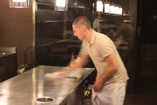
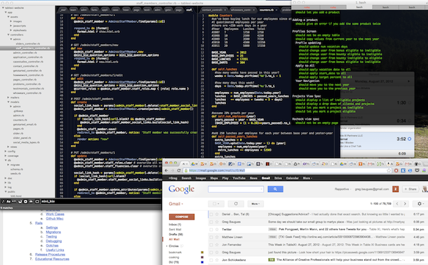
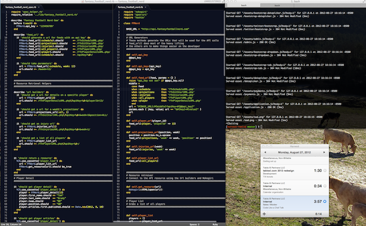

# Code Like a Chef: Work Clean

*Posted on:* August 30th, 2012 *by* Greg Baugues [No Comments](http://www.tablexi.com/blog/2012/08/code-like-a-chef-work-clean/developers/#respond "Comment on Code Like a Chef: Work Clean")

There are a dozen opinions on any given cooking technique, but in the Alinea kitchen, when you say “TK says…” that’s the end of the discussion.

Thomas Keller is considered by many to be the best chef in America, and almost certainly the most influential. His NYC restaurant, Per Se, is ranked the [sixth best restaurant in the world](http://www.theworlds50best.com/awards/1-50-winners/) (edging Alinea out of the spot it held in 2011). In 2003 and 2004, his The French Laundry, was named the best restaurant in the world – the first American restaurant to hold the honor.  Grant Achatz, chef of Alinea, spent six years at the French Laundry and so influential was TK’s friendship and mentorship that Grant named his eldest son “Keller”.

In [Ad Hoc at Home](http://www.amazon.com/dp/1579653774?tag=telen-20) , TK says:

> Being organized – as we say in our kitchen, ‘working clean’ – is a skill to develop. We call it mise-en-place, French for, literally, ‘put in place.’ The term can be very specific, referring to ingredients needed to complete a recipe, measured out and ready to use, or it can be more general: are you organized, do you have everything you need to accomplish the task at hand?
>
> Good organization is all about setting yourself up to succeed. It means getting rid of anything that would interfere with the process of making a recipe or preparing an entire meal. If you are in the middle of preparation, you don’t want to stop and find the proper pot, or dig around in the cupboard for an ingredient: that opens you up to distractions and errors…
>
> When I peel an onion, I get rid of all the onion skin before I begin slicing it… When you finish with a pot, wash it. Clean as you go to avoid clutter; clutter interferes with the cooking process. Things get in your way when you’re not organized. Clear your path.
>
> Being organized is the first and most important part of cooking.

Working clean is the most valuable concept I have adopted from the kitchen, for I am not an organized person by nature. At the office, working clean takes two forms. First, I keep my physical workspace clean. Dirty dishes, papers and knick knacks cause me visual distraction.

More importantly, I am continually cleaning my virtual workspace. If I’m not careful, by mid-afternoon my desktop looks like this:

Every file I’ve touched throughout the day is open. I’ve got a couple open docs, maybe a spreadsheet or two, unrelated to what I’m working on. Email’s up, begging for my attention. I see guys brag on twitter about how many browser tabs they have open at the end of the day. I don’t get that. Forty open tabs are a sign of a disorganized and unintentional mind. It’s sloppy.

When I’m on my game, my desktop looks like this:

Everything is put in place. My editor takes up the left two-thirds of my external monitor – tests on the left, production code on the right. Terminal goes in the top right, time clock below that. My browser stays below on my laptop monitor – but only when explicitly needed. Email *does not stay open.*

*When I finish the task at hand, I reset. I *cmd-w all the way down. I take off my headphones, step away from my computer, and [shake out my legs](http://www.tablexi.com/blog/2012/08/stand-up-and-code-like-a-chef/txi-life/ "Stand Up and Code Like a Chef") . I ask myself: Is there anything that I can do to prevent from being interrupted over the next hour? Do I need a break? Do I need to use the bathroom? Respond to email?**

**If not, I get my mise en place for my next task. If I need a rails server, I start it. I open the production code and tests that I’ll be working on along with any docs that I know I’ll need.**

**The goal of a professional programmer is to produce clean, organized code. Software veteran Bob Martin has two books about the importance of clean code: [Clean Code](http://www.amazon.com/dp/0132350882?tag=telen-20) and [The Clean Coder](http://www.amazon.com/dp/0137081073?tag=telen-20) . In the latter he says:**

> **The way to go fast, and to keep the deadlines at bay, is to stay clean. Professionals do not succumb to the temptation to create a mess in order to move more quickly. Professionals realize that “quick and dirty” is an oxymoron. Dirty always means slow!**
>
> **We can avoid pressure by keeping our systems, our code and our design as clean as possible. This does not mean that we spend endless hours polishing code. It simply means that we don’t tolerate messes. We know that messes will slow us down, causing us to miss dates and break commitments. So we do the best work we can and keep our output as clean as we can.**

**The cleanliness of a workspace is invariably reflected by the product created in it.  TK says: “We’re taking great measures at making sure that we have an environment that’s very wholesome, very clean, very well organized so that there are no opportunities for food-borne illness.”**

**How would you feel eating food from a filthy kitchen? How can clean code come from a dirty desktop?**

***If you found this post interesting, you may want to check out others in the Code Like a Chef series:***

****Also, I’ll be giving a lightning talk on this topic at [Windy City Rails](http://windycityrails.com/) next week.****

********

#### ****About Greg Baugues****

****Greg Baugues has written 74 posts in this blog.****

*******Developer** Fluent in: Rails, PHP, WordPress, Cooking, Druidic*****

****[Code Like a Chef](http://www.tablexi.com/blog/tag/code-like-a-chef/)****
