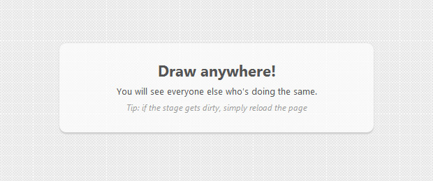

# Let’s Make a Drawing Game with Node.js

Posted on **Aug 21st, 2012**

By now you have probably heard of [node.js](http://nodejs.org/) . It is an asynchronous web server built ontop of Google’s V8 JavaScript engine (the same one that makes Chrome lighning fast). Using node, you can write scalable web services in JavaScript, that can handle a huge number of simultaneous connections, which makes it perfect as the backend of games, web chats and other real time tasks.

### The Idea

Today we will be making a simple online drawing game. The app will let users draw on the page by dragging and moving their mice, and will display the results on a large canvas element. What sets is apart from all the other similar experiments though, is that people will see each other in real time as they do so. To achieve this, we will leverage the [socket.io](http://socket.io/) library for node.js, which uses a range of technologies from websockets to AJAX long polling to give us a real time data channel. Because of this, the example works in all modern browsers.

### Installing node.js

To run the game you will need to install node.js. It shouldn’t take more than a few minutes and is fairly straightforward. If you are on Windows, you can go ahead and download the installer from its official site. If you are on Linux or OSX, you will need to run [this set of commands](https://gist.github.com/579814#file_node_and_npm_in_30_seconds.sh) in your terminal (you only need to run the first script: *node-and-npm-in-30-seconds.sh*).

After you finish installing, you will also get access to npm, or node package manager. With this utility you can install useful libraries and bits of code that you can import into your node.js scripts. For this example, we will need the [socket.io](http://socket.io/) library I mentioned above, and [node-static](https://github.com/cloudhead/node-static) , which will serve the HTML, CSS and JS files of the drawing application. Again, open up your terminal (or a new command prompt window if you are on Windows) and write the following command:

|  |  |
| --- | --- |
| `1` | `npm install socket.io node-static` |

This shouldn’t take more than a few minutes to complete.

### Running the Application

If you want to just grab the files and test the app on your computer, you will need to download the archive from the button above, and extract it somewhere on your hard drive. After this, open a command prompt / terminal and navigate to the folder (of course you remember how the cd command works, don’t you?). After this, type this command and hit return:

|  |  |
| --- | --- |
| `1` | `node app.js` |

You should be greeted with a socket.io debug message (otherwise probably your path is wrong; keep practicing with that cd command!). This means that everything is up and running! Now open **http://localhost:8080** and you should see your very own copy of the demo. Nice!

These instructions also apply if you are following the steps of the article and are building the app from scratch. Which brings us back to the tutorial:

### The HTML

The first step is to create a new HTML document. Inside it, we will put the canvas element which users will be drawing upon, and a div for holding the mouse pointers. Each mouse pointer will be a div with the **.pointer** css class that is absolutely positioned on the page (we won’t be discussing the styling in this article, open *assets/css/styles.css* to take a look).

#### index.html

|  |  |
| --- | --- |
| `01` | `<!DOCTYPE html>` |

|  |  |
| --- | --- |
| `02` | `<``html``>` |

|  |  |
| --- | --- |
| `03` | `<``head``>` |

|  |  |
| --- | --- |
| `04` | `<``meta` `charset``=``"utf-8"` `/>` |

|  |  |
| --- | --- |
| `05` | `<``title``>Node.js Multiplayer Drawing Game | Tutorialzine Demo</``title``>` |

|  |  |
| --- | --- |
| `06` |  |

|  |  |
| --- | --- |
| `07` | `<!-- The stylesheets -->` |

|  |  |
| --- | --- |
| `08` | `<``link` `rel``=``"stylesheet"` `href``=``"assets/css/styles.css"` `/>` |

|  |  |
| --- | --- |
| `09` |  |

|  |  |
| --- | --- |
| `10` | `<!--[if lt IE 9]>` |

|  |  |
| --- | --- |
| `11` | `` |

|  |  |
| --- | --- |
| `12` | `<![endif]-->` |

|  |  |
| --- | --- |
| `13` | `</``head``>` |

|  |  |
| --- | --- |
| `14` |  |

|  |  |
| --- | --- |
| `15` | `<``body``>` |

|  |  |
| --- | --- |
| `16` | `<``div` `id``=``"cursors"``>` |

|  |  |
| --- | --- |
| `17` | `<!-- The mouse pointers will be created here -->` |

|  |  |
| --- | --- |
| `18` | `</``div``>` |

|  |  |
| --- | --- |
| `19` |  |

|  |  |
| --- | --- |
| `20` | `<``canvas` `id``=``"paper"` `width``=``"1900"` `height``=``"1000"``>` |

|  |  |
| --- | --- |
| `21` | `Your browser needs to support canvas for this to work!` |

|  |  |
| --- | --- |
| `22` | `</``canvas``>` |

|  |  |
| --- | --- |
| `23` |  |

|  |  |
| --- | --- |
| `24` | `<``hgroup` `id``=``"instructions"``>` |

|  |  |
| --- | --- |
| `25` | `<``h1``>Draw anywhere!</``h1``>` |

|  |  |
| --- | --- |
| `26` | `<``h2``>You will see everyone else who's doing the same.</``h2``>` |

|  |  |
| --- | --- |
| `27` | `<``h3``>Tip: if the stage gets dirty, simply reload the page</``h3``>` |

|  |  |
| --- | --- |
| `28` | `</``hgroup``>` |

|  |  |
| --- | --- |
| `29` |  |

|  |  |
| --- | --- |
| `30` | `<!-- JavaScript includes. Notice that socket.io.js is served by node.js -->` |

|  |  |
| --- | --- |
| `31` | `<``script` `src``=``"/socket.io/socket.io.js"``></``script``>` |

|  |  |
| --- | --- |
| `32` | `<``script` `src``=``"http://code.jquery.com/jquery-1.8.0.min.js "``></``script``>` |

|  |  |
| --- | --- |
| `33` | `<``script` `src``=``"assets/js/script.js"``></``script``>` |

|  |  |
| --- | --- |
| `34` |  |

|  |  |
| --- | --- |
| `35` | `</``body``>` |

|  |  |
| --- | --- |
| `36` | `</``html``>` |

You can see that the canvas is set to a fixed width of 1900px and height of 1000px, but users with smaller displays will see only a part of it. A possible enhancement would be to enlarge or reduce the canvas in relation to the screen size, but I will leave that to you.

For the real-time communication channel between the users’s browser and node.js to work, we need to include the *socket.io* library in both places, however you won’t find the *socket.io.js* file included in the bottom of index.html in the download archive. This is because socket.io intercepts requests to */socket.io/socket.io.js* and serves it itself so you don’t have to explicitly upload this file with your application.

Draw Anywhere!

### The Client Side

In [other tutorials](http://tutorialzine.com/category/tutorials/) , we would usually name this section JavaScript, but this time we have JavaScript on both the client (the person’s browser) and the server (node.js), so proper distinction must be made.

The code you see below runs in the person’s browser. It uses socket.io to connect to the server and notifies us when an event occurs. That event is a message emitted by other clients and relayed back to us by node.js. The messages contain mouse coordinates, unique id for the user, and whether they are drawing or not in the moment.

#### assets/js/script.js

|  |  |
| --- | --- |
| `001` | `$(``function``(){` |

|  |  |
| --- | --- |
| `002` |  |

|  |  |
| --- | --- |
| `003` | `// This demo depends on the canvas element` |

|  |  |
| --- | --- |
| `004` | `if``(!(``'getContext'` `in` `document.createElement(``'canvas'``))){` |

|  |  |
| --- | --- |
| `005` | `alert(``'Sorry, it looks like your browser does not support canvas!'``);` |

|  |  |
| --- | --- |
| `006` | `return` `false``;` |

|  |  |
| --- | --- |
| `007` | `}` |

|  |  |
| --- | --- |
| `008` |  |

|  |  |
| --- | --- |
| `009` | `// The URL of your web server (the port is set in app.js)` |

|  |  |
| --- | --- |
| `010` | `var` `url =` `'http://localhost:8080 '``;` |

|  |  |
| --- | --- |
| `011` |  |

|  |  |
| --- | --- |
| `012` | `var` `doc = $(document),` |

|  |  |
| --- | --- |
| `013` | `win = $(window),` |

|  |  |
| --- | --- |
| `014` | `canvas = $(``'#paper'``),` |

|  |  |
| --- | --- |
| `015` | `ctx = canvas[0].getContext(``'2d'``),` |

|  |  |
| --- | --- |
| `016` | `instructions = $(``'#instructions'``);` |

|  |  |
| --- | --- |
| `017` |  |

|  |  |
| --- | --- |
| `018` | `// Generate an unique ID` |

|  |  |
| --- | --- |
| `019` | `var` `id = Math.round($.now()*Math.random());` |

|  |  |
| --- | --- |
| `020` |  |

|  |  |
| --- | --- |
| `021` | `// A flag for drawing activity` |

|  |  |
| --- | --- |
| `022` | `var` `drawing =` `false``;` |

|  |  |
| --- | --- |
| `023` |  |

|  |  |
| --- | --- |
| `024` | `var` `clients = {};` |

|  |  |
| --- | --- |
| `025` | `var` `cursors = {};` |

|  |  |
| --- | --- |
| `026` |  |

|  |  |
| --- | --- |
| `027` | `var` `socket = io.connect(url);` |

|  |  |
| --- | --- |
| `028` |  |

|  |  |
| --- | --- |
| `029` | `socket.on(``'moving'``,` `function` `(data) {` |

|  |  |
| --- | --- |
| `030` |  |

|  |  |
| --- | --- |
| `031` | `if``(! (data.id` `in` `clients)){` |

|  |  |
| --- | --- |
| `032` | `// a new user has come online. create a cursor for them` |

|  |  |
| --- | --- |
| `033` | `cursors[data.id] = $(``'
'``).appendTo(``'#cursors'``);` |

|  |  |
| --- | --- |
| `034` | `}` |

|  |  |
| --- | --- |
| `035` |  |

|  |  |
| --- | --- |
| `036` | `// Move the mouse pointer` |

|  |  |
| --- | --- |
| `037` | `cursors[data.id].css({` |

|  |  |
| --- | --- |
| `038` | `'left'` `: data.x,` |

|  |  |
| --- | --- |
| `039` | `'top'` `: data.y` |

|  |  |
| --- | --- |
| `040` | `});` |

|  |  |
| --- | --- |
| `041` |  |

|  |  |
| --- | --- |
| `042` | `// Is the user drawing?` |

|  |  |
| --- | --- |
| `043` | `if``(data.drawing && clients[data.id]){` |

|  |  |
| --- | --- |
| `044` |  |

|  |  |
| --- | --- |
| `045` | `// Draw a line on the canvas. clients[data.id] holds` |

|  |  |
| --- | --- |
| `046` | `// the previous position of this user's mouse pointer` |

|  |  |
| --- | --- |
| `047` |  |

|  |  |
| --- | --- |
| `048` | `drawLine(clients[data.id].x, clients[data.id].y, data.x, data.y);` |

|  |  |
| --- | --- |
| `049` | `}` |

|  |  |
| --- | --- |
| `050` |  |

|  |  |
| --- | --- |
| `051` | `// Saving the current client state` |

|  |  |
| --- | --- |
| `052` | `clients[data.id] = data;` |

|  |  |
| --- | --- |
| `053` | `clients[data.id].updated = $.now();` |

|  |  |
| --- | --- |
| `054` | `});` |

|  |  |
| --- | --- |
| `055` |  |

|  |  |
| --- | --- |
| `056` | `var` `prev = {};` |

|  |  |
| --- | --- |
| `057` |  |

|  |  |
| --- | --- |
| `058` | `canvas.on(``'mousedown'``,``function``(e){` |

|  |  |
| --- | --- |
| `059` | `e.preventDefault();` |

|  |  |
| --- | --- |
| `060` | `drawing =` `true``;` |

|  |  |
| --- | --- |
| `061` | `prev.x = e.pageX;` |

|  |  |
| --- | --- |
| `062` | `prev.y = e.pageY;` |

|  |  |
| --- | --- |
| `063` |  |

|  |  |
| --- | --- |
| `064` | `// Hide the instructions` |

|  |  |
| --- | --- |
| `065` | `instructions.fadeOut();` |

|  |  |
| --- | --- |
| `066` | `});` |

|  |  |
| --- | --- |
| `067` |  |

|  |  |
| --- | --- |
| `068` | `doc.bind(``'mouseup mouseleave'``,``function``(){` |

|  |  |
| --- | --- |
| `069` | `drawing =` `false``;` |

|  |  |
| --- | --- |
| `070` | `});` |

|  |  |
| --- | --- |
| `071` |  |

|  |  |
| --- | --- |
| `072` | `var` `lastEmit = $.now();` |

|  |  |
| --- | --- |
| `073` |  |

|  |  |
| --- | --- |
| `074` | `doc.on(``'mousemove'``,``function``(e){` |

|  |  |
| --- | --- |
| `075` | `if``($.now() - lastEmit > 30){` |

|  |  |
| --- | --- |
| `076` | `socket.emit(``'mousemove'``,{` |

|  |  |
| --- | --- |
| `077` | `'x'``: e.pageX,` |

|  |  |
| --- | --- |
| `078` | `'y'``: e.pageY,` |

|  |  |
| --- | --- |
| `079` | `'drawing'``: drawing,` |

|  |  |
| --- | --- |
| `080` | `'id'``: id` |

|  |  |
| --- | --- |
| `081` | `});` |

|  |  |
| --- | --- |
| `082` | `lastEmit = $.now();` |

|  |  |
| --- | --- |
| `083` | `}` |

|  |  |
| --- | --- |
| `084` |  |

|  |  |
| --- | --- |
| `085` | `// Draw a line for the current user's movement, as it is` |

|  |  |
| --- | --- |
| `086` | `// not received in the socket.on('moving') event above` |

|  |  |
| --- | --- |
| `087` |  |

|  |  |
| --- | --- |
| `088` | `if``(drawing){` |

|  |  |
| --- | --- |
| `089` |  |

|  |  |
| --- | --- |
| `090` | `drawLine(prev.x, prev.y, e.pageX, e.pageY);` |

|  |  |
| --- | --- |
| `091` |  |

|  |  |
| --- | --- |
| `092` | `prev.x = e.pageX;` |

|  |  |
| --- | --- |
| `093` | `prev.y = e.pageY;` |

|  |  |
| --- | --- |
| `094` | `}` |

|  |  |
| --- | --- |
| `095` | `});` |

|  |  |
| --- | --- |
| `096` |  |

|  |  |
| --- | --- |
| `097` | `// Remove inactive clients after 10 seconds of inactivity` |

|  |  |
| --- | --- |
| `098` | `setInterval(``function``(){` |

|  |  |
| --- | --- |
| `099` |  |

|  |  |
| --- | --- |
| `100` | `for``(ident` `in` `clients){` |

|  |  |
| --- | --- |
| `101` | `if``($.now() - clients[ident].updated > 10000){` |

|  |  |
| --- | --- |
| `102` |  |

|  |  |
| --- | --- |
| `103` | `// Last update was more than 10 seconds ago.` |

|  |  |
| --- | --- |
| `104` | `// This user has probably closed the page` |

|  |  |
| --- | --- |
| `105` |  |

|  |  |
| --- | --- |
| `106` | `cursors[ident].remove();` |

|  |  |
| --- | --- |
| `107` | `delete` `clients[ident];` |

|  |  |
| --- | --- |
| `108` | `delete` `cursors[ident];` |

|  |  |
| --- | --- |
| `109` | `}` |

|  |  |
| --- | --- |
| `110` | `}` |

|  |  |
| --- | --- |
| `111` |  |

|  |  |
| --- | --- |
| `112` | `},10000);` |

|  |  |
| --- | --- |
| `113` |  |

|  |  |
| --- | --- |
| `114` | `function` `drawLine(fromx, fromy, tox, toy){` |

|  |  |
| --- | --- |
| `115` | `ctx.moveTo(fromx, fromy);` |

|  |  |
| --- | --- |
| `116` | `ctx.lineTo(tox, toy);` |

|  |  |
| --- | --- |
| `117` | `ctx.stroke();` |

|  |  |
| --- | --- |
| `118` | `}` |

|  |  |
| --- | --- |
| `119` |  |

|  |  |
| --- | --- |
| `120` | `});` |

The basic idea is that we use **socket.emit()** to send a message to the node.js server on every mouse movement. This can generate a large number of packets, so we are rate-limiting it to one packet every 30 ms (the $.now() function is defined by jQuery and returns the number of milliseconds since the epoch).

The mousemove event is not called on every pixel of the movement, but we are using a trick to draw solid lines instead of separate dots – when drawing on the canvas, we are using the lineTo method, so that the distance between the mouse coordinates are joined with a straight line.

Now let’s take a look at the server!

### Server Side

After reading through the client side code you might be worried that the code on the server is even longer. But you will be mistaken. The code on the server side is much shorter and simpler. What it does is serve files when people access the url of the app in their browsers, and relay *socket.io* messages. Both of these tasks are aided by libraries so are as simple as possible.

#### app.js

|  |  |
| --- | --- |
| `01` | `// Including libraries` |

|  |  |
| --- | --- |
| `02` |  |

|  |  |
| --- | --- |
| `03` | `var` `app = require(``'http'``).createServer(handler),` |

|  |  |
| --- | --- |
| `04` | `io = require(``'socket.io'``).listen(app),` |

|  |  |
| --- | --- |
| `05` | `static = require(``'node-static'``);` `// for serving files` |

|  |  |
| --- | --- |
| `06` |  |

|  |  |
| --- | --- |
| `07` | `// This will make all the files in the current folder` |

|  |  |
| --- | --- |
| `08` | `// accessible from the web` |

|  |  |
| --- | --- |
| `09` | `var` `fileServer =` `new` `static.Server(``'./'``);` |

|  |  |
| --- | --- |
| `10` |  |

|  |  |
| --- | --- |
| `11` | `// This is the port for our web server.` |

|  |  |
| --- | --- |
| `12` | `// you will need to go to http://localhost:8080 to see it` |

|  |  |
| --- | --- |
| `13` | `app.listen(8080);` |

|  |  |
| --- | --- |
| `14` |  |

|  |  |
| --- | --- |
| `15` | `// If the URL of the socket server is opened in a browser` |

|  |  |
| --- | --- |
| `16` | `function` `handler (request, response) {` |

|  |  |
| --- | --- |
| `17` |  |

|  |  |
| --- | --- |
| `18` | `request.addListener(``'end'``,` `function` `() {` |

|  |  |
| --- | --- |
| `19` | `fileServer.serve(request, response);` `// this will return the correct file` |

|  |  |
| --- | --- |
| `20` | `});` |

|  |  |
| --- | --- |
| `21` | `}` |

|  |  |
| --- | --- |
| `22` |  |

|  |  |
| --- | --- |
| `23` | `// Delete this row if you want to see debug messages` |

|  |  |
| --- | --- |
| `24` | `io.set(``'log level'``, 1);` |

|  |  |
| --- | --- |
| `25` |  |

|  |  |
| --- | --- |
| `26` | `// Listen for incoming connections from clients` |

|  |  |
| --- | --- |
| `27` | `io.sockets.on(``'connection'``,` `function` `(socket) {` |

|  |  |
| --- | --- |
| `28` |  |

|  |  |
| --- | --- |
| `29` | `// Start listening for mouse move events` |

|  |  |
| --- | --- |
| `30` | `socket.on(``'mousemove'``,` `function` `(data) {` |

|  |  |
| --- | --- |
| `31` |  |

|  |  |
| --- | --- |
| `32` | `// This line sends the event (broadcasts it)` |

|  |  |
| --- | --- |
| `33` | `// to everyone except the originating client.` |

|  |  |
| --- | --- |
| `34` | `socket.broadcast.emit(``'moving'``, data);` |

|  |  |
| --- | --- |
| `35` | `});` |

|  |  |
| --- | --- |
| `36` | `});` |

With this our drawing app is complete!

### Done!

Drawing is much more fun when you see other people doing it at the same time. Feel free to play with the example and improve it! Some ideas: it would be awesome to have different brushes, erasers, colors and shapes, or even country flags displayed next to the cursors. Go wild!
