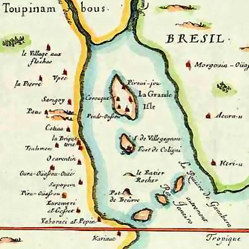
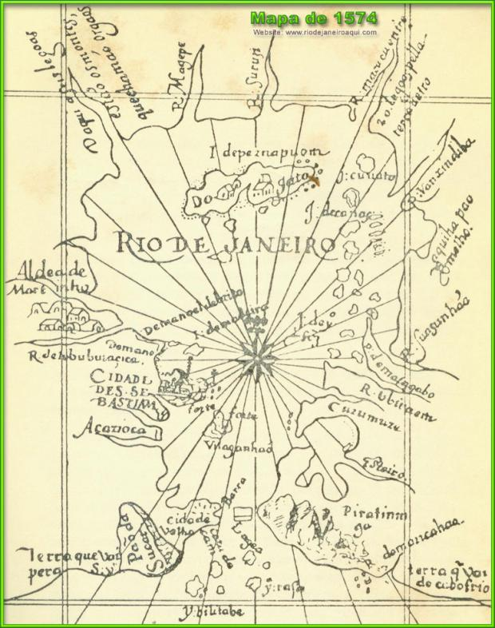
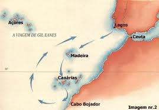

Diz a lenda que os portugueses confundiram a entrada da Baía de Guanabara com a foz de um rio. Isso é mentira.

  

Vamos aos fatos: entre 1501 e 1502, o navegador português Gaspar de Lemos fez uma viagem de exploração pelas costas do Brasil e descobriu, entre outros, o arquipélago de Fernando de Noronha, a Baía de Todos os Santos, a Baía da Guanabara, Angra dos Reis e São Vicente.

  

  

Em 1º de janeiro de 1502, um dia sem nenhum santo dedicado a ele, Gaspar descobriu a Baía de Guanabara e chamou-a de Rio de Janeiro – teoricamente por pensar que era a foz de um grande rio.

  

Mas, para se acreditar nessa besteira, é preciso dois enganos:

  

Em primeiro lugar, ignorar que, naquela época, “rio” era a denominação comum para corpos d’água de modo geral, como rios, baías, sacos, etc. Então, chamar a Baía de Guanabara de “rio” era tão incorreto quanto chamar a Avenida Paulista de “logradouro”.

  

Ok, tudo bem as pessoas não saberem isso.

  

  

Mas o segundo engano é mais interessante.

  

Os portugueses foram talvez os maiores navegadores da história, autores de feitos mais revolucionários em sua época do que a chegada do homem à Lua.

  

O Cabo Bojador, por exemplo, no atual Saara Ocidental, era considerado o último limite do mundo, habitado por monstros ferozes e, teoricamente, abaixo dele, seria tão quente que a vida humana se tornaria impossível. Em 1434, Gil Eanes destruiu todos esses mitos.

  

Colombo descobrir a América foi fofo, mas Vasco da Gama chegar à Índia foi o que finalmente unificou o mundo.

  

  
  

Parece pouco, mas essa viagem teve mais impacto que a chegado do homem na Lua.

  

Os navegadores portugueses eram homens que liam os mares, os céus e os ventos como hoje lemos um livro. Que conseguiam saber que havia terra a centenas de quilômetros de distância somente observando as águas e marés.

  

Só muita arrogância e ignorância, só um desprezo muito grande pelo povo português, pode explicar que se considere, por um minuto que seja, que esses homens, os maiores navegadores da história, não conseguiriam distinguir entre a foz de um rio e a barra de uma baía.

  
[anexo ausente]  
  

Artigos Relacionados

  

[Como fazer brigadeiro belga na cozinha maravilhosa de Jader Pires](http://rss.feedsportal.com/c/32911/f/530922/s/23657d1a/l/0Lpapodehomem0N0Bbr0Ccomo0Efazer0Ebrigadeiro0Ebelga0Ena0Ecozinha0Emaravilhosa0Ede0Ejader0Epires0C/story01.htm)

  

[Led Zeppelin lança show de reunião em vídeo e alimenta nossos sonhos](http://rss.feedsportal.com/c/32911/f/530922/s/236e1b75/l/0Lpapodehomem0N0Bbr0Cled0Ezeppelin0Elanca0Eshow0Ede0Ereuniao0Eem0Evideo0Ee0Ealimenta0Enossos0Esonhos0C/story01.htm)

  

[Rally: insanidade sobre rodas](http://rss.feedsportal.com/c/32911/f/530922/s/237039c7/l/0Lpapodehomem0N0Bbr0Crally0Einsanidade0Esobre0Erodas0C/story01.htm)

  

[Meninas, mulheres, gatinhas e delicinhas | Convocação para o “Bom dia”](http://rss.feedsportal.com/c/32911/f/530922/s/2382e52d/l/0Lpapodehomem0N0Bbr0Cmeninas0Emulheres0Egatinhas0Ee0Edelicinhas0Econvocacao0Epara0Eo0Ebom0Edia0C/story01.htm)

  

[Trabalhar de casa: fuja dessa roubada!](http://rss.feedsportal.com/c/32911/f/530922/s/238736f7/l/0Lpapodehomem0N0Bbr0Ctrabalhar0Ede0Ecasa0Efuja0Edessa0Eroubada0C/story01.htm)

  
  
  
 [anexo ausente]  
  

[[anexo ausente]](http://feeds.feedburner.com/~ff/PapodehomemLifestyleMagazine?a=7WDIPguSPgA:3Cec-pkeRyw:yIl2AUoC8zA)  [[anexo ausente]](http://feeds.feedburner.com/~ff/PapodehomemLifestyleMagazine?a=7WDIPguSPgA:3Cec-pkeRyw:qj6IDK7rITs) [[anexo ausente]](http://feeds.feedburner.com/~ff/PapodehomemLifestyleMagazine?a=7WDIPguSPgA:3Cec-pkeRyw:-BTjWOF_DHI)

  
[anexo ausente]  
  
  
  
from Papo de Homem - Lifestyle Magazine <http://da.feedsportal.com/c/32911/f/530922/s/238d3319/l/0Lpapodehomem0N0Bbr0Cnenhum0Eportugues0Eachou0Eque0Ea0Ebaia0Ede0Eguanabara0Eera0Eum0Erio0C/ia1.htm>
