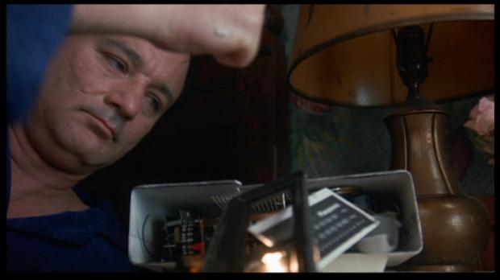
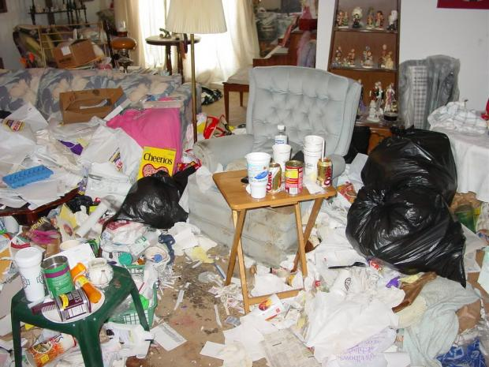

Trabalho de casa há muitos anos.

  

Meu principal objetivo nesse texto é te convencer que trabalhar remotamente é uma péssima ideia.

  

Sério. Pensa bem. Quem é que quer essa vida?

  

### O sono

  

Pra começar, ao invés da delícia de acordar todo dia na mesma hora, com aquele rádio de filme americano dizendo a data e a previsão do tempo, eu levo uma vida terrível e desregrada.

  

Ninguém merece ir dormir sem saber a hora exata em que vai acordar, deixando o corpo despertar naturalmente…

  

É um verdadeiro pesadelo.

  

  
  

"Acorda cedo todo dia, que agonia..."

  

### As roupas

  

Além disso, enquanto meus amigos que trabalham em prédios fazem mil passeios ao shopping e se divertem comprando roupas caras, sapatos sociais, camisas de fechar, blasers, e coisas assim, eu, ó pobre de mim, basicamente só uso shorts, camisetas, pijamas.

  

Não tenho nem o consolo de estar aquecendo a economia e prestigiando a indústria têxtil nacional!

  

### O trânsito

  

E os passeios?

  

Gente, pensa bem.

  

Eu poderia estar passeando até o trabalho todo dia! Ida e volta! Bem na hora mais movimentada, para aumentar minhas chances de encontrar amigos pelo caminho! Alternando entre metrô, carro ou ônibus, sem nunca sentir tédio! Me equilibrando de bicicleta na Marginal, me desviando de caminhões como se estivesse em um videogame, calculando de cabeça minhas probabilidades de ser o 345º ciclista estraçalhado esse ano em São Paulo! Respirando esse ar tão lindo, tão sólido, tão visível! Fortes emoções!

  

  
  

O que é escalar o Monte Everest comparado a andar de bicicleta em SP? A mortalidade com certeza é bem menor!

  

Porém, ao invés de todas essas atividades legais que moldam o caráter, raios!, fico em casa.

  

Quando muito, logo após acordar, medito num templo zen da minha rua, leio o jornal de graça na biblioteca logo ao lado, malho na academia no quarteirão seguinte, ou então, ai de mim, dou um pulinho rápido na praia de Copacabana.

  

E já tenho que voltar correndo pra casa pra trabalhar! É uma escravidão!

  

Sério. Ninguém merece. Vocês não sabem o sofrimento.

  

E, no caminho de volta da praia, sentindo o sal no meu corpo, vejo aquele povo todo engravatado em seus carros e penso, poxa, que inveja!

  

Quem me dera estar agora respirando um bom ar condicionado e ouvindo um repórter de helicóptero sugerindo a rota menos engarrafada!

  

Vocês são felizes e não sabem!

  

  
  

Muito duro estar sofrendo de calor na areia e vendo esse povo todo no bem-bom de seus carros com ar-condicionado!

  

### As viagens

  

Mas o pior mesmo são as viagens.

  

Esse mês, por exemplo, fui convidado para falar no [Primeiro Congresso Humanista](http://papodehomem.com.br/o-sentido-da-vida-para-ateus/), em Porto Alegre. Se eu trabalhasse em tempo integral em um escritório, teria tido a desculpa perfeita para não ir. Mas desgraçadamente não tenho essa sorte.

  

Fui obrigado a aceitar a viagem com tudo pago até o sul, falar para centenas de pessoas, ver várias palestras interessantes, conviver com toda essa gente por vários dias! Vejam vocês as enrascadas em que me meto!

  

Se eu fosse uma pessoa normal com um trabalho normal, teria passado esses dias todos no escritório, sentado no mesmo lugar, entre as mesmas pessoas, almoçando na mesma hora. Meu pai é que estava certo, eu devia ter estudado Marketing ou Administração!

  

Enfim, os meus contratempos não pararam por aí. Não, meus amigos, não mesmo!

  

Aproveitando que já estava no sul, fui voltando de ônibus, visitando amigos pelo caminho: Blumenau, Joinville, São Paulo.

  

E, em cada nova casa por onde passava, era sempre o mesmo constrangimento, eu, explicando ao meu anfitrião:

  
> Olha, desculpa não poder passear com você pela cidade, mas preciso trabalhar por algumas horas para a empresa…

  

Sério. Vocês não imaginam minha vergonha.

  

Ah, como eu sonho em ser um trabalhador de escritório e poder viajar (por duas semanas por ano!) mas sem nunca levar trabalho junto.

  

### Cuidado!

  

Enfim, amigos, é esse o meu alerta. Não caiam no conto do trabalho remoto. Continuem felizes em seus carros e escritórios, em seus terninhos apertados e horários de almoço idem.

  

Essa vida de trabalhar em casa não é pra todos, não. Só para os fortes.

  

  
  

Minha casa. Num dia bom.

  

### Ok, você é um forte: como se preparar?

  

**1. Estabeleça rituais.**

  

Eu, por exemplo, desfaço e desmonto minha cama toda manhã, simbolizando que aquele aposento acabou de passar de casa/dormitório para escritório/local de trabalho.

  

Durante o dia, eu só tomo café. Quando o sol se põe, eu me sirvo uma tacinha de vinho. Para sinalizar o fim da labuta.

  

Coisas assim.

  

Como você está sempre fisicamente no mesmo lugar, esses símbolos e rituais são fundamentais para demarcar o espaço. E para você não enlouquecer.

  

**2. Você nunca tem tempo**

  

Vale para tudo na vida, mas especialmente para quem trabalha em casa. O tempo corre muito mais rápido do que parece. A gente nunca tem tanto tempo como imagina.

  

Seja disciplinado. Se você tem horas a cumprir, cumpra-as logo cedo. Se tem metas a entregar, entregue-as logo cedo.

  

Quanto antes você fizer o que tem que fazer, quanto antes estará livre.

  

A tentação é grande de ficar coçando o saco e deixar tudo pra última hora.

  

Essa tática pode até dar certo na 5ª série, mas agora você pode ser despedido.

  

Pior: seu próximo trabalho pode não ser de casa!

  

  
  

Amanhã, eu faço.

  

**3. Respeite seu trabalho**

  

Trabalho é trabalho. Mesmo se for pra [Revista Mad](http://www.facebook.com/RevistaMAD) ou pro PapodeHomem, dois lugares para os quais ninguém acreditava que eu trabalhava:

  
> “Ah, sério? Revista Mad? Não me sacaneia, vai! Vamos sair e tomar um chope?”

  

Mas, repito, trabalho é trabalho. Você empenha sua palavra que vai fazer certas coisas, recebe dinheiro por elas e, com isso, paga suas contas. Trabalho não é hobby, trabalho não é piada, trabalho não é dever de casa. Nem pra Revista Mad ou pro PapodeHomem.

  

Um dos grandes problemas de quem trabalha em casa é que seus amigos e parentes não respeitam seu trabalho. Uma ligação típica da minha mãe:

  
> “Alex, já que você não trabalha mesmo, pode passar lá na casa do caralho e me pegar uma encomenda?”

  

E eu respondo:

  
> “Não, mãe, eu trabalho. Pro PapodeHomem. O dia todo. Como você acha que eu pago as contas?”

  

E ela ri e insiste:

  
> “Ai, meu filho, que cansativo. Tá bom, Alex. Tô falando sério agora. Sei que você passa o dia inteiro em casa se punhetando. Pode fazer esse favor pra sua mãe ou não?”

  

A verdade é que seus amigos e parentes são influenciados por SUA própria atitude. Se você demonstrar que respeita seu trabalho, eles também vão respeitar.

  

Então, respeite seu trabalho.

  

### Mecenas: Samsung Ultrabook

  

*Agora que você aprendeu algumas maneiras de como trabalhar de casa com performance, que tal conhecer a central da Ultra-Ajuda?*

  

*Lá o Rodrigo Hilbert e a Mariana Weickert vão te dar boas dicas ainda para melhorar sua performance, perder peso e melhorar o visual.*

  
  

*Se você quiser melhorar em alguma dessas áreas ou achar que algum amigo precisa dessas dicas envie esse link a ele.*

  
  

## LEIA TAMBÉM...

  

1.   

   A geração Y (e o que ela pode aprender com a X)

     

     

   Trabalhando “like a boss”

     

     

   Geração wireless: férias e trabalho, ao mesmo tempo, o tempo todo

[anexo ausente]  
  

Artigos Relacionados

  

[Do básico ao hardcore: 9 dicas para ser um bom hóspede](http://rss.feedsportal.com/c/32911/f/530922/s/236e1b73/l/0Lpapodehomem0N0Bbr0Cdo0Ebasico0Eao0Ehardcore0E90Edicas0Epara0Eser0Eum0Ebom0Ehospede0C/story01.htm)

  

[Led Zeppelin lança show de reunião em vídeo e alimenta nossos sonhos](http://rss.feedsportal.com/c/32911/f/530922/s/236e1b75/l/0Lpapodehomem0N0Bbr0Cled0Ezeppelin0Elanca0Eshow0Ede0Ereuniao0Eem0Evideo0Ee0Ealimenta0Enossos0Esonhos0C/story01.htm)

  

[Rally: insanidade sobre rodas](http://rss.feedsportal.com/c/32911/f/530922/s/237039c7/l/0Lpapodehomem0N0Bbr0Crally0Einsanidade0Esobre0Erodas0C/story01.htm)

  

[Fui estuprada](http://rss.feedsportal.com/c/32911/f/530922/s/23718c96/l/0Lpapodehomem0N0Bbr0Cfui0Eestuprada0C/story01.htm)

  

[Meninas, mulheres, gatinhas e delicinhas | Convocação para o “Bom dia”](http://rss.feedsportal.com/c/32911/f/530922/s/2382e52d/l/0Lpapodehomem0N0Bbr0Cmeninas0Emulheres0Egatinhas0Ee0Edelicinhas0Econvocacao0Epara0Eo0Ebom0Edia0C/story01.htm)

  
  
  
   
  

[[anexo ausente]](http://feeds.feedburner.com/~ff/PapodehomemLifestyleMagazine?a=i0VFMBclg98:6mSaJxjwSj8:yIl2AUoC8zA) [[anexo ausente]](http://feeds.feedburner.com/~ff/PapodehomemLifestyleMagazine?a=i0VFMBclg98:6mSaJxjwSj8:D7DqB2pKExk) [[anexo ausente]](http://feeds.feedburner.com/~ff/PapodehomemLifestyleMagazine?a=i0VFMBclg98:6mSaJxjwSj8:qj6IDK7rITs) [[anexo ausente]](http://feeds.feedburner.com/~ff/PapodehomemLifestyleMagazine?a=i0VFMBclg98:6mSaJxjwSj8:-BTjWOF_DHI)

  
[anexo ausente]  
  
  
  
from Papo de Homem - Lifestyle Magazine <http://da.feedsportal.com/c/32911/f/530922/s/238736f7/l/0Lpapodehomem0N0Bbr0Ctrabalhar0Ede0Ecasa0Efuja0Edessa0Eroubada0C/ia1.htm>
