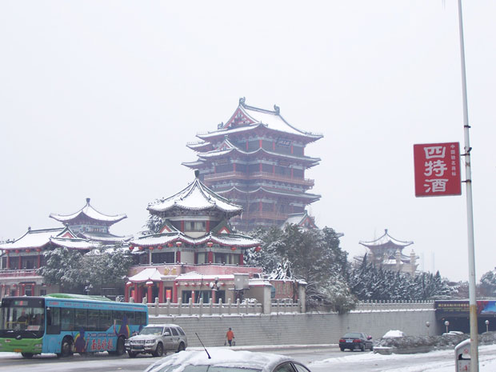
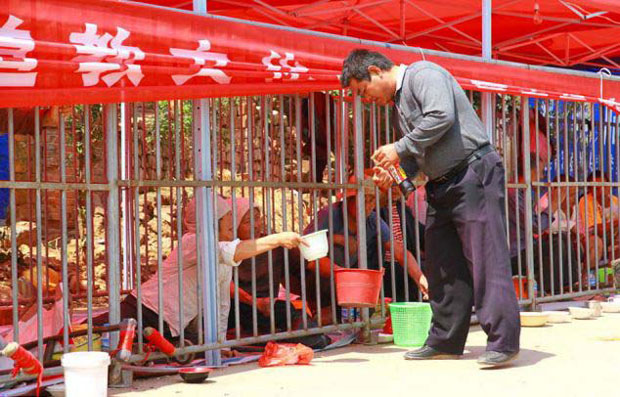
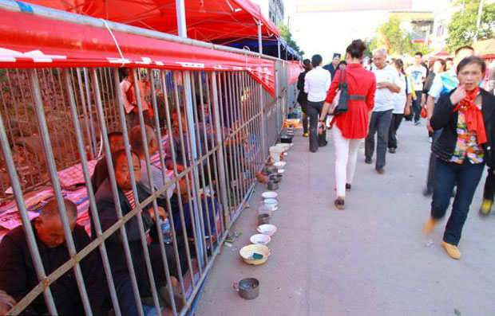
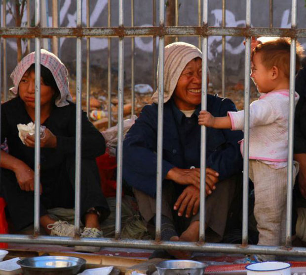

Nanchang é uma cidade importante para a China. Localizada no sul do grande país, é bastante conhecida por abrigar uma das quatro grandes torres da China, o Pavilhão do Príncipe Teng, uma maravilhosa construção que data de 650 dC e que foi destruída e reconstruída diversas vezes na história, tendo sua última reconstrução em 1989.

  

  

Eis a bela edificação, sob a neve

  

Um dos clássicos da literatura chinesa é o livro Tengwang Ge Xu, que se refere justamente ao grande Pavilhão que, na China, se chama Tengwang. Nos dias de hoje, a cidade de Nanchang é motivo de outra história.

  

Em festivais religiosos, comuns na China, há uma quantidade significativa de mendigos nas ruas, pedindo ajuda, comida, trocados. Até aí, nada diferente de qualquer outro lugar no mundo com um mínimo de diferenças sociais. Só que, como a China é um país bem populoso e a mendicância acaba por se tornar um negócio bem lucrativo, o número de pedintes começou a aumentar substancialmente e acabou se tornando uma verdadeira praga para quem perambulava pelas ruas, topando constantemente com mais de uma pessoa solicitando ajuda, algo pra comer, umas moedinhas.

  

Para tentar resolver a questão do ir e vir mais confortável para os religiosos, a organização do festival optou por criar um corredor enorme com gaiolas de ferro para que os mendigos pudessem ficar separados dos pedestres, mas que pudessem também continuar com suas operações de mendigos. Assim, os pedintes ficam atrás das grades e os religiosos ficam mais livres e tranquilos para caminhar e atirar moedinhas para a organizada linha de pessoas com cuias nas mãos, pedindo água e uma ajuda financeira.

  

[Os criadores](http://www.dailymail.co.uk/news/article-2205536/China-rounds-CAGES-beggars---didnt-spoil-view-town-fair.html) desse zoológico humano afirmam que os mendigos entram nas gaiolas por vontade própria, que não são coagidos em nenhum nível para cooperar e passar o dia entre grades.

  
> “Os mendigos estão muito confortáveis ​​em suas gaiolas, as pessoas enviam-lhes comida e água como presentes. De certa forma, é melhor para eles lá do que ter que encontrar um lugar nas ruas movimentadas. Eles podem sair quando quiserem, mas eles têm que deixar a cidade também, eles não podem ir para a feira”.

  

As gaiolas são minúsculas e uma pessoa adulta mal consegue ficar em pé. Isso parece deixar os visitantes bem desconfortáveis, como a turista chinesa Lu Cheng, que foi visitar o templo com sua família:

  
> “Eu estava horrorizada ao ver estas pessoas pobres em gaiolas. Viemos para um dia agradável com a família, mas foi angustiante ver outros seres humanos como animais mantidos em jaulas. Essas pessoas merecem melhor tratamento e deveriam poder visitar o festival como todos os outros. Se as pessoas decidem dar-lhes comida, dinheiro ou água, aí é com eles”

  

  

Os pedintes chineses, sob o sol e enjaulados

  

Milhares de pessoas de muitas províncias diferentes fazer a peregrinação aos templos e devido a sua popularidade na cidade vizinha transformou o evento em uma feira com shows folclóricos, comidas tradicionais, mercados com iguarias locais e atrações para as crianças. Tradicionalmente pessoas visitaram o templo para pagar os seus sacrifícios aos deuses budistas.

  

Ao que parece, os pedintes acabam pagando sacrifícios involuntariamente.

  

  

  

  
[anexo ausente]  
  

Artigos Relacionados

  

[Charles Bronson/Michael Gordon Peterson | Homens que você deveria conhecer #35](http://rss.feedsportal.com/c/32911/f/530922/s/231f0c9d/l/0Lpapodehomem0N0Bbr0Ccharles0Ebronsonmichael0Egordon0Epeterson0Ehomens0Eque0Evoce0Edeveria0Econhecer0E350C/story01.htm)

  

[Homem grosso é gente boa pacas!](http://rss.feedsportal.com/c/32911/f/530922/s/234db39a/l/0Lpapodehomem0N0Bbr0Chomem0Egrosso0Ee0Egente0Eboa0Epacas0C/story01.htm)

  

[Nenhum português achou que a Baía de Guanabara era um rio](http://rss.feedsportal.com/c/32911/f/530922/s/238d3319/l/0Lpapodehomem0N0Bbr0Cnenhum0Eportugues0Eachou0Eque0Ea0Ebaia0Ede0Eguanabara0Eera0Eum0Erio0C/story01.htm)

  

[Estamos cansados de votar nas mesmas pessoas?](http://rss.feedsportal.com/c/32911/f/530922/s/239963d0/l/0Lpapodehomem0N0Bbr0Cestamos0Ecansados0Ede0Evotar0Enas0Emesmas0Epessoas0C/story01.htm)

  

[As prostitutas de BH perguntam: e a gente, como é que fica?](http://rss.feedsportal.com/c/32911/f/530922/s/239a3507/l/0Lpapodehomem0N0Bbr0Cas0Eprostitutas0Ede0Ebh0Eperguntam0Ee0Ea0Egente0Ecomo0Ee0Eque0Efica0C/story01.htm)

  
  
  
   
  

[[anexo ausente]](http://feeds.feedburner.com/~ff/PapodehomemLifestyleMagazine?a=BOol47C0cVo:BiZeR0LpWV0:yIl2AUoC8zA)  [[anexo ausente]](http://feeds.feedburner.com/~ff/PapodehomemLifestyleMagazine?a=BOol47C0cVo:BiZeR0LpWV0:qj6IDK7rITs) [[anexo ausente]](http://feeds.feedburner.com/~ff/PapodehomemLifestyleMagazine?a=BOol47C0cVo:BiZeR0LpWV0:-BTjWOF_DHI)

  
[anexo ausente]  
  
  
  
from Papo de Homem - Lifestyle Magazine <http://da.feedsportal.com/c/32911/f/530922/s/23ac6e46/l/0Lpapodehomem0N0Bbr0Czoologico0Ehumano0C/ia1.htm>
