Em busca de mais imagens históricas, conseguimos juntar mais algumas curiosidades. Desta vez, com várias brasileiras.  
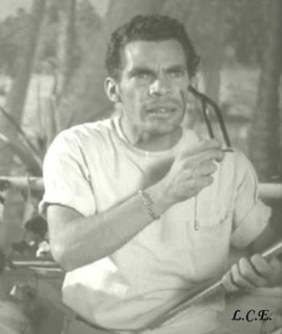  
  
  
Ramón Valdez, o eterno Seu Madruga, do seriado Chaves, atuando no filme “Simbad, el Mareado” (1950).

  

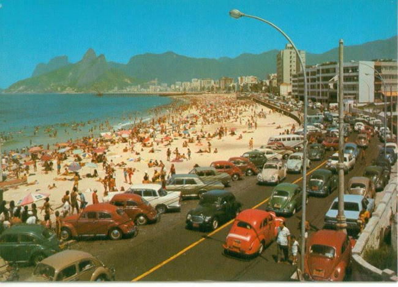  
  
  
Ipanema na década de 60.

  

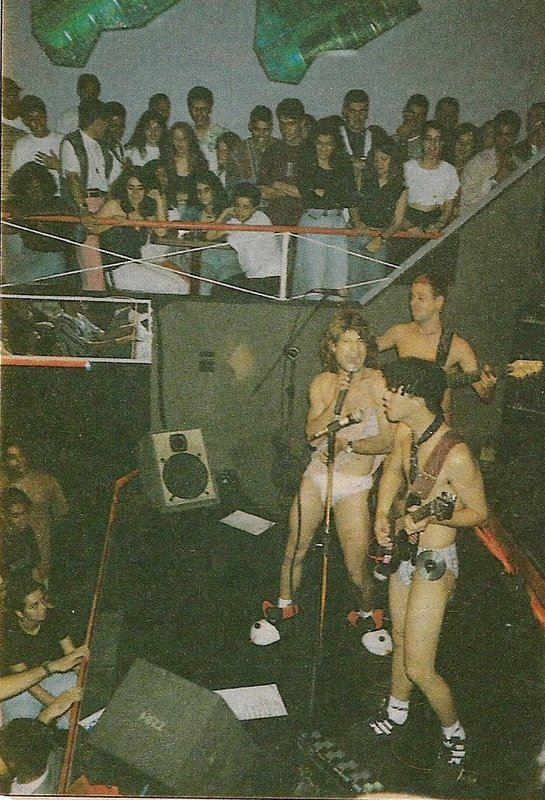  
  
  
Primeiro show da Mamonas Assassinas.

  

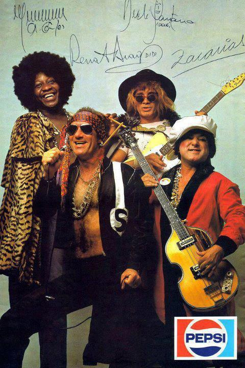  
  
  
Poster da Pepsi com Os Trapalhões, década de 80.

  

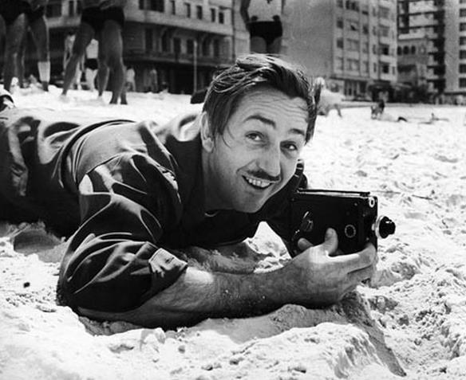  
  
  
Walt Disney, em Copacabana.

  

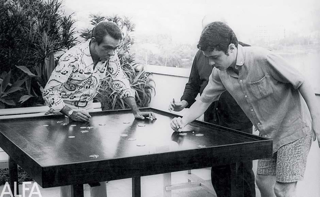  
  
  
Chico Anysio jogando futebol de botão com Chico Burque, com Vinicius de Moraes assistindo.

  

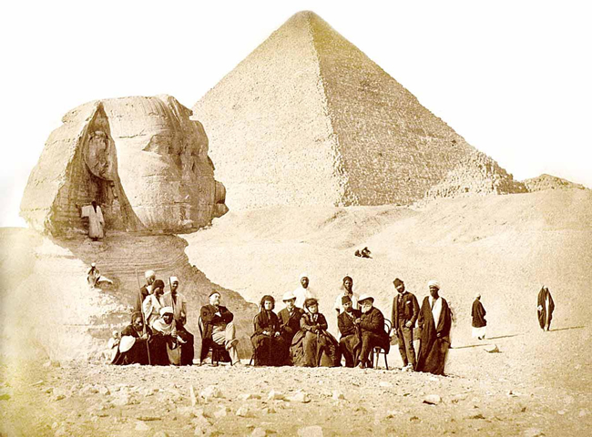  
  
  
Dom Pedro II em viagem ao Egito.

  

  
  
  
Construção da Ponte Rio-Niterói.

  

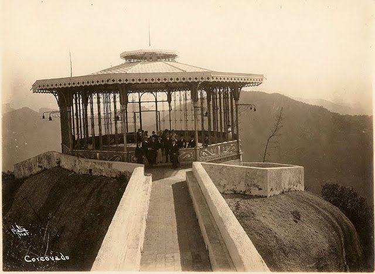  
  
  
Corcovado ainda sem o Cristo.

  

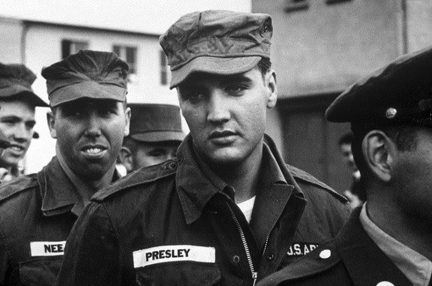  
  
  
Elvis Presley no exército.

  

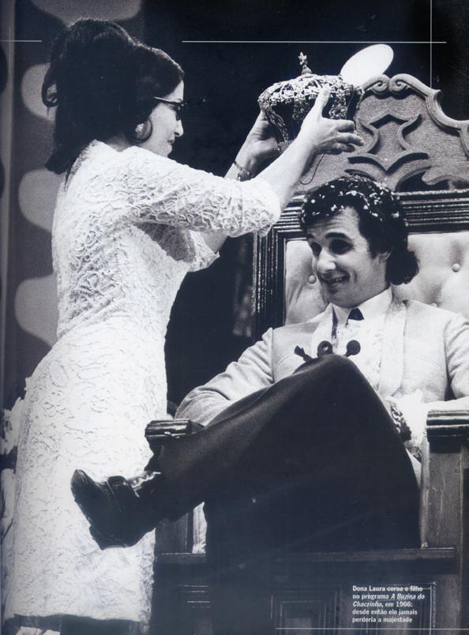  
  
  
Em 1966, Roberto Carlos sendo coroado “Rei” por sua mãe, Lady Laura, no programa do Chacrinha.

  

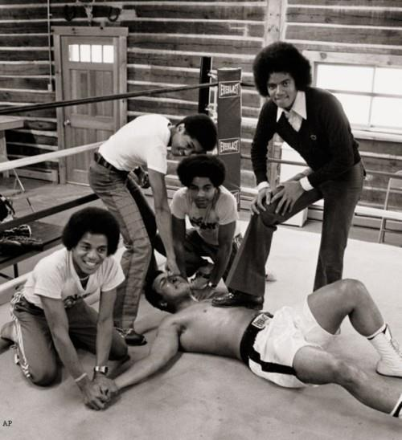  
  
  
Muhammad Ali em momento de descontração com os Jacksons.

  

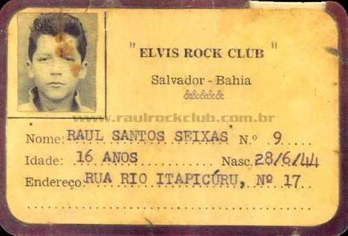  
  
  
Carteirinha de Raul Seixas do fã clube de Elvis Presley.

  

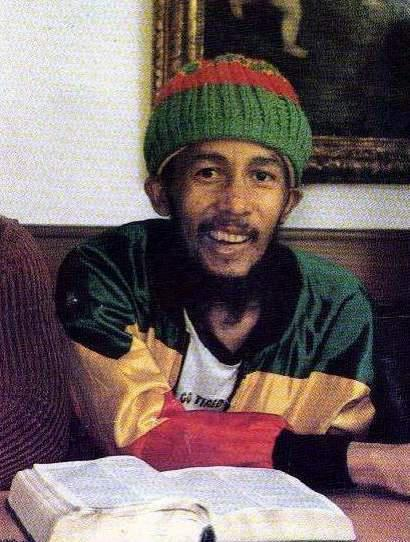  
  
  
Bob Marley pouco tempo antes de sua morte.

  

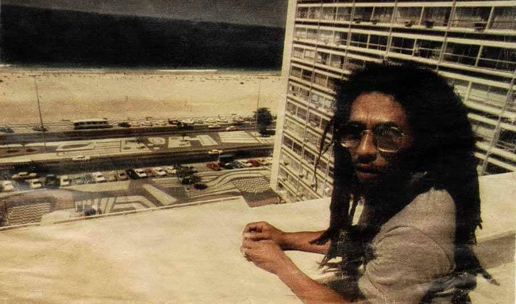  
  
  
Bob Marley na sacado do Copacabana Palace, em março de 1980.

  

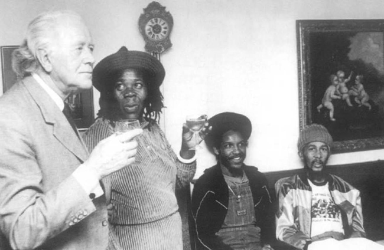  
  
  
Outra foto tirada meses antes da morte de Bob Marley.

  

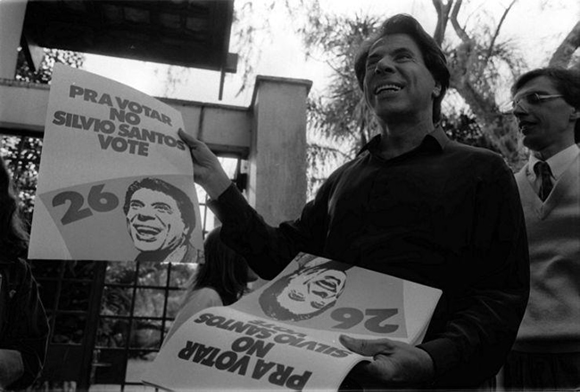  
  
  
Silvio Santos, em 1989, durante sua campanha eleitoral para a Presidência da República. Alguns meses mais tarde, a candidatura de Silvio Santos foi cassada pelo TSE por irregularidades no registro do partido.

  

[Via](https://www.facebook.com/HistoricasImagens?fref=ts)

  

Notas relacionadas:

  

1. [Lembrando 33 anos da sua morte, site divulga fotos curiosas de Elvis Presley](http://colunistas.ig.com.br/obutecodanet/2010/08/19/lembrando-33-anos-da-sua-morte-site-divulga-fotos-curiosas-de-elvis-presley/)

     

   [Confira algumas capas históricas de revistas brasileiras](http://colunistas.ig.com.br/obutecodanet/2012/05/10/confira-algumas-capas-historicas-de-revistas-brasileiras/)

     

   [Confira algumas fotos históricas e suas origens](http://colunistas.ig.com.br/obutecodanet/2012/10/02/confira-algumas-fotos-historicas-e-suas-origens/)

  
  
from O Buteco da Net <http://colunistas.ig.com.br/obutecodanet/2012/10/17/confira-algumas-fotos-historicas-e-suas-origens-parte-2/>
