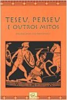
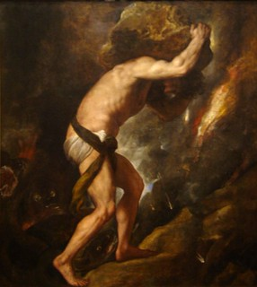
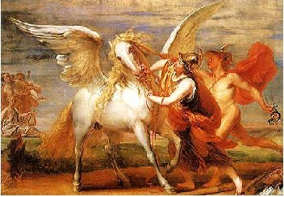
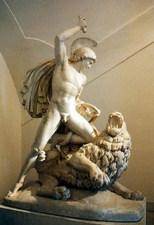
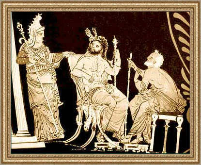
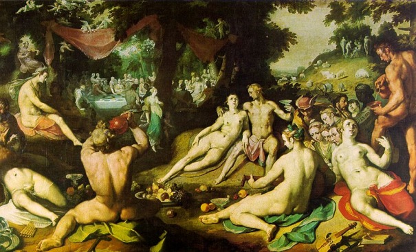

  
  
  
No retorno dos Escritos Lendários vamos continuar com a coleção de Mitologia Helênica do Menelaos Stephanides, agora com o livro **Teseu, Perseu e outros mitos**.

  

Apesar de não ser um livro grande, apenas 158 páginas, as histórias que aborda são extremamente importantes para se entender os mitos gregos. Não apenas pelos heróis mais conhecidos, como Perseu e Teseu, mas também os menos conhecidos e que, de uma forma ou de outra, participaram de feitos importantes da mitologia grega e até hoje tem seus nomes lembrados, apesar de nem sempre sabermos o que fizeram.

  

Muitos são conhecidos apenas por serem antepassados de algum herói, mas entre os gregos, e na maioria dos povos antigos, a origem é o que dá identidade ao indivíduo e, em alguns casos, é o que acaba determinando o que acontecerá com o herói.

  

**PERSEU**

  

E para confirmar esta ligação com o passado o livro começa contando o mito de Io, sua ligação com a história do Egito e da Líbia, e como Linceu, um dos 50 filhos de Egito, se casa com Hipermnestra, uma das 50 Danaides e se torna Rei de Argos.  
Narra também, brevemente, a história de Acrísio e Preto, os irmãos gêmeos cuja rixa tornou-se lendária e resultou com uma guerra pelo trono de Argos, que terminou com um acordo em que Preto torna-se rei de Tirinto e Acrísio rei de Argos.  
É aí que a história de Perseu começa: com a paixão de Zeus por Dânae, a única filha de Acrísio, sobre a qual foi profetizado que teria um filho que seria responsável pela morte do avô.  
Este filho é Perseu, considerado o primeiro herói grego, e dele descendem muitos outros heróis ou personagens mitológicos. Boa parte da sua história foi contada no [Papo Lendário 21: A procura do Titã furioso](http://www.mitografias.com.br/2010/05/papo-lendario-21-a-procura-do-tita-furioso/).

  

  
  
  
**SÍSIFO**

  

Para contar a história de Belerofonte, é preciso primeiro conhecer seu avô, Sísifo: o rei-fundador de Corinto, que conseguiu enganar os deuses duas vezes, irritando tanto Zeus como Hades.  
Após sua morte definitiva foi condenado a um trabalho interminável no Hades.

  
  

**BELEROFONTE**

  

Este é um herói pouco conhecido ultimamente, mas cuja história parece ter sido bem popular entre os antigos gregos e, atualmente, muitos dos seus feitos são creditados a outros heróis em filmes e séries.  

  

Belerofonte inicialmente chamava-se Hipónoo e depois de matar Beleros, passou a ser chamado de “O matador de Beleros”, ou Belerofonte.

  

Beleros era protegido de Ares, e sua morte atraiu a fúria do deus e, apesar de ser filho do rei, Belerofonte foi obrigado a deixar Corinto e iniciar suas aventuras.

  

  

Seus dois maiores feitos foram: domar e montar Pégasus e matar a Quimera.  
Apesar de ter sido criado como filho de um rei, a certa altura lhe é revelado que, na verdade, é filho que Posseidon. Esta origem foi o que o ajudou a domar Pégasus e de ter um poder sobre-humano sobre as águas.  
Se alguém notar alguma semelhança com Percy Jackson, acertou. Este é um dos heróis inspirou Rick Riordan na hora de moldar os poderes e atitudes do seu personagem mais conhecido.

  

Porém, diferentemente do herói estadunidense, Belerofonte não teve um final muito feliz e que pode explicar, ou não, a dificuldade em ser lembrado. Deixarei este final e esta dificuldade para o leitor descobrir no livro, ou em outra fonte.

  

**TESEU**

  

A história de Teseu é abordada desde sua concepção à morte. É o maior herói de Atenas e um dos maiores heróis gregos. Como sua história já foi contada aqui no site do Mitografias, em: [O Mito de Teseu – Parte I: Do Nascimento ao Exílio](http://www.mitografias.com.br/2012/01/o-mito-de-teseu-parte-i-do-nascimento-ao-exilio/) e [Parte II: O Combate Contra o Minotauro, não irei me aprofundar.](http://www.mitografias.com.br/2012/01/o-mito-de-teseu-parte-final-o-combate-contra-o-minotauro/)

  

**ÉACO E PELEU**

  

  
  
  
Estes são dois personagens quase desconhecidos atualmente, mas suas histórias estão interligadas à de Sísifo, Aquiles, Ájax e da própria Tróia.  
Éaco era filho de Zeus com a filha do deus-rio Asopo, Tornou-se rei de Egina onde, após uma tragédia abater a cidade, surge a raça dos Mirmidões.  
Foi considerado um dos homens mais piedosos e justos que já existiu e após a sua morte se tornou um dos juízes do mundo inferior, juntamente com o rei Minos e Radamanto.

  

Teve três filhos: Télamon, Peleu e Foco.

  

Após um acidente, em que Foco foi mortalmente ferido, Télamon e Peleu foram obrigados ao exílio. Télamon foi para Salamina, e viveu muitas aventuras ao lado de Héracles.

  

Já Peleu viveu muitas aventuras, entre elas participar da Caçada ao Javali de Cálidon, onde teve como rival Atalanta e Meléagro. Depois de se tornar um herói renomado, casou-se com Tétis, a mais bela das nereidas, num casamento arranjado por Zeus.  
É na festa deste casamento que o famoso Pomo da Discórdia foi lançado pela deusa Éris. E também é desta união que nasce Aquiles.  

  
  
  
from Mitografias <http://www.mitografias.com.br/2012/10/escritos-lendarios-teseu-perseu-e-outros-mitos/>
