  
  
O [Vagrant](http://vagrantup.com/) é um projeto que permite virtualizar o ambiente de desenvolvimento de forma simples. No caso específico do Windows, você precisava instalar algo como o [Cygwin](http://www.cygwin.com/) (que convenhamos, não funciona tão bem assim) se quisesse usar alguma ferramenta do Unix.

  

Com o Vagrant você pode executar máquinas virtuais utilizando o [VirtualBox](https://www.virtualbox.org/). Estas máquinas virtuais podem ter qualquer configuração e programas instalados e você pode, inclusive, criar a sua própria configuração com muita facilidade. Isso ajuda bastante quando um novo funcionário é contratado, por exemplo. Se todo o seu ambiente de desenvolvimento for baseado em *boxes* (box é o nome que o Vagrant utilizada para definir cada máquina virtual) personalizados, tudo o que ele precisa fazer é [instalar o Vagrant](http://downloads.vagrantup.com/) e executar um único comando. Simples assim.

  

Voltemos ao Windows. Todo mundo que já tentou desenvolver com Ruby/Rails no Windows sabe o quão lento ele é. Não é um *pouquinho* lento. É *muuuuuuuuuuito* lento. Em uma das turmas do [curso de Ruby on Rails](http://howtocode.com.br/cursos/ruby-on-rails?simplesideias) um dos alunos usava Windows. Enquanto todos os que usavam Macs e Linux rodavam 100 testes em 4 segundos, esta mesma suíte de testes demorava mais do que **4 minutos** para ser executada no Windows.

  

Além disso, o Windows é um péssimo sistema operacional para quem precisa trabalhar constantemente na linha de comando. O PowerShell, que é infinitamente melhor que a versão anterior da linha de comando, ainda não chega nem perto de um Bash.

  

Com o Vagrant você consegue resolver todos estes problemas. No fim das contas, você irá executar uma distribuição Linux.

  

O fluxo de desenvolvimento com o Vagrant muda um pouco, mas não muito. Você usará a máquina virtual como um terminal. Em vez de abrir o PowerShell, por exemplo, você irá se conectar através de SSH. Uma grande vantagem do Vagrant é que ele compartilha um diretório entre o host (a máquina real, neste caso um Windows) e o guest (a máquina virtual). Qualquer alteração realizada em uma das pontas será imediatamente refletida na outra. Você pode continuar utilizando o seu editor de texto (ou IDE) favorito no Windows, e executar o projeto no Linux. Mais fácil impossível.

  

Agora que você já sabe como tudo isso funciona, vamos configurar o seu sistema. Para este artigo, utilizei um servidor Windows configurado na Amazon EC2, mas o processo não muda nada para a sua instalação real.

  

**NOTA:** Estas dicas também servem para quem trabalha com Linux e Mac, mas não quer configurar as instalações na máquina real. Estou considerando trabalhar desta forma assim que fizer uma nova instalação no meu Macbook Air que deve chegar em breve! :)

  

## Instalando o VirtualBox

  

O primeiro passo é instalar o VirtualBox. Acesse a página de [downloads](http://www.virtualbox.org/wiki/Downloads) e baixe a versão própria para o seu sistema operacional. Inicie a instalação, e avance todos os passos como nas imagens abaixo.

  

[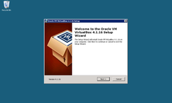](http://m.simplesideias.com.br/vagrant/install-virtual-box-01.png)

  

[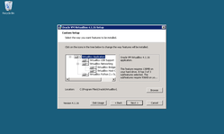](http://m.simplesideias.com.br/vagrant/install-virtual-box-02.png)

  

[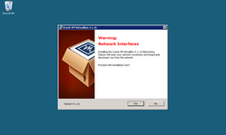](http://m.simplesideias.com.br/vagrant/install-virtual-box-03.png)

  

[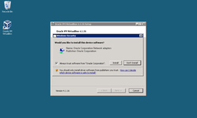](http://m.simplesideias.com.br/vagrant/install-virtual-box-04.png)

  

[](http://m.simplesideias.com.br/vagrant/install-virtual-box-05.png)

Após finalizar a instalação, você poderá instalar o Vagrant.

  

## Instalando o Vagrant

  

Agora é a vez do Vagrant. Ele pode ser instalado de duas formas diferentes. Se você já possui uma instalação do Ruby em seu sistema operacional, basta instalar a gem `vagrant`. A outra forma, mais simples, é instalar o binário do Vagrant, que já traz tudo embutido.

  

Acesse o site do Vagrant e faça o [download](http://downloads.vagrantup.com/) da versão para o seu sistema operacional. Inicie a instalação, e avance todos os passos como nas imagens abaixo.

  

[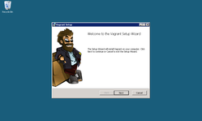](http://m.simplesideias.com.br/vagrant/install-vagrant-01.png)

  

[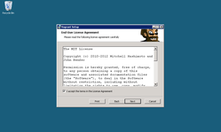](http://m.simplesideias.com.br/vagrant/install-vagrant-02.png)

  

[](http://m.simplesideias.com.br/vagrant/install-vagrant-03.png)

  

[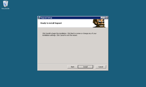](http://m.simplesideias.com.br/vagrant/install-vagrant-04.png)

  

[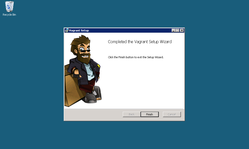](http://m.simplesideias.com.br/vagrant/install-vagrant-05.png)

Agora, precisamos adicionar um novo box ao Vagrant. Para os [cursos de Rails](http://howtocode.com.br/cursos/ruby-on-rails?simplesideias), decidi por criar um box com tudo instalado, para que os alunos não precisem se preocupar em fazer isso manualmente. Este box já vem com uma série de configurações e programas, dentre eles:

  

Vim

  

MySQL

  

Ruby 1.9.3

  

Bundler

  

Sphinx

  

Git

  

Curl

Para adicionar o box, abra o seu terminal e execute o comando `vagrant box add hellobits http://hellobits.com/vagrant/hellobits.box`. Isso pode demorar algum tempo, já que a imagem com 559MB precisará ser baixada.

  

[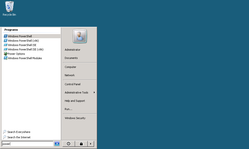](http://m.simplesideias.com.br/vagrant/finding-powershell.png)

  

[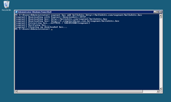](http://m.simplesideias.com.br/vagrant/vagrant-add-box.png)

Antes de iniciar uma nova máquina virtual, você precisa fazer uma coisa: baixar um programa chamado [PuTTY](http://www.putty.org/), que permitirá a conexão através do SSH. Se você usa Mac ou Linux, pode pular este passo.

  

Acesse a página de [downloads](http://www.chiark.greenend.org.uk/~sgtatham/putty/download.html) do PuTTy e baixe os programas [putty.exe](http://the.earth.li/~sgtatham/putty/latest/x86/putty.exe) e [puttygen.exe](http://the.earth.li/~sgtatham/putty/latest/x86/puttygen.exe). Execute o programa `puttygen.exe`; nós iremos gerar uma chave privada de SSH que possa ser utilizada no PuTTY.

  

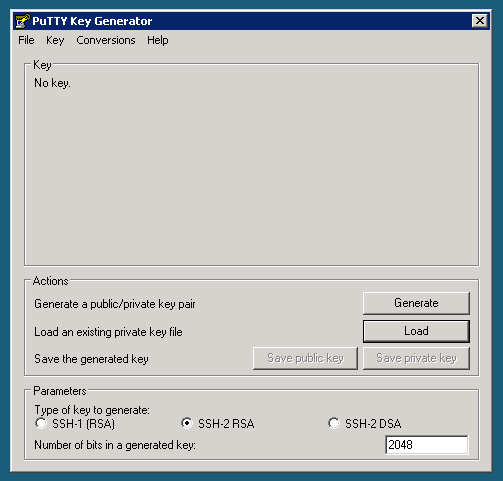

  

Clique no botão “Load”, selecione o arquivo `C:/Users/<seu usuário>/.vagrant.d/insecure_private_key` e clique em “Open”.

  

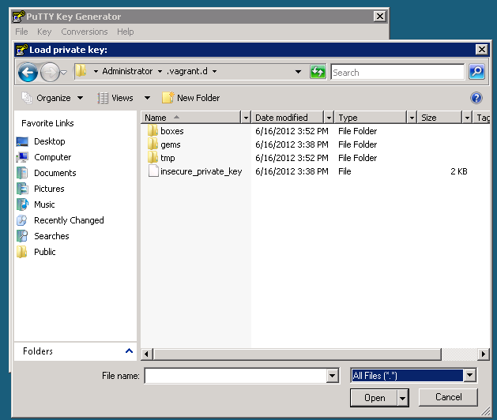

  

Isso irá carregar a chave privada de SSH utilizada pelo Vagrant.

  

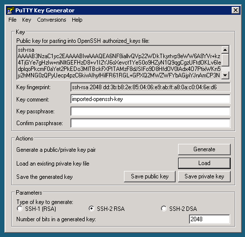

  

Clique no botão “Save private key”. Uma janela perguntando se você quer continuar sem uma senha irá aparecer. Clique no botão “Yes”.

  

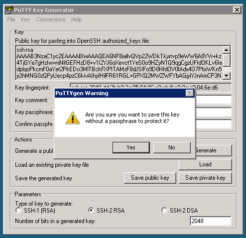

  

Salve este arquivo com o nome “vagrant.ppk” no mesmo diretório do arquivo “insecure\_private\_key”.

  

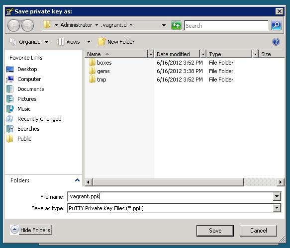

  

Pronto! Agora podemos criar uma nova máquina virtual.

  

## Iniciando uma nova máquina com o Vagrant

  

Para iniciar uma nova máquina virtual, volte ao terminal e crie um novo diretório. Eu usei “myapp”, mas prefira algo mais útil como “Projetos”. De dentro deste diretório, execute o comando `vagrant init hellobits`.

  

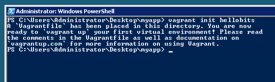

  

Abra o arquivo “Vagrantfile”, gerado com o comando anterior. Você precisará editá-lo como o exemplo abaixo.

  

```
 Vagrant::Config.run do |config|  
   config.vm.box = "hellobits"  
   config.vm.box_url = "http://hellobits.com/vagrant/hellobits.box"  
   config.vm.forward_port 3000, 3000  
 end
```

  

Este arquivo de configuração é utilizado para iniciar uma nova máquina. Aqui, estamos especificando o nome do box utilizado, e em qual URL ele pode ser encontrado caso ele ainda não tenha sido adicionado. Já a linha `config.vm.forward_port 3000, 3000` especifica o número da porta do servidor Rails, que por padrão é iniciado na porta 3000. Essa configuração permite que você acesse o servidor à partir de seu navegador local.

  

Agora, você já pode iniciar o servidor. Isso pode ser feito com o comando `vagrant up`. Este comando pode demorar um pouco na primeira vez que é executado.

  

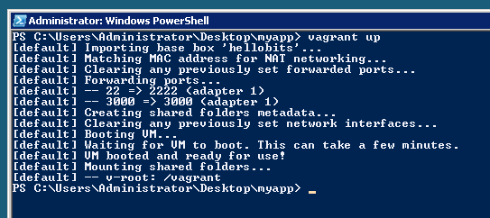

  

O próximo passo é acessar o seu servidor por SSH.

  

## Iniciando uma conexão com SSH

  

Para conectar ao servidor que você acabou de adicionar, vai precisar do programa PuTTY, que baixamos anteriormente. Infelizmente, no Windows não é possível executar o comando `vagrant ssh`, que já inicia uma conexão automática com o servidor. Isso acontece porque o terminal do Windows não possui um comando que permite realizar conexões através de SSH.

  

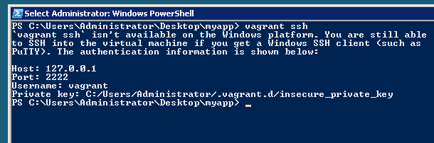

  

Abra o PuTTY. O endereço de conexão é "vagrant@127.0.0.1" e a porta utilizada é a "2222".

  

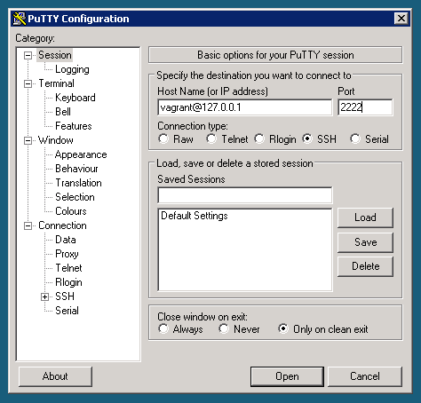

  

Selecione a seção "Connection > SSH > Auth". Clique no botão "Browse" e selecione o arquivo "vagrant.ppk". Se você seguiu todas as instruções corretamente, ele deve ter sido salvo em "C:/Users/<seu usuário>/.vagrant.d/vagrant.ppk".

  

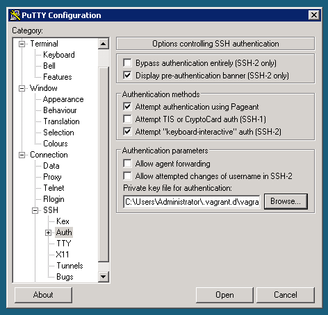

  

Como você irá utilizar estas configurações constantemente, salve-as. Para isso, volte até a seção "Session", digite um nome no campo "Saved Sessions" e clique no botão "Save".

  

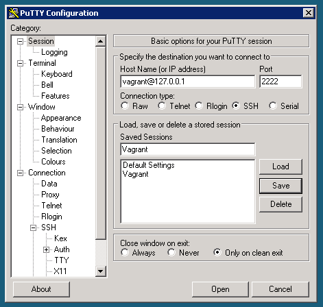

  

Para iniciar a conexão, clique no botão "Open", presente na seção "Session" . Se tudo der certo, uma janela perguntando se quer conectar no servidor irá aparecer. Clique no botão "Yes".

  

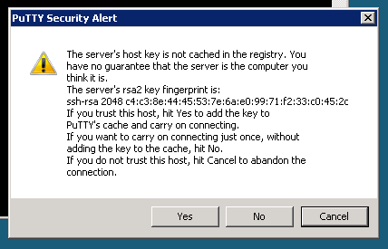

  

Sua conexão com o servidor foi iniciada! Agora, você já pode configurar o Rails.

  

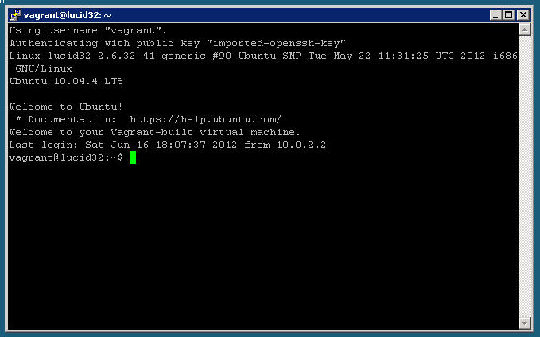

  

## Configurando o Ruby on Rails

  

Para instalar o Ruby on Rails, basta executar o comando `gem install rails`. Isso instalará o Rails e todas as suas dependências.

  


  

Depois de instalado, você poderá criar o seu primeiro app. Para isso, acesse o diretório “/vagrant”. Este diretório é compartilhado entre o servidor virtual e sua máquina. Qualquer alteração realizada em qualquer uma das pontas será imediatamente refletida na outra. **Atenção:** se você remover qualquer arquivo deste diretório, ele também será imediatamente removido de sua máquina local.

  

Execute o comando `rails new myapp -d mysql` para iniciar um novo app configurado para o MySQL.

  


  

O MySQL pode ser acessado com o usuário `root`, sem nenhuma senha.

  

Para ver como os arquivos são sincronizados, abra o diretório na sua máquina local. Melhor ainda. Nós precisaremos configurar uma coisa antes de podermos iniciar o servidor Rails. Abra o diretório “myapp” em seu editor de texto preferido. Altere o arquivo “Gemfile”, presente na raíz do projeto. Descomente a linha `gem 'therubyracer', :platforms => :ruby` para ativar esta dependência.

  


  

Agora, volte ao terminal remoto (aquele iniciado através do PuTTY) e execute o comando `bundle install`, para instalar esta dependência.

  


  

Pronto! Seu servidor Rails já pode ser executado. Execute o comando `rails s`.

  


  

O seu app Rails já está rodando! Para saber se está tudo funcionando corretamente, abra o seu navegador e acesse o endereço [http://127.0.0.1:3000](http://127.0.0.1:3000/). Você deverá ver a página inicial do Rails.

  


  

## Alguns comandos úteis

  

Quando você não quiser mais trabalhar (todo mundo precisa de uma pausa de vez em quando), pode pausar a execução de sua máquina virtual com o comando `vagrant suspend`. Para reiniciar a máquina virtual, execute o comando `vagrant resume`. Estes dois comandos permitirão reiniciar a sua máquina virtual no exato ponto onde ela estava antes de ser pausada.

  

Se você decidir que quer recomeçar um novo ambiente, pode simplesmente remover a máquina virtual existente. Para isso, execute o comando `vagrant destroy` e inicie uma nova com o comando `vagrant up`. Os arquivos compartilhados não serão removidos, mas todo o resto sim! Isso inclui dados salvos no banco e arquivos de configuração adicionados no próprio servidor.

  

E lembre-se! Se você está em um outro sistema operacional como Mac OS X ou Linux, acesse sua máquina virtual com o comando `vagrant ssh`.

  

É uma ótima ideia dar uma lida na [documentação](http://vagrantup.com/v1/docs/index.html). Ela é bem completa, com uma leitura fácil, mas está disponível apenas em inglês (o que não deve ser um problema, certo?).

  

## Manutenção de sua máquina virtual

  

Esta máquina virtual nada mais é que um Ubuntu Linux Server 10.04 LTS 32-bits. Por isso, todas as coisas que você faria normalmente em um Ubuntu Server, podem ser feitas aqui também.

  

Vez ou outra é bom você atualizar os pacotes. Para fazer isso, execute os comandos abaixo como sudoer (o usuário vagrant não possui senha para executar o comando `sudo`).

  

```
 sudo apt-get update  
 sudo apt-get upgrade  
 sudo apt-get dist-upgrade  
 sudo apt-get autoremove  
 sudo apt-get clean
```

  

### Atualizando o Ruby

  

Caso saia uma nova versão do Ruby, você pode atualizar executando o comando `~/scripts/ruby`.

  

```
 cd ~/scripts  
 ./ruby install 1.9.3-p194  
 ./ruby activate 1.9.3-p194
```

  

Esses comandos irão instalar e ativar a versão 1.9.3-p194. Simples e sem usar coisas como o [RVM](https://rvm.io/) ou [rbenv](https://github.com/sstephenson/rbenv).

  

## Atualizando o VirtualBox e o Guest Additions

  

Toda vez que você atualizar a versão do VirtualBox, precisará atualizar o VirtualBox Guest Additions, que é o módulo que permite compartilhar diretórios entre sua máquina real e a máquina virtual, dentre outras funcionalidades.

  

A maneira mais simples de fazer isso é instalando um plugin chamado [vagrant-vbguest](https://github.com/dotless-de/vagrant-vbguest). Para instalá-lo, execute o comando abaixo:

  

```
 $ vagrant gem install vagrant-vbguest
```

  

Agora, toda vez que sua máquina for iniciada com o comando `vagrant up`, ele irá verificar se o Guest Additions precisa ser atualizado e, em caso positivo, fará isso automaticamente.

  

## Próximos passos

  

Embora pareça um processo complicado, ele é bastante simples. É muito melhor do que configurar o seu ambiente como [neste outro artigo](http://simplesideias.com.br/configurando-ruby-rails-mysql-e-git-no-windows/) que escrevi. E se você usa um outro sistema operacional, dê uma olhada também. Na minha opinião, é muito mais fácil de manter um ambiente coeso, com instalações muito próximas de um servidor real.

  

Se você quer aprender mais sobre Rails, não deixe de conhecer o meu [curso de Ruby on Rails](http://howtocode.com.br/cursos/ruby-on-rails). Ele é apresentado nas modalidades presencial e online e, com certeza, irá dar um conhecimento muito bom sobre este framework.

  
[anexo ausente]  
  
  
  
from Simples Ideias [http://simplesideias.com.br/usando-o-vagrant-como-ambiente-de-desenvolvimento-no-windows?utm\_source=feedburner&utm\_medium=feed&utm\_campaign=Feed%3A+simplesideias+%28Simples+Ideias.+Por+Nando+Vieira.%29](http://simplesideias.com.br/usando-o-vagrant-como-ambiente-de-desenvolvimento-no-windows?utm_source=feedburner&amp;utm_medium=feed&amp;utm_campaign=Feed%3A+simplesideias+%28Simples+Ideias.+Por+Nando+Vieira.%29)
