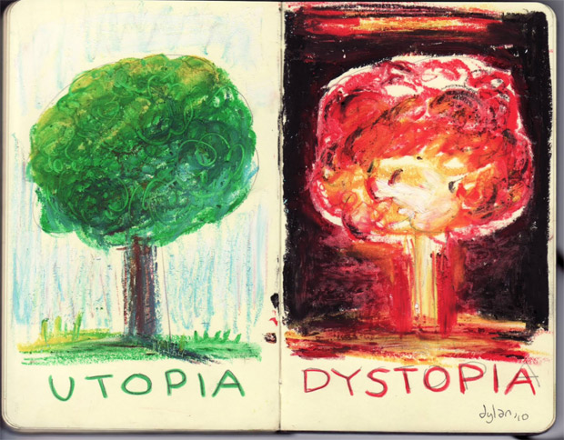
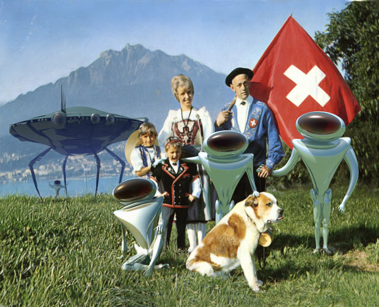
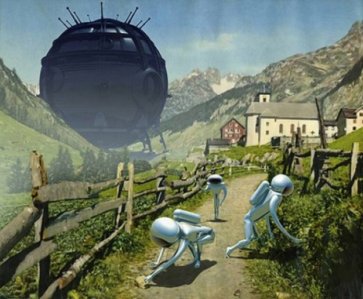
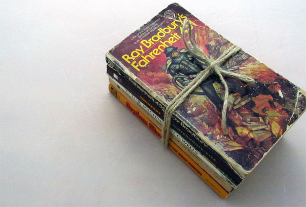

> ### Utopia? Distopia?
>
>   
>
> São dos dois conceitos mais universalmente utilizados em ficção científica. Segundo a Wikipedia:
>
>   
>
> **Utopia:** Tem como significado mais comum a ideia de [civilização ideal](http://pt.wikipedia.org/wiki/Civilidade), imaginária, fantástica. Pode referir-se a uma cidade ou a um mundo, sendo possível tanto no futuro, quanto no presente, porém em um paralelo. O “utopismo” consiste na ideia de idealizar não apenas um lugar, mas uma vida, um futuro, ou qualquer outro tipo de coisa, numa visão fantasiosa e normalmente contrária ao mundo real. O utopismo é um modo absurdamente otimista de ver as coisas do jeito que gostaríamos que elas fossem.
>
>   
>
> **Distopia:** é o pensamento, a filosofia ou o processo discursivo baseado numa ficção cujo valor representa a antítese da utopia ou promove a vivência em uma “utopia negativa”. As distopias são geralmente caracterizadas pelo [totalitarismo](http://pt.wikipedia.org/wiki/Totalitarismo), [autoritarismo](http://pt.wikipedia.org/wiki/Autoritarismo), por opressivo controle da sociedade. Nelas, caem as cortinas, e a sociedade mostra-se corruptível; as normas criadas para o bem comum mostram-se flexíveis. A tecnologia é usada como ferramenta de controle, seja do Estado, seja de instituições ou mesmo de corporações. Distopias são frequentemente criadas como avisos ou como [sátiras](http://pt.wikipedia.org/wiki/S%C3%A1tira), mostrando as atuais convenções sociais e limites extrapolados ao máximo.

  

  

Quando criança eu gostava muito de ciência, mas não me interessava a fantasia. Até para a ficção científica eu torcia o nariz. Mas isso até os dez anos de idade, quando comprei um livro de divulgação científica de [Isaac Asimov](http://pt.wikipedia.org/wiki/Isaac_Asimov), “[O Colapso do Universo](http://pt.scribd.com/doc/17696378/Isaac-Asimov-O-Colapso-Do-Universo)”.

  

Ele contava de forma dramática a história das estrelas de diversos tamanhos, passando por sua formação até seu derradeiro final, como gigantes vermelhas, anãs brancas, estrelas de nêutrons ou buracos-negros. Gostei tanto do livro (cheguei a apresentar um trabalho na escola sobre ele) que ansiosamente persegui inúmeros outros livros de divulgação de Asimov, até que um dia não resisti: comprei um de seus livros de ficção científica (“[Poeira de Estrelas](http://pt.scribd.com/doc/92762650/Isaac-Asimov-Poeira-de-Estrelas)”).

  

Naquela época (1985), talvez seja preciso dizer, as coisas eram diferentes. Não havia internet, e eu não conhecia ninguém que tivesse interesse em literatura de ficção científica. Alguns amigos gostavam de Star Trek, e vez que outra encontrava alguém que ficava acordado e assistia a Sessão Corujão na Globo – já que VHS era meio caro e pouca gente tinha no Brasil.

  

  
  

Ilustração de Franco Brambilla (www.francobrambilla.com), parte de uma série que retrata alienígenas invadindo cenas típicas de décadas passadas

  

Daí era possível conversar sobre filmes como “A última esperança da terra” ou “No mundo de 2020”, “Planeta dos macacos”, “Logan’s run”, “Silent running”, etc. Mas de forma geral, minha experiência com Ficção Científica consistia em passar horas em sebos e ir montando um mapa de possíveis leituras com algumas referências feitas em introduções, ou recomendações de velhos donos de sebos.

  

Fora a mera curiosidade científica e talvez uma mente imaginativa, não parei muito para tentar entender porque eu segui o “caminho do geek”, ou seja, afinal de contas porque eu pessoalmente haveria criado essa afinidade.

  

Mas o certo é que, já naquela época, a Ficção Científica era anacrônica: eram livros velhos, de páginas amareladas, da “era de ouro”, isto é, os anos 50. O futurismo, as “previsões” científicas, não me interessavam tanto (e isso foi muito antes do [steampunk](http://pt.wikipedia.org/wiki/Steampunk), que realmente transformou o anacronismo num estilo).

  

Três fatores pareciam me fascinar nesses primeiros contatos:

  

tramas de cunho lógico ou de engenho, nas quais soluções eram obtidas por uma mistura de raciocínio e conhecimento científico;

  

surpresa, quebras de padrões, mundos, seres e relações sociais inusitados;

  

o próprio aspecto já envelhecido, imperfeito, desqualificado ou escanteado dessas obras.

Com o passar dos anos fui construindo um conhecimento relativamente bom de uma vasta gama de autores, e outros três fatores contribuíram para que eu depurasse meu gosto e encontrasse novos interesses dentro da ficção científica:

  

a chegada da Isaac Asimov Magazine no Brasil, em 1990;

  

minha inscrição no “Clube de Leitores de Ficção Científica”, que produzia um ótimo zine chamado Somnium, e onde conheci luminares da ficção científica no Brasil, como o [Dr. Ruby Felisbino Medeiros](http://pt.wikipedia.org/wiki/Ruby_Felisbino_Medeiros), dono da maior biblioteca de FC no Rio Grande do Sul, talvez do Brasil;

  

e o fantástico livro de Gilberto Schröder, “Ficção Científica”, que descrevia centenas de livros e filmes e continha pequenos ensaios extremamente instigantes sobre os vários temas da FC.

Repito: numa era sem internet, onde certos livros eram inalcançáveis, e existiam apenas como lenda.

  

  

Com o passar do tempo meu interesse começou a se voltar a histórias de cunho mais filosófico, psicológico e antropológico. A ficção científica guiou a maior parte de meus interesses e perspectivas, e quando o “futuro chegou”, em algum momento dos anos 90, e se abriram os portais da cultura irrestrita com a Internet, creio que ela me ajudou a encarar as mudanças de forma diferente da maioria das pessoas ao meu redor.

  

Ao mesmo tempo é curioso como a ficção científica envelheceu e perdeu relevância no mundo de hoje: ela já era velha na década de oitenta, e só foi caducando mais até os dias de hoje.

  

É claro que há o comentarista de Facebook que posta algo no sentido de “meu deus, toda essa vida em redes sociais, isso é um horror para os relacionamentos, as pessoas vivem em bolhas!” (a inovação como [pathos](http://pt.wikipedia.org/wiki/Pathos)), e o neófilo fascinado, que vê todos os seus gadgets como extensões naturais de sua humanidade (a inovação como [ethos](http://pt.wikipedia.org/wiki/Ethos)). Eu já tendo a ver com certo olhar cansado: foram tantas leituras de robôs terríveis e espaçonaves maravilhosas, [utopias](http://pt.wikipedia.org/wiki/Utopia_(sociologia)) e [distopias](http://pt.wikipedia.org/wiki/Distopia), mundos ótimos que se revelam horripilantes e vice-versa, que naturalmente surgiu certo distanciamento analítico e engajamento mais criterioso nesses tipos de visões ora catastróficas, ora deslumbradas.

  

Mas a ficção mesmo, produzida nos últimos 10 anos especialmente, não parece ter relevância alguma. Talvez eu tenha que ler mais [Cory Doctorow](http://en.wikipedia.org/wiki/Cory_Doctorow), ou algo assim. Mas virou muito mais cultura de nicho do que era no passado, isso sem dúvida.

  

Particularmente com relação a como a tecnologia afeta nossa humanidade, a ficção científica tem nos preparado desde que Mary Shelley escreveu Frankenstein. Esse é o tema central desse gênero de literatura fantástica: seja ele mais crítico e desconfiado com a tecnologia, seja ele progressista, deslumbrado e propagandista com a mesma.

  

**É curioso que o tema nos seja tão desinteressante hoje**, ao mesmo tempo que é talvez uma explicação: chega, né? A [distopia](http://pt.wikipedia.org/wiki/Distopia) e a [utopia](http://pt.wikipedia.org/wiki/Utopia_(sociologia)) já estão aqui e agora, totalmente operantes.

  

### Minhas 6 recomendações

  

Ainda assim, aproveito para fazer meia dúzia de recomendações. Alguns desses livros podem ser encontrados em português também (links para as edições na nossa língua estarão entre parênteses).

  

  

**1) “The Three Stigmata of Palmer Eldrich“, Philip K. Dick**  
Um traficante interplanetário dotado de estigmas como os de Jesus Cristo vende uma droga que permite a trabalhadores em condições chinesas atuais vivam uma “segunda vida” amena e relativamente feliz ao brincarem com bonecos. ([Em português.](http://www.goodreads.com/book/show/15857754-os-tr-s-estigmas-de-palmer-eldritch))

  

**2) “The Sirens of Titan“, Kurt Vonnegut Jr.**Douglas Adams, autor da popular série Guia do Mochileiro das Galáxias, aprendeu tudo que sabia desse romance. Um milionário e seu cão penetram uma “infundíbula-crononsinclástica” e surgem como projeções de tempos em tempos, revelando aos poucos a função da história humana.

  

**3) “Babel 17“, Samuel R. Delany**  
Uma língua é inventada como uma arma, ela altera o modo de pensar dos que a aprendem, transformando-os em traidores. Muitos elementos de linguística são apresentados. ([Em português.](http://www.skoob.com.br/livro/252234-babel-17))

  

**4) “Concrete Island“, J. G. Ballard**  
Robinson Crusoe, mas no meio da “selva de pedra”.

  

**5) “Schrödinger’s Cat Trilogy“, Robert Anton Wilson**  
Uma brincadeira com elementos de [Finnegans Wake, de James Joyce](http://papodehomem.com.br/de-paulo-coelho-a-james-joyce-resumido-as-coisas-a-um-tuite-dr-wtf-2/), mais contracultura hippie drogada, personagens que são como “partículas-onda”, um anão que promove uma forma de terrorismo baseada em distorcer estatísticas, mudança de sexo e os Illuminati.

  

**6) “The Dragon’s Egg“, Robert L. Forward**  
Um romance de ficção científica bastante difícil (com ciência acurada) mas de especulação imaginativa fantástica: uma civilização de seres inteligentes se forma não na base orgânica da vida terrestre, mas com o plasma da superfície de uma estrela. Um satélite humano estabelece comunicação, porém a civilização nasce, se desenvolve e morre em questão de dias humanos.

  

E, se vocês se interessarem por história da FC e quiserem ficar com vontade de ler uma pá de livros, duas aulas em áudio sobre Ficção Científica são excelentes: “TTC – Science Fiction – The Literature of Technological Imagination” e “TMS – From Infinity An Exploration of Science Fiction Literature”. Juro que tentei encontrar links onde vocês pudessem comprar tais cursos, mas não os encontrei… eles podem ser encontrados na sua forma “pirata” através do Google, mas isso é por sua conta e risco.

  

### \*   \*   \*

  

*Na coluna “WTF”, Eduardo Pinheiro tem total liberdade para nos ajudar a ver o que precisa ser visto.*

  

*“WTF” no sentido do espanto que dá origem à filosofia, à ciência, às tradições de sabedoria. E WTF no sentido do impacto que isso talvez nos cause, quebrando cegueiras, ilusões.*

  

*Além de seguir o papo abaixo nos comentários, você pode enviar suas mais profundas perguntas para wtf@papodehomem.com.br.*

  
[anexo ausente]  
  

Artigos Relacionados

  

[[+18] Charles Bronson, mulher com iniciativa e paternidade: setembro foi intenso](http://rss.feedsportal.com/c/32911/f/530922/s/24185d7c/l/0Lpapodehomem0N0Bbr0Ccharles0Ebronson0Emulher0Ecom0Einiciativa0Ee0Epaternidade0Esetembro0Efoi0Eintenso0C/story01.htm)

  

[Eleições municipais: SimCity me ensinou que não é tão simples quanto dizem](http://rss.feedsportal.com/c/32911/f/530922/s/2421b58e/l/0Lpapodehomem0N0Bbr0Celeicoes0Emunicipais0Esimcity0Eme0Eensinou0Eque0Enao0Ee0Etao0Esimples0Equanto0Edizem0C/story01.htm)

  

[Capturando a beleza com lentes, pincéis e camisetas](http://rss.feedsportal.com/c/32911/f/530922/s/242652c4/l/0Lpapodehomem0N0Bbr0Ccapturando0Ea0Ebeleza0Ecom0Elentes0Epinceis0Ee0Ecamisetas0C/story01.htm)

  

[O universo melancólico de Nick Drake](http://rss.feedsportal.com/c/32911/f/530922/s/2447d1e8/l/0Lpapodehomem0N0Bbr0Co0Euniverso0Emelancolico0Ede0Enick0Edrake0C/story01.htm)

  

[O Cavalete Parade dominou a Paulista e a nossa atenção](http://rss.feedsportal.com/c/32911/f/530922/s/244a8b37/l/0Lpapodehomem0N0Bbr0Co0Ecavalete0Eparade0Edominou0Ea0Epaulista0Ee0Ea0Enossa0Eatencao0C/story01.htm)

  
  
  
[[anexo ausente]](http://da.feedsportal.com/r/146821050668/u/49/f/530922/c/32911/s/245d7bcd/a2.htm) [anexo ausente]  
  

[[anexo ausente]](http://feeds.feedburner.com/~ff/PapodehomemLifestyleMagazine?a=1z8OafuPB9w:2Hmggpdq0c0:yIl2AUoC8zA)  [[anexo ausente]](http://feeds.feedburner.com/~ff/PapodehomemLifestyleMagazine?a=1z8OafuPB9w:2Hmggpdq0c0:qj6IDK7rITs) [[anexo ausente]](http://feeds.feedburner.com/~ff/PapodehomemLifestyleMagazine?a=1z8OafuPB9w:2Hmggpdq0c0:-BTjWOF_DHI)

  
[anexo ausente]  
  
  
  
from Papo de Homem - Lifestyle Magazine <http://da.feedsportal.com/c/32911/f/530922/s/245d7bcd/l/0Lpapodehomem0N0Bbr0Cficcao0Ecientifica0Eum0Epapo0Ee0E60Erecomendacoes0Ede0Elivros0Efodas0Ewtf0E50C/ia1.htm>
