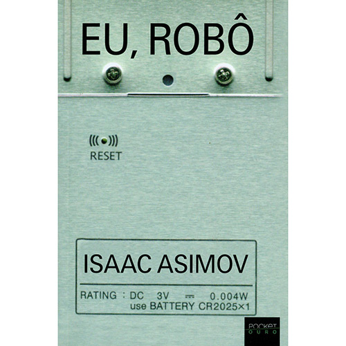

  

**Isaac Asimov** (1920-1992), natural da Rússia, foi professor assistente de bioquímica na  Escola de Medicina da Universidade de Boston. A partir de 1958, passou a se dedicar à literatura e acabou se tornando um dos principais ícones da ficção científica, juntamente com **Arthur C. Clarke** e **Robert A. Heinlein**. Em **Eu, Robô,** publicado em 1950, Asimov desenvolve a relação entre humanos e robôs, inovando o modo de pensar os robôs e, ao mesmo tempo, se afastando da lógica de **Frankstein** (**Mary Shelley**) – em que uma criatura entra em conflito com o criador, por este tentar se aproximar de deus – muito comum à época.

  

“Eu, Robô” é uma coletânea de nove contos interligados entre si, os quais perpassam pela história da robótica na humanidade pelos olhos de Susan Calvin, em 2057, uma psicóloga de robôs prestes a se aposentar que dedicou a maior parte da sua vida trabalhando para a empresa U.S. Robôs, fabricante cuja proposta era construir robôs para servirem os seres humanos para as mais diversas atividades. Todos eles estariam apoiados sobre três leis fundamentais da robótica (as quais foram criadas pelo próprio Asimov):

  

1) Um robô não pode ferir um ser humano ou, por omissão, permitir que um ser humano sofra algum mal.

  

2) Um robô deve obedecer às ordens que lhe sejam dadas por seres humanos, exceto nos casos em que tais ordens contrariem a Primeira Lei.

  

3) Um robô deve proteger sua própria existência, desde que tal proteção não entre em conflito com a Primeira e a Segunda Lei.

  

Desde o primeiro conto, intitulado “Robbie”, somos levados à progressão da relação dos robôs com os seres humanos e a forma como essas três leis se aplicam de maneira intrínseca no intelecto desses seres. Neste primeiro momento temos uma história de Robbie, um robô mudo cuja atribuição é servir de babá para uma criança, mas sofre com a rejeição e preconceito da mãe da garota. Asimov nos apresenta uma humanidade temerosa por mudanças drásticas, de serem substituídos por máquinas em seus trabalhos, além de evidenciar uma metáfora para a discriminação de minorias.

  

Deste momento em diante encontramos robôs que falam, que raciocinam sobre questões esotéricas e existenciais, com crises de estresse, que cuidam de linhas de produção inteiras e que projetam o futuro para a humanidade. O relato por parte de Susan, a qual se dedicou a compreender como pensam os robôs, evidencia sua afinidade maior com estas máquinas, pois acredita que estas são dotadas de bondade. Mesmo quando temos dúvida que um robô poderia se revoltar contra um ser humano (que seria um ser tecnicamente inferior), as três leis da robótica sempre se mostram superiores, refletindo dessa forma em uma ética por parte dos mesmos.

  

No conto “Razão”, Cutie é um robô que possui uma incrível capacidade de raciocinar sobre as mais diversas coisas. Seu passatempo preferido é ler romances de ficção científica, pois lhe atrai ver a forma como humanos pensavam o futuro em um passado pouco tecnológico. Asimov praticamente se diverte consigo mesmo ao descrever Cutie, ainda mais visualizando esta realidade em meados de 1950 e considerando que até hoje o ser humano se fascina em sonhar e imaginar o futuro desconhecido.

  

No último conto, quase como uma profecia, “O Conflito Evitável”,  a primeira lei da robótica atinge um nível mundial e as máquinas passam a cuidar dos seres humanos, evitando conflitos, guerras e perpetuando nossa existência. No fim, os seres humanos dependem das máquinas para sua existência.

  

“Eu, Robô” é uma ficção científica intrigante que leva o leitor a pensar, juntamente com a robô-psicóloga Susan Calvin, a forma como os robôs pensam, sua evolução e a forma como se tornaram cada vez mais participativos no seio da sociedade. O livro é mais do que uma mera obra de ficção científica. É um ensinamento, uma experiência filosófica e uma obra de reflexão para a humanidade.

  

### Posts Relacionados

  

[Com prefácio de Hayao Miyazaki, obra com desenhos inéditos do autor d' O Pequeno Príncipe chega ao Brasil](http://www.vortexcultural.com.br/literatura/com-prefacio-de-hayao-miyazaki-obra-com-desenhos-ineditos-do-autor-d-o-pequeno-principe-chega-ao-brasil/)

  

[[Resenha] Necropólis: A Fronteira das Almas - Douglas MCT](http://www.vortexcultural.com.br/literatura/resenha-necropolis-a-fronteira-das-almas-douglas-mct/)

  

[[Resenha] Elite da Tropa - Luiz Eduardo Soares, André Batista e Rodrigo Pimentel](http://www.vortexcultural.com.br/literatura/elite-da-tropa/)

  

[[Resenha] Vida - Keith Richards](http://www.vortexcultural.com.br/literatura/resenha-vida-keith-richards/)

  

[[Resenha] Kafka à Beira Mar - Haruki Murakami](http://www.vortexcultural.com.br/literatura/resenha-kafka-a-beira-mar-haruki-murakami/)

  
  
  
from Vortex Cultural - HQ's, Literatura, Games, Resenhas, Podcast, Cinema, Música e Séries <http://www.vortexcultural.com.br/literatura/resenha-eu-robo/>
