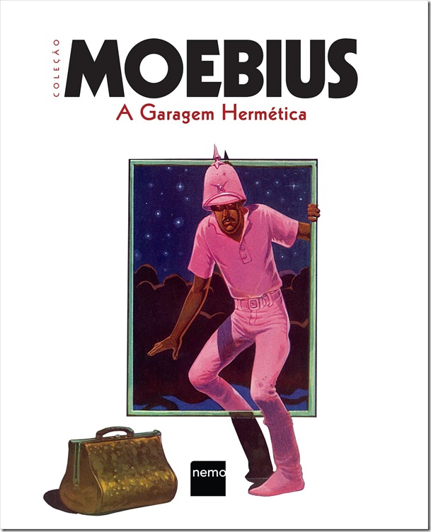

 Uma das obras primas do quadrinista **Moebius** (Jean Giraud), falecido em 10 de março de 2012, **A Garagem Hermética** foi originalmente publicada na revista francesa **Metal Hurlant** entre 1976 e 1980 em episódios de duas a quatro páginas. Foi republicada no Brasil pela editora Nemo, com nova tradução e um belo trabalho editorial. Portanto, hora mais propícia para uma resenha de um dos maiores clássicos dos quadrinhos europeus provavelmente não haverá. Embarquemos, então, nessa viagem lisérgica de Moebius.

  

É uma tarefa árdua falar do plot de Garagem Hermética, tanto pela estrutura da história – com idas e vindas que saem do desconhecido e te levam para pontos que “desconhecido” não é o suficiente para definir – quanto porque, notadamente, talvez o último interesse do autor fosse realmente contar uma história quadrada, fechada, seguindo uma estrutura narrativa comum, com início, meio e fim. Ele próprio descreve um pouco do desenvolvimento da história de Garagem Hermética: “Todo mês eu tentaria recriar uma trama coerente, com os elementos já existentes na história. E então separaria tudo para me sentir inseguro novamente, e então no mês seguinte unir os pedaços pra começar tudo de novo”.

  

Com esse espírito de liberdade de desenhar e criar universos e deixar que o leitor os complete em sua própria experiência, Moebius continua a contar a história de Major Grubert – e digo “continua” pois era um personagem já existente em **Major Fatal**, e publicado pela primeira vez em **A caçada ao francês de férias**. Dessa vez, Major Grubert e seu antagonista, Lewis Carnelian, protagonizam uma trama transcendental, mística, em que adentram um planeta com diferentes níveis de realidade, cada vez mais complexos e distantes da nossa própria realidade, deixando o leitor sempre um passo atrás da compreensão de tudo aquilo que está acontecendo, mas ainda assim envolto e imerso naquele universo de nonsense, belas imagens e criatividade quase infinita.

  

Sobre a arte de Moebius: eu compararia sua arte e os planos que ele apresenta em Garagem Hermética ao Cinema Scope dos quadrinhos. Planos abertos, às vezes até ocupando uma página inteira, com detalhes suficientes para que o leitor dê uma pausa na leitura e na evolução da trama apenas para analisar cada trecho e minúcia desenhada. Observar e apreciar cada referência e inspiração que o quadrinista deixa ali em seu traço: por exemplo, uma cena em que Major e Lewis estão voando, o próprio autor cita como referência direta ao Homem de Ferro. Como se já não fosse o bastante, alguns dos ângulos de observação daqueles planos já seriam muito inovadores nos dias de hoje. Considerando então a época em que Garagem Hermética foi escrita e desenhada, podemos com certeza considerá-la um marco que viria a influenciar quase toda, se não toda, a produção de quadrinhos subsequente.

  

Fora que toda essa arte remete, é claro, ao nosso mundo real, mas ainda assim cria um universo próprio, com suas regras particulares, o que dá ainda mais liberdade e criatividade para suas criaturas, paisagens, construções, todas belíssimas e únicas. Os desenhos em preto e branco conferem ao leitor o uso da imaginação para que aquilo tudo se torne ainda mais vivo e real, sem perder, porém, um aspecto de sonho e imaginação que muitas obras em preto e branco sugerem.

  

A Garagem Hermética, mesmo que não agrade àqueles que preferem uma estrutura narrativa mais linear e fechada, com certeza vale por seu desenho.Em muitos momentos ele é a motivação para a continuidade na saga que, por suas idas e vindas, muitas vezes sem muito nexo e lógica, dá a impressão de que a história não sai do lugar, e que cairá para algo em que não há solução possível. Portanto um clássico como esse, quase uma experiência, é obrigatório para todos os fãs de histórias em quadrinhos, e também como uma introdução a esse mestre da nona arte, Moebius, junto com suas histórias iniciais do Major Grubert.

  

[Compre aqui](http://links.lomadee.com/ls/VFFNTDtlSW1Yc3FYZzsyNDgxMTUxMjswOzE3NjszMzU0MDYyNjswO0JSOzM7.html).

  
  
  
from Vortex Cultural - HQ's, Literatura, Games, Resenhas, Podcast, Cinema, Música e Séries <http://www.vortexcultural.com.br/quadrinhos-e-hqs/resenha-a-garagem-hermetica/>
